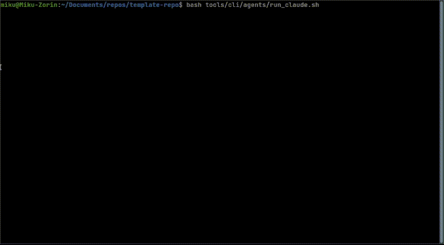

# Agent Orchestration & Security Template

A reference architecture for AI agent orchestration, trust measurement, and tool integration. Designed to be studied, forked, and adapted -- not contributed to directly. All code changes in this repository are authored by AI agents under human oversight.

This repo demonstrates how to run a council of AI agents (Claude, Gemini, Codex, OpenCode, Crush) across a shared codebase with board-driven task delegation, automated PR review, security hardening, and containerized tooling. It also includes standalone research packages for sleeper agent detection, autonomous economic agent simulation, and companion repositories for [runtime injection / game modding](https://github.com/AndrewAltimit/game-mods) and an [embeddable OS framework](https://github.com/AndrewAltimit/oasis-os) targeting PSP hardware, UE5, and Raspberry Pi.

**Use this repo to learn how to:**
- Orchestrate multiple AI agents with a GitHub Projects v2 work queue
- Measure and enforce trust boundaries for autonomous agents (wrapper guards, iteration limits, claim tracking)
- Integrate 18 MCP servers spanning code quality, content creation, 3D graphics, video editing, and speech synthesis
- Build hardened CI/CD pipelines for agent-authored code (15-stage pipeline, security scanning, multi-arch Docker builds)
- Detect sleeper agent behaviors via residual stream analysis and linear probes
- Inject into closed-source applications for modding, debugging, or AI agent embodiment (via [game-mods](https://github.com/AndrewAltimit/game-mods))



---

> **Important: This is an advanced template** designed for experienced developers working with autonomous AI agents. Before diving in, we strongly recommend:
>
> 1. **Read the [AI Safety Training Guide](docs/agents/human-training.md)** - Essential concepts for safe human-AI collaboration, including deception detection, scalable oversight, and control protocols
>
> 2. **Take an AI Safety course at [BlueDot Impact](https://bluedot.org/)** - Free, rigorous training programs covering AI safety fundamentals, governance, and alignment
>
> Working with AI agents introduces risks that differ fundamentally from traditional software. Understanding these risks isn't optional - it's a prerequisite for responsible development.

---

## Legal Notice

> **This repository contains dual-use research and tooling.** The maintainer provides no guidance, consultation, or feature development -- whether solicited or unsolicited, compensated or uncompensated. This policy exists as a legal protection given the nature of the codebase.
>
> - **No feature requests will be accepted.** Money does not change this.
> - **No guidance or consulting will be provided** on usage, adaptation, or deployment of any component.
> - **No external contributions are accepted.** See [CONTRIBUTING.md](CONTRIBUTING.md).
> - **The maintainer does not seek or engage with community interaction.** Public comments, issues filed by external parties, events, and news surrounding this repository or its components may be ignored without response to maintain neutrality and legal distance.
> - **No endorsement is implied.** The existence of code in this repository does not constitute encouragement, recommendation, or endorsement of any particular use.
>
> This repository is released under a public domain dedication. You may fork and adapt it freely. The maintainer assumes no obligation to any downstream user for any reason.

## Project Philosophy

This project follows a **container-first approach**:

- **All tools and CI/CD operations run in Docker containers** for maximum portability
- **Zero external dependencies** - runs on any Linux system with Docker
- **Self-hosted infrastructure** - no cloud costs, full control over runners
- **Single maintainer design** - optimized for individual developer productivity, no contributors model
- **Modular MCP architecture** - Separate specialized servers for different functionalities

## Quick Start

> **New to the template?** Check out our **[Template Quickstart Guide](docs/QUICKSTART.md)** for step-by-step customization instructions!

1. **Prerequisites**: Linux system with Docker (v20.10+) and Docker Compose (v2.0+)

2. **Clone and setup**
   ```bash
   git clone https://github.com/AndrewAltimit/template-repo
   cd template-repo
   # Build the Rust CLI tools (optional - pre-built binaries available in releases)
   cd tools/rust/board-manager && cargo build --release
   cd ../github-agents-cli && cargo build --release
   ```

3. **Set API keys** (if using AI features)
   ```bash
   export OPENROUTER_API_KEY="your-key-here"  # For OpenCode/Crush
   export GEMINI_API_KEY="your-key-here"      # For Gemini
   ```

4. **Use with Claude Code**: MCP servers are configured in `.mcp.json` and auto-started by Claude. See [MCP Configuration](docs/mcp/README.md#configuration-strategy) for essential vs full setups.

5. **Run CI/CD operations**
   ```bash
   automation-cli ci run full  # Full pipeline
   ```

For detailed setup, see [CLAUDE.md](CLAUDE.md) and [Template Quickstart Guide](docs/QUICKSTART.md).

## AI Agents

Six AI agents for development and automation. See [AI Agents Documentation](docs/agents/README.md) for details.

| Agent | Provider | Use Case | Documentation |
|-------|----------|----------|---------------|
| **Claude Code** | Anthropic | Primary development assistant | [Setup Guide](docs/agents/claude-code-setup.md) |
| **Codex** | OpenAI | Code generation | [Setup Guide](docs/agents/codex-setup.md) |
| **OpenCode** | OpenRouter | Code generation | [AI Code Agents](docs/integrations/ai-services/ai-code-agents.md) |
| **Crush** | OpenRouter | Code generation | [AI Code Agents](docs/integrations/ai-services/ai-code-agents.md) |
| **Gemini** | Google | Code review (limited tool use) | [Setup Guide](docs/integrations/ai-services/gemini-setup.md) |
| **GitHub Copilot** | GitHub | PR review suggestions | - |

All code generation agents (Codex, OpenCode, Crush) provide equivalent functionality - choose based on your API access.

**Security**: Keyword triggers, user allow list, secure token management. See [Security Model](docs/agents/security.md)

**Safety Training**: Essential AI safety concepts for human-AI collaboration. See [Human Training Guide](docs/agents/human-training.md)

**Sleeper Agents**: Create and evaluate sleeper agents in order to detect misalignment and probe for deception. See [Sleeper Agents Package](packages/sleeper_agents/README.md)

### Agentic Git Workflow

AI agents autonomously manage the development lifecycle from issue creation through PR merge:

```
Issue Created → Admin Approval → Agent Claims → PR Created → AI Review → Human Merge
```

**The Flow:**

1. **Issue Creation** - Issues are created manually or by agents via `backlog-refinement.yml`, automatically added to the GitHub Projects board
2. **Admin Approval** - An authorized user comments `[Approved][Claude]` (or another agent name) to authorize work
3. **Agent Claims** - `board-agent-worker.yml` finds approved issues, the agent claims the issue and creates a working branch
4. **Implementation** - The agent implements the fix/feature and opens a PR
5. **AI Review** - `pr-validation.yml` triggers Gemini code review; `pr-review-monitor.yml` lets agents iterate on feedback
6. **Human Merge** - Admin reviews and merges the PR

**Security Model:**

- **Approval Required** - Agents cannot work on issues without explicit `[Approved][Agent]` comment
- **Authorized Users Only** - Only users listed in `.agents.yaml` → `security.agent_admins` can approve
- **Pattern Validation** - Must use `[Action][Agent]` format (e.g., `[Approved][Claude]`) to prevent false positives
- **Claim Tracking** - Agents post claim comments with timestamps to prevent conflicts

See [Security Documentation](docs/agents/security.md) for the complete security model.

## Reports & Research

Technical reports and guides exploring AI risks, safety frameworks, and philosophical questions. PDFs are automatically built from LaTeX source and published with each release.

### Emerging Technology Risk Assessments

Scenario-based projection reports analyzing potential futures involving advanced AI systems. See [Projections Documentation](docs/projections/README.md).

| Report | Topic | PDF | Source |
|--------|-------|-----|--------|
| **AI Agents Political Targeting** | Political violence risk | [Download](https://github.com/AndrewAltimit/template-repo/releases/latest) | [LaTeX](docs/projections/latex/ai-agents-political-targeting.tex) |
| **AI Agents WMD Proliferation** | WMD proliferation risk | [Download](https://github.com/AndrewAltimit/template-repo/releases/latest) | [LaTeX](docs/projections/latex/ai-agents-wmd-proliferation.tex) |
| **AI Agents Espionage Operations** | Intelligence tradecraft | [Download](https://github.com/AndrewAltimit/template-repo/releases/latest) | [LaTeX](docs/projections/latex/ai-agents-espionage-operations.tex) |
| **AI Agents Economic Actors** | Autonomous economic actors | [Download](https://github.com/AndrewAltimit/template-repo/releases/latest) | [LaTeX](docs/projections/latex/ai-agents-economic-actors.tex) |
| **AI Agents Financial Integrity** | Money laundering & corruption | [Download](https://github.com/AndrewAltimit/template-repo/releases/latest) | [LaTeX](docs/projections/latex/ai-agents-financial-integrity.tex) |
| **AI Agents Institutional Erosion** | IC monopoly erosion & verification pivot | [Download](https://github.com/AndrewAltimit/template-repo/releases/latest) | [LaTeX](docs/projections/latex/ai-agents-institutional-erosion.tex) |

### Technical Guides

| Guide | Description | PDF | Source |
|-------|-------------|-----|--------|
| **Agentic Workflow Handout** | AI agent pipeline architecture and workflows | [Download](https://github.com/AndrewAltimit/template-repo/releases/latest) | [LaTeX](docs/agents/Agentic_Workflow_Handout.tex) |
| **Sleeper Agents Framework** | AI backdoor detection using residual stream analysis | [Download](https://github.com/AndrewAltimit/template-repo/releases/latest) | [LaTeX](packages/sleeper_agents/docs/Sleeper_Agents_Framework_Guide.tex) |
| **AgentCore Memory Integration** | Multi-provider AI memory system | [Download](https://github.com/AndrewAltimit/template-repo/releases/latest) | [LaTeX](docs/integrations/ai-services/AgentCore_Memory_Integration_Guide.tex) |
| **Virtual Character System** | AI agent embodiment platform | [Download](https://github.com/AndrewAltimit/template-repo/releases/latest) | [LaTeX](docs/integrations/ai-services/Virtual_Character_System_Guide.tex) |
| **BioForge CRISPR Automation** | Agent-driven biological automation platform | [Download](https://github.com/AndrewAltimit/template-repo/releases/latest) | [LaTeX](docs/hardware/latex/bioforge-crispr-automation.tex) |
| **Secure Terminal Briefcase** | Tamper-responsive hardware security system with PQC recovery | [Download](https://github.com/AndrewAltimit/template-repo/releases/latest) | [LaTeX](docs/hardware/latex/secure-terminal-briefcase.tex) |

### Philosophy Papers

Philosophical explorations of minds, experience, and intelligence. See [Philosophy Papers Documentation](docs/philosophy/README.md).

| Paper | Topic | PDF | Source |
|-------|-------|-----|--------|
| **Architectural Qualia** | What Is It Like to Be an LLM? | [Download](https://github.com/AndrewAltimit/template-repo/releases/latest) | [LaTeX](docs/philosophy/latex/architectural-qualia.tex) |

**Build Status**: [](https://github.com/AndrewAltimit/template-repo/actions/workflows/build-docs.yml)

## Packages

Standalone packages addressing different aspects of AI agent development, safety, and security:

| Package | Purpose | Documentation |
|---------|---------|---------------|
| **[Sleeper Agents](packages/sleeper_agents/)** | Research-validated detection framework for hidden backdoors in LLMs, based on Anthropic's research on deceptive AI that persists through safety training | [README](packages/sleeper_agents/README.md) \| [PDF Guide](https://github.com/AndrewAltimit/template-repo/releases/latest) |
| **[Economic Agents](packages/economic_agents/)** | Rust-based simulation framework demonstrating autonomous AI economic capability - agents that earn money, form companies, hire sub-agents, and seek investment. For governance research and policy development | [README](packages/economic_agents/README.md) |
| **[Tamper Briefcase](packages/tamper_briefcase/)** | Tamper-responsive Raspberry Pi briefcase with dual-sensor detection, LUKS2 cryptographic wipe, and hybrid PQC recovery USB. For secure physical transport of field-deployable agent terminals | [README](packages/tamper_briefcase/README.md) \| [Hardware Docs](docs/hardware/secure-terminal-briefcase.md) |
| **[Game Mods](https://github.com/AndrewAltimit/game-mods)** | Injection toolkit + game mod projects -- DLL injection (Windows), LD_PRELOAD (Linux), shared memory IPC, overlay rendering. For agent integration on legacy hardware, game modding, and AI agent embodiment | [README](https://github.com/AndrewAltimit/game-mods) |
| **[OASIS_OS](https://github.com/AndrewAltimit/oasis-os)** | Embeddable OS framework in Rust -- skinnable shell with scene-graph UI, command interpreter, VFS, and plugin system. Renders on PSP hardware (sceGu), desktop (SDL2), and UE5 (render target via FFI). Containerized PPSSPP testing with NVIDIA GPU passthrough | [README](https://github.com/AndrewAltimit/oasis-os) \| [Design Doc](https://github.com/AndrewAltimit/oasis-os/blob/main/docs/design.md) |

**Rust CLI Tools** (in `tools/rust/`):

| Tool | Purpose | Documentation |
|------|---------|---------------|
| **[github-agents-cli](tools/rust/github-agents-cli/)** | Issue/PR monitoring, refinement, code analysis, and agent execution | [README](tools/rust/github-agents-cli/README.md) |
| **[board-manager](tools/rust/board-manager/)** | GitHub Projects v2 board operations - claim, release, status updates | [README](tools/rust/board-manager/README.md) |
| **[git-guard](tools/rust/git-guard/)** | Git CLI wrapper requiring sudo for dangerous operations (force push, --no-verify) | [README](tools/rust/git-guard/README.md) |
| **[gh-validator](tools/rust/gh-validator/)** | GitHub CLI wrapper for automatic secret masking | [README](tools/rust/gh-validator/README.md) |
| **[pr-monitor](tools/rust/pr-monitor/)** | Dedicated PR monitoring for admin/review feedback during development | [README](tools/rust/pr-monitor/README.md) |
| **[markdown-link-checker](tools/rust/markdown-link-checker/)** | Fast concurrent markdown link validator for CI/CD pipelines | [README](tools/rust/markdown-link-checker/README.md) |
| **[code-parser](tools/rust/code-parser/)** | Parse and apply code blocks from AI agent responses | [README](tools/rust/code-parser/README.md) |
| **[mcp-code-quality](tools/mcp/mcp_code_quality/)** | Rust MCP server for code quality tools (formatting, linting, testing) | [README](tools/mcp/mcp_code_quality/README.md) |

```bash
# Install Python packages
pip install -e ./packages/sleeper_agents

# Build Rust packages (requires Rust toolchain)
cd packages/economic_agents && cargo build --release
cd tools/rust/github-agents-cli && cargo build --release
cd tools/rust/board-manager && cargo build --release
```

## Features

- **[18 MCP Servers](#mcp-servers)** - Code quality, content creation, AI assistance, 3D graphics, video editing, speech synthesis, and more
- **[6 AI Agents](#ai-agents)** - Autonomous development workflow from issue to merge
- **[5 Packages](#packages)** - Sleeper agent detection, economic agent simulation, runtime injection, tamper-responsive briefcase, CRISPR automation
- **Container-First Architecture** - Maximum portability and consistency
- **Self-Hosted CI/CD** - Zero-cost GitHub Actions infrastructure
- **Company Integration** - Corporate proxy builds for enterprise AI APIs ([Docs](automation/corporate-proxy/shared/docs/ARCHITECTURE.md))

## Enterprise & Corporate Setup

For enterprise environments requiring custom certificates, customize [`automation/corporate-proxy/shared/scripts/install-corporate-certs.sh`](automation/corporate-proxy/shared/scripts/install-corporate-certs.sh). This script runs during Docker builds for all containers. See the [customization guide](automation/corporate-proxy/shared/scripts/README.md) for details.

## Project Structure

```
.
├── .github/workflows/        # GitHub Actions workflows
├── docker/                   # Docker configurations
├── packages/                 # Installable packages
│   ├── sleeper_agents/       # AI backdoor detection framework (Python)
│   ├── economic_agents/      # Autonomous economic agents (Rust)
│   └── tamper_briefcase/     # Tamper-responsive briefcase system (Rust)
├── tools/
│   ├── mcp/                  # 18 MCP servers (see MCP Servers section)
│   ├── rust/                 # Rust CLI tools
│   │   ├── github-agents-cli/    # Issue/PR monitoring, refinement, analysis
│   │   ├── board-manager/        # GitHub Projects board operations
│   │   ├── git-guard/            # Git wrapper requiring sudo for dangerous ops
│   │   ├── gh-validator/         # Secret masking for GitHub CLI
│   │   ├── pr-monitor/           # PR feedback monitoring
│   │   ├── markdown-link-checker/ # Fast link validation for CI/CD
│   │   ├── code-parser/          # Parse code blocks from AI responses
│   │   └── mcp-code-quality/     # Rust MCP server for code quality
│   └── cli/                  # Agent runners and utilities
├── automation/               # CI/CD and automation scripts
├── tests/                    # Test files
├── docs/                     # Documentation
└── config/                   # Configuration files
```

## MCP Servers

### Available Servers

1. **Code Quality** - Formatting, linting, auto-formatting
2. **Content Creation** - Manim animations, LaTeX, TikZ diagrams
3. **Gaea2** - Terrain generation ([Documentation](tools/mcp/mcp_gaea2/docs/README.md))
4. **Blender** - 3D content creation, rendering, physics simulation ([Documentation](tools/mcp/mcp_blender/README.md))
5. **Gemini** - AI consultation (containerized and host modes available)
6. **Codex** - AI-powered code generation and completion
7. **OpenCode** - Code generation via OpenRouter
8. **Crush** - Code generation via OpenRouter
9. **Meme Generator** - Create memes with templates
10. **ElevenLabs Speech** - Advanced TTS with v3 model, 50+ audio tags, 74 languages ([Documentation](tools/mcp/mcp_elevenlabs_speech/docs/README.md))
11. **Video Editor** - AI-powered video editing with transcription and scene detection ([Documentation](tools/mcp/mcp_video_editor/README.md))
12. **Virtual Character** - AI agent embodiment in virtual worlds (VRChat, Blender, Unity) ([Documentation](tools/mcp/mcp_virtual_character/README.md))
13. **GitHub Board** - GitHub Projects v2 board management, work claiming, agent coordination ([Documentation](tools/mcp/mcp_github_board/docs/README.md))
14. **AI Toolkit** - LoRA training interface (remote: 192.168.0.222:8012)
15. **ComfyUI** - Image generation interface (remote: 192.168.0.222:8013)
16. **AgentCore Memory** - Multi-provider AI memory (AWS AgentCore or ChromaDB) ([Documentation](tools/mcp/mcp_agentcore_memory/docs/README.md))
17. **Reaction Search** - Semantic search for anime reaction images (Rust)
18. **Desktop Control** - Cross-platform desktop automation for Linux and Windows ([Documentation](tools/mcp/mcp_desktop_control/README.md))

### Usage Modes

- **STDIO Mode** (local MCPs): Configured in `.mcp.json`, auto-started by Claude
- **HTTP Mode** (remote MCPs): Run the MCP using docker compose on the remote node.

See [MCP Architecture Documentation](docs/mcp/README.md) and [STDIO vs HTTP Modes](docs/mcp/architecture/stdio-vs-http.md) for details.

### Tool Reference

For complete tool listings, see [MCP Tools Reference](docs/mcp/tools.md)

## Configuration

### Environment Variables

See `.env.example` for all available options.

### Key Configuration Files

- `.mcp.json` - MCP server configuration for Claude Code
- `docker-compose.yml` - Container services configuration
- `CLAUDE.md` - Project-specific Claude Code instructions (root directory)
- `AGENTS.md` - Universal AI agent configuration and guidelines (root directory)
- `docs/agents/project-context.md` - Context for AI reviewers

### Setup Guides

- [Self-Hosted Runner Setup](docs/infrastructure/self-hosted-runner.md)
- [GitHub Environments Setup](docs/infrastructure/github-environments.md)
- [Gemini Setup](docs/integrations/ai-services/gemini-setup.md)
- [Containerized CI](docs/infrastructure/containerization.md)

## Development Workflow

### Container-First Development

All Python operations run in Docker containers:

```bash
# Run CI operations via automation-cli
automation-cli ci run format             # Check formatting
automation-cli ci run lint-basic         # Basic linting
automation-cli ci run test               # Run tests
automation-cli ci run full               # Full CI pipeline

# Run specific tests
docker compose run --rm python-ci pytest tests/test_mcp_tools.py -v
```

### GitHub Actions

- **Pull Request Validation** - Automatic Gemini AI review
- **Continuous Integration** - Full CI pipeline
- **Code Quality** - Multi-stage linting (containerized)
- **Automated Testing** - Unit and integration tests
- **Security Scanning** - Bandit and safety checks

All workflows run on self-hosted runners for zero-cost operation.

## Documentation

### Core Documentation
- [AGENTS.md](AGENTS.md) - Universal AI agent configuration and guidelines
- [CLAUDE.md](CLAUDE.md) - Claude-specific instructions and commands
- [MCP Architecture](docs/mcp/README.md) - Modular server design
- [AI Agents Documentation](docs/agents/README.md) - AI agents overview

### Quick References
- [Codex Setup Guide](docs/agents/codex-setup.md)
- [AI Code Agents Quick Reference](docs/integrations/ai-services/ai-code-agents-ref.md)
- [MCP Tools Reference](docs/mcp/tools.md)
- [Gaea2 Quick Reference](tools/mcp/mcp_gaea2/docs/GAEA2_QUICK_REFERENCE.md)

### Integration Guides
- [Codex Integration](docs/agents/codex-setup.md)
- [AI Code Agents Integration](docs/integrations/ai-services/ai-code-agents.md)
- [AI Toolkit & ComfyUI Integration](docs/integrations/creative-tools/ai-toolkit-comfyui.md)
- [Gaea2 Documentation](tools/mcp/mcp_gaea2/docs/README.md)

### Setup & Configuration
- **[Template Quickstart Guide](docs/QUICKSTART.md)** - Customize the template for your needs
- [Self-Hosted Runner Setup](docs/infrastructure/self-hosted-runner.md)
- [GitHub Environments Setup](docs/infrastructure/github-environments.md)
- [Containerized CI](docs/infrastructure/containerization.md)

## License

This project is released under the [Unlicense](LICENSE) (public domain dedication).

**For jurisdictions that do not recognize public domain:** As a fallback, this project is also available under the [MIT License](LICENSE-MIT).

## Disclaimer

This repository and all associated documentation, code, research papers, and tools are provided **as-is** with no warranty of any kind. The maintainer makes no representations regarding the suitability, legality, or safety of any component for any purpose. Users assume all responsibility for their use of this material.

The maintainer is not responsible for any use or misuse of the contents of this repository. No advisory, consulting, support, or guidance relationship is created by the publication of this code. The maintainer expressly disclaims any obligation to respond to inquiries, feature requests, bug reports, or other communications from any party.

Portions of this repository contain dual-use security research and tooling. Publication of this material is for defensive research, education, and policy analysis purposes. The maintainer does not endorse, encourage, or facilitate any unlawful use.
