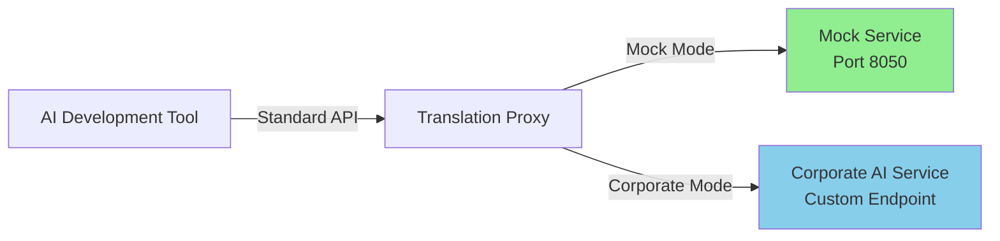

# Corporate AI Proxy Solutions

> **Enterprise-grade proxy integrations that enable AI development tools to work seamlessly with corporate AI services behind firewalls or with custom authentication requirements.**

## Table of Contents

- [Overview](#overview)
- [Architecture](#architecture)
- [Operating Modes](#operating-modes)
  - [Mock Mode (Development)](#mock-mode-development)
  - [Corporate Mode (Production)](#corporate-mode-production)
- [Quick Start](#quick-start)
  - [Mock Mode Setup](#mock-mode-setup)
  - [Corporate Mode Setup](#corporate-mode-setup)
- [Integrated Tools](#integrated-tools)
- [Configuration Reference](#configuration-reference)
- [Model Mapping](#model-mapping)
- [Troubleshooting](#troubleshooting)
- [Security Considerations](#security-considerations)
- [Adding New Tools](#adding-new-tools)

## Overview

Many AI development tools (OpenCode, Crush, Gemini CLI) are designed to work with public AI APIs like OpenAI or Anthropic. In corporate environments, AI services often have unique requirements:

- **Network Isolation**: Services behind firewalls with restricted access
- **Custom Authentication**: Corporate SSO, tokens, or certificate-based auth
- **API Format Differences**: AWS Bedrock, Azure OpenAI, or proprietary formats
- **Compliance Requirements**: Data residency, audit logging, security policies

These proxy solutions act as **translation layers**, allowing developers to use their favorite AI tools while complying with corporate policies.

## Architecture



### Component Layout

```
automation/corporate-proxy/
├── gemini/          # Gemini CLI integration (Port 8053)
├── crush/           # Crush CLI integration (Port 8051)
├── opencode/        # OpenCode CLI integration (Port 8052)
├── shared/          # Shared services and utilities
│   ├── services/    # Translation wrapper, mock API, unified tool API
│   └── scripts/     # Common bash functions
└── tests/           # Integration tests
```

## Operating Modes

### Mock Mode (Development)

**Purpose**: Test integrations without corporate network access or API credentials.

**When to Use**:
- Local development and testing
- CI/CD pipelines
- Demonstrating functionality
- Troubleshooting integration issues

**How It Works**:
1. Mock API service simulates corporate responses
2. Returns predictable test data
3. No external network calls
4. No authentication required

### Corporate Mode (Production)

**Purpose**: Connect to actual corporate AI services.

**When to Use**:
- Production deployments
- Real AI interactions
- Corporate network environment
- Integration with existing systems

**How It Works**:
1. Proxies translate API calls to corporate format
2. Handles authentication and authorization
3. Routes to corporate endpoints
4. Manages response transformation

## Quick Start

### Mock Mode Setup

**1. Clone and Navigate**
```bash
git clone <repository>
cd automation/corporate-proxy
```

**2. Build Services (Docker)**
```bash
# Build all proxy services
docker-compose build crush-proxy opencode-proxy gemini-proxy

# Or build individually
docker-compose build gemini-proxy
```

**3. Start in Mock Mode (Default)**
```bash
# Start all proxies with mock API
docker-compose --profile proxy up -d

# Verify services are running
docker-compose ps

# Check logs
docker-compose logs -f gemini-proxy
```

**4. Test Mock Functionality**
```bash
# Test Gemini with tools
docker-compose run --rm gemini-proxy bash -c "./scripts/test-tools.sh"
# Expected: Tool execution results

# Test Crush
docker-compose run --rm crush-proxy bash -c "./scripts/test-patched.sh"
# Expected: "Hatsune Miku"

# Test OpenCode
docker-compose run --rm opencode-proxy bash -c "./scripts/test-api-only.sh"
# Expected: "Response: Hatsune Miku"
```

**5. Interactive Testing**
```bash
# Run Gemini CLI interactively
docker-compose run --rm -it gemini-proxy

# Inside container, test with:
# > What is 2+2?
# Expected: Mock response
```

### Corporate Mode Setup

**1. Configure Environment Variables**

Create `.env` file in project root:
```bash
# Corporate API Configuration
COMPANY_API_BASE=https://bedrock.internal.company.com
COMPANY_API_TOKEN=your-corporate-api-token
USE_MOCK_API=false

# Optional: Custom endpoints for specific models
COMPANY_CLAUDE_ENDPOINT=ai-coe-bedrock-claude35-sonnet-200k
COMPANY_GPT4_ENDPOINT=ai-coe-bedrock-gpt4-turbo

# Network Configuration (if behind proxy)
HTTP_PROXY=http://proxy.company.com:8080
HTTPS_PROXY=http://proxy.company.com:8080
NO_PROXY=localhost,127.0.0.1
```

**2. Validate Configuration**
```bash
# Check environment is loaded
docker-compose config | grep -A5 environment

# Test connectivity to corporate API
curl -H "Authorization: Bearer $COMPANY_API_TOKEN" \
     $COMPANY_API_BASE/health
```

**3. Start Services in Corporate Mode**
```bash
# Start with corporate configuration
docker-compose --env-file .env --profile proxy up -d

# Monitor logs for connection status
docker-compose logs -f gemini-proxy | grep -E "Corporate|Connected"
```

**4. Test Corporate Integration**
```bash
# Test with real corporate endpoint
docker-compose run --rm gemini-proxy bash -c "
  export USE_MOCK_API=false
  ./scripts/test-api.sh
"

# Interactive test with corporate backend
docker-compose run --rm -it gemini-proxy
# > Generate a Python function to calculate fibonacci
# Should return real AI response from corporate service
```

## Integrated Tools

### Gemini CLI
- **Port**: 8053
- **Status**: Full tool support
- **Features**: File operations, command execution, web search
- **Config**: `gemini/config/gemini-config.json`
- **Test**: `docker-compose run --rm gemini-proxy bash -c "./scripts/test-tools.sh"`

### Crush CLI
- **Port**: 8051
- **Status**: Catwalk validation bypass
- **Features**: Fast code generation
- **Config**: Environment variables
- **Test**: `docker-compose run --rm crush-proxy bash -c "./scripts/test-patched.sh"`

### OpenCode CLI
- **Port**: 8052
- **Status**: API translation working
- **Features**: Comprehensive code generation
- **Config**: Environment variables
- **Test**: `docker-compose run --rm opencode-proxy bash -c "./scripts/test-api-only.sh"`

## Configuration Reference

### Environment Variables

| Variable | Description | Default | Example |
|----------|-------------|---------|---------|
| `USE_MOCK_API` | Enable mock mode | `true` | `false` for production |
| `COMPANY_API_BASE` | Corporate API base URL | `http://localhost:8050` | `https://ai.company.com` |
| `COMPANY_API_TOKEN` | Authentication token | `test-token` | `Bearer xyz123` |
| `GEMINI_PROXY_PORT` | Gemini proxy port | `8053` | Any available port |
| `CRUSH_PROXY_PORT` | Crush proxy port | `8051` | Any available port |
| `OPENCODE_PROXY_PORT` | OpenCode proxy port | `8052` | Any available port |
| `API_MODE` | Service mode | Service-specific | `gemini`, `crush`, `opencode` |
| `DEBUG` | Enable debug logging | `0` | `1` for verbose output |
| `GEMINI_MAX_OUTPUT_SIZE` | Max tool output size | `102400` | Size in bytes |
| `TOOL_API_SPEC` | Tool API format | `openai` | `openai` or `anthropic` |

### Configuration Files

**Gemini Configuration** (`gemini/config/gemini-config.json`):
```json
{
  "models": {
    "gemini-2.5-flash": {
      "endpoint": "your-corporate-endpoint",
      "description": "Maps to corporate model"
    }
  },
  "proxy_settings": {
    "port": 8053,
    "timeout": 120
  },
  "mock_settings": {
    "enabled": true,
    "response": "Test response"
  },
  "corporate_api": {
    "base_url": "http://localhost:8050",
    "token_env_var": "COMPANY_API_TOKEN"
  }
}
```

## API Endpoints

### Mock Mode Endpoints

| Service | Port | Endpoint | Description |
|---------|------|----------|-------------|
| Mock API | 8050 | `http://localhost:8050/api/v1/AI/GenAIExplorationLab/Models/{model}` | Simulates corporate API responses |
| Gemini Proxy | 8053 | `http://localhost:8053/v1/models/{model}:generateContent` | Gemini API format proxy |
| Crush Proxy | 8051 | `http://localhost:8051/v1/chat/completions` | OpenAI-compatible endpoint |
| OpenCode Proxy | 8052 | `http://localhost:8052/v1/chat/completions` | OpenRouter-compatible endpoint |

### Corporate Mode Endpoints

In corporate mode, the proxies translate requests to your corporate API:

```
Client Request → Proxy (localhost:805X) → Corporate API (COMPANY_API_BASE)
                                         ↓
                    https://bedrock.internal.company.com/api/v1/AI/GenAIExplorationLab/Models/{endpoint}
```

**Corporate API Request Format**:
```json
{
  "anthropic_version": "bedrock-2023-05-31",
  "max_tokens": 1000,
  "system": "System prompt",
  "messages": [
    {"role": "user", "content": "User message"}
  ],
  "temperature": 0.7
}
```

## Model Mapping

The proxy automatically maps standard model names to corporate endpoints:

| Standard Model | Corporate Endpoint | Use Case |
|----------------|-------------------|----------|
| `gpt-4` | `ai-coe-bedrock-claude35-sonnet-200k` | Advanced reasoning |
| `gpt-3.5-turbo` | `ai-coe-bedrock-claude3-haiku` | Fast responses |
| `claude-3.5-sonnet` | `ai-coe-bedrock-claude35-sonnet-200k` | Balanced performance |
| `gemini-2.5-flash` | `ai-coe-bedrock-claude35-sonnet-200k` | Quick iterations |
| `gemini-3-pro-preview` | `ai-coe-bedrock-claude3-opus` | Complex tasks |

### Automatic Tool Support Detection

**New Feature**: The proxy now **automatically detects** whether a model supports native tool calling based on configuration in `shared/configs/models.json`. No manual environment variables needed!

For models without native tool support, the proxy automatically:
1. Injects tool descriptions into the prompt
2. Parses tool calls from the model's text response
3. Converts them to standard OpenAI format

Configure in `models.json`:
```json
{
  "models": {
    "custom-model": {
      "endpoint": "your-endpoint",
      "supports_tools": false  // Automatically uses text parsing!
    }
  }
}
```

See `shared/docs/automatic-tool-detection.md` for complete documentation.

### Dual API Specification Support

**New Feature**: The proxy now supports both **OpenAI** and **Anthropic** tool API specifications, with automatic format detection!

#### API Specifications

| Spec | Tool Calls | Tool Results | Detection Indicators |
|------|------------|--------------|---------------------|
| **OpenAI** | `tool_calls` array with function objects | `role="tool"` messages | `role="tool"`, `tool_calls` in messages |
| **Anthropic** | `content` array with `tool_use` blocks | `tool_result` in user message content | `anthropic_version`, `system` as string, `tool_use`/`tool_result` blocks |

#### Configuration

Set via environment variable:
```bash
# Use OpenAI format (default)
export TOOL_API_SPEC=openai

# Use Anthropic format
export TOOL_API_SPEC=anthropic
```

Or in `shared/configs/tool_config.json`:
```json
{
  "api_spec": {
    "default": "openai",
    "auto_detect": true
  }
}
```

#### Automatic Detection

When `auto_detect` is enabled (default), the proxy automatically detects the API spec from incoming requests:

1. **Anthropic Indicators**:
   - `anthropic_version` field present
   - `system` field is a string (not in messages)
   - `tool_use` or `tool_result` blocks in message content

2. **OpenAI Indicators**:
   - `role="tool"` messages
   - `tool_calls` array in assistant messages

3. **Default**: Falls back to configured `TOOL_API_SPEC` if no indicators found

#### Endpoints

| Endpoint | Description |
|----------|-------------|
| `/chat/completions` | OpenAI-compatible (auto-detects and responds in matching format) |
| `/messages` | Native Anthropic Messages API format |
| `/v1/chat/completions` | Versioned OpenAI-compatible |
| `/v1/messages` | Versioned Anthropic-compatible |

#### Example: OpenAI Format Request
```json
{
  "model": "gpt-4",
  "messages": [
    {"role": "user", "content": "Read the file"},
    {"role": "assistant", "tool_calls": [
      {"id": "call_123", "type": "function", "function": {"name": "view", "arguments": "{}"}}
    ]},
    {"role": "tool", "tool_call_id": "call_123", "content": "file contents"}
  ]
}
```

#### Example: Anthropic Format Request
```json
{
  "anthropic_version": "bedrock-2023-05-31",
  "model": "claude-3",
  "system": "You are helpful",
  "messages": [
    {"role": "user", "content": "Read the file"},
    {"role": "assistant", "content": [
      {"type": "tool_use", "id": "toolu_123", "name": "view", "input": {}}
    ]},
    {"role": "user", "content": [
      {"type": "tool_result", "tool_use_id": "toolu_123", "content": "file contents"}
    ]}
  ]
}
```

## Troubleshooting

### Common Issues and Solutions

#### 1. Connection Refused
```bash
# Problem: Cannot connect to proxy service
Error: connect ECONNREFUSED 127.0.0.1:8053

# Solutions:
# a) Check service is running
docker-compose ps
docker-compose logs gemini-proxy

# b) Verify port mapping
docker port gemini-proxy

# c) Restart service
docker-compose restart gemini-proxy
```

#### 2. Authentication Failures
```bash
# Problem: 401 or 403 errors from corporate API

# Solutions:
# a) Verify token is set
echo $COMPANY_API_TOKEN

# b) Test token directly
curl -H "Authorization: Bearer $COMPANY_API_TOKEN" \
     $COMPANY_API_BASE/health

# c) Check token expiration and refresh if needed
```

#### 3. Model Not Found
```bash
# Problem: "Model not found" or mapping errors

# Solutions:
# a) Check model mapping in configuration
cat gemini/config/gemini-config.json | jq '.models'

# b) Verify corporate endpoint is correct
# c) Update mapping in translation_wrapper.py
```

#### 4. Network/Proxy Issues
```bash
# Problem: Cannot reach corporate API behind proxy

# Solutions:
# a) Set proxy environment variables
export HTTP_PROXY=http://proxy.company.com:8080
export HTTPS_PROXY=http://proxy.company.com:8080
export NO_PROXY=localhost,127.0.0.1

# b) Test connectivity through proxy
curl -x $HTTP_PROXY $COMPANY_API_BASE/health

# c) Add proxy config to Docker
docker-compose run --rm \
  -e HTTP_PROXY=$HTTP_PROXY \
  -e HTTPS_PROXY=$HTTPS_PROXY \
  gemini-proxy
```

#### 5. Mock Mode Not Working
```bash
# Problem: Mock responses not returning

# Solutions:
# a) Verify mock mode is enabled
export USE_MOCK_API=true

# b) Check mock service is running
curl http://localhost:8050/health

# c) Restart with clean state
docker-compose down
docker-compose --profile proxy up -d
```

### Debug Mode

Enable verbose logging for troubleshooting:

```bash
# Set debug environment variable
export DEBUG=1

# Run with debug output
docker-compose run --rm -e DEBUG=1 gemini-proxy

# Check detailed logs
docker-compose logs -f --tail=100 gemini-proxy 2>&1 | tee debug.log

# Analyze specific errors
grep -E "ERROR|WARN|Failed" debug.log
```

## Security Considerations

### Best Practices

1. **Credential Management**
   - Never hardcode tokens or passwords
   - Use environment variables or secrets management
   - Rotate tokens regularly
   - Use `.env` files with `.gitignore`

2. **Network Security**
   - Proxy runs locally by default (minimize attack surface)
   - Use TLS for corporate connections
   - Implement rate limiting
   - Monitor for anomalous activity

3. **Container Security**
   - Run as non-root user
   - Use minimal base images
   - Regular security updates
   - Scan images for vulnerabilities

4. **Data Protection**
   - No sensitive data in logs
   - Sanitize error messages
   - Implement audit logging for corporate mode
   - Follow data residency requirements

## Adding New Tools

To integrate a new AI tool:

### 1. Create Directory Structure
```bash
mkdir -p corporate-proxy/newtool/{docker,scripts,config}
```

### 2. Implement Translation Layer
```python
# newtool/newtool_proxy.py
from shared.services.translation_wrapper import TranslationWrapper

class NewToolProxy(TranslationWrapper):
    def translate_request(self, request):
        # Convert tool format to corporate format
        pass

    def translate_response(self, response):
        # Convert corporate format back to tool format
        pass
```

### 3. Create Dockerfile
```dockerfile
# newtool/docker/Dockerfile
FROM python:3.10-slim
# Install tool and dependencies
# Configure proxy settings
```

### 4. Add to Docker Compose
```yaml
# docker-compose.yml
newtool-proxy:
  build:
    context: .
    dockerfile: automation/corporate-proxy/newtool/docker/Dockerfile
  ports:
    - "8054:8054"
  environment:
    - USE_MOCK_API=${USE_MOCK_API:-true}
```

### 5. Create Test Scripts
```bash
# newtool/scripts/test.sh
#!/bin/bash
# Test mock mode
# Test corporate mode
# Validate responses
```

### 6. Document Configuration
- Update this README
- Create tool-specific README
- Add to model mapping table
- Include troubleshooting steps

## Contributing

When contributing to corporate proxy integrations:

- Follow existing patterns and directory structure
- Reuse shared components where possible
- Include comprehensive test scripts
- Document all environment variables
- Test with both mock and corporate modes
- Add security considerations
- Update main documentation

## Support

For issues or questions:
1. Check troubleshooting section
2. Review tool-specific READMEs
3. Enable debug mode for detailed logs
4. Create GitHub issue with debug output

## License

Part of the template-repo project. See repository root for license information.
