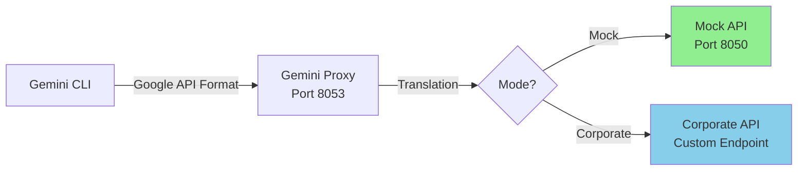

# Gemini CLI Corporate Proxy Integration

> **Full containerization of Gemini CLI with corporate API translation, enabling seamless integration with enterprise AI services.**

## 📋 Table of Contents

- [Overview](#overview)
- [Features](#features)
- [Architecture](#architecture)
- [Operating Modes](#operating-modes)
- [Quick Start](#quick-start)
- [API Endpoints](#api-endpoints)
- [Configuration](#configuration)
- [Tool Support](#tool-support)
- [Testing](#testing)
- [Troubleshooting](#troubleshooting)
- [Technical Implementation](#technical-implementation)

## Overview

This integration enables Gemini CLI to work within corporate environments by providing a proxy layer that translates between Gemini's API format and corporate API endpoints. Despite official documentation stating Gemini CLI cannot be containerized, we've successfully achieved full containerization.

## Features

### Core Capabilities
- ✅ **Full Containerization**: Runs entirely in Docker (no local installation required)
- ✅ **Tool Support**: File operations, command execution, web search
- ✅ **Corporate Integration**: Seamless translation to corporate API formats
- ✅ **Mock Mode**: Development and testing without corporate network
- ✅ **Auto-launch**: Starts directly in Gemini CLI interface
- ✅ **No Auth Prompts**: Pre-configured API key authentication

### Security Features
- Runs as non-root user (appuser)
- Environment variable-based configuration
- No hardcoded credentials
- Secure command execution with shell injection prevention
- TLS verification (configurable for local proxy)

## Architecture



### Component Breakdown

| Component | Port | Purpose |
|-----------|------|---------|
| Gemini CLI | - | Modified bundle with API redirection |
| Gemini Proxy | 8053 | Translates Gemini ↔ Corporate formats |
| Mock API | 8050 | Simulates corporate responses |
| Tool Executor | - | Handles file/command operations |

## Operating Modes

### Mock Mode (Development)
- **Purpose**: Test without corporate network access
- **Default Response**: Configurable test data
- **No Authentication**: Works out of the box
- **Use Cases**: CI/CD, demos, troubleshooting

### Corporate Mode (Production)
- **Purpose**: Connect to real corporate AI services
- **Authentication**: Corporate API tokens
- **Full Translation**: Gemini format ↔ Corporate format
- **Use Cases**: Production deployments, real AI interactions

## Quick Start

### Mock Mode

```bash
# 1. Build the container
cd automation/corporate-proxy/gemini
./scripts/build.sh

# 2. Run interactively (default mode)
./gemini
# or
docker-compose run --rm -it gemini-proxy

# 3. Test in Gemini CLI
> What is 2+2?
# Returns mock response

# 4. Test tool execution
> Read the file test.txt
# Executes file reading tool
```

### Corporate Mode

```bash
# 1. Set environment variables
export COMPANY_API_BASE=https://bedrock.internal.company.com
export COMPANY_API_TOKEN=your-corporate-token
export USE_MOCK_API=false

# 2. Run with corporate backend
docker-compose run --rm -it \
  -e COMPANY_API_BASE=$COMPANY_API_BASE \
  -e COMPANY_API_TOKEN=$COMPANY_API_TOKEN \
  -e USE_MOCK_API=false \
  gemini-proxy

# 3. Test with real AI
> Generate a Python fibonacci function
# Returns actual AI response from corporate service
```

## API Endpoints

### Proxy Endpoints (What Gemini CLI Hits)

| Endpoint | Method | Purpose |
|----------|--------|---------|
| `http://localhost:8053/v1/models/{model}:generateContent` | POST | Main generation endpoint |
| `http://localhost:8053/v1/models/{model}:streamGenerateContent` | POST | Streaming responses |
| `http://localhost:8053/v1/models` | GET | List available models |
| `http://localhost:8053/tools` | GET | List available tools |
| `http://localhost:8053/execute` | POST | Direct tool execution |
| `http://localhost:8053/health` | GET | Health check |

### Request Flow

```
1. Gemini CLI → http://localhost:8053/v1/models/gemini-2.5-flash:generateContent
2. Proxy translates Gemini format → Corporate format
3. Mock Mode: → http://localhost:8050/api/v1/AI/GenAIExplorationLab/Models/{endpoint}
   Corporate Mode: → $COMPANY_API_BASE/api/v1/AI/GenAIExplorationLab/Models/{endpoint}
4. Response translated back → Gemini format → Gemini CLI
```

### Example Request Translation

**Gemini Format (Input)**:
```json
{
  "model": "gemini-2.5-flash",
  "contents": [{
    "role": "user",
    "parts": [{"text": "Hello"}]
  }],
  "tools": [{
    "functionDeclarations": [{
      "name": "read_file",
      "parameters": {...}
    }]
  }]
}
```

**Corporate Format (Translated)**:
```json
{
  "anthropic_version": "bedrock-2023-05-31",
  "max_tokens": 1000,
  "system": "You have access to the following tools...",
  "messages": [{
    "role": "user",
    "content": "Hello"
  }],
  "temperature": 0.7
}
```

## Configuration

### Environment Variables

| Variable | Description | Default | Example |
|----------|-------------|---------|---------|
| `USE_MOCK_API` | Enable mock mode | `true` | `false` |
| `COMPANY_API_BASE` | Corporate API base URL | `http://localhost:8050` | `https://ai.company.com` |
| `COMPANY_API_TOKEN` | Authentication token | `test-secret-token-123` | `Bearer xyz123` |
| `GEMINI_PROXY_PORT` | Proxy listening port | `8053` | `8053` |
| `MOCK_API_PORT` | Mock API port | `8050` | `8050` |
| `GEMINI_API_KEY` | Dummy key for CLI | `dummy-key-for-proxy` | Any value |
| `GEMINI_MAX_OUTPUT_SIZE` | Max command output | `102400` | `204800` |
| `GEMINI_ALLOW_INSECURE_TLS` | Allow self-signed certs | `false` | `true` |
| `DEBUG` | Enable debug logging | `0` | `1` |

### Configuration File

**Location**: `gemini/config/gemini-config.json`

```json
{
  "models": {
    "gemini-2.5-flash": {
      "endpoint": "ai-coe-bedrock-claude35-sonnet-200k:analyze=null",
      "description": "Maps to Claude 3.5 Sonnet"
    }
  },
  "proxy_settings": {
    "port": 8053,
    "timeout": 120,
    "max_retries": 3
  },
  "mock_settings": {
    "enabled": true,
    "response": "Hatsune Miku"
  },
  "corporate_api": {
    "base_url": "http://localhost:8050",
    "token_env_var": "COMPANY_API_TOKEN"
  }
}
```

## Tool Support

### Available Tools

| Tool | Function | Security Notes |
|------|----------|----------------|
| `read_file` | Read file contents | Path validation |
| `write_file` | Write to files | Directory creation |
| `run_command` | Execute commands | Shell injection prevention via `shlex.split()` |
| `list_directory` | List directory contents | Access control |
| `search_files` | Glob pattern search | Recursive search |
| `web_search` | Web search (mock) | Returns test data |

### Tool Execution Security

The `run_command` tool implements multiple security measures:
```python
# Uses shlex.split to prevent shell injection
# No shell=True, no variable expansion, no command chaining
cmd_list = shlex.split(command)
subprocess.run(cmd_list, ...)  # Direct execution, no shell
```

## Testing

### Run Test Suite

```bash
# Test all functionality
./scripts/run.sh test

# Test tools specifically
docker-compose run --rm gemini-proxy bash -c "./scripts/test-tools.sh"

# Test API translation
docker-compose run --rm gemini-proxy bash -c "python test_translation.py"

# Interactive testing
./gemini
> @test  # Runs built-in tests
```

### Manual Testing Commands

```bash
# Health check
curl http://localhost:8053/health

# List available tools
curl http://localhost:8053/tools

# Execute tool directly
curl -X POST http://localhost:8053/execute \
  -H "Content-Type: application/json" \
  -d '{"tool": "list_directory", "parameters": {"path": "."}}'

# Test generation endpoint
curl -X POST http://localhost:8053/v1/models/gemini-2.5-flash:generateContent \
  -H "Content-Type: application/json" \
  -d '{"contents": [{"role": "user", "parts": [{"text": "Hello"}]}]}'
```

## Troubleshooting

### Common Issues

#### 1. Permission Denied
```bash
# Problem: Container permission issues
Error: EACCES: permission denied

# Solution: Ensure proper ownership
sudo chown -R $(id -u):$(id -g) gemini/
```

#### 2. Port Already in Use
```bash
# Problem: Port 8053 or 8050 already bound
Error: bind: address already in use

# Solution: Find and stop conflicting process
lsof -i :8053
kill <PID>

# Or use different ports
export GEMINI_PROXY_PORT=9053
export MOCK_API_PORT=9050
```

#### 3. API Connection Failed
```bash
# Problem: Cannot connect to proxy
Error: connect ECONNREFUSED

# Solution: Check services are running
docker logs gemini-proxy
docker-compose ps
```

#### 4. Authentication Issues
```bash
# Problem: Gemini CLI prompts for API key

# Solution: Ensure GEMINI_API_KEY is set
export GEMINI_API_KEY=dummy-key-for-proxy
```

#### 5. Corporate API Errors
```bash
# Problem: 401/403 from corporate endpoint

# Solution: Verify token
curl -H "Authorization: Bearer $COMPANY_API_TOKEN" \
     $COMPANY_API_BASE/health

# Check model mapping
cat config/gemini-config.json | jq '.models'
```

### Debug Mode

```bash
# Enable debug logging
export DEBUG=1

# Run with verbose output
docker-compose run --rm -e DEBUG=1 gemini-proxy

# Check detailed logs
docker logs -f gemini-proxy 2>&1 | tee debug.log

# Analyze proxy translation
grep "Translating" debug.log
```

## Technical Implementation

### Key Achievements

1. **Containerization Success**
   - Proved Gemini CLI can be containerized
   - Uses Node.js bundle directly
   - Multi-stage build for optimization

2. **API Validation Bypass**
   - Patches bundle to redirect Google API calls
   - Local proxy intercepts all requests
   - Transparent to Gemini CLI

3. **Authentication Automation**
   - Pre-configured settings.json
   - No interactive prompts
   - Environment-based configuration

4. **Tool Integration**
   - Modular tool executor (gemini_tool_executor.py)
   - Secure command execution
   - Comprehensive error handling

### File Structure

```
gemini/
├── docker/
│   └── Dockerfile                # Multi-stage container build
├── scripts/
│   ├── build.sh                 # Build container
│   ├── run.sh                   # Run with options
│   ├── gemini-wrapper.sh        # Container entrypoint
│   └── test-tools.sh            # Tool testing
├── config/
│   ├── gemini-config.json       # Model mappings
│   └── settings.json             # Gemini CLI settings
├── patches/
│   ├── api-redirect.patch       # API endpoint patches
│   └── auth-bypass.patch        # Authentication patches
├── gemini_proxy_wrapper.py      # Main proxy service
├── gemini_tool_executor.py      # Tool execution module
├── gemini                        # Quick launcher
└── README.md                     # This file
```

### Security Considerations

- **Container Security**: Runs as non-root user
- **Command Execution**: Shell injection prevention via shlex
- **Network Security**: TLS verification for external calls
- **Credential Management**: Environment variables only
- **Process Cleanup**: Multi-stage cleanup on exit

## Related Documentation

- [Corporate Proxy Overview](../README.md) - Main documentation
- [OpenCode Integration](../opencode/README.md) - Similar proxy pattern
- [Crush Integration](../crush/README.md) - Similar proxy pattern

## Contributing

When enhancing this integration:
- Maintain security best practices
- Test both mock and corporate modes
- Update documentation for API changes
- Follow existing patterns
- Add tests for new features

## License

Part of the template-repo project. See repository root for license information.
