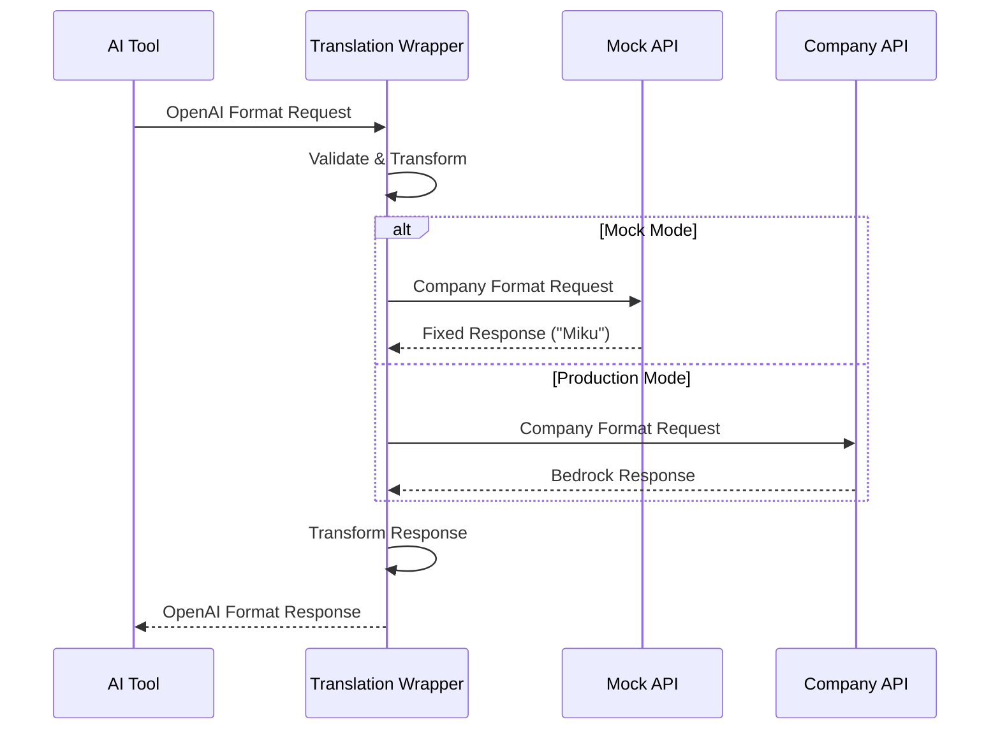

# Corporate Proxy Architecture

## System Overview

The Corporate Proxy Integration Suite provides a secure middleware layer that intercepts and translates API calls from AI development tools to internal corporate APIs, ensuring complete data sovereignty.

## Core Components

### 1. Translation Layer

```
┌──────────────────────────────────────────────────────────┐
│                   Translation Wrapper                      │
│                      (Port 8052)                          │
├──────────────────────────────────────────────────────────┤
│  Input Handler           │           Output Handler       │
│  ├─ OpenAI Format       │           ├─ OpenAI Format    │
│  ├─ Authentication      │           ├─ Streaming Sim    │
│  └─ Request Validation  │           └─ Error Handling   │
├──────────────────────────────────────────────────────────┤
│                    Format Converter                       │
│  ├─ Message Transformation                               │
│  ├─ Model Mapping                                        │
│  └─ Token Calculation                                    │
├──────────────────────────────────────────────────────────┤
│                    Company API Client                     │
│  ├─ Bedrock Format                                       │
│  ├─ Authentication                                        │
│  └─ Rate Limiting                                        │
└──────────────────────────────────────────────────────────┘
```

### 2. Request Flow



### 3. Data Transformation

#### Request Transformation (OpenAI → Bedrock)

```python
# OpenAI Format
{
    "model": "company/claude-3.5-sonnet",
    "messages": [
        {"role": "system", "content": "..."},
        {"role": "user", "content": "..."}
    ],
    "max_tokens": 4096,
    "temperature": 0.7,
    "stream": true
}

# Transformed to Bedrock Format
{
    "anthropic_version": "bedrock-2023-05-31",
    "system": "...",
    "messages": [...],
    "max_tokens": 4096,
    "temperature": 0.7
}
```

#### Response Transformation (Bedrock → OpenAI)

```python
# Bedrock Format
{
    "id": "msg_...",
    "content": [{"type": "text", "text": "..."}],
    "usage": {"input_tokens": 10, "output_tokens": 50}
}

# Transformed to OpenAI Format
{
    "id": "chatcmpl-...",
    "object": "chat.completion",
    "choices": [{
        "message": {"role": "assistant", "content": "..."},
        "finish_reason": "stop"
    }],
    "usage": {...}
}
```

## Container Architecture

### Multi-Stage Build Pattern

```dockerfile
# Stage 1: Tool Binary
FROM [base] AS builder
# Build or download tool binary

# Stage 2: Runtime Environment
FROM python:3.11-alpine
# Copy binary
# Install Python services
# Configure environment
```

### Service Orchestration

```
Container Startup
    ├─ Initialize Environment
    ├─ Start Mock API (if enabled)
    ├─ Start Translation Wrapper
    ├─ Health Checks
    └─ Launch AI Tool
```

## Network Architecture

### Port Allocation

| Service | Port | Protocol | Purpose |
|---------|------|----------|---------|
| Mock API | 8050 | HTTP | Simulated Company API |
| Translation Wrapper | 8052 | HTTP | API Translation |
| Health Check | - | Internal | Service monitoring |

### Network Modes

#### Development Mode (Mock)
```
[AI Tool] → localhost:8052 → localhost:8050 → [Mock Response]
```

#### Production Mode
```
[AI Tool] → localhost:8052 → [Company API URL] → [Real Response]
```

## Security Architecture

### Authentication Flow

1. **Tool → Wrapper**: Uses configured API key
2. **Wrapper Validation**: Checks token format
3. **Wrapper → Company**: Uses Company bearer token
4. **Response**: Stripped of sensitive headers

### Data Protection

- **No External Calls**: All endpoints configurable
- **Token Isolation**: Separate tokens for each layer
- **Request Logging**: Full audit trail available
- **Error Sanitization**: No leak of internal details

## Configuration Management

### Hierarchical Configuration

```
shared/configs/
    ├─ models.json       # Model definitions
    ├─ endpoints.json    # Service endpoints
    └─ [tool]/config.json # Tool-specific overrides
```

### Environment Variable Precedence

1. Runtime environment variables (highest)
2. Tool-specific configuration
3. Shared configuration
4. Default values (lowest)

## Scaling Considerations

### Horizontal Scaling

```
         Load Balancer
              │
    ┌─────────┴─────────┬─────────┐
    │                   │         │
Wrapper-1          Wrapper-2  Wrapper-3
    │                   │         │
    └─────────┬─────────┴─────────┘
              │
         Company API
```

### Performance Optimizations

- **Connection Pooling**: Reuse HTTP connections
- **Response Caching**: Cache frequent queries (optional)
- **Async Processing**: Non-blocking I/O for wrapper
- **Resource Limits**: Container memory/CPU constraints

## Monitoring & Observability

### Health Checks

```bash
# Service health
GET /health → {"status": "healthy", "timestamp": "..."}

# Detailed status
GET /status → {
    "uptime": 3600,
    "requests_processed": 150,
    "error_rate": 0.01
}
```

### Logging Strategy

```
[timestamp] [level] [service] [correlation_id] message
2024-01-20 10:30:45 INFO wrapper req_123 Request received
2024-01-20 10:30:46 INFO wrapper req_123 Transform complete
2024-01-20 10:30:47 INFO wrapper req_123 Response sent
```

### Metrics Collection

- Request count and latency
- Error rates by type
- Token usage statistics
- Model usage distribution

## Deployment Patterns

### Docker Compose (Development)

```yaml
services:
  opencode:
    image: opencode-corporate
    environment:
      - COMPANY_API_BASE=http://mock:8050
    depends_on:
      - mock

  mock:
    image: mock-api
    ports:
      - "8050:8050"
```

### Kubernetes (Production)

```yaml
apiVersion: apps/v1
kind: Deployment
metadata:
  name: corporate-proxy
spec:
  replicas: 3
  template:
    spec:
      containers:
      - name: wrapper
        image: translation-wrapper:latest
        env:
        - name: COMPANY_API_BASE
          valueFrom:
            secretKeyRef:
              name: company-api
              key: base-url
```

## Extensibility

### Adding New Tools

1. **Create Tool Adapter**: Implement tool-specific configuration
2. **Define Model Mapping**: Map tool's model names to company models
3. **Container Integration**: Build tool with shared services
4. **Testing**: Verify with mock services
5. **Documentation**: Update tool-specific README

### Adding New Models

1. Update `shared/configs/models.json`
2. Add endpoint mapping in wrapper
3. Test transformation logic
4. Update documentation

## Performance Characteristics

### Latency Breakdown

| Component | Latency | Notes |
|-----------|---------|-------|
| Tool → Wrapper | <1ms | Local connection |
| Transform Logic | ~5ms | JSON processing |
| Wrapper → API | Variable | Network dependent |
| Response Transform | ~5ms | JSON processing |
| **Total Overhead** | **~10ms** | Plus network latency |

### Throughput

- Single wrapper instance: ~100 req/s
- With connection pooling: ~500 req/s
- Horizontal scaling: Linear with instances

## Streaming Limitations

### Current Implementation: Simulated Streaming

The translation wrapper currently implements **simulated streaming** rather than true streaming. This is an important architectural limitation that affects performance for large responses.

#### How It Works

1. **Request Phase**: Client requests streaming response (`stream: true`)
2. **Buffer Phase**: Wrapper makes complete request to Company API
3. **Wait Phase**: Entire response is buffered in memory
4. **Simulation Phase**: Response is sent as chunks to simulate streaming

```python
# Current implementation (simplified)
def stream_response():
    # Step 1: Get complete response from upstream
    complete_response = company_api.call()  # BLOCKS until complete

    # Step 2: Send as simulated chunks
    yield f"data: {json.dumps(chunk_with_content)}\n\n"
    yield f"data: {json.dumps(finish_chunk)}\n\n"
    yield "data: [DONE]\n\n"
```

#### Impact on Large Responses

For responses that take significant time to generate:

| Response Size | Generation Time | Client Experience |
|--------------|-----------------|-------------------|
| Small (<1K tokens) | <5 seconds | Negligible impact |
| Medium (1-4K tokens) | 5-15 seconds | Noticeable delay before first byte |
| Large (4-8K tokens) | 15-30 seconds | **Risk of client timeout** |
| Very Large (>8K tokens) | >30 seconds | **High risk of timeout** |

#### Client Timeout Risks

- **Crush/OpenCode Default Timeout**: 30 seconds
- **First Byte Wait**: Entire generation time
- **Mitigation**: Configure longer timeouts for large requests

#### Why Not True Streaming?

The Company Bedrock API does not currently support Server-Sent Events (SSE) or chunked responses. True streaming would require:

1. Company API to support streaming responses
2. Iterative processing with `requests.post(..., stream=True)`
3. Real-time chunk transformation and forwarding

#### Recommended Workarounds

1. **Increase Client Timeouts**: For large generation tasks
2. **Reduce Max Tokens**: Limit response size when possible
3. **Use Non-Streaming Mode**: For better error handling
4. **Monitor Response Times**: Track and alert on slow responses

## Failure Modes & Recovery

### Graceful Degradation

1. **Company API Down**: Return cached responses or error
2. **Wrapper Crash**: Container restart policy
3. **Network Issues**: Exponential backoff retry
4. **Rate Limiting**: Queue and throttle requests

### Error Handling

```python
try:
    response = company_api.call()
except ConnectionError:
    return cached_response or error_response
except RateLimitError:
    queue_request()
    return retry_after_response
except AuthenticationError:
    refresh_token()
    retry_request()
```

## Future Enhancements

### Planned Features

- **True Streaming**: When Company API supports SSE
- **WebSocket Support**: For real-time interactions
- **Multi-Region**: Geographic distribution
- **Advanced Caching**: Redis-based response cache
- **GraphQL Interface**: Alternative to REST API
- **Metrics Dashboard**: Grafana integration

### Architecture Evolution

```
Current: Monolithic Wrapper
    ↓
Next: Microservices
    ├─ Auth Service
    ├─ Transform Service
    ├─ Cache Service
    └─ Analytics Service
```
