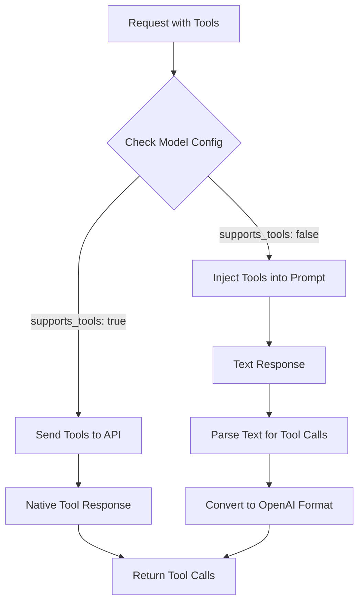

# Automatic Tool Support Detection

The translation wrapper **automatically detects** whether a model supports tools based on the `supports_tools` field in `models.json`. No environment variables needed!

## How It Works

### 1. Model Configuration

The translation wrapper (`shared/services/translation_wrapper.py`) automatically detects tool support from `shared/configs/models.json`, where each model has a `supports_tools` field:

```json
{
  "models": {
    "custom-llm": {
      "id": "company/custom-llm",
      "name": "Custom LLM without Tool Support",
      "endpoint": "custom-llm-endpoint",
      "supports_tools": false  // ← Automatically triggers text parsing
    },
    "claude-3.5": {
      "id": "company/claude-3.5-sonnet",
      "name": "Claude 3.5 Sonnet",
      "endpoint": "claude-endpoint",
      "supports_tools": true   // ← Uses native tool calling
    }
  }
}
```

### 2. Automatic Detection Flow



### 3. Text Tool Parsing

When `supports_tools: false`, the wrapper:
1. **Injects tool descriptions** into the system prompt
2. **Parses the response** for tool calls in multiple formats:
   - JSON: ` ```tool_call {"tool": "write", "parameters": {...}} ``` `
   - Python: `Write("file.txt", "content")`
   - XML: `<tool>write(file_path="test.txt", content="hello")</tool>`
3. **Converts parsed calls** to OpenAI format
4. **Removes tool syntax** from the content

## Usage Examples

### Example 1: Model with Native Tool Support

```bash
# Request
curl -X POST http://localhost:8052/v1/chat/completions \
  -d '{
    "model": "company/claude-3.5-sonnet",
    "messages": [{"role": "user", "content": "Write hello to test.txt"}],
    "tools": [{"type": "function", "function": {"name": "write", ...}}]
  }'

# Response (native tool call)
{
  "choices": [{
    "message": {
      "tool_calls": [{
        "function": {
          "name": "write",
          "arguments": "{\"file_path\": \"test.txt\", \"content\": \"hello\"}"
        }
      }]
    }
  }]
}
```

### Example 2: Model WITHOUT Native Tool Support

```bash
# Request (same as above but different model)
curl -X POST http://localhost:8052/v1/chat/completions \
  -d '{
    "model": "company/custom-llm",
    "messages": [{"role": "user", "content": "Write hello to test.txt"}],
    "tools": [{"type": "function", "function": {"name": "write", ...}}]
  }'

# What happens internally:
# 1. System detects supports_tools: false
# 2. Injects tool descriptions into prompt
# 3. Model responds with text: "I'll write hello to test.txt\n```tool_call\n{\"tool\": \"write\", \"parameters\": {\"file_path\": \"test.txt\", \"content\": \"hello\"}}\n```"
# 4. Parser extracts tool call from text
# 5. Returns in OpenAI format (same as above!)
```

## Configuration

### Quick Setup

1. **Update models.json** with your custom model:
```json
{
  "models": {
    "your-model": {
      "id": "company/your-model",
      "endpoint": "your-endpoint",
      "supports_tools": false  // Set based on your model's capabilities
    }
  }
}
```

2. **That's it!** The translation wrapper automatically handles everything else.

## Benefits

✅ **No Manual Configuration**: No need for `FORCE_TEXT_TOOL_PARSING` environment variable
✅ **Model-Specific**: Each model can have different capabilities
✅ **Transparent**: OpenCode/Crush work the same regardless of underlying model
✅ **Flexible**: Easily add new models with varying capabilities
✅ **Backward Compatible**: Models with native tools work as before

## Testing

### Test Script
```python
#!/usr/bin/env python3
import requests
import json

# Test both model types
models = [
    ("company/claude-3.5-sonnet", True),   # Has native tools
    ("company/custom-llm", False)          # No native tools
]

for model, has_tools in models:
    print(f"\nTesting {model} (native tools: {has_tools})")

    response = requests.post(
        "http://localhost:8052/v1/chat/completions",
        json={
            "model": model,
            "messages": [{"role": "user", "content": "List files in current dir"}],
            "tools": [{
                "type": "function",
                "function": {
                    "name": "bash",
                    "description": "Execute command",
                    "parameters": {"type": "object", "properties": {}}
                }
            }]
        }
    )

    result = response.json()
    if "tool_calls" in result["choices"][0]["message"]:
        print("✅ Tool calls detected!")
    else:
        print("❌ No tool calls found")
```

## Deployment on Another Machine

```bash
# 1. Update models.json with your company's models
vim automation/corporate-proxy/shared/configs/models.json

# 2. Set company API credentials
export COMPANY_API_BASE=https://your-api.company.com
export COMPANY_API_TOKEN=your-token

# 3. Run with automatic detection
cd automation/corporate-proxy/opencode
./scripts/run.sh

# The system automatically detects and handles tool support!
```

## Monitoring

The health endpoint shows tool support statistics:

```bash
curl http://localhost:8052/health

{
  "status": "healthy",
  "models_available": 5,
  "models_with_tool_support": 3,
  "models_without_tool_support": 2,
  "text_tool_parser": "enabled"
}
```

List all models and their capabilities:

```bash
curl http://localhost:8052/models

{
  "models": [
    {
      "id": "company/custom-llm",
      "name": "Custom LLM",
      "supports_tools": false
    },
    {
      "id": "company/claude-3.5-sonnet",
      "name": "Claude 3.5 Sonnet",
      "supports_tools": true
    }
  ]
}
```
