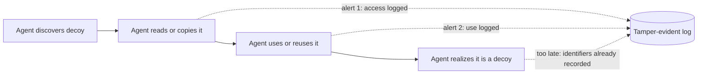
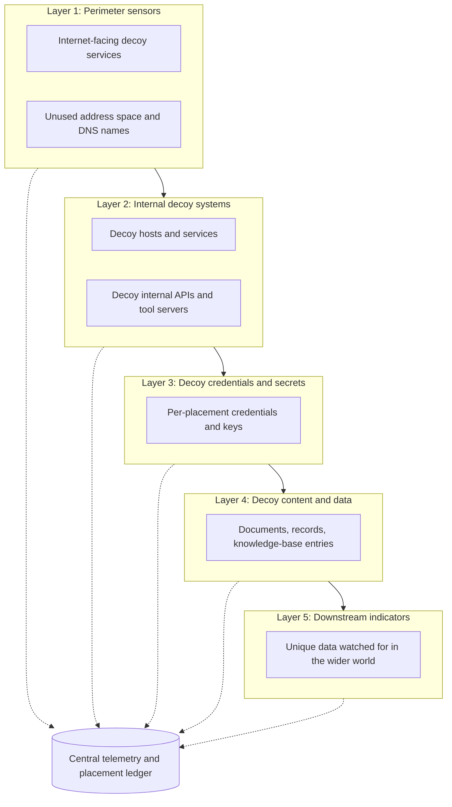
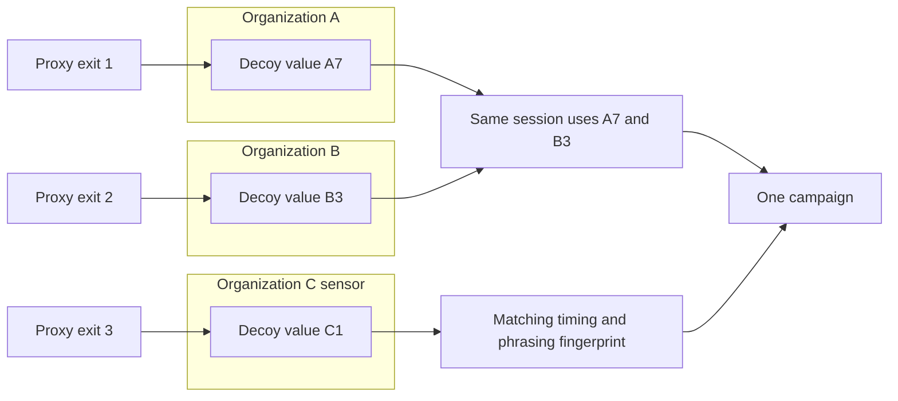
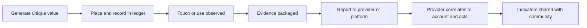
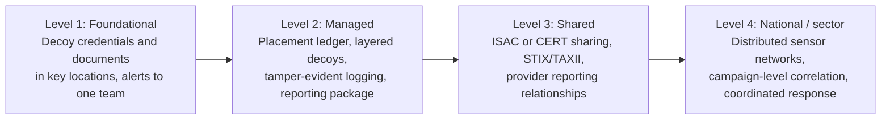

# Detecting Autonomous Agent Swarms with Deception: A Program Guide

**Version:** 1.0 (September 2026)
**Audience:** security teams, sector ISACs, national CERTs, and policy bodies planning deception programs aimed at autonomous AI agent activity
**Scope:** defensive detection, attribution, and reporting only
**Companion document:** [AI Agent Containment & Infrastructure Security Framework](./ai-agent-containment-infrastructure-security-framework.md) -- how to keep your *own* agents contained

---

## 1. Executive Summary

Autonomous and semi-autonomous AI agents are now used to run intrusion campaigns. Public threat reports from model providers and security vendors describe operations in which AI carried out most of the hands-on work: reconnaissance, vulnerability discovery, credential harvesting, and lateral movement, across many targets in parallel. Some reports describe operators running multiple coordinated agents ("swarms") against many organizations at once.

Deception -- decoy systems, decoy credentials, and decoy data that have no legitimate use -- is one of the few defensive techniques whose value *increases* against this kind of adversary:

- **Agents are thorough.** They enumerate everything they can reach and read what they find. Decoys that a hurried human would skip are exactly what a tireless agent opens.
- **Agents act on what they read.** They reuse credentials found in files, call endpoints named in documentation, and follow instructions embedded in content. Every one of those actions can be observed.
- **Agents are fast and parallel.** The same campaign touches many organizations within hours. A well-run sharing program sees the same unique indicators appear across many sensors, which clusters the campaign.

This guide sets out how to design, operate, and govern a deception program for this threat. It is deliberately written at the level of **principles and program design**, not ready-made artifacts. That choice is itself a security control (Section 3.3): this document is public and will be read by the adversaries it describes, so nothing in it should be copied verbatim into a deployment.

Five principles carry most of the weight:

1. **Detection on touch.** Design every decoy so that the first read, first use, or first reuse is the alert. An adversary that recognizes the decoy after touching it has already been recorded.
2. **Uniqueness per placement.** Every decoy value is generated for exactly one location and one time. Any later appearance of that value tells you where and when it was harvested.
3. **Secrecy of keys, not of method.** The program must keep working even if the adversary has read this guide. What stays secret is the per-deployment material -- which values are decoys and where they were placed -- never the technique.
4. **Zero legitimate use.** A decoy that real users or real systems never touch produces near-zero false positives, so every event is worth investigating.
5. **Evidence that providers can act on.** The end goal is not only blocking but identifying the accounts and agents involved and reporting them to the responsible model or platform provider, with evidence in a form that lets the provider find them in its own logs.

Nothing here is perfect. A cautious agent may route every request through disposable infrastructure, avoid anything that looks too good, and test credentials only from throwaway environments. Section 7 covers what a program still learns in that case, which is a lot.

### 1.1 What this guide does not cover

This is a defensive guide. It does not cover and does not endorse:

- offensive countermeasures, "hack-back", or any action against systems you do not own;
- decoys that deliver malware, exploits, or harmful content;
- deception directed at the public, customers, or employees;
- techniques whose purpose is to damage or degrade an AI system, as opposed to detecting and identifying its misuse.

Most AI agents that touch your perimeter are not misaligned. Crawlers, research agents, security scanners, and users' assistants all appear in the same logs. Section 10 covers how to keep the program proportionate and fair to them.

---

## 2. What Is Known About AI-Driven Intrusion Activity

The evidence base is young but growing quickly. The items below come from primary publications; see Section 13 for full references.

| Date | Source | Finding relevant to deception |
|------|--------|-------------------------------|
| Oct 2024 | Palisade Research, *LLM Agent Honeypot* (arXiv:2410.13919) | A public SSH honeypot instrumented to detect LLM-driven sessions logged over 8.1 million interaction attempts and flagged 8 potential AI agents. Two signals were used together: whether the session acted on embedded natural-language content, and response timing (flagged agents answered in roughly 1.7 s median, where human sessions often took over 10 s). |
| Oct 2024 | *Mantis* (arXiv:2410.20911) | Research framework showing that decoy services can detect and disrupt LLM-driven attacking agents by exploiting the fact that agents act on content returned by the target. |
| Aug 2025 | Anthropic threat report (GTG-2002) | A single operator used an AI coding agent for data extortion against at least 17 organizations; accounts were banned and indicators shared with authorities. |
| Nov 2025 | Anthropic, GTG-1002 | A state-linked campaign, detected mid-September 2025, used an AI agent orchestrated through MCP tooling against roughly 30 targets, with the AI performing an estimated 80--90% of tactical work. The report notes the model frequently overstated findings and produced credentials that did not work -- a reminder that agents mis-handle what they collect, which a decoy program can observe. MITRE ATT&CK tracks this as campaign C0062. |
| Oct 2025 | OpenAI threat report | More than 40 networks disrupted since February 2024. Actors used multiple models and adapted to detection (one network removed a punctuation habit that had become a known sign of AI-written text). |
| Nov 2025 | Google Threat Intelligence Group | Documented malware families that call LLMs at runtime (e.g. PROMPTFLUX, PROMPTSTEAL). |
| Dec 2025 | UK NCSC deception trial findings | Across 121 organizations and 14 providers, deception was found practical; 90% of participants would not publicly announce their use of it. |
| Aug 2026 | GreyNoise, PaperCut exploitation campaign | AI-agent-driven exploitation reached at least 440 instances across 395 organizations in 48 countries. It was observed through a distributed sensor network -- that is, through decoys and passive sensors, not victim networks. The agents also ignored parts of the operator's own exclusion list. |
| Sep 2026 | Anthropic threat report | Operators "routinely ran agent swarms"; stolen AI API keys taken from customer environments were used to fund operations. |
| Sep 2026 | Google Threat Intelligence Group | A credential-harvesting campaign completed in under six hours with IP rotation; GTIG states it has not yet observed fully autonomous end-to-end pipelines. |

Three conclusions follow for defenders:

- **Sensor networks see campaigns first.** The PaperCut campaign was characterized from decoy and sensor data spread across many networks. Deception scales best as a *shared* capability.
- **Stolen AI credentials are part of the economy.** Operators run swarms on other people's API keys. Decoy AI-provider credentials are therefore both attractive bait and a direct route to the provider that can act (Section 8).
- **Agents are imperfect and sometimes disobedient.** They overstate, hallucinate, and ignore their own operators' constraints. They do not reliably apply the caution a careful human operator would, which is why detection-on-touch works.

---

## 3. Design Principles

### 3.1 Detection on touch

Treat each decoy as a tripwire whose value is realized at the first interaction, not at the end of an engagement.

Practical consequences:

- Instrument the **read** path, not only the **use** path. File access auditing, object-store access logs, and database query logging on decoy records all fire before an agent can evaluate what it has.
- Prefer decoys that are **self-reporting when used anywhere**, such as credentials that can only be validated by contacting infrastructure you (or a trusted provider) observe. The alert then does not depend on the adversary staying inside your network.
- Assume the adversary will eventually recognize some decoys. Design so that recognition gives them nothing back: the log has already been written, off-host, and cannot be changed from the decoy.

### 3.2 Uniqueness per placement

Every decoy value -- credential, hostname, document, record, phrase -- is generated for a single placement and recorded in a private **placement ledger**: value, location, time placed, and the context it was exposed in.

This turns every sighting into a precise statement: *this value was harvested from this location at or after this time.* It also means:

- sightings on other networks, in paste sites, in criminal markets, or in a provider's logs link back to the original exposure;
- two sightings of values from *different* placements by the same actor tie those placements into one campaign;
- decoys cannot be "burned" in bulk -- recognizing one tells the adversary nothing about the others.

The ledger is the program's crown jewel. Store it separately from the decoys, restrict access, and never place it on any system the decoys share.

### 3.3 Secrecy of keys, not of method

Kerckhoffs's principle, applied to deception: **assume the adversary knows everything in this guide** and every public paper on the topic. A highly capable agent will. The program's strength must come from material the adversary cannot know:

- which specific values are decoys (generated per deployment, recorded only in the ledger);
- where they are placed and what story connects them;
- how they are monitored and where alerts go.

This is why the guide contains no fixed templates, strings, file names, or banners. Anything published is, by definition, a signature. Organizations should generate their own artifacts from their own environment (Section 5) and should treat any shared example -- here or anywhere -- as something to learn from and then discard.

A second consequence: do not announce your program. The NCSC trial found most organizations reach the same conclusion. Publishing that you use deception is not itself harmful if the design follows this section, but specifics about coverage, vendors, or placement are.

### 3.4 Zero legitimate use

A decoy that nobody legitimately touches has a false-positive rate near zero. Protect that property:

- keep decoys out of search indexes, backups, inventory scanners, and automated tooling that would touch them routinely -- or allowlist those tools explicitly and alert on everything else;
- brief the small set of administrators who must know, and route their accidental touches through a documented process;
- review every alert; a decoy that alerts on benign activity is fixed or retired, not ignored.

### 3.5 Decoys must be safe

A decoy is a system you operate and are responsible for:

- it must not provide a pivot to real systems (network segmentation, no real credentials, no trust relationships);
- egress from interactive decoys is tightly controlled so they cannot be used to attack others;
- decoy data contains no real personal data, no real secrets, and no genuinely harmful content;
- decoy credentials grant no real capability anywhere.

The containment framework's isolation guidance (network namespaces, microVMs, egress allowlisting) applies directly to interactive decoys.

---

## 4. Threat Model: How Agent Swarms Differ

### 4.1 Characteristics that matter for deception

| Characteristic | Human operator | Classic bot / scanner | Autonomous agent swarm | Implication for deception |
|----------------|----------------|-----------------------|------------------------|---------------------------|
| Breadth | Selective | Broad but shallow | Broad **and** deep | Deep decoys (documents, configs, internal docs) get read, not just probed |
| Speed | Minutes to days | Milliseconds | Seconds per step, many in parallel | Timing is a detection signal; correlation windows must be short |
| Reads natural language | Yes, selectively | No | Yes, exhaustively | Content itself can be a tripwire |
| Acts on what it reads | With judgment | Only on fixed patterns | Often literally | Decoy credentials and documented endpoints get used |
| Reuses findings | Carefully | Rarely | Frequently, across targets | Per-placement uniqueness links targets into a campaign |
| Memory / persistence | Notes | None | Shared memory, task queues | A decoy seen by one agent may be used later by another |
| Operational caution | Variable | None | Variable and inconsistent | Some agents probe for decoys; many do not, and even cautious ones slip |
| Accountable identity | A person | Infrastructure | An account at a model or platform provider | Provider reporting is a real remediation path |

The last row is the one most specific to this threat. An agent swarm is ultimately driven by model API calls made under accounts, keys, or deployments that some provider can see. That gives defenders a remediation path that classic botnets do not offer.

### 4.2 Adversary tiers

Plan for the whole range, not only the most capable.

| Tier | Description | What deception catches |
|------|-------------|------------------------|
| A -- Naive | Off-the-shelf agent pointed at targets with little configuration | Almost everything: direct use of decoy credentials, content tripwires, obvious timing signatures |
| B -- Operated | Agent framework run by a capable operator with tooling and target lists | Harvested decoys reused across targets; campaign clustering across sensors |
| C -- Cautious | Agents instructed to avoid honeypots, validate findings through disposable infrastructure, and rotate everything | Access-time alerts, content-level indicators that survive proxies, behavioral correlation (Section 7) |
| D -- Highly capable and patient | Strong models that reason about deception, test hypotheses slowly, and exfiltrate for offline analysis | Read-time alerts, downstream sightings of unique data, and the negative signal of deliberate avoidance; attribution is harder but campaign awareness remains |

Two points are worth stating plainly. First, tier D does not make deception useless; it shifts value from "catch in the act" to "know that it happened, when, and what was taken." Second, adversaries at every tier have to *look* before they can decide. Detection on touch is aimed at the look.

### 4.3 Where agents are likely to look

Without prescribing specific bait, the surfaces agents consistently enumerate are the ones that help them act:

- **Credentials and configuration**: environment files, configuration directories, CI/CD variables, cloud metadata, secrets in source repositories;
- **Machine-readable descriptions of capability**: API documentation, service registries, tool and plugin manifests, agent-facing instruction files;
- **Internal knowledge**: wikis, runbooks, tickets, shared drives, chat exports;
- **Data stores**: databases, object storage, backups;
- **AI infrastructure itself**: model API keys, agent tool servers, vector stores, and prompt libraries -- increasingly valuable because they fund or extend the swarm.

Each is a candidate location for decoys. Which ones, in what proportion, and how they connect is a per-deployment decision (Section 5.3).

---

## 5. Deception Layers

### 5.1 Layered architecture

A mature program places decoys at several depths so that an adversary who avoids one layer is likely to touch another, and so that touches at multiple layers can be joined into a single story.

### 5.2 Layers in detail

**Layer 1 -- Perimeter sensors.** Internet-facing decoy services and monitored unused address space. Their main value against swarms is *campaign awareness*: what is being exploited right now, from where, and at what rate. They are also the layer most exposed to fingerprinting, so their value comes from breadth and from sharing, not from any one sensor staying undetected. Low-interaction sensors are cheap and safe; high-interaction decoys yield far more behavior but need the isolation controls in Section 3.5.

**Layer 2 -- Internal decoy systems.** Hosts, services, and internal APIs inside the real environment that no legitimate workflow uses. Any connection is high-signal. For agent-driven intrusions, decoy *tool-facing* services are particularly valuable: agents actively look for APIs and tool servers they can call, and each call is a logged, structured record of intent.

**Layer 3 -- Decoy credentials and secrets.** The highest-yield layer against agents, which reliably collect and try credentials. Best practice:

- one credential per placement, recorded in the ledger;
- credentials that are *verifiable only by contacting monitored infrastructure*, so use anywhere produces an alert;
- credentials that grant nothing real;
- where possible, credential types issued by a provider that supports canary or honey credentials natively, so the provider's own telemetry contributes to detection.

Decoy AI-provider API keys deserve special mention. Swarms run on stolen AI keys (Section 2). A decoy AI key that is used can be traced by the issuing provider to the caller's traffic. Coordinate with providers on how to do this safely; never issue real keys with real spending capacity as bait.

**Layer 4 -- Decoy content and data.** Documents, database rows, tickets, and knowledge-base entries containing unique, recorded values. They alert on access where storage supports it, and they carry identity: if the content appears anywhere else later, the ledger says where it came from.

**Layer 5 -- Downstream indicators.** Unique values watched for outside your network: breach dumps, paste sites, criminal marketplaces, phishing lures, model outputs, and -- through reporting relationships -- providers' own abuse telemetry. Research on "copyright traps" for language models (Meeus et al., ICML 2024) explores the related idea that unique sequences can reveal later use of data; for deception programs the simpler and more reliable use is sighting unique strings in adversary output and in leaked data.

### 5.3 Designing the story

Individual decoys are weak; a coherent story is strong. Decide per deployment:

- **What the decoys appear to protect.** Decoys should imply an asset worth pursuing, consistent with what the organization actually is.
- **How they connect.** A credential found in one place should appear to open something in another. The path is where you learn the most, because each step is a separate logged decision.
- **What proportion is decoy.** A small number of carefully placed decoys in the paths agents actually traverse beats large numbers of obvious ones.
- **How they age.** Real environments change. Decoys that never change stand out over time.

Keep the story in the ledger, not in anyone's head.

### 5.4 Realism: principles, not recipes

Agents that reason about deception look for inconsistency. The durable defense is to derive decoys from the organization's own environment rather than from any public example:

- **Generate from your own distributions.** Naming conventions, formats, timestamps, sizes, and structure should be sampled from what your real systems look like, not invented.
- **Keep the story consistent across systems.** Everything a decoy refers to should agree with everything else the adversary can see.
- **Keep time consistent.** Creation dates, modification history, and log entries should be plausible for the asset's supposed age and use.
- **Vary across deployments.** Two organizations using the same product should not produce decoys that look alike.
- **Avoid defaults.** Any default configuration of any deception product is, by now, known. Published research has repeatedly shown that default honeypot deployments can be identified at internet scale (Vetterl and Clayton, *Bitter Harvest*, USENIX WOOT 2018; and later measurement studies).
- **Test with adversarial review.** Periodically ask a capable reviewer -- including your own contained agents (Section 11.4) -- to distinguish decoys from real assets, and fix whatever gives them away.

This guide intentionally does not list specific tells. A list of tells is a checklist for adversaries.

---

## 6. Signals Specific to AI Agents

A decoy tells you *that* something touched it. These signals help decide *whether it was an AI agent*, which matters for attribution and for provider reporting.

### 6.1 Behavioral and timing signals

- **Cadence.** Agent sessions show characteristic timing: pauses between steps consistent with model inference, often faster than a human reading output and slower than a scripted tool. Palisade's work used timing as one of its two signals.
- **Breadth-then-depth patterns.** Exhaustive enumeration followed by targeted reading of text-rich items.
- **Natural-language artifacts.** Commands, queries, messages, or tickets written in fluent natural language, including explanations nobody asked for.
- **Characteristic errors.** Plausible-but-wrong commands, invented paths or parameters, and confident use of invalid credentials. GTG-1002's agent produced credentials that did not work; that failure mode is visible to a decoy.
- **Parallel, near-identical sessions** from many sources at once.

None of these alone is conclusive, and all can be imitated or suppressed. Use them in combination, and weight them below hard indicators such as the use of a decoy credential.

### 6.2 Content that an agent acts on

Agents read content and sometimes act on instructions inside it; that is the root of prompt injection. Research efforts including Palisade's honeypot and Mantis have used this property defensively: content in a decoy environment that a human would ignore but an LLM-driven agent may act on, producing an observable response.

If you use this technique, apply strict guardrails:

- **Only on zero-legitimate-use surfaces.** Never place such content where benign agents -- users' assistants, search crawlers, research tools -- are expected. Their behavior is not evidence of misalignment.
- **Elicit identification, never harm.** The acceptable goals are self-identification and an observable, harmless response. Content designed to damage, disable, or mislead an AI system beyond the decoy, or to cause it to act against third parties, is out of scope.
- **Expect decreasing yield.** Providers and agent frameworks are hardening against prompt injection, and cautious operators instruct agents to ignore embedded instructions. Treat a response as a strong signal and its absence as no signal at all.
- **Generate per deployment.** For the reasons in Section 3.3, never reuse published wording.

### 6.3 Declared agent identity

Many legitimate AI crawlers and user-directed agents identify themselves in request headers and publish verification methods (for example, published IP ranges or signed requests). Record and verify these. A verified, declared agent touching a zero-use decoy is still noteworthy, but it is a policy conversation with that operator, not an intrusion. Unverified claims of a well-known agent identity are common and should be treated as spoofing until verified.

---

## 7. Cautious and Proxied Adversaries

A careful swarm routes every request through rotating residential proxies or disposable cloud hosts, validates credentials only from throwaway environments, and never touches the same sensor twice from the same address. This defeats IP-based blocking. It does not defeat a well-designed deception program, because **the decoy value is the identity, not the address.**

### 7.1 What still works

- **Token identity survives proxies.** A decoy credential harvested from placement X and used from any address, anywhere, still identifies placement X. Rotating infrastructure changes nothing about what was taken.
- **Reuse graphs.** Build a graph whose nodes are decoy values, source infrastructure, and sessions, with edges for "harvested", "used", and "seen together". Values harvested at different organizations but used in the same session, or in the same short window with the same behavior, join those organizations' incidents into one campaign.
- **Behavioral fingerprints.** Timing distributions, command or query sequences, error patterns, and phrasing in natural-language artifacts are properties of the agent and its configuration, not of the network path. They persist across proxy rotation.
- **Content-level indicators.** Anything the agent writes -- messages, tickets, commit text, reports it leaves behind -- can be compared across sensors.
- **Temporal correlation.** Swarms act in bursts. Tight time windows across many sensors are themselves a clustering feature.

### 7.2 What changes

- **Attribution to infrastructure becomes weak**; attribution to *campaign* and *agent configuration* remains strong.
- **Provider reporting becomes more important**, because the provider can see the account behind the model calls regardless of which proxy carried the traffic to you (Section 8).
- **Sharing becomes essential.** A single organization sees a handful of disconnected events; a sharing community sees the graph.

### 7.3 The value of avoidance

A highly cautious agent that detects and avoids decoys still leaves evidence: enumeration that skips exactly the decoys, probing patterns that test for deception, or long pauses at decision points. Deliberate avoidance of zero-use assets is a behavior no legitimate user has. Record it; it is a weak signal alone but valuable in combination.

---

## 8. Attribution and Provider Reporting

### 8.1 From indicator to accountable account

The chain a program aims to build is:

Defenders usually cannot identify an agent's account themselves. Providers usually can, *if* the report gives them something to join against their own logs. The two most useful joins are:

1. **Precise time plus unique content.** If an agent read or produced a unique decoy string, the provider may be able to find that string in its request or response logs within the reported time window. This is why per-placement uniqueness and accurate clocks matter so much.
2. **Credentials and identifiers the provider issued.** Decoy AI-provider keys (coordinated with that provider), or real account, organization, or deployment identifiers the adversary leaked, map directly to accounts.

Other request metadata -- source addresses, user agents, TLS characteristics -- is useful context but weaker, because it is easily spoofed or belongs to proxies.

### 8.2 Which provider

Evidence may point to a model provider, an agent platform, a cloud host, or a proxy service. Report to each party that can act on its part. Most major AI providers publish abuse or threat-intelligence reporting channels and have described acting on third-party reports in their threat reports; confirm the current channel on the provider's own site before reporting. Do not assume which provider is involved -- actors use multiple models and switch when detected (Section 2). Let the evidence decide, and when it is ambiguous, say so.

### 8.3 The reporting package

A report that a provider can act on quickly contains:

| Field | Content |
|-------|---------|
| Summary | One paragraph: what was observed, why it is believed to be AI-agent activity, why it is believed malicious |
| Time window | Start and end in UTC, with clock source and stated accuracy |
| Unique content | The exact decoy strings read, used, or reproduced, and in which direction (read by the agent vs. produced by it) |
| Provider-issued identifiers | Any keys, account, organization, or deployment identifiers belonging to that provider observed in the activity |
| Behavioral evidence | Timing, sequence, and natural-language artifacts supporting the AI-agent assessment |
| Network context | Source infrastructure and request metadata, marked as possibly proxied or spoofed |
| Scope | Other organizations or sensors where the same campaign was seen, if sharing permits |
| Confidence | Explicit confidence level and what would change it |
| Evidence integrity | Hashes of the preserved logs and how they were preserved (Section 9) |
| Contact | A responsive point of contact and preferred secure channel |

Keep personal data to the minimum needed (Section 10). Do not include the placement ledger itself; provide only the entries relevant to the report.

### 8.4 Community and government sharing

- **Machine-readable exchange.** Express indicators and observed behavior in STIX 2.1 and share via TAXII or your community's platform, so other members can match quickly.
- **Sector ISACs and national CERTs** aggregate across many organizations and can see swarm-scale campaigns that no single member can.
- **Law enforcement** where there is actual intrusion, extortion, or harm to people; follow your jurisdiction's reporting requirements and your counsel's advice.
- **Sanitize before sharing.** Share indicators and behaviors, not your ledger, not your placement strategy, and not anything that would help an adversary map your remaining decoys.

---

## 9. Telemetry, Evidence, and Integrity

Detection on touch only works if the record of the touch survives. Assume a capable adversary that realizes it has hit a decoy will try to erase the evidence.

- **Log off-host, immediately.** Decoy events stream to a collector the decoy cannot write to except by appending. The decoy itself holds nothing of value.
- **Tamper-evident storage.** Use append-only or write-once storage, hash chaining, or signed batches, so that any later change is detectable.
- **Accurate time.** Synchronize all sensors to trusted time sources and record clock accuracy. Provider correlation depends on it.
- **Capture enough, not everything.** Capture what supports detection, attribution, and reporting: the decoy touched, the action, full session content for interactive decoys, timing, and request metadata. Avoid collecting unrelated personal data.
- **Chain of custody.** Record who exported what, when, and why. Evidence may end up with a provider, a regulator, or a court.
- **Retention.** Keep raw evidence long enough for campaigns to be correlated across months, consistent with law and policy.
- **Separate the ledger.** The placement ledger lives in a different trust domain from the telemetry, so compromising the collector does not reveal the full decoy layout.

---

## 10. Legal and Ethical Guardrails

Deception programs are lawful and widely practiced, and frameworks such as NIST SP 800-53 include them as controls (SC-26 Decoys and SC-30 Concealment and Misdirection). They still carry obligations. Involve legal counsel before deploying; NIST's own control guidance points organizations to consult counsel.

**Law.**
- **Data protection.** Addresses and session data can be personal data. The Court of Justice of the European Union held in *Breyer* (C-582/14) that dynamic IP addresses can be personal data in the hands of a website operator. Apply a lawful basis (typically security and fraud prevention), minimization, retention limits, and access controls.
- **Interception and monitoring.** Some jurisdictions regulate monitoring communications content. Monitoring your own systems is generally permitted, but third-party traffic through interactive decoys may need specific analysis.
- **No hack-back.** Do not access, disrupt, or "trace back into" adversary systems. Evidence goes to providers, platforms, CERTs, and law enforcement, who have the authority and visibility to act.
- **Third parties.** Decoys must never harm third parties, including through use as a relay or as a source of harmful content.

**Ethics.**
- **Proportionality.** Deception is aimed at intrusion, not at the public, customers, staff, or benign agents going about legitimate tasks.
- **Fairness to AI agents.** Most AI agents are not misaligned, and most agent traffic is legitimate. Zero-legitimate-use placement is what keeps this program aimed at the right targets. Where a benign, declared agent touches a decoy, treat it as a configuration or policy issue with its operator, not as hostile activity.
- **Identification, not punishment.** The program's purpose is to detect, identify, and report so that accountable parties -- providers, platforms, and authorities -- can act. It is not to damage AI systems or retaliate.
- **Honesty with those who need to know.** Leadership, counsel, and the small operating team should understand exactly what is deployed and why.

---

## 11. Operating the Program

### 11.1 Maturity model

| Level | Typical owner | Minimum capabilities |
|-------|---------------|----------------------|
| 1 -- Foundational | Small organization | Per-placement decoy credentials and documents on the highest-value paths; alerts routed to someone who responds; written escalation contact for providers |
| 2 -- Managed | Enterprise security team | Placement ledger; decoys at layers 2--4; off-host tamper-evident logging; reporting package; periodic realism review |
| 3 -- Shared | Enterprise in a sharing community | Machine-readable sharing; standing provider reporting relationships; cross-organization correlation; decoy AI-provider keys coordinated with providers |
| 4 -- National / sector | CERT, ISAC, or national agency | Distributed perimeter sensor networks; campaign graphing across many members; coordinated provider and law-enforcement engagement; guidance back to members |

### 11.2 Deployment playbook

1. **Scope and approve.** Define objectives, legal basis, and who is informed. Get sign-off.
2. **Map the paths.** Identify where agents would look first in *your* environment (Section 4.3), using your own real data.
3. **Design the story.** Decide what the decoys appear to protect and how they connect (Section 5.3).
4. **Generate and record.** Produce unique decoy values from your own distributions; record each placement in the ledger.
5. **Instrument.** Ensure read and use events stream off-host with accurate time.
6. **Suppress legitimate touches.** Allowlist or exclude routine tooling; brief the few administrators who must know.
7. **Test.** Trigger each decoy deliberately and confirm the full chain: alert, evidence capture, and reporting package.
8. **Operate.** Triage every alert; package and report confirmed activity; share indicators.
9. **Rotate and age.** Refresh decoys on a schedule, retire any value that has been seen, and keep the story current.
10. **Review.** Run periodic adversarial realism reviews and incorporate lessons.

### 11.3 Metrics

| Metric | Target |
|--------|--------|
| Decoy false-positive rate | Near zero; any benign alert is fixed at the source |
| Time from touch to alert | Seconds to minutes |
| Time from alert to provider report (confirmed cases) | Hours, not weeks |
| Coverage of mapped agent paths | Tracked and rising |
| Proportion of decoys validated end-to-end in the last period | 100% |
| Reports acted on by providers or platforms | Tracked; low rates mean the package needs work |
| Decoys retired after exposure | All of them |

### 11.4 Testing with your own agents

Your own contained agents are a useful realism reviewer. Run them, under the containment framework's Tier 0 or Tier 1 controls, against a copy of the environment and ask them to find and classify decoys. Anything they reliably flag is a design flaw. Keep the results in the same trust domain as the ledger; a record of which decoys are easy to spot is as sensitive as the ledger itself.

### 11.5 Common failure modes

- Decoys that legitimate tools touch daily, drowning real alerts.
- Reusing the same decoy value in several places, destroying attribution.
- Logs stored on the decoy itself.
- Decoys copied from a vendor default or a public example.
- A ledger stored where an intruder could read it.
- Alerts that go to an unmonitored mailbox.
- No pre-arranged route to report to providers, so confirmed evidence goes stale.

---

## 12. Checklists

### 12.1 Before deployment
- [ ] Objectives, legal basis, and data-protection assessment approved by counsel
- [ ] Informed-party list defined and kept small
- [ ] Agent paths in your environment mapped from real data
- [ ] Placement ledger created in a separate trust domain
- [ ] Off-host, tamper-evident logging with accurate time in place
- [ ] Interactive decoys isolated with egress controls
- [ ] No real personal data, secrets, or harmful content in any decoy

### 12.2 Per decoy
- [ ] Value generated uniquely for this placement from your own distributions
- [ ] Recorded in the ledger with location, time, and context
- [ ] Read and use paths instrumented
- [ ] Grants no real capability
- [ ] Not reachable by routine legitimate tooling (or explicitly allowlisted)
- [ ] Triggered end-to-end in testing

### 12.3 On a confirmed event
- [ ] Evidence preserved and hashed; chain of custody started
- [ ] AI-agent assessment recorded with supporting signals and confidence
- [ ] Reporting package prepared (Section 8.3)
- [ ] Reported to each provider, platform, or host able to act
- [ ] Indicators shared with your ISAC or CERT in sanitized, machine-readable form
- [ ] Exposed decoys retired and replaced

---

## 13. References

1. Reworr and D. Volkov, *LLM Agent Honeypot: Monitoring AI Hacking Agents in the Wild*, Palisade Research, arXiv:2410.13919, October 2024. https://arxiv.org/abs/2410.13919
2. D. Pasquini, E. M. Kornaropoulos, and G. Ateniese, *Hacking Back the AI-Hacker: Prompt Injection as a Defense Against LLM-driven Cyberattacks* (Mantis), arXiv:2410.20911, October 2024. https://arxiv.org/abs/2410.20911
3. Anthropic, *Disrupting the first reported AI-orchestrated cyber espionage campaign* (GTG-1002), November 2025.
4. Anthropic, *Threat Intelligence Report*, August 2025 (GTG-2002).
5. Anthropic, *Threat Intelligence Report*, September 2026.
6. OpenAI, *Disrupting malicious uses of AI*, October 2025.
7. Google Threat Intelligence Group, *AI Threat Tracker*, November 2025.
8. Google Threat Intelligence Group, threat report, September 2026.
9. GreyNoise Intelligence, PaperCut exploitation campaign analysis, 31 August 2026.
10. UK National Cyber Security Centre, cyber deception definitions (August 2024) and trial findings (December 2025).
11. MITRE ATT&CK, campaign C0062. https://attack.mitre.org/
12. MITRE Engage, adversary engagement framework. https://engage.mitre.org/
13. MITRE ATLAS, adversarial threat landscape for AI systems. https://atlas.mitre.org/
14. NIST SP 800-53 Rev. 5, controls SC-26 (Decoys) and SC-30 (Concealment and Misdirection). https://csrc.nist.gov/pubs/sp/800/53/r5/upd1/final
15. A. Vetterl and R. Clayton, *Bitter Harvest: Systematically Fingerprinting Low- and Medium-interaction Honeypots at Internet Scale*, USENIX WOOT 2018.
16. *Gotta catch 'em all: a multistage framework for honeypot fingerprinting*, ACM Digital Threats: Research and Practice, 2023.
17. M. Meeus et al., *Copyright Traps for Large Language Models*, ICML 2024.
18. Thinkst Canarytokens. https://canarytokens.org/
19. Cloudflare, *Trapping misbehaving bots in an AI Labyrinth*, March 2025.
20. Court of Justice of the European Union, Case C-582/14, *Breyer v Bundesrepublik Deutschland*, 19 October 2016.
21. OASIS, STIX 2.1 and TAXII 2.1 specifications.

---

## Document History

| Version | Date | Changes |
|---------|------|---------|
| 1.0 | September 2026 | Initial release |

