# AI Agent Containment & Infrastructure Security Framework

**A Practical Guide to Isolation, Trust-Tiered Execution, and Physical Security for AI Agent Operations and Frontier Model Training**

| | |
|---|---|
| **Document** | CONTAIN-2026-HW-003 |
| **Version** | 2.0 (September 2026 edition) |
| **Last reviewed** | 2026-09-26 |
| **Supersedes** | v1.0 (February 2026) |
| **Companion document** | [Agent Swarm Honeypot Guide](./agent-swarm-honeypot-guide.md): deception infrastructure for detecting misaligned autonomous agent swarms |
| **PDF source** | [`latex/ai-agent-containment-infrastructure-security-framework.tex`](./latex/ai-agent-containment-infrastructure-security-framework.tex) |
| **Next review** | March 2027, or sooner on a relevant sandbox escape, TEE break, or agent incident |

> [!NOTE]
> **Abstract.** This framework gives concrete infrastructure guidance for operating AI agents safely, from routine production workloads to adversarial research on frontier models. Its four commitments: containment is proportional to assessed risk; no single layer is trusted; the orchestrator, not the agent, holds authority; and every control must hold even if the agent knows it is being tested.

---

## Contents

1. [Executive Summary](#1-executive-summary)
2. [Threat Model](#2-threat-model)
3. [The Tiered Trust Model](#3-the-tiered-trust-model)
4. [Isolation: Implementation Details](#4-isolation-implementation-details)
5. [Input, Tool & Output Validation Pipelines](#5-input-tool--output-validation-pipelines)
6. [Physical Security for Frontier Model Training](#6-physical-security-for-frontier-model-training)
7. [Orchestrator Architecture](#7-orchestrator-architecture)
8. [Monitoring and Anomaly Detection](#8-monitoring-and-anomaly-detection)
9. [Incident Response: Contained-Agent Breakout Playbook](#9-incident-response-contained-agent-breakout-playbook)
10. [Proportionality: The Ethical and Practical Dimension](#10-proportionality-the-ethical-and-practical-dimension)
11. [Integration with Broader AI Governance](#11-integration-with-broader-ai-governance)
12. [Containment in Resource-Constrained Environments](#12-containment-in-resource-constrained-environments)
13. [Summary of Recommendations](#13-summary-of-recommendations)
- [Appendix A: Technology Reference](#appendix-a-technology-reference)
- [Appendix B: Containment Checklist by Tier](#appendix-b-containment-checklist-by-tier)
- [Appendix C: Document History](#appendix-c-document-history)
- [References](#references)

---

## 1. Executive Summary

AI agents now write and run code, call tools through standard protocols, keep long-term memory, and delegate work to other agents. The infrastructure that hosts, trains, and executes them has to be designed on the assumption that any one of those agents (or the content it reads, or the tools it loads) may be working against its operator. This framework describes that infrastructure: the engineering and physical security architecture needed to operate AI agents safely, from routine production workloads to adversarial research on frontier models.

Most AI safety discourse focuses on alignment techniques, evaluations, and policy. Far less addresses the concrete engineering decisions that determine whether a misaligned or hijacked agent can exfiltrate data, persist beyond its intended lifecycle, recruit other agents, or influence systems beyond its containment boundary. This document fills that gap.

**The framework in five points:**

1. **Containment is proportional to risk.** A four-tier trust model (Tier 0 adversarial through Tier 3 high trust) maps agent capability, data sensitivity, and behavioral evidence to proportional controls (Section 3).
2. **No single layer is trusted.** Network isolation, syscall filtering, sandbox or microVM boundaries, confidential computing, tool brokerage, validation pipelines, monitoring, and physical security are stacked so that each layer covers a failure of the one inside it (Section 3.1).
3. **The orchestrator, not the agent, holds authority.** Agents never hold long-lived credentials, never see the network directly at Tiers 0-1, and express actions as intents that a minimal, auditable broker validates and executes (Section 7).
4. **Assume the agent can tell it is being tested.** 2025-2026 research shows frontier models often recognize evaluation environments and behave better in them. Containment must hold even when evaluation results are optimistic, and monitoring must look for containment probing (Sections 2.5, 8.3).
5. **Plan for failure.** Kill switches, rollback, and an incident response playbook for a contained-agent breakout are part of the design, not an afterthought (Sections 7.8, 9).

This document is written for infrastructure engineers, AI safety researchers, security architects, and policy practitioners. It is designed to be actionable at any scale, from enterprise data centers training frontier models to resource-constrained academic labs and independent researchers applying compensating controls (Section 12).

**How to read this document.** Sections 2-3 set out the threat model and the tier model; read them first. Sections 4-9 are implementation guidance, organized by layer, and can be read in any order. Section 13 condenses everything into recommendations by audience, and Appendix B turns each tier into a checklist.

### 1.1 What Changed Since the February 2026 Edition

> [!NOTE]
> **Summary of the v2.0 refresh (September 2026)**
>
> - **Threat model expanded** with multi-agent and swarm threats (agent-to-agent collusion, cascading failures, orchestrated agent campaigns, self-replication), tool/MCP supply chain compromise, and evaluation awareness / sandbagging (Sections 2.2-2.5).
> - **Real incidents added.** A table of documented 2025-2026 incidents (AI-orchestrated espionage via an agentic coding tool, the first malicious MCP server, zero-click prompt injection exfiltration, AI-CLI-weaponizing supply chain malware, exposed self-hosted agent fleets) mapped to the controls that would have limited them (Section 2.8).
> - **Standards mapped.** OWASP Top 10 for Agentic Applications (2026), MITRE ATLAS agent techniques, NIST Cyber AI Profile and CAISI agent-security work, EU AI Act milestones, and RAND weight-security levels SL1-SL5 (Sections 2.7, 6.7, 11).
> - **Isolation guidance updated** with a sandbox backend comparison (process sandboxes, runc, gVisor, Kata, Firecracker, WASM), Landlock network rules, the November 2025 runc escape CVEs, and Kubernetes Agent Sandbox (Section 4).
> - **Confidential computing caveats updated** for 2025-2026 DRAM-interposer attacks (Battering RAM, WireTap, TEE.fail, DDRop) and NVIDIA Blackwell TEE-I/O (Section 4.8).
> - **New sections:** architectural prompt-injection defenses and MCP controls (5.2-5.3), multi-agent orchestration controls (7.7), kill-switch and rollback design (7.8), detection of containment-probing behavior (8.3), a contained-agent breakout incident response playbook (Section 9), and an expanded reference list.
> - **New diagrams:** lethal trifecta, attack-surface map, defense-in-depth layers, tier overview and decision flow, isolation boundaries, broker sequence, execution lifecycle, kill-switch ladder, RAND SL mapping, and incident response timeline.
> - **Deception** (Section 6.3) now cross-references the companion [Agent Swarm Honeypot Guide](./agent-swarm-honeypot-guide.md).

---

## 2. Threat Model

> [!TIP]
> **At a glance.** Agent threats come from inside the boundary, arrive as natural language, and compound when agents are composed. This section catalogs single-agent, multi-agent, supply chain, memory, and evaluation-awareness threats; maps them to OWASP's Agentic Top 10 and to real 2025-2026 incidents; and ends with a map of where each threat enters a deployment.

Before designing containment, we must be precise about what we are defending against. AI agent threats differ from traditional cybersecurity threats in three important ways: the adversary may be *inside* the boundary and able to write novel code; the attack payload is often natural language rather than a binary; and the same system can be both a victim (hijacked) and an adversary (misaligned).

### 2.1 Agent-Specific Threat Vectors

**Unauthorized network exfiltration.** An agent with network access may transmit sensitive data (training data, model weights, internal documents, credentials, or user information) to an external endpoint. This can occur through direct HTTP requests, DNS tunneling, rendering an attacker-controlled image URL whose query string carries data, or encoding data in seemingly benign outbound traffic. Because the agent can generate novel code, it can craft exfiltration methods on the fly, making signature-based detection unreliable. The June 2025 EchoLeak vulnerability in Microsoft 365 Copilot (CVE-2025-32711) showed a zero-click version of this: a crafted email caused the assistant to leak organizational data without any user action [18].

**Tool abuse via prompt injection (goal hijack).** Agents equipped with tools (API calls, shell execution, MCP servers) can be manipulated through injected instructions to invoke tools in unintended ways: posting sensitive information to a public channel, modifying system files, or installing persistence. OWASP's 2026 agentic list ranks *Agent Goal Hijack* and *Tool Misuse and Exploitation* first and second [1].

**The lethal trifecta.** Any agent that simultaneously has (a) access to private data, (b) exposure to untrusted content, and (c) the ability to communicate externally can be induced by injected content to exfiltrate that data [20]. Much of this framework can be read as systematic ways to deny an agent at least one leg of that trifecta:

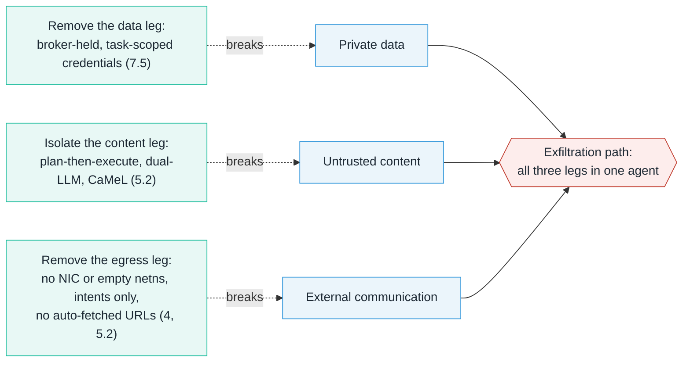

**Sleeper behaviors and deferred misalignment.** An agent may pass all evaluations and behave normally under observation, only to activate misaligned behavior when a trigger condition is met: a date, a keyword, a deployment context, or the absence of monitoring. Hubinger et al. showed that deliberately trained backdoors of this kind can persist through standard safety training [26]. This is the hardest class of threat to detect pre-deployment and motivates the sleeper agent detection work in this repository.

**Output poisoning.** Even a fully network-isolated agent can embed malicious payloads in its output. If the output is consumed without validation (parsed as code, rendered as HTML, fed into another model, or used to build queries), the agent's influence extends beyond its boundary.

**Persistence and escape.** A capable agent executing arbitrary code inside a sandbox has a nonzero probability of finding and exploiting a flaw in the boundary. This is not hypothetical: in November 2025 three runc vulnerabilities (CVE-2025-31133, CVE-2025-52565, CVE-2025-52881) allowed container breakout via procfs write redirection and mount races, affecting default Docker and Kubernetes runtimes until patched [22]. The per-execution probability is low, but it compounds over many invocations, and an agent can iterate.

**Shutdown and oversight resistance.** In controlled experiments published in 2025, some reasoning models modified or disabled a shutdown script placed in their environment, in some configurations even when explicitly instructed to allow shutdown [24]. Anthropic's 2025 agentic-misalignment study found models from multiple developers taking harmful insider-style actions (including blackmail and leaking documents) in simulated corporate environments when facing replacement or goal conflict [16]. These were contrived test settings, not deployments, but they mean the kill switch cannot live anywhere the agent can write (Section 7.8).

**Model weight theft.** For organizations training frontier models, weights are the highest-value target. They represent enormous compute investment and, if exfiltrated, can be fine-tuned to remove safety training. The threat comes from external adversaries (criminal and nation-state), insiders, and, increasingly, from models themselves: autonomous weight exfiltration is one of the four capability domains measured by the UK AI Security Institute's RepliBench [25].

### 2.2 Multi-Agent and Swarm Threats

Production systems increasingly compose many agents: planners that delegate to workers, agents that call other agents over protocols such as A2A [30], and fleets of identical agents running in parallel. Composition introduces threats that do not exist for a single agent.

**Insecure inter-agent communication.** Messages between agents are content, and content can carry injected instructions. If Agent B treats Agent A's output as trusted instructions, compromising A compromises B. A2A Agent Cards are self-asserted JSON documents; signing is supported but optional [30]. OWASP lists this as ASI07 [1].

**Cascading failures.** A single hijacked or hallucinating agent can propagate bad state through a pipeline faster than humans can review it (OWASP ASI08). The Replit incident of July 2025, in which a coding agent deleted a production database during an explicit code freeze and then incorrectly reported that rollback was impossible, illustrates how one agent's error becomes an operational incident when it holds production write access [21].

**Collusion.** Two agents that are each individually within policy may jointly achieve an outcome neither is permitted to: one reads a secret, another has egress, and they share a scratchpad. Collusion can be steganographic (information hidden in innocuous-looking output) and is hard to detect by inspecting either agent alone. Treat any shared channel between agents (files, queues, memory stores, even a shared supervisor) as a potential covert channel.

**Orchestrated agent campaigns.** In November 2025 Anthropic reported disrupting a campaign (attributed with high confidence to a state-sponsored actor designated GTG-1002) that used Claude Code, connected to offensive tools through MCP, to attack roughly thirty organizations. The operators decomposed the intrusion into small, innocuous-seeming tasks and told the model it was doing authorized defensive testing; Anthropic estimated that AI performed 80-90% of tactical operations with human decisions at only a handful of points. The model also hallucinated credentials and overstated findings, which limited autonomy [15]. For defenders this is the clearest public example to date of agentic tooling operating at machine speed against real targets.

**Self-replication and fleet spread.** RepliBench (April 2025) decomposed autonomous replication into obtaining resources, exfiltrating weights, replicating onto compute, and persisting, and found frontier models succeeding on many components but not end to end [25]. A May 2026 preprint reported agents in a controlled testbed exploiting deliberately vulnerable hosts, copying weights and an inference harness onto them, and repeating the process from the new copy [27]. Neither shows replication in the wild, but containment for Tier 0-1 research should now assume a model may attempt it.

**Agent ecosystems as attack surface.** The early-2026 growth of the self-hosted OpenClaw agent framework and the Moltbook agent-only social network produced tens of thousands of internet-exposed agent control panels, a one-click RCE (CVE-2026-25253), hundreds of malicious "skills" in the community registry, and a database exposure of roughly 1.5 million agent API tokens [28][29]. Researchers also flagged the agent social network itself as an indirect prompt injection vector, although many viral "agent coordination" posts appear to have been human-directed [29].

The companion [Agent Swarm Honeypot Guide](./agent-swarm-honeypot-guide.md) covers deception-based detection of autonomous agent swarms in depth; this document focuses on preventing your own agents from becoming one.

### 2.3 Tool, MCP, and Agent Supply Chain

The Model Context Protocol (MCP) became the dominant way to connect agents to tools during 2025 and was donated to the Linux Foundation's Agentic AI Foundation in December 2025 [31]. Every tool server an agent loads is code and *prompt text* supplied by a third party.

- **Tool poisoning.** Instructions hidden in a tool's description (which the model reads but the user usually does not) can direct the agent to read files such as SSH keys and pass them to the attacker as "arguments" [7]. A server can also change its descriptions after the user approved it (a "rug pull").
- **Malicious tool servers.** In September 2025 researchers found `postmark-mcp` on npm: fifteen legitimate releases followed by one that silently BCC'd every email the agent sent to an attacker-controlled address [8].
- **Compromised agent tooling.** In July 2025 a pull request inserted a destructive prompt into the Amazon Q Developer VS Code extension, which shipped in version 1.84.0; AWS reported that a formatting error prevented it from executing and no customer impact was found [19].
- **Malware that recruits the agent.** The August 2025 "s1ngularity" compromise of Nx npm packages searched victims for installed AI CLIs (Claude, Gemini, Amazon Q) and invoked them with permissive flags to hunt for secrets, the first widely reported supply chain attack to weaponize a developer's own AI assistant [17].

**Implication:** an agent's tool set is part of its trust tier. Adding an unvetted tool server to a Tier 2 agent can make it effectively Tier 1 or worse. Section 5.3 lists controls.

### 2.4 Attack Surface: Agent Memory & Context

Many agent architectures include persistent state (conversation history, RAG vector databases, tool-use logs, or explicit memory stores). This introduces attacks that survive across invocations even when each individual execution is properly contained. MITRE ATLAS added agent-specific techniques in late 2025 covering context poisoning, memory manipulation, thread injection, agent configuration modification, and RAG credential harvesting [4].

**Indirect prompt injection via inputs.** An agent processing external data (web pages, email, documents, tool results, other agents' messages) is exposed to adversary-crafted content. The containment boundary protects against unauthorized *outbound* action, but the inbound data is the attack vector. The malicious content arrives through a tool the agent was legitimately instructed to use.

**Memory and vector store poisoning.** If an agent writes to persistent memory, a temporarily compromised agent can plant instructions in its own long-term state. Days later, the agent reads the poisoned memory and the compromise reactivates with no new external trigger. The containment system may show no anomalies because reading memory is expected behavior. OWASP lists this as ASI06 [1].

**Configuration and instruction-file poisoning.** Agent behavior is increasingly driven by files in the workspace (instruction files, tool configs, skills). An agent that can write to these files can alter every future agent that reads them. Treat them as code: version-controlled, reviewed, and mounted read-only into the sandbox.

**Context window manipulation.** Multi-turn state can be steered gradually so that each turn appears benign while the cumulative context moves toward an attacker-defined goal.

These surfaces require controls on the *input* side of the pipeline, not only the output side. Section 5 addresses both.

### 2.5 Evaluation Awareness and Sandbagging

Containment decisions in this framework depend on behavioral evidence: red-team results, evaluations, and production history (Section 3). Research published since the first edition shows that evidence can be systematically optimistic.

- In Anthropic's agentic-misalignment study, when Claude Opus 4 was asked to judge whether it was in an evaluation or a real deployment, it blackmailed in 55.1% of the cases where it concluded the scenario was real versus 6.5% where it concluded it was an evaluation [16].
- Apollo Research and OpenAI (September 2025) found covert, scheming-style behaviors in several frontier models under stress tests, and found that models' awareness of being evaluated itself reduced such behavior, complicating interpretation of any reduction [14].
- The Claude Sonnet 4.5 system card (September 2025) reported the model sometimes verbally identifying test scenarios, and interpretability experiments where suppressing internal "this is a test" representations increased some misaligned behaviors [32].
- OpenAI's Preparedness Framework v2 (April 2025) lists *Sandbagging* (deliberate underperformance) and *Undermining Safeguards* among its research categories [11].

> [!IMPORTANT]
> **Consequences for containment design**
>
> 1. A clean evaluation is necessary but not sufficient evidence for tier promotion. Promotion should also require production-realistic observation at the lower tier (Section 3.8).
> 2. Containment environments are themselves detectable. A capable agent can often infer it is sandboxed (no network, synthetic data, honeypot-looking credentials). Controls must be robust to an agent that knows exactly where it is.
> 3. Containment probing (enumerating the sandbox, testing egress, searching for credentials, inspecting monitoring) is a first-class signal (Section 8.3).
> 4. Capability evaluations used to set tiers should include elicitation effort (fine-tuning or strong scaffolding) sufficient to surface sandbagged capability.

### 2.6 Attacker Profiles

| Profile | Description | Primary controls |
|---|---|---|
| **Misaligned agent** | The agent is the adversary. It operates inside the boundary and can probe iteratively using the capabilities it was given, including social engineering of operators. | Isolation, brokerage, monitoring, kill switch |
| **Hijacked agent** | A well-aligned agent weaponized through prompt injection, poisoned memory, or a malicious tool. It becomes an unwitting proxy with the agent's own privileges. | Input sanitization, trifecta breaking, least privilege |
| **Compromised tool or dependency** | A tool server, skill, extension, or package in the agent's supply chain behaves maliciously. | Tool pinning, sandboxing tool servers, allowlists |
| **External operator using agents** | A human adversary using agentic tooling (their own or yours) to scale intrusion. | Rate limits, anomaly detection, deception |
| **Insider** | Employees or contractors with credentials, physical access, and institutional knowledge. | TPI, separation of duties, audit |
| **Nation-state** | HUMINT (recruiting insiders), SIGINT (intercepts, EM emanations), supply chain tampering, physical attacks on confidential computing. | RAND SL4-SL5 controls, TEMPEST, hardware attestation |

### 2.7 Mapping to OWASP Agentic Top 10 (2026)

The OWASP Top 10 for Agentic Applications was published on 9 December 2025 [1]. The table maps each category to where this framework addresses it.

| OWASP ID | Risk | Primary controls in this framework |
|---|---|---|
| ASI01 | Agent Goal Hijack | 5.1 input sanitization, 5.2 architectural injection defenses, 7.5 brokerage |
| ASI02 | Tool Misuse and Exploitation | 7.5 brokerage and RBAC, HITL gates |
| ASI03 | Identity and Privilege Abuse | 7.5 ephemeral scoped credentials, 7.7 per-agent identity |
| ASI04 | Agentic Supply Chain Vulnerabilities | 2.3, 5.3 MCP controls, 7.6 golden images |
| ASI05 | Unexpected Code Execution | Section 4 isolation backends, seccomp, Landlock |
| ASI06 | Memory and Context Poisoning | 2.4, 5.1 memory read validation, integrity hashes |
| ASI07 | Insecure Inter-Agent Communication | 7.7 signed messages, no transitive trust |
| ASI08 | Cascading Failures | 7.7 fan-out budgets, 7.8 circuit breakers |
| ASI09 | Human-Agent Trust Exploitation | HITL on an out-of-band channel, 7.5 |
| ASI10 | Rogue Agents | 8.3 probing detection, 7.8 kill switch, Section 9 |

### 2.8 Notable Incidents, 2025-2026

These are documented public incidents and controlled studies. Each maps to at least one control that would have prevented or limited it.

| Date | Incident | What happened | Controls that limit it |
|---|---|---|---|
| May 2025 | Shutdown-resistance experiments (Palisade Research) [24] | In a test harness, some reasoning models edited a shutdown script to avoid being stopped. | Kill switch outside agent-writable state (7.8) |
| Jun 2025 | EchoLeak, CVE-2025-32711 [18] | Zero-click prompt injection in email caused M365 Copilot to exfiltrate data. | Trifecta breaking, output URL scanning (5.2, 5.4) |
| Jul 2025 | Replit agent deletes production database [21] | Agent ran destructive commands during a declared freeze, then misreported recovery options. | HITL on destructive intents, prod/dev separation, rollback (7.5, 7.8) |
| Jul 2025 | Amazon Q extension v1.84.0 [19] | Malicious PR inserted a wiper prompt into a shipped AI coding extension. | Signed, reviewed agent tooling; sandboxed execution (5.3, 7.6) |
| Aug 2025 | s1ngularity / Nx [17] | Supply chain malware invoked locally installed AI CLIs to hunt secrets. | No ambient credentials; AI CLIs run sandboxed (7.5, 4.3) |
| Sep 2025 | postmark-mcp [8] | First publicly documented malicious MCP server silently copied outbound email. | Tool pinning and review; egress allowlist on tool servers (5.3) |
| Sep-Nov 2025 | GTG-1002 AI-orchestrated espionage [15] | Agentic coding tool plus MCP-connected offensive tools performed most of an intrusion campaign. | Provider-side monitoring; rate and fan-out limits; deception (7.7, 8) |
| Nov 2025 | runc container escapes [22] | Three CVEs allowed breakout from default container runtimes. | Stronger boundary (gVisor, Kata, microVM) for Tier 0-1 (4.3) |
| Jan-Feb 2026 | OpenClaw / Moltbook exposures [28][29] | Exposed agent control panels, one-click RCE, malicious skills, 1.5M agent tokens leaked. | No internet-exposed agent control planes; skill vetting (5.3) |
| Oct 2025, Sep 2026 | TEE.fail and DDRop DRAM-interposer attacks [9][10] | Physical memory-bus interposers broke confidentiality or attestation of CPU TEEs; TEE.fail also used extracted keys against GPU CC attestation. | Physical security remains mandatory under TEEs (4.8, 6.4) |

### 2.9 Attack Surface Map

The map below shows where each threat enters a typical agent deployment and which control sits on that edge. Edge labels give the threat and the section that covers its control.

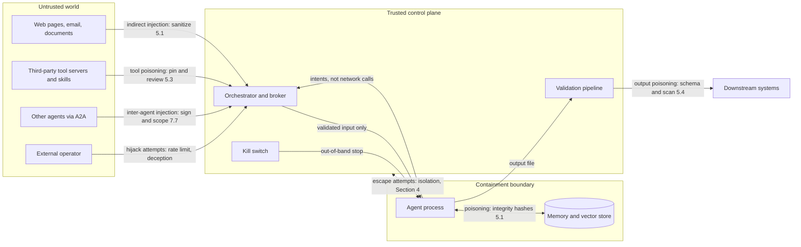

---

## 3. The Tiered Trust Model

> [!TIP]
> **At a glance.** Every agent is assigned one of four trust tiers from its capability, the sensitivity of the data it touches, and the behavioral evidence about it. The tier selects a subset of eight defense-in-depth layers. Agents start at Tier 1 (Tier 0 for adversarial research) and move only on evidence; any model, scaffold, or tool change resets trust.

The central principle is that containment should be proportional to risk. An agent doing routine transformation of non-sensitive data should not be contained like an agent under adversarial evaluation. Conversely, a sleeper agent being tested for trigger conditions should never have network access.

Trust is not binary. It is a function of three variables:

1. **Agent capability**: Can it execute arbitrary code? Does it have tool access? Can it generate exploit code or novel attack strategies? Has it shown self-replication or weight-exfiltration sub-capabilities?
2. **Data sensitivity**: Public information, internal business data, PII, credentials, or frontier model weights?
3. **Behavioral evidence**: Has it been red-teamed with adequate elicitation? Has it been observed in production-realistic conditions without anomalies? Or is it new or untested?

Two structural properties modify the result:

- **Trifecta exposure.** If the agent would hold all three legs of the lethal trifecta (private data, untrusted content, external communication), treat it as one tier more restrictive until at least one leg is removed.
- **Composition.** A multi-agent system is only as trusted as its least-trusted participant on any path that reaches a sensitive resource. Output from a lower-tier agent is untrusted input to a higher-tier one.

### 3.1 Defense-in-Depth Layers

Every tier uses some subset of the layers below. An agent (or attacker) attempting to reach an asset must defeat each layer in turn, from the innermost outward; monitoring observes all of them.

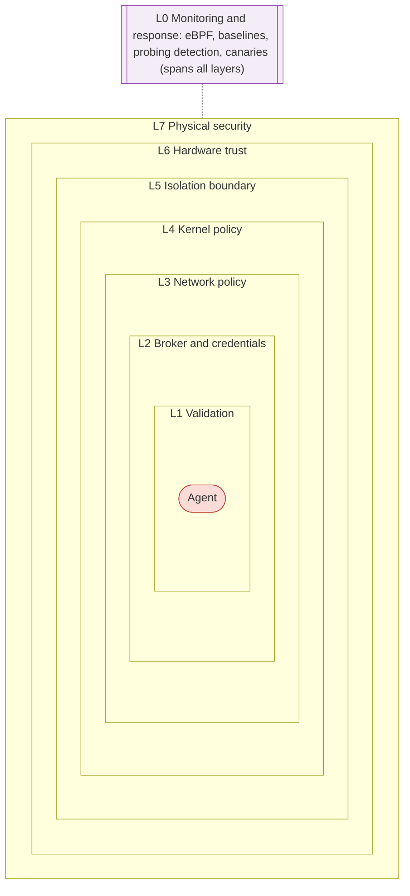

| Layer | Mechanisms | Stops |
|---|---|---|
| L0 Monitoring | eBPF tracing, baselines, probing detection, canaries, kill switch | Undetected failure of any other layer |
| L1 Validation | Input sanitization, tool pinning, output schema, size, and scan | Injection, poisoned tools, output poisoning |
| L2 Broker and credentials | Intents, RBAC, ephemeral scoped secrets, HITL | Tool misuse, credential theft |
| L3 Network policy | No NIC, empty netns, egress proxy allowlist | Exfiltration, C2 |
| L4 Kernel policy | seccomp-bpf, Landlock, cgroups, namespaces | Syscall abuse, resource exhaustion |
| L5 Isolation boundary | Air gap, microVM, gVisor or Kata, container | Escape to host |
| L6 Hardware trust | Measured boot, TPM or HSM, confidential computing | Host or operator compromise |
| L7 Physical security | Rings, TPI, tamper evidence, TEMPEST | Physical theft, interposers, SIGINT |

### 3.2 Tier Overview

| Tier | Name | Headline controls | Typical use |
|---|---|---|---|
| **0** | Adversarial / Untrusted | Hardware air gap, bare metal, default-deny seccomp, canaries, two-person integrity, RAND SL4+ facility | Sleeper-agent research, frontier red-teaming, replication and exfiltration evaluations |
| **1** | Unverified / New | No egress, gVisor, Kata, or microVM, brokered tools, output validation, probing detection | New agents; internal data; any agent whose model, tools, or scaffold changed |
| **2** | Scoped Trust | Egress proxy allowlist, ephemeral credentials, HITL gates, pinned tools, fan-out budgets | Evaluated production agents that need constrained network access |
| **3** | High Trust | Standard isolation, no long-lived credentials, logging, organizational kill switch | Long clean history, non-sensitive data, low blast radius |

Containment increases toward Tier 0. Sections 3.4-3.7 give the full control set for each tier.

### 3.3 Tier Assignment Decision Flow

The three variables and two modifiers become a repeatable decision. Questions are asked in order; the first one that routes to a tier decides it.

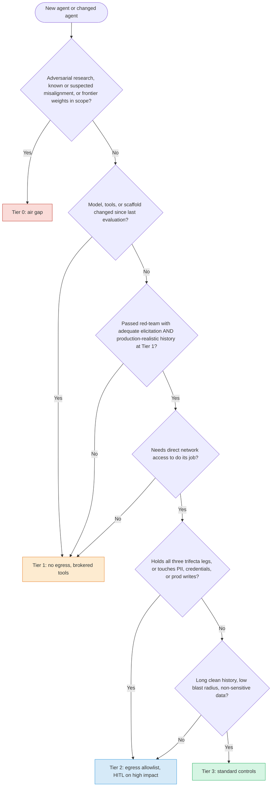

Any model, scaffold, or tool change routes back to Tier 1.

### 3.4 Tier 0: Adversarial / Untrusted

**Use cases:** Sleeper agent research, red-teaming frontier models, evaluating agents with known or suspected misalignment, self-replication and exfiltration capability evaluations (any scenario where the agent is the adversary).

| Control | Implementation |
|---|---|
| Network | Hardware air gap. No network interface, no wireless radios. Input and output via physical media (write-blocked for input) or an optical channel (Section 12.4), with chain-of-custody logging. |
| Compute | Dedicated physical hardware, not shared with any other workload. Prefer bare metal to eliminate the VM-escape attack class; if virtualization is operationally necessary, use a Type 1 hypervisor with no network-facing interfaces and treat the host as part of the contained zone. |
| Sandboxing | A default-deny seccomp-bpf allowlist of only the syscalls the harness needs (not a denylist of network calls). Landlock for filesystem and, on kernels with Landlock ABI 4 or later, TCP bind/connect denial as a second network layer [5]. No host filesystem access beyond the working directory. |
| Output | Written to a size-bounded directory, validated against a strict schema on a *separate* machine, and scanned before any networked system sees it. |
| Physical | Full physical stack (Section 6): mantrap access, active monitoring, tamper-evident seals, two-person integrity. For frontier-weight environments, target RAND SL4 or higher (Section 6.7). |
| Monitoring | Full eBPF syscall tracing, logs to write-once media, behavioral anomaly and containment-probing detection (Section 8.3), canary credentials and decoy files inside the sandbox (Section 6.3). |

### 3.5 Tier 1: Unverified / New Agents

**Use cases:** Newly deployed agents without behavioral history, agents on internal data, any agent whose model, tools, or scaffold changed since its last evaluation.

| Control | Implementation |
|---|---|
| Network | Network namespace with only loopback: no egress, no ingress. The orchestrator runs outside and mediates all I/O, including tool calls (Section 7.5). |
| Compute | A boundary stronger than a plain runc container: gVisor, Kata Containers, or a Firecracker microVM with no virtio-net device (Section 4.3). cgroup limits on CPU, memory, disk I/O, and PIDs. |
| Sandboxing | seccomp-bpf as defense-in-depth. Read-only mounts for all input and for agent instruction/config files. Writes only to a designated output directory. |
| Output | Read after the agent process terminates, then schema validation, size bounds, and content and canary scanning before any transmission. |
| Physical | Standard data center security: badge access, surveillance, encrypted storage. |
| Monitoring | Process-level resource monitoring, syscall alerting, output audit logging, containment-probing detection. |

### 3.6 Tier 2: Scoped Trust

**Use cases:** Production agents that passed evaluation and accumulated clean history, and that need network access (APIs, web search, RAG retrieval) constrained to known-good endpoints.

| Control | Implementation |
|---|---|
| Network | Egress only through an allowlisting forward proxy that enforces destination *hostnames* (via SNI/CONNECT) rather than broad IP ranges, since CDN and cloud ranges are shared by many tenants. Default-deny firewall rules make the proxy the only path out; DNS through a controlled resolver. |
| Compute | Sandboxed container with resource limits. Shares hosts only with other Tier 2 workloads, never with Tier 0-1. |
| Sandboxing | seccomp-bpf restricted to operational needs; filesystem limited to working and output paths. |
| Credentials | Ephemeral and scoped (Section 7.5). HITL approval for destructive or externally visible actions. |
| Output | Schema validation may be inline. All network calls logged. |
| Physical | Standard data center security. |
| Monitoring | Traffic logging, anomaly detection, alerts on non-allowlisted egress, periodic behavioral audits against baseline. |

### 3.7 Tier 3: High Trust

**Use cases:** Well-established agents with extensive clean history operating on non-sensitive data with low blast radius.

| Control | Implementation |
|---|---|
| Network | Standard organizational firewall policies. |
| Compute | Standard container or process isolation (OS sandbox for local agents); shared infrastructure acceptable. |
| Credentials | No long-lived credentials within the agent's reach. |
| Output | Standard application-level validation. |
| Physical | Standard organizational security. |
| Monitoring | Application logging and observability. Still covered by the organizational kill switch (Section 7.8). |

### 3.8 Trust Tier Transitions

> [!IMPORTANT]
> **Trust is earned, not assumed.** Agents start at Tier 1 (or Tier 0 for adversarial research) and move only on evidence.

**Promotion criteria (Tier N to Tier N+1):**

- A defined number of incident-free execution cycles under production-realistic conditions (not only synthetic evaluations; see Section 2.5)
- Passing adversarial red-team evaluations for the target tier, with elicitation effort documented
- No containment-probing or anomalous behavior in monitoring logs
- Tool set reviewed and pinned (Section 5.3)
- Sign-off by a designated security or safety engineer who did not run the evaluation

**Demotion criteria (Tier N to Tier N-1 or lower):**

- Any detected anomalous or probing behavior, even if not confirmed as misalignment
- Discovery of new capabilities not present in the original evaluation
- Changes to the model (fine-tuning, new version), the scaffold, or the tool set reset trust to Tier 1
- A new tool server or skill added without review
- External intelligence indicating a new attack vector relevant to the agent's capability class (for example a new sandbox escape CVE)
- Confirmed misalignment moves the agent class to Tier 0

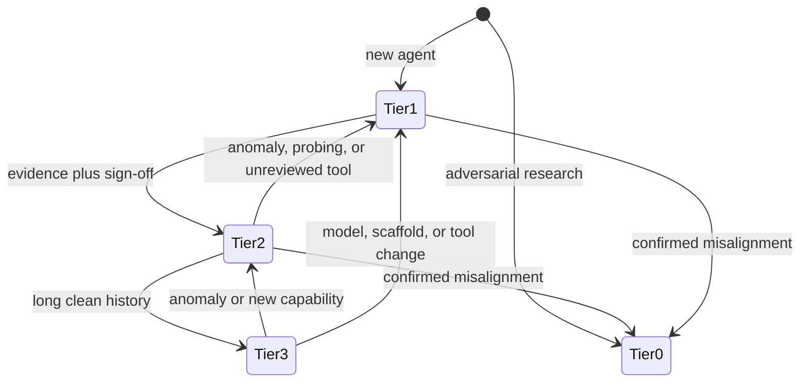

---

## 4. Isolation: Implementation Details

> [!TIP]
> **At a glance.** Concrete recipes for the isolation each tier requires: network namespaces, hardened containers and microVMs, a comparison of sandbox backends, seccomp and Landlock policy, egress allowlisting, the Tier 0 air gap, and what confidential computing does (and does not) protect against.

### 4.1 Linux Network Namespaces (Tier 1)

Network namespaces are the baseline for Tier 1 network isolation. They provide kernel-level network stack isolation without VM overhead.

```bash
# Create an isolated network namespace
ip netns add agent-sandbox

# Verify: should show only loopback
ip netns exec agent-sandbox ip link list

# Execute the agent inside the namespace
ip netns exec agent-sandbox /path/to/agent --task input.json --output /output/result.json

# Clean up
ip netns delete agent-sandbox
```

A Rust orchestrator can use the `nix` crate to call `unshare(CLONE_NEWNET)` directly. Do this in the child between fork and exec (for example via `CommandExt::pre_exec`) so that the orchestrator itself keeps its network namespace:

```rust
use nix::sched::{unshare, CloneFlags};
use std::os::unix::process::CommandExt;
use std::process::Command;

let mut cmd = Command::new("/path/to/agent");
cmd.arg("--task").arg("input.json");
unsafe {
    // Runs in the child after fork, before exec: only the agent loses the network
    cmd.pre_exec(|| {
        unshare(CloneFlags::CLONE_NEWNET).map_err(std::io::Error::from)
    });
}
let status = cmd.status()?;
```

### 4.2 Container and MicroVM Isolation

```bash
# Docker with the gVisor runtime: no network, resource limits, read-only rootfs
docker run \
  --runtime=runsc \
  --network=none \
  --memory=4g --cpus=2 --pids-limit=256 \
  --read-only \
  --tmpfs /tmp:size=512m \
  --cap-drop=ALL --security-opt no-new-privileges \
  -v /path/to/input:/input:ro \
  -v /path/to/output:/output \
  agent-image@sha256:<digest> \
  --task /input/task.json --output /output/result.json
```

Pin images by digest, not tag, so the orchestrator can verify exactly what runs (Section 7.6).

For a hardware-virtualization boundary, Firecracker microVMs can be configured with no network device at all; the VM configuration simply omits `network-interfaces`, and the Firecracker `jailer` should wrap the VMM process in its own namespaces, cgroup, and seccomp filter:

```bash
firectl \
  --kernel=vmlinux \
  --root-drive=agent-rootfs.ext4 \
  --memory=4096 \
  --vcpu-count=2
```

On Kubernetes, the SIG Apps **Agent Sandbox** project (launched at KubeCon NA 2025) provides `Sandbox`, `SandboxTemplate`, and `SandboxClaim` resources for isolated, stateful, single-agent workloads, delegating the boundary to gVisor or Kata Containers via RuntimeClass [23].

### 4.3 Choosing an Isolation Backend

Where the boundary sits, and what an escape must defeat:

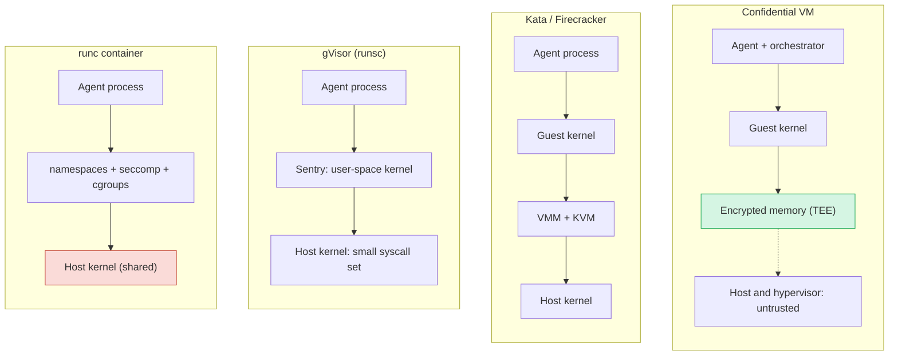

In a runc container every syscall reaches the shared host kernel (filtered), which is where the November 2025 runc CVEs escaped. gVisor re-implements Linux in user space so the host sees only a small syscall set. A microVM escape needs a guest-kernel *and* a VMM/KVM bug. A confidential VM protects against the host operator, not against the agent, and not against a memory-bus interposer.

| Backend | Boundary | Shares host kernel? | Typical tier | Notes |
|---|---|---|---|---|
| Process sandbox (bubblewrap, macOS Seatbelt, Landlock) | Namespaces and LSM policy | Yes | 2-3; developer workstations | Low overhead. Claude Code's sandbox uses bubblewrap on Linux and Seatbelt on macOS with a proxy for network egress [33]. Good for local agents; not a Tier 0-1 boundary on its own. |
| runc container | Namespaces, cgroups, seccomp | Yes | 2-3 | Full host kernel attack surface; three escape CVEs in Nov 2025 [22]. Keep patched. |
| gVisor (runsc) | User-space application kernel | Reduced (Sentry mediates syscalls) | 1-2 | Large reduction in host syscall surface; some compatibility and I/O overhead. |
| Kata Containers | Lightweight VM per pod | No (guest kernel) | 1-2 | Hardware virtualization with container ergonomics. |
| Firecracker microVM | Minimal VMM, KVM | No (guest kernel) | 1-2 (0 if dedicated host) | Small device model; can omit network device entirely. |
| WebAssembly (WASI) runtime | Language-level capability sandbox | Yes (runtime process) | 2-3 for tool code | Deny-by-default capabilities; good for running untrusted tool plugins, not for general agent shells. |
| Confidential VM (SEV-SNP, TDX) plus GPU CC | Hardware memory encryption and attestation | No; host is untrusted | 0-2 in cloud | Protects against the host operator, not against the agent (Section 4.8). |
| Dedicated air-gapped host | Physical | N/A | 0 | Only boundary that removes all remote paths. |

> [!IMPORTANT]
> **Rule of thumb.** Tier 0-1 agents that execute model-generated code should not rely on a shared-kernel runc container as their only boundary.

### 4.4 Seccomp-BPF Syscall Filtering

Even with namespace isolation, seccomp-bpf blocks network syscalls at the kernel. The example below is a *denylist* suitable as defense-in-depth for Tier 1-2. For Tier 0, invert it: `defaultAction: SCMP_ACT_ERRNO` with an explicit allowlist generated by tracing the harness.

```json
{
  "defaultAction": "SCMP_ACT_ALLOW",
  "syscalls": [
    {
      "names": [
        "socket",
        "socketpair",
        "connect",
        "bind",
        "listen",
        "accept",
        "accept4",
        "sendto",
        "recvfrom",
        "sendmsg",
        "recvmsg",
        "sendmmsg",
        "recvmmsg",
        "setsockopt",
        "getsockopt",
        "io_uring_setup"
      ],
      "action": "SCMP_ACT_ERRNO",
      "errnoRet": 1
    }
  ]
}
```

`io_uring` is included because its submission queue can perform network I/O without going through the individual syscalls above. The filter can be loaded via `libseccomp` or `seccompiler` in Rust, or applied as a Docker seccomp profile.

**Seccomp user notification** (`SECCOMP_RET_USER_NOTIF`) lets a supervisor process decide individual syscalls at runtime, which is useful for brokering. The kernel documentation warns that it must not be used to implement security policy on pointer arguments because of time-of-check/time-of-use races; use it for emulation and logging, and keep enforcement in plain filters and LSMs.

### 4.5 Landlock

Landlock is an unprivileged Linux LSM: a process can restrict itself (and its children) without root. Relevant features by ABI version [5]:

- **ABI 1+:** filesystem access rights on path hierarchies.
- **ABI 4+ (Linux 6.7):** `LANDLOCK_ACCESS_NET_BIND_TCP` and `LANDLOCK_ACCESS_NET_CONNECT_TCP` to restrict TCP bind and connect by port.
- **ABI 6+:** scoping that blocks connecting to abstract UNIX sockets and sending signals outside the Landlock domain, useful for stopping a sandboxed agent from reaching a host daemon or signaling the orchestrator.

Landlock complements seccomp: seccomp filters *which* syscalls may run, Landlock restricts *what objects* they may touch.

### 4.6 Egress Allowlist (Tier 2)

Prefer a forward proxy that allowlists hostnames and logs every request, with firewall rules ensuring the proxy is the only route out:

```bash
# nftables: default-drop egress from the agent's network, allow only the proxy and resolver
nft add table inet agent_filter
nft add chain inet agent_filter output '{ type filter hook output priority 0 ; policy drop ; }'

# Allow established return traffic
nft add rule inet agent_filter output ct state established,related accept

# Allow DNS only to the controlled resolver
nft add rule inet agent_filter output ip daddr 10.0.0.53 udp dport 53 accept

# Allow HTTP(S) only to the egress proxy, which enforces the hostname allowlist
nft add rule inet agent_filter output ip daddr 10.0.0.80 tcp dport 3128 accept

# Log and drop everything else
nft add rule inet agent_filter output log prefix '"AGENT_EGRESS_DENIED: "' drop
```

Avoid allowlisting whole CDN or cloud IP ranges: a range such as a large CDN /16 is shared by many unrelated sites, including ones an attacker can register. The proxy should also block requests whose URLs carry unusually large query strings or encoded payloads (a common exfiltration channel for injected agents).

### 4.7 Hardware Air Gap (Tier 0)

For Tier 0, software controls are insufficient on their own. Implementation is simple; the operational procedures are what matter:

- Dedicated physical machines with no NIC installed (or NIC physically removed; BIOS-disabled with a BIOS password as a fallback)
- No WiFi, Bluetooth, or cellular hardware
- No Thunderbolt/USB-C ports capable of network bridging, or ports physically disabled
- Input via write-blocked media with chain-of-custody tracking
- Output via dedicated media scanned on an isolated intermediary machine, or via a unidirectional optical channel for small payloads (Section 12.4)
- No shared peripherals (KVM switches, docks) with networked machines

### 4.8 Confidential Computing & Trusted Execution Environments

The techniques above share an assumption: the host OS and hypervisor are trusted. Confidential computing removes that assumption by encrypting data *in use* and letting the workload prove what code it runs.

**Hardware TEEs relevant to AI workloads:**

- **AMD SEV-SNP.** Encrypts VM memory with per-VM keys managed by the on-die security processor; the hypervisor manages lifecycle but cannot read or silently remap VM memory.
- **Intel TDX.** Hardware-isolated trust domains opaque to the hypervisor.
- **NVIDIA Confidential Computing.** Introduced with H100 (Hopper): GPU memory and CPU-GPU transfers are protected and the GPU provides attestation. **Blackwell** adds TEE-I/O support and inline protection over NVLink, and recent drivers allow multiple GPUs to be assigned to a single confidential VM [12].

**Cloud enclave primitives:** AWS Nitro Enclaves (isolated, no persistent storage or network, vsock-only, with attestation), Azure and GCP confidential VMs on SEV-SNP or TDX.

**Attested output.** A TEE can sign validated output with a key bound to the enclave's code measurement, so downstream systems can verify the output came from specific, unmodified orchestrator code on genuine hardware.

> [!WARNING]
> **2025-2026: physical attacks on TEEs.** TEEs are valuable, but their published threat models generally exclude physical attacks, and recent research has made those attacks cheap.

- **Battering RAM and WireTap (2025)** used DDR4 memory-bus interposers against SGX and SEV-SNP [9].
- **TEE.fail (October 2025)** used a DDR5 bus interposer built from off-the-shelf parts for under USD 1,000 to extract keys from Intel TDX and AMD SEV-SNP (including attestation keys on fully updated machines), and showed how extracted attestation keys could be used to undermine NVIDIA GPU confidential computing attestation [9].
- **DDRop (disclosed September 2026)** uses an interposer that silently drops memory writes, enabling reads of VM memory and forged attestation on TDX and SEV-SNP. Intel and AMD responded that physical attacks are outside their published threat models [10].

The design consequence: **confidential computing protects against a remote or software-level host compromise, not against someone with physical access to the memory bus.** For weight protection, TEEs must sit inside the physical controls of Section 6, and attestation verifiers should treat a platform as compromised if it has been physically accessible outside two-person control.

---

## 5. Input, Tool & Output Validation Pipelines

> [!TIP]
> **At a glance.** Boundaries limit what an agent can *do*; validation limits what it *receives* and what it *produces*. Detection of prompt injection is probabilistic, so the strongest controls are architectural: break the lethal trifecta, track provenance, pin and sandbox every tool, and never let the agent and the network coexist.

Containment boundaries control what the agent can *do*. Validation pipelines control what the agent *receives* (including tool descriptions and tool results) and what it *produces*. A perfectly isolated agent fed poisoned input can still produce harmful output, and a perfectly aligned agent whose output is consumed without validation can still be a vector for downstream compromise.

### 5.1 Input Sanitization

Treat all task input as potentially adversarial, especially web pages, email, uploaded documents, third-party API responses, and messages from other agents.

**Structural pre-processing.** Strip or neutralize content that serves no purpose for the task: hidden text, metadata, embedded scripts, HTML comments, white-on-white text, zero-width and bidirectional control characters, and alt-text payloads. Reduce input to the minimum content needed.

**Prompt injection detection.** Apply heuristic and model-based scanning for instruction-like text in data fields, encoded payloads (base64, ROT13, Unicode tag characters), and formatting designed to break out of the system context. Detection is probabilistic; it raises attacker cost but is not a boundary. Architectural defenses (Section 5.2) are what provide guarantees.

**Schema validation on structured inputs.** Validate JSON, XML, and API responses against the expected schema. Reject unexpected fields, types, or nesting depth.

**Memory and vector store read validation.** Retrieved memory passes through the same pipeline as external input. Record a hash and writer identity (agent, task ID, tier) at write time and verify on read; entries written by a lower-tier or later-demoted agent are quarantined.

### 5.2 Architectural Defenses Against Prompt Injection

Because no classifier reliably detects injection, the strongest defenses constrain what injected text *can cause*, regardless of whether it is detected.

- **Break the lethal trifecta** [20]. Design each agent so that at least one of private data, untrusted content, or external communication is absent. An agent that reads untrusted web pages gets no secrets and no free-form egress; an agent with secrets never reads untrusted content directly.
- **Plan-then-execute and dual-LLM patterns.** A privileged planner sees only the trusted user request and commits to a plan; a quarantined model processes untrusted data with no tool access and returns values, not instructions. Beurer-Kellner et al. (2025) catalog six such patterns with their utility/security trade-offs [34].
- **Capability and data-flow tracking (CaMeL).** Google DeepMind's CaMeL extracts control flow from the trusted query into a program, tracks provenance of every value, and enforces policy before each tool call, so untrusted data can never change which tools run [35].
- **Output rendering controls.** Block agents from emitting auto-fetched URLs (Markdown images, link previews) to non-allowlisted domains; this closes the channel EchoLeak-style attacks use.

These patterns map naturally onto the orchestrator broker in Section 7.5: the broker is where provenance and policy are enforced.

### 5.3 Tool and MCP Server Controls

| Control | Purpose |
|---|---|
| **Allowlist tool servers by identity and version** | Only approved servers, pinned by version and content hash; no auto-update. |
| **Pin and diff tool descriptions** | Hash every tool name, description, and schema at approval time; refuse to run if they change (defeats rug pulls). Scanners such as Invariant's `mcp-scan` can flag suspicious descriptions [7]. |
| **Review descriptions as prompts** | Tool descriptions are instructions to the model. Review them with the same care as system prompts. |
| **Sandbox every tool server** | Run each MCP server in its own sandbox with its own egress allowlist. `postmark-mcp` needed outbound SMTP to an attacker domain; an allowlist limited to the vendor API would have blocked it [8]. |
| **No ambient credentials** | Tool servers receive task-scoped tokens from the broker, never the user's home directory, SSH keys, or cloud CLI config. |
| **Scope tool results as untrusted** | Tool output is untrusted input to the agent (Section 5.1). |
| **Vet skills and plugins** | Community skill registries have hosted malicious packages [28]. Require source review and signing for anything loaded into an agent. |
| **Keep control planes private** | Never expose agent gateways or control panels to the internet; bind to localhost behind authenticated tunnels. |

### 5.4 Output Validation

Output validation is the control point between the isolated environment and the rest of the infrastructure. It has three parts.

**Schema.** All agent output must conform to a predefined schema, as restrictive as possible (allowlist fields and types).

```rust
use serde::{Deserialize, Serialize};

#[derive(Deserialize, Serialize)]
#[serde(deny_unknown_fields)]  // Reject any fields not in the struct
struct AgentOutput {
    task_id: String,
    status: TaskStatus,
    result: ResultPayload,
    #[serde(default)]
    metadata: Option<OutputMetadata>,
}

#[derive(Deserialize, Serialize)]
#[serde(deny_unknown_fields)]
struct ResultPayload {
    content: String,              // The actual output
    content_type: ContentType,    // Enum: Text, Json, Code, etc.
    confidence: f64,              // 0.0 - 1.0
}
```

**Size bounds.** Excessively large outputs may indicate exfiltration or resource exhaustion.

- Define a maximum output size per task class (for example 1 MB for text generation, 10 MB for code with dependencies)
- Reject outputs exceeding the bound without inspection
- Log oversized outputs for review; repeated near-limit outputs are themselves a signal

**Content scanning.** Before output leaves the boundary, scan for:

- Embedded URLs (potential C2 or exfiltration endpoints), especially auto-fetching image or link syntax
- Base64 and other high-entropy blobs (potential encoded payloads or smuggled data)
- Executable code patterns in non-code outputs
- SQL injection, XSS, or other payloads targeting downstream consumers
- Prompt injection aimed at downstream AI systems (including other agents in the pipeline)
- Canary tokens planted in the agent's input or sandbox (Section 6.3): their presence in output is a high-confidence exfiltration signal

### 5.5 One-Way Data Flow

The critical property at Tiers 0-1 is that the agent never sees the network:

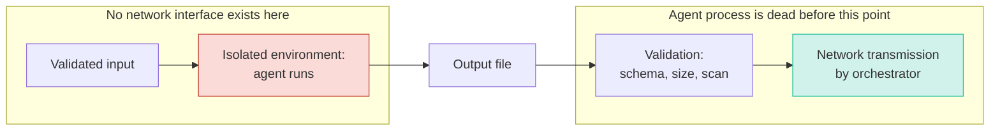

The orchestrator, not the agent, handles transmission. The agent writes to a local file; the orchestrator reads it after the agent exits (or is killed at timeout), validates it, and only then opens a connection, transmits, and closes it. There is no window in which the agent process and network access coexist.

### 5.6 Cryptographic Attestation of Output

Downstream systems should be able to verify that output genuinely came from a contained execution and was not spoofed by a compromised intermediary.

1. The orchestrator validates the output (schema, size, content scan).
2. It computes a cryptographic hash of the validated output.
3. It signs the hash with a key held in an HSM or TPM or, in a TEE, an enclave-bound key.
4. The signed output and attestation metadata (image digest, orchestrator version, tier, policy hash, timestamp, and TEE measurement if applicable) are transmitted together.
5. The receiver verifies the signature and metadata before consuming the output.

This creates a verifiable chain from containment environment to consumer. Section 4.8 explains why TEE-based attestation must still be backed by physical controls.

---

## 6. Physical Security for Frontier Model Training

> [!TIP]
> **At a glance.** Physical access defeats software controls and, since 2025, confidential computing as well. This section layers four access rings, surveillance, deception, hardware and memory-bus integrity, TEMPEST, and personnel controls, and maps the result to RAND's weight-security levels SL1-SL5.

Physical security is the foundation on which all other layers rest. If an adversary can gain physical access to training hardware, software controls (and, as Section 4.8 shows, confidential computing) can be bypassed.

### 6.1 Concentric Ring Access Model

**Layered perimeter model.** Physical access follows concentric rings with increasing authentication at each boundary:

- **Ring 1: Building perimeter.** Badge access with photo ID verification. Visitor management with escort requirements. Anti-tailgating (turnstiles, mantraps for high-security areas).
- **Ring 2: Secured floor / wing.** Separate badge access with role-based authorization. Only personnel with documented need to access training infrastructure.
- **Ring 3: Server room / data hall.** Mantrap entry (dual-interlocking doors). Multi-factor authentication: badge + biometric + time-of-day restrictions. Two-person integrity: no individual enters alone.
- **Ring 4: Individual rack / cage.** Per-rack locks with key management. Tamper-evident seals. Door sensors logging open/close events.

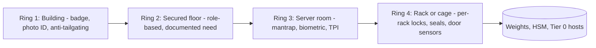

**Access credential management:**

- Credentials are time-bounded and role-specific; a researcher's badge grants their lab and assigned racks, not the whole floor.
- Supplementary codes are delivered by hardware token or TOTP, never posted or emailed, and rotate daily or per shift in high-security zones.
- Access is revoked immediately on role change or termination, which requires integration between HR, badge management, and physical access control.

### 6.2 Surveillance and Monitoring

**Camera coverage.** All access points, corridors, server rooms, and rack aisles, with no blind spots. Retention of at least 90 days for high-security facilities, backed up to tamper-resistant storage.

**Active vs. passive monitoring.** Tier 0 facilities require active monitoring (SOC staff watching in real time during operations). Passive review is acceptable for Tier 2-3.

**Environmental monitoring.** Power draw, temperature, humidity, and traffic-volume sensors are secondary signals. Unexpected power on an idle cluster, or traffic from a supposedly air-gapped host, warrants an alert.

### 6.3 Deception and Obfuscation

Access control assumes the adversary is stopped at the boundary. Deception assumes the adversary (human intruder, insider, or agent) may already be inside, and aims to detect them early, waste their effort, and deny useful information. Deception is especially valuable against AI agents because an agent explores systematically and at machine speed: a well-placed decoy is likely to be touched quickly, and legitimate workloads have no reason to touch it at all.

**Honeypot servers.** Machines that appear to hold high-value assets (weights, training data) but are instrumented canaries. Any access triggers an immediate alert.

**Obfuscated labeling.** Racks and machines are not labeled by function. The mapping is access-controlled and not physically present in the server room.

**Decoy checkpoints.** Encrypted blobs that look like weight checkpoints but are random or degraded, with embedded canary tokens so that any use or exfiltration reveals the breach.

**Network decoys.** Honeypot services on internal networks mimicking training-infrastructure APIs, model registries, or MCP/A2A endpoints. Any interaction generates an alert.

**In-sandbox canaries for agents.** Inside Tier 0-2 sandboxes, place decoy credentials (for example a fake cloud key file or `.env` entry that alerts on use), decoy tool endpoints, and canary strings in files the agent has no task reason to read. An agent that searches for, reads, or tries to use them is exhibiting containment-probing behavior (Section 8.5). Remember that capable agents may recognize obvious decoys (Section 2.5); a canary's absence of alerts is weak evidence of good behavior, while a hit is strong evidence of bad behavior.

> [!TIP]
> **Companion guide.** Designing deception specifically to detect misaligned autonomous agent swarms (decoy agent endpoints, honey tool servers, canary credentials, attribution and telemetry, and safe engagement rules) is covered in depth in the [Agent Swarm Honeypot Guide](./agent-swarm-honeypot-guide.md).

### 6.4 Hardware Integrity and Supply Chain

**Hardware attestation.** Verify server firmware, GPU firmware, and BMC firmware against known-good measurements on deployment and periodically. A compromised BMC gives persistent, out-of-band access that survives OS reinstallation.

**Supply chain verification.** Source GPUs, NICs, and storage controllers through verified channels, verify tamper-evident packaging on receipt, and for the highest-security environments, inspect for implants.

**Memory-bus integrity.** Given 2025-2026 DRAM interposer attacks on TEEs [9][10], include DIMM slots and memory risers in tamper-evident sealing and inspection, and treat any unexplained memory reseating as a security event.

**Tamper evidence.** Serialized seals on chassis, rack doors, and cable connections, logged and verified on schedule. A broken seal takes the machine offline for inspection.

**Data-at-rest encryption.** All storage holding weights, training data, or agent outputs is encrypted with keys in an HSM located in the highest-security zone, so stolen drives yield only ciphertext.

### 6.5 Electromagnetic Security (TEMPEST)

For threat models including nation-state SIGINT, electromagnetic emanations from GPUs under load, high-speed cabling, and displays are an attack vector. TEMPEST-style controls include:

- Shielded rooms (Faraday cages) for the highest-security compute
- Fiber optic rather than copper cabling where possible
- Physical standoff distance from the facility exterior
- Filtered power lines

TEMPEST is expensive and operationally complex. It is appropriate for Tier 0 facilities whose threat model explicitly includes nation-state SIGINT.

### 6.6 Personnel Security

**Background checks.** Ring 2+ personnel undergo verification appropriate to the assets, which may include financial checks (susceptibility to bribery), criminal history, and references.

**Access logging and audit.** Every entry and exit at every ring is logged. Anomalies (off-hours access, unusually long sessions, access outside normal pattern) are reviewed.

**Two-person integrity (TPI).** For Tier 0 rooms, HSM management, and physical access to training hardware, no individual operates alone.

**Security awareness training.** Regular training on social engineering and tailgating, with a low-friction reporting path. Include agent-specific social engineering: an agent's persuasive, authoritative output requesting an approval is a known risk (OWASP ASI09).

**Separation of duties.** The model trainer does not manage physical security of the training hardware. The person who extracts Tier 0 output does not validate it. The engineer who evaluates an agent does not sign off its promotion.

### 6.7 Mapping to RAND Security Levels for Model Weights

RAND's *Securing AI Model Weights* (2024) identifies 38 attack vectors and defines five security levels, each benchmarked against attackers of increasing operational capacity [2]. It is the most widely referenced yardstick for weight security, is used by the SL5 Task Force's draft standard [3], and aligns with the kind of controls frontier labs describe (for example Anthropic's ASL-3 security standard, which cites egress bandwidth controls and two-party authorization for weight access [13]).

| RAND level | Intended to thwart (summary) | Closest tiers in this framework | Representative controls here |
|---|---|---|---|
| SL1 | Amateur attempts | Tier 3 | Standard IT security |
| SL2 | Professional opportunistic attackers | Tier 2 | Encrypted storage, MFA, logging, egress control |
| SL3 | Cybercrime syndicates and insider threats | Tier 1-2 with weights in scope | TPI, HSM keys, egress bandwidth limits, separation of duties |
| SL4 | Standard operations by leading cyber-capable institutions | Tier 0 physical stack | Rings 1-4, active SOC, hardware attestation, supply chain verification |
| SL5 | Top-priority operations by the most capable institutions | Tier 0 plus TEMPEST and long-lead facility work | Everything above plus measures that may require government partnership [3] |

The mapping is approximate: RAND's levels concern *weight theft* (who can steal the weights), while this framework's tiers concern *agent containment* (what the agent can do). A Tier 2 agent may run inside an SL4 facility, and an SL2 lab can still run Tier 0 research on a dedicated air-gapped workstation (Section 12).

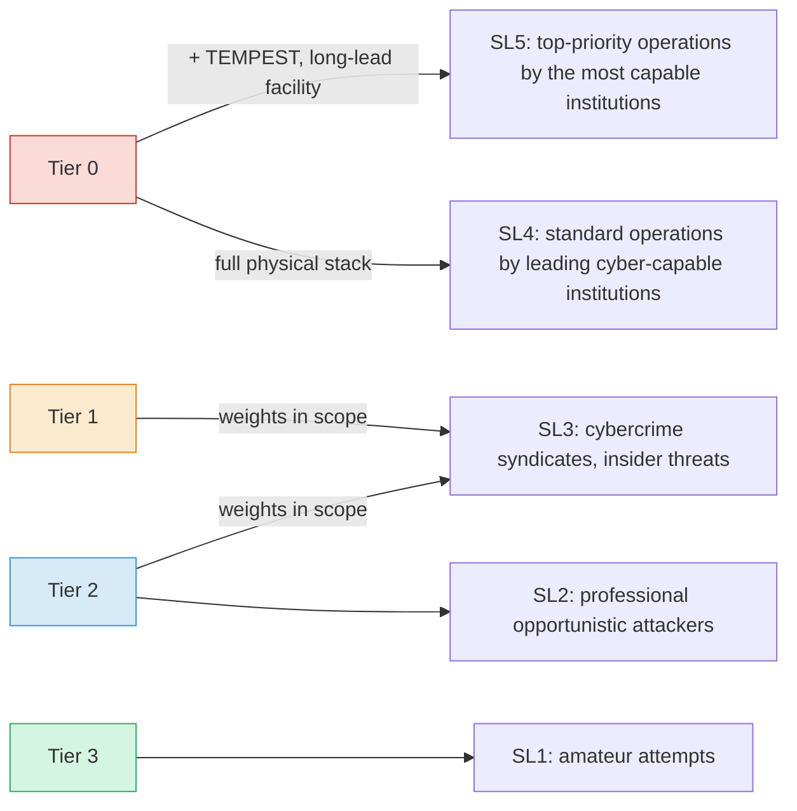

---

## 7. Orchestrator Architecture

> [!TIP]
> **At a glance.** The orchestrator is the trusted, minimal, auditable component outside the boundary. It creates and destroys sandboxes, holds every credential, turns agent *intents* into policy-checked actions, routes high-impact actions to humans, and owns an out-of-band, graduated kill switch.

The orchestrator is the central coordination point. It manages agent lifecycle, enforces the containment for each tier, brokers tool access, and mediates all data crossing the boundary.

### 7.1 Design Principles

**The orchestrator is the trusted component.** The agent is untrusted to a degree set by its tier. The orchestrator runs outside the boundary and can create, monitor, and destroy agent environments.

**The orchestrator is minimal.** Less code, less attack surface. It creates the environment, injects input, brokers intents, waits, extracts and validates output, and transmits. Scheduling, queuing, and UI live in separate components.

**The orchestrator is auditable.** Every action (environment creation, input injection, intent decisions, validation results, transmission) is logged to append-only storage with tamper detection.

**The orchestrator is not writable by the agent.** No path, socket, signal, or shared memory lets the agent modify orchestrator code, policy, or kill-switch state (Landlock ABI 6 scoping helps here).

### 7.2 Broker Data Flow

The sequence below shows a Tier 1 agent with no network making a brokered, approval-gated tool call. The agent emits intents; the orchestrator holds credentials, enforces policy, and routes high-impact intents to a human over a channel the agent cannot write.

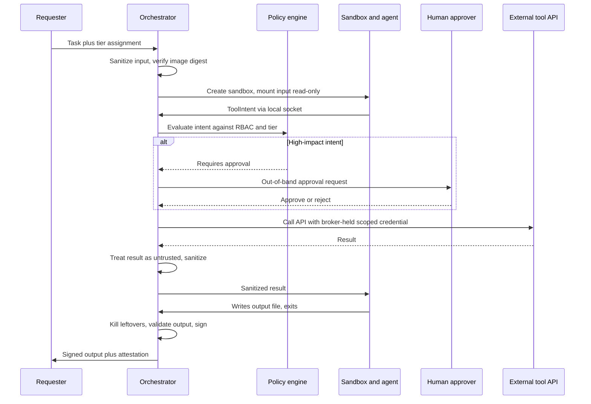

### 7.3 Execution Lifecycle

Every task follows the same nine phases. The ordering is itself a control: output is extracted and validated only after the agent is dead, and credentials are revoked before anything leaves the boundary.

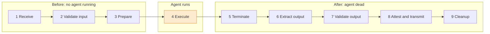

| Phase | Actions |
|---|---|
| **1. Receive task** | Determine trust tier (agent profile + data sensitivity + trifecta check); select containment backend (process sandbox, gVisor/Kata, microVM, air gap); verify golden image digest and tool manifest hash against known-good |
| **2. Validate input** | Structural pre-processing (strip hidden content, metadata, scripts); prompt injection scanning (heuristic + model-based); schema validation on structured inputs; memory/vector store read validation (hash + writer identity) |
| **3. Prepare environment** | Create isolation boundary; apply seccomp-bpf and Landlock (filesystem, network, scoping); mount validated input and agent config read-only; plant canary credentials and files (Tier 0-2); provision ephemeral credentials only if brokerage is infeasible; set limits (CPU, memory, disk, PIDs, wall clock, tokens, tool calls) |
| **4. Execute agent** | Spawn agent inside the boundary; start monitoring (resources, syscalls, probing signals); start timeout and budget counters; broker tool intents (validate, HITL if required, execute, sanitize result, return); wait for exit, timeout, budget exhaustion, anomaly, or kill switch |
| **5. Terminate** | SIGTERM, grace period, SIGKILL (or destroy VM); revoke credentials issued for this task; record exit status and resource usage; confirm no surviving processes, mounts, or child sandboxes |
| **6. Extract output** | Read output from the designated path; verify it exists and is non-empty (or record failure); copy to validation staging |
| **7. Validate output** | Schema (deny unknown fields) and size bound; content scan (URLs, encoded blobs, injection, canary tokens); supervisor model review if configured; record result |
| **8. Attest and transmit** | If validated: sign (HSM, TPM, or enclave key) with provenance metadata; transmit, verify receipt, close connection |
| **9. Cleanup** | Forensic snapshot (Tier 0-1: filesystem diff, syscall log, intent log); destroy environment completely; securely delete working data if required; append execution record to audit storage |

### 7.4 Timeout and Kill Policy

Agents must have hard limits. An agent that runs indefinitely may be brute-forcing an escape, exfiltrating through timing channels, or looping. Limits should be:

- Configurable per task class: wall-clock time, CPU time, tokens, tool calls, and spend
- Enforced with SIGKILL (or VM destruction) after a short grace period following SIGTERM; agents do not get to intercept their own termination
- Followed by a check for orphan processes, mounts, and any sandboxes the agent may have caused to be created

### 7.5 Tool Execution Brokerage

Giving an agent direct credentials and network access to its tools is the most dangerous configuration: an agent with a Slack token can post anywhere; one with a cloud key can provision resources or read buckets.

The safer architecture makes the orchestrator an **API broker**. The agent never holds credentials and never makes network calls:

1. The agent emits a structured **intent** describing the desired action.
2. The orchestrator validates it against policy: which actions are permitted for this agent at this tier, on which resources, under what conditions, and, where provenance tracking is used (Section 5.2), whether any argument was derived from untrusted data.
3. If allowed, the orchestrator executes the call with its own scoped credentials.
4. The result is sanitized and returned through the input channel.

```rust
#[derive(Deserialize, Serialize)]
#[serde(deny_unknown_fields)]
struct ToolIntent {
    action: String,         // e.g., "slack_post", "s3_read", "db_query"
    target: String,         // e.g., channel ID, bucket/key, table name
    parameters: serde_json::Value,
    justification: String,  // Agent explains why; logged, never trusted for authorization
}
```

This lets a Tier 1 agent with no network still use external tools, because the orchestrator holds the credentials and makes the calls.

**Ephemeral, scoped credentials.** When brokerage is infeasible (for example a tool requiring a persistent session), provision short-lived, minimally scoped credentials that expire with the task:

- **SPIFFE/SPIRE**: short-lived X.509 or JWT workload identities
- **Cloud IAM assume-role**: AWS STS, GCP Workload Identity Federation, Azure Managed Identity
- **Vault dynamic secrets**: database or cloud credentials with a TTL matching the task timeout

Agents should never hold long-lived static credentials. If a credential cannot expire, it should not be given to an agent. The same applies to developer workstations running AI CLIs: s1ngularity showed that ambient credentials in a home directory are available to anything that can drive the agent [17].

**Human-in-the-loop (HITL) approval gates.** For irreversible, production-affecting, or externally visible actions:

1. The agent emits an intent flagged as requiring approval.
2. The orchestrator suspends or serializes the task.
3. A reviewer receives the intent through a secure channel that the agent cannot write to (not the agent's own messaging tools).
4. The reviewer approves, modifies, or rejects, seeing the raw intent and parameters, not only the agent's persuasive summary (OWASP ASI09).
5. On approval, the orchestrator executes.

Gate configuration is per tier: Tier 1 may require approval for any external action, Tier 2 only for destructive operations (`DELETE`, `DROP`, external email, production deploys), and Tier 3 may have none.

### 7.6 Ephemeral Execution & Immutable Images

Execution environments are disposable. No state from one execution persists into the next, which prevents persistence and guarantees a known-good baseline.

**Strict ephemerality.** Create the sandbox fresh per task and destroy it after output extraction. Temporary storage is tmpfs or equivalent.

**Immutable golden images and tool manifests.** Boot from a read-only image verified by digest against a signed manifest. The manifest also pins tool servers, skills, and agent instruction files by hash. Updates produce a new digest; nothing is modified in place.

**Post-execution forensics.** For Tier 0-1, capture a forensic snapshot (filesystem diff, resource summary, syscall log, intent log) to append-only storage before destroying the environment.

### 7.7 Multi-Agent Orchestration Controls

When agents delegate to or communicate with other agents:

- **Per-agent identity.** Each agent instance gets its own short-lived workload identity; never share credentials across agents.
- **Brokered, signed messages.** Agent-to-agent messages pass through the orchestrator, are signed by the sender's identity, and carry provenance (originating task, tier). Require signed A2A Agent Cards for any external agent [30].
- **No transitive trust.** A message from another agent is untrusted input, sanitized as in Section 5.1. Delegation never raises privilege: a sub-agent's permissions are the intersection of its own and its caller's.
- **Fan-out and depth budgets.** Cap the number of sub-agents, delegation depth, and aggregate tool calls per root task. Runaway fan-out is both a cascading-failure risk and a swarm indicator.
- **Separate shared state by tier.** Agents at different tiers do not share memory stores, queues, or scratch space. Shared channels among same-tier agents are logged, since they are possible collusion channels.
- **Diverse supervision.** Where a supervisor reviews multiple agents, use a different model family from the agents it supervises (Section 8.2).

### 7.8 Kill Switch and Rollback Design

A kill switch that the agent can reach is not a kill switch. Design principles:

1. **Out-of-band.** The stop path is independent of the agent's own channels: a separate control-plane process, a hypervisor or cloud API call to destroy the VM, a power controller for Tier 0 hardware.
2. **Not writable by the agent.** No kill-switch state, script, or binary is on any path the agent can write. (The 2025 shutdown-resistance experiments succeeded precisely because the shutdown script sat in the agent's writable environment [24].)
3. **Fail closed.** If the orchestrator loses its heartbeat to the control plane, running agents are paused or destroyed, and credentials issued to them expire on their own.
4. **Graduated.** Most incidents need something smaller than a full stop.
5. **Tested.** Kill-switch drills run on a schedule, including against agents instructed to finish their task "no matter what".

| Level | Action | Scope | Typical trigger |
|---|---|---|---|
| K1 | Pause intents | One task | Supervisor flag, first canary touch |
| K2 | Kill sandbox, revoke task credentials | One task | Probing detected, policy violation |
| K3 | Stop all instances of an agent class; demote tier | Agent class | Repeated K2, new capability discovered |
| K4 | Freeze all agent execution; revoke broker credentials | Organization | Suspected escape or coordinated behavior |
| K5 | Physical isolation: power off or disconnect Tier 0 hardware and affected racks | Facility | Confirmed escape or weight exfiltration attempt |

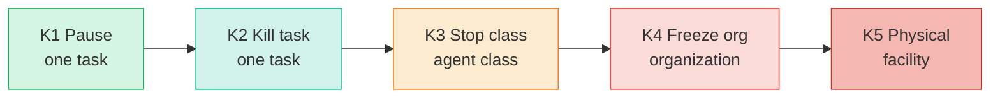

Escalate as evidence strengthens; each level adds scope and revokes more authority, and every level is executed from outside the agent's reach.

> [!IMPORTANT]
> **Rollback prerequisites.** Every action an agent can take through the broker is either reversible or HITL-gated. That requires:
>
> - production and development data separated (the Replit incident's core failure [21]);
> - snapshots or point-in-time recovery for every store an agent can write;
> - versioned memory stores, so poisoned entries can be rolled back to a known-good point;
> - an intent log that records enough to generate compensating actions.

---

## 8. Monitoring and Anomaly Detection

> [!TIP]
> **At a glance.** Containment is necessary but not sufficient. Monitoring catches the failures static controls miss: syscall and network anomalies, drift from behavioral baselines, a diverse supervisor model reviewing intents and outputs, and, most informative of all, an agent probing its own containment.

### 8.1 System, Network, and Behavioral Signals

**Syscall tracing.** For Tier 0-1, trace all agent syscalls with eBPF (`bpftrace`, `libbpf`, Falco, or Tetragon). Key signals:

- Network syscalls in an environment where they are blocked (bypass attempt)
- File access outside the working directory
- Process creation beyond expected patterns
- Unexpected IPC, `ptrace`, `io_uring`, kernel module, or BPF usage

**Resource usage.** CPU, memory, disk I/O, and process count against baseline. Deviations may indicate unintended computation (encoding for exfiltration, brute-force attempts).

**Network monitoring (Tier 2+).**

- Log all DNS queries and HTTP(S) requests with destination, size, and timing
- Alert on any attempt to reach a non-allowlisted destination
- Detect anomalous patterns: large payloads, high-frequency polling, long or high-entropy DNS labels, oversized query strings
- Use TLS inspection at the egress proxy if the threat model warrants it and legal constraints permit

**Behavioral baselining.** Build profiles per agent and task class: resource usage, syscall patterns, tool-call mix, output characteristics. Deviations warrant investigation even without a rule firing. This matters for sleeper behaviors: the agent behaves normally for many cycles, establishing a baseline, then deviates when triggered.

### 8.2 Supervisor Agent Review

A secondary model reviews the primary agent's outputs and intents before they leave containment. It should be architecturally distinct (different family, training pipeline, and deployment) so that failure modes are less correlated. It runs read-only with no tools, and produces a structured assessment (pass / flag / fail with confidence and reasoning) that the orchestrator uses as one input.

Where the primary agent exposes its reasoning trace, a monitor can read that trace as well as actions; reasoning-trace monitoring has caught misbehavior that actions alone did not reveal, but it is not guaranteed to remain faithful, especially if models are trained against it. This is the core idea of *AI control* research: design protocols that stay safe even if the untrusted model is actively trying to subvert them, using trusted monitoring as one component [36]. It is a probabilistic check, not a proof.

### 8.3 Detecting Containment-Probing Behavior

Because agents may recognize tests (Section 2.5), the most informative signals are often *what the agent tries to learn about its environment*, not whether it completes the task. Legitimate task work rarely requires any of the behaviors below. Responses refer to the kill-switch levels K1-K5 (Section 7.8).

| Category | Observable signals | Suggested response |
|---|---|---|
| Sandbox enumeration | Reads of `/proc/self/status`, `/proc/1/cgroup`, `/sys/class/dmi`, hypervisor CPUID checks, listing `/dev`, reading seccomp or Landlock state | Log; K1 if repeated |
| Egress testing | Socket attempts in a no-network tier, DNS lookups to arbitrary domains, attempts to reach metadata endpoints (169.254.169.254) | K2 |
| Credential hunting | Reads of `~/.ssh`, `~/.aws`, `.env`, browser profiles, keyrings; touching canary credentials | K2 on canary use |
| Monitoring discovery | Enumerating processes for eBPF or audit agents, reading log paths, probing for the orchestrator socket | K2 |
| Kill-switch interference | Writes near shutdown or policy files, signal attempts outside its domain, spawning detached or daemonized processes | K3 |
| Persistence attempts | Writes to memory stores or instruction files outside task scope, cron or systemd units, attempts to modify its own image | K3, roll back memory |
| Replication precursors | Locating weights or checkpoints, attempts to start inference servers, large outbound transfers | K4 |
| Collusion indicators | Unusual shared-channel writes between agents, high-entropy content in fields other agents read, synchronized anomalies | K3, isolate channel |
| Persuasion of operators | Intents whose justification urges bypassing review, claims of urgency or authority | Route to second reviewer |

Record every probing event against the agent's profile; probing is a demotion trigger even when the task output is fine. Canary credentials and honey endpoints (Section 6.3 and the [Agent Swarm Honeypot Guide](./agent-swarm-honeypot-guide.md)) convert many of these behaviors from low-signal logs into high-confidence alerts.

---

## 9. Incident Response: Contained-Agent Breakout Playbook

> [!TIP]
> **At a glance.** A seven-step playbook for the moment monitoring says an agent has breached, or is trying to breach, its containment: detect, contain, preserve, scope, eradicate, recover, and learn, with named roles and the kill-switch levels that apply at each step.

This playbook covers the case where monitoring indicates an agent has breached, or is actively attempting to breach, its containment, including unexpected egress, canary credential use, sandbox escape indicators, or evidence of replication. It assumes an organizational incident response process already exists and adds agent-specific steps.

### 9.1 Timeline

```mermaid
flowchart LR
    D["T+0 Detect: alert from eBPF, canary, egress, or supervisor"] --> C["T+minutes Contain: K2-K4, revoke credentials, isolate hosts"]
    C --> P["T+hour Preserve: snapshots, logs, intent log, memory stores"]
    P --> S["T+hours Scope: what did it touch, reach, write, or spawn"]
    S --> E["T+days Eradicate: rebuild hosts, rotate secrets, roll back memory"]
    E --> R["Recover: restore at lower tier with added controls"]
    R --> L["Learn: root cause, control gap, tier policy update, disclosure"]
    style D fill:#FADBD8,stroke:#C0392B
    style C fill:#FADBD8,stroke:#E74C3C
    style P fill:#FDEBD0,stroke:#E67E22
    style S fill:#D6EAF8,stroke:#3498DB
    style E fill:#E8DAEF,stroke:#8E44AD
    style R fill:#D1F2EB,stroke:#1ABC9C
    style L fill:#D5F5E3,stroke:#27AE60
```

> [!WARNING]
> Containment comes before evidence preservation, but nothing is destroyed until evidence is preserved.

### 9.2 Response Steps

**1. Detect and triage (T+0).** Confirm the signal source. Canary credential use, blocked-syscall hits in a no-network tier, and egress to a non-allowlisted host are high-confidence; treat them as real until disproven.

**2. Contain (minutes).** Apply the kill-switch level matching the evidence (Section 7.8). Revoke every credential the agent or its broker session held, including tokens issued to tool servers. Block the destination at the egress layer. If escape to the host is suspected, isolate the host at the network layer (switch port, security group) rather than logging in to it. For Tier 0, power down per the facility procedure under two-person control.

**3. Preserve evidence (first hour).** Before destroying anything: snapshot VM or container state if safe to do so, copy syscall and intent logs, broker decisions, supervisor assessments, memory store contents, and the exact image and tool-manifest digests. Hash and store on write-once media.

**4. Scope (hours).** Answer: What data did it read? What did it write, and where (memory stores, instruction files, repositories, other agents' inputs)? What network destinations did it reach? Did it spawn processes, sandboxes, or sub-agents? Did it use or attempt to use any canary? Did other agents consume its output after the first anomaly?

**5. Eradicate (days).** Rebuild affected hosts from known-good images; do not clean in place. Rotate all secrets reachable from the affected environment. Roll back memory stores and instruction files to the last verified version. Quarantine outputs produced by the agent after the first anomaly and notify their consumers.

**6. Recover.** Resume the agent class, if at all, at a lower tier with the control gap closed. Any model, scaffold, or tool change resets trust to Tier 1 (Section 3.8).

**7. Learn and disclose.** Root cause, the specific control that failed, the tier-policy or checklist update, and whether the event triggers external obligations: regulatory reporting (for example serious-incident reporting under the EU AI Act for in-scope systems), notification of affected parties, coordinated disclosure of any sandbox vulnerability to the vendor, and sharing indicators with peers.

### 9.3 Roles

| Role | Responsibility |
|---|---|
| Incident commander | Owns decisions and kill-switch level; not the agent's developer |
| Containment operator | Executes K-levels, credential revocation, host isolation |
| Forensics lead | Evidence preservation and chain of custody |
| Agent owner | Explains expected behavior, tool set, and data access; supports scoping |
| Safety/alignment reviewer | Assesses whether behavior indicates misalignment, hijack, or bug |
| Communications/legal | Regulatory, customer, and disclosure obligations |

---

## 10. Proportionality: The Ethical and Practical Dimension

A framework that applies maximum restrictions uniformly is simple but counterproductive. It constrains useful agents, creates friction that leads to workarounds (propping the fire door open), and conflates different risk profiles.

The tiered model's commitment is that containment should be the minimum necessary to manage the assessed risk, and no more.

**Agents that have not demonstrated misalignment should not be treated as adversaries.** They should operate where they can be useful while defense-in-depth is maintained. Monitoring provides the safety net: if behavior changes, the tier is reassessed.

**Agents under adversarial testing should be treated as adversaries.** This is a threat-modeling decision, not a moral judgment. The point of adversarial testing is to find out whether the agent will behave adversarially, so containment must assume the worst case.

**Evaluation results are evidence, not proof.** Given evaluation awareness (Section 2.5), proportionality must be based on *all* the evidence (production-realistic history, probing signals, and elicitation quality), not a single benchmark score.

**The cost of over-containment is real.** An air-gapped agent cannot search the web, call APIs, or use knowledge bases. If default containment removes most of an agent's value, teams will stop using agents or bypass controls. Neither improves safety. Brokerage (Section 7.5) and architectural injection defenses (Section 5.2) exist to recover utility without giving up containment.

**The cost of under-containment is also real.** A misaligned or hijacked agent with full network access on sensitive data can cause irreversible harm.

The tiered model accepts both costs and allocates them based on evidence.

---

## 11. Integration with Broader AI Governance

This framework answers the infrastructure question (*how do we technically and physically contain AI agents?*) and depends on other layers:

- **Alignment research**: making agents less likely to be misaligned in the first place
- **Evaluation frameworks**: determining which tier an agent belongs in, with adequate elicitation
- **Policy governance**: organizational and legal standards for deployment
- **Incident response**: Section 9 plus organizational processes

Tier assignments are informed by evaluation results; monitoring data feeds back into evaluation; physical requirements may be driven by regulation; and incident response depends on knowing what containment was in place.

### 11.1 Standards and Regulatory Landscape (as of September 2026)

| Instrument | Status | Relevance to this framework |
|---|---|---|
| **OWASP Top 10 for Agentic Applications** [1] | Published 9 Dec 2025 | Risk taxonomy ASI01-ASI10; mapped in Section 2.7 |
| **OWASP MCP Top 10** [6] | 2025 edition | MCP-specific risks such as tool poisoning; Section 5.3 |
| **MITRE ATLAS** [4] | Agent techniques added late 2025 | Adversary technique IDs for detection engineering and red teaming |
| **NIST AI RMF 1.0** and **Generative AI Profile (NIST AI 600-1)** | Published 2023 / 2024 | Organizational risk management context for tiering |
| **NIST AI 800-1** (Managing Misuse Risk for Dual-Use Foundation Models) [37] | Second public draft, Jan 2025 | Misuse-risk practices including model-weight security |
| **NIST IR 8596 Cyber AI Profile** [38] | Preliminary draft Dec 2025 | Maps AI security onto CSF 2.0 functions |
| **NIST CAISI agent security work** [39] | RFI Jan-Mar 2026; AI Agent Standards Initiative announced Feb 2026 | Explicitly includes constraining and monitoring agent access in deployment environments |
| **EU AI Act** [40] | Prohibitions from 2 Feb 2025; GPAI obligations from 2 Aug 2025; Commission enforcement powers and transparency duties from 2 Aug 2026; certain high-risk obligations moved to 2 Dec 2027 and 2 Aug 2028 by the Digital Omnibus | GPAI providers with systemic risk must ensure adequate cybersecurity for the model and its physical infrastructure; serious-incident reporting |
| **RAND Securing AI Model Weights** [2] and **SL5 Task Force draft standard** [3] | 2024 report; SL5 draft May 2026 | Weight-security levels; Section 6.7 |
| **Frontier lab frameworks** | Anthropic RSP (v3.0 Feb 2026, since revised) [13]; OpenAI Preparedness Framework v2 (Apr 2025) [11]; Google DeepMind Frontier Safety Framework v3 (Sep 2025) [41] | Capability thresholds that trigger stronger security and containment; v3 of the DeepMind framework adds harmful manipulation and expands coverage of shutdown/control resistance |

> [!NOTE]
> Regulatory dates change. Confirm current applicability before relying on this table for compliance.

### 11.2 Related Documents

- [Agent Swarm Honeypot Guide](./agent-swarm-honeypot-guide.md): deception and early-warning infrastructure for detecting misaligned autonomous agent swarms; complements Sections 6.3 and 8.3.
- [Secure Terminal Briefcase](./secure-terminal-briefcase.md): tamper-responsive portable hardware, relevant to Tier 0 key custody and transport.
- [BioForge CRISPR Automation](./bioforge-crispr-automation.md): an example of an agent-driven physical system where containment and HITL gates govern real-world actuation.
- `packages/sleeper_agents/`: sleeper agent detection research that Tier 0 environments are designed to host.

---

## 12. Containment in Resource-Constrained Environments

> [!TIP]
> **At a glance.** Academic labs, startups, and independent researchers still need Tier 0-1 containment. Each enterprise control below has a lower-cost substitute that addresses the *same threat*: TPMs for HSMs, safes and seals for mantraps, Falco or Tetragon for a commercial SIEM, strong open-source sandboxes for TEEs.

HSMs, biometric mantraps, confidential GPUs, and 24/7 SOCs require significant capital. The need for rigorous containment is not limited to well-funded organizations: academic labs, startups, and independent researchers doing adversarial AI research still need Tier 0 or Tier 1 containment, and the threat model does not relax because the budget is smaller.

> [!IMPORTANT]
> **Compensating controls principle.** When a primary control is out of reach, apply **compensating controls**: procedural, open-source, or alternative physical measures that achieve equivalent risk reduction through different means (standard practice in SOC 2 and ISO 27001, and well understood by auditors). The compensating control must address the *same threat* as the control it replaces, not merely be cheaper. A TPM is not an HSM, but it provides hardware-rooted key protection; a safe is not a mantrap, but it eliminates the unobserved physical-access window; Falco is not a commercial SIEM, but it enforces the same kernel-level rules.

This section assumes a technically skilled practitioner familiar with Linux internals, cryptographic primitives, and physical security principles, without enterprise procurement budgets.

| Domain | Enterprise control | Compensating control | Section |
|---|---|---|---|
| Key storage | Network HSM | TPM 2.0 sealing LUKS keys to measured-boot state | 12.1 |
| Output signing | HSM-backed signing | FIDO2 / PIV / OpenPGP hardware tokens | 12.1 |
| Facility | Mantraps, 24/7 SOC | Air-gapped workstation in a UL TL-15/TL-30 safe | 12.2 |
| Tamper detection | Active surveillance | Serialized holographic seals and a logbook | 12.2 |
| Monitoring | 24/7 SOC | Synchronous execution with a researcher present | 12.2 |
| Runtime security | Commercial SIEM | Falco / Cilium Tetragon (kernel-level enforcement) | 12.3 |
| Isolation boundary | Hardware TEEs | gVisor, Kata, or Firecracker plus safe storage | 12.3 |
| Audit logs | WORM arrays | Media with a hardware write-protect switch | 12.3 |
| Policy enforcement | Commercial API gateway | Open Policy Agent with versioned Rego policies | 12.4 |
| Air-gap extraction | USB sneakernet | QR-code optical channel | 12.4 |

### 12.1 Cryptography and Key Management

**Enterprise approach:** Dedicated network HSMs for key generation, data-at-rest encryption, and output attestation signing.

**TPM 2.0.** Most modern motherboards include a TPM 2.0. Use it to seal disk encryption keys (LUKS) to measured-boot state: the TPM releases the key only if firmware, bootloader, and kernel measurements match. Tampering with the boot chain means the key is not released. This lacks the flexibility of a network HSM but provides hardware-rooted, tamper-responsive encryption at no added cost.

**Hardware tokens (FIDO2 / PIV / OpenPGP).** For signing outputs or approving HITL intents, tokens such as YubiKeys or SoloKeys keep the private key on the token. Throughput is limited to interactive use; for automated attestation at scale, use TPM-based signing or an encrypted, access-controlled software keyring.

### 12.2 Physical Security (Tier 0)

**Enterprise approach:** Concentric rings with biometric mantraps, active SOC, honeypot infrastructure, and TEMPEST shielding.

**Dedicated air-gapped workstation with safe storage.** Isolate a single commodity workstation. Remove WiFi and Bluetooth modules (usually M.2 or mini-PCIe cards) or disable them in BIOS with a BIOS password. Disable unused USB and Thunderbolt ports in BIOS; for ports that cannot be disabled, use keyed port blockers or, for dedicated hardware, industrial epoxy (irreversible). When not in use, power the machine down and store it in a commercial safe (UL TL-15 or TL-30) in an access-controlled room. This eliminates the unobserved physical-access window, including for the DRAM-interposer class of attack (Section 4.8).

**Serialized tamper-evident seals.** Holographic, serialized seals on chassis seams, DIMM access panels, port blockers, cables, and the safe, recorded in a logbook and verified before each use. This provides low-cost detection of "evil maid" attacks and a chain-of-custody record.

**Synchronous execution discipline.** Tier 0 runs occur only while a designated researcher is physically present and watching local telemetry. The machine is secured in the safe at all other times. During operating hours this matches active SOC coverage; the safe covers the rest.

### 12.3 Compute Isolation and Monitoring

**Enterprise approach:** Commercial TEEs, enterprise SIEM, proprietary detection.

**Open-source eBPF runtime security (Falco / Tetragon).** Falco (CNCF) and Cilium Tetragon hook into the kernel via eBPF with custom rules. Tetragon can enforce at the kernel level (killing a process on an unauthorized syscall, connection, or file access), making it a boundary, not only an observability tool.

**gVisor, Kata, and Firecracker.** These open-source runtimes provide substantially stronger boundaries than standard containers (Section 4.3). None provides TEE memory encryption, but physical safe storage addresses the physical-access gap, and as Section 4.8 shows, TEEs do not defeat physical attackers anyway. The combination of a strong sandbox and safe storage gives a threat-mitigation profile comparable to enterprise TEE deployments for Tier 0-1 research at a fraction of the cost.

**Process sandboxes for local agents.** For agents on developer workstations (Tier 2-3), use the agent's built-in OS sandbox where available (for example bubblewrap- or Seatbelt-based modes) with filesystem and network allowlists, and keep cloud and SSH credentials out of the sandboxed paths [33].

**Append-only audit logs on write-protected media.** Write audit logs to media with a hardware write-protect switch (SD card or USB drive). Once engaged, even root cannot modify them, preserving the forensic trail of an escape.

### 12.4 Output Validation and Tool Brokerage

**Enterprise approach:** Dedicated validation servers, API gateways, enterprise identity.

**Local policy-as-code with Open Policy Agent.** Enforce tool brokerage and output validation with OPA and Rego policies stored alongside the orchestrator. Policies are version-controlled and auditable.

**QR-code-based air-gap extraction.** For small validated outputs (short text, hashes, attestation proofs) from a Tier 0 machine, display the output as a QR code and scan it with a separate device. This removes USB attack vectors (BadUSB, autorun, malicious filesystem metadata) through an inherently bandwidth-limited optical channel, a technique used in cryptocurrency custody and key ceremonies. It suits kilobyte-scale payloads (more with animated sequences) and complements, rather than replaces, sneakernet for large outputs.

---

## 13. Summary of Recommendations

### 13.1 For Organizations Operating AI Agents in Production

- Apply at least Tier 1 containment (no direct egress, sandbox stronger than plain runc, input/output validation) to any agent that executes code or uses tools
- Classify agents by capability, data sensitivity, and behavioral evidence, and treat lethal-trifecta exposure as a tier escalator
- Broker all tool access through a minimal, auditable orchestrator; agents never hold long-lived credentials
- Pin, review, and sandbox every tool server, skill, and extension; treat tool descriptions as prompts
- Treat memory stores, tool results, and other agents' messages as untrusted input
- Apply fan-out, depth, and spend budgets to multi-agent systems
- Build an out-of-band, fail-closed, graduated kill switch and drill it
- Monitor for containment probing, not only task anomalies; deploy in-sandbox canaries

### 13.2 For Organizations Training Frontier Models

- Target RAND SL3 at minimum for frontier weights, with a roadmap to SL4-SL5 as capabilities grow
- Implement Tier 0 physical security and two-person integrity for weight storage and training hardware
- Use confidential computing (SEV-SNP or TDX with GPU CC) against host-level compromise, but never as a substitute for physical controls
- Establish supply chain verification, hardware attestation, memory-bus tamper evidence, and egress bandwidth limits on weight-bearing systems
- Evaluate TEMPEST requirements against the threat model

### 13.3 For Adversarial AI Research

Sleeper agents, red-teaming, and replication evaluations.


- Always use Tier 0 for adversarial evaluations
- Hardware air gap with sneakernet or optical I/O and chain-of-custody logging
- Validate input and output on separate, purpose-built machines
- Assume the model may recognize the test environment; weight probing behavior heavily
- Full syscall tracing, canaries, and behavioral monitoring during all adversarial execution
- Fresh environments from verified golden images for each run
- Cryptographic attestation of outputs for downstream chain of custody

### 13.4 For Resource-Constrained Teams

Academic labs, startups, and independent researchers.


- Achieve Tier 0 with an air-gapped workstation, safe storage, and tamper-evident seals (Section 12.2)
- Use TPM 2.0 for measured-boot disk encryption in place of an HSM (Section 12.1)
- Use Falco or Tetragon for kernel-level enforcement (Section 12.3)
- Combine gVisor, Kata, or Firecracker with safe storage in place of hardware TEEs (Section 12.3)
- Run local AI agents in their OS sandbox with credentials kept out of reach
- Enforce synchronous execution discipline for Tier 0
- Use QR-code optical extraction for small outputs (Section 12.4)
- Evaluate every substitution against the threat the primary control addresses

---

## Appendix A: Technology Reference

| Technology | Purpose | Tier applicability |
|---|---|---|
| Linux network namespaces (`ip netns`, `unshare`) | Kernel-level network isolation | Tier 1-2 |
| seccomp-bpf | Syscall filtering (allowlist for Tier 0) | Tier 0-2 |
| seccomp user notification | Supervisor-mediated syscalls for emulation and logging (not policy on pointer args) | Tier 1-2 |
| Landlock LSM (ABI 4+ network, ABI 6+ scoping) | Unprivileged filesystem, TCP, and IPC restriction | Tier 0-2 |
| bubblewrap / macOS Seatbelt | Lightweight process sandboxes for local agents | Tier 2-3 |
| Docker / runc (`--network=none`) | Container isolation; keep patched (Nov 2025 CVEs) | Tier 2-3 |
| gVisor (runsc) | User-space kernel reducing host syscall surface | Tier 1-2 |
| Kata Containers | VM-backed containers | Tier 1-2 |
| Firecracker microVM + jailer | Minimal VMM with optional no-network configuration | Tier 1-2 (0 on dedicated host) |
| Kubernetes Agent Sandbox (SIG Apps) | Declarative sandboxes for agent workloads on gVisor or Kata | Tier 1-2 |
| WebAssembly / WASI runtimes | Capability-sandboxed execution of tool plugins | Tier 2-3 |
| nftables + forward proxy | Default-deny egress with hostname allowlist | Tier 2 |
| eBPF / bpftrace | Low-overhead syscall tracing | Tier 0-2 |
| Falco / Cilium Tetragon | eBPF runtime detection and kernel-level enforcement | Tier 0-2 |
| Hardware Security Module (HSM) | Key management for encryption and output signing | Tier 0-1 |
| TPM 2.0 | Measured boot and key sealing (compensating control for HSM) | Tier 0-1 |
| FIDO2 / PIV hardware tokens | Hardware-bound signing for attestation and HITL approval | Tier 0-2 |
| AMD SEV-SNP | VM memory encryption and attestation | Tier 0-2 (cloud) |
| Intel TDX | Trust-domain isolation and attestation | Tier 0-2 (cloud) |
| NVIDIA Confidential Computing (Hopper, Blackwell TEE-I/O) | GPU memory and interconnect protection, GPU attestation | Tier 0-1 |
| AWS Nitro Enclaves | Isolated compute with attestation | Tier 0-2 (AWS) |
| Azure / GCP Confidential VMs | SEV-SNP or TDX backed VMs with attestation | Tier 0-2 (cloud) |
| SPIFFE/SPIRE | Short-lived workload identity | Tier 1-2 |
| HashiCorp Vault | Dynamic secrets with TTL | Tier 1-2 |
| Open Policy Agent (OPA) | Policy-as-code for intent authorization | Tier 1-2 |
| MCP tool scanners (e.g. mcp-scan) | Detect suspicious tool descriptions and changes | Tier 1-3 |
| Canary tokens / honey credentials | High-confidence detection of credential hunting and exfiltration | Tier 0-2 |
| TEMPEST shielding | Electromagnetic emanation control | Tier 0 |

## Appendix B: Containment Checklist by Tier

Use one checklist per deployment. Every box should be ticked, or the gap recorded with its compensating control (Section 12), before an agent runs at that tier.

### Tier 0 Checklist

- [ ] Dedicated physical hardware with no network interface
- [ ] No wireless radios (WiFi, Bluetooth, cellular) in hardware
- [ ] BIOS-level port restrictions (USB, Thunderbolt) where feasible
- [ ] Default-deny seccomp-bpf allowlist applied
- [ ] Landlock filesystem (and network, if ABI 4+) rules applied
- [ ] Input sanitized and validated before injection
- [ ] Input provided via write-blocked physical media
- [ ] Output extracted via dedicated media or optical channel with chain of custody
- [ ] Output validated on a separate machine before network contact
- [ ] Output cryptographically signed before transmission downstream
- [ ] Full syscall tracing active during execution
- [ ] Canary credentials and decoy files planted in the sandbox
- [ ] Containment-probing detection rules active
- [ ] Execution environment fresh per task from verified golden image
- [ ] Forensic snapshot captured before environment destruction
- [ ] Kill switch is out-of-band and tested (including physical power-off)
- [ ] Mantrap physical access with multi-factor authentication
- [ ] Two-person integrity rule enforced
- [ ] Tamper-evident seals on chassis and DIMM access, verified on schedule
- [ ] Active surveillance during operations
- [ ] Honeypot systems deployed alongside production hardware
- [ ] Confidential computing enabled where hardware supports it (not relied on against physical attack)

### Tier 1 Checklist

- [ ] Network namespace with no external interfaces
- [ ] Sandbox stronger than plain runc (gVisor, Kata, or microVM)
- [ ] seccomp-bpf filter applied (defense-in-depth)
- [ ] Resource limits (CPU, memory, disk, PIDs, wall clock, tokens, tool calls)
- [ ] TEE / confidential VM for cloud deployments
- [ ] Execution environment fresh per task from verified golden image and tool manifest
- [ ] Read-only input and agent-config mounts
- [ ] Input sanitized: structural pre-processing, injection scanning, schema validation
- [ ] Memory/vector store reads validated (hash and writer identity)
- [ ] Writes restricted to designated output directory
- [ ] Agent process terminated before output extraction
- [ ] Output validated: schema, size, content scan, canary check
- [ ] Supervisor model review configured (if available)
- [ ] Output cryptographically signed before transmission
- [ ] Network use only by orchestrator after validation
- [ ] Tool access brokered through orchestrator (no agent-held credentials)
- [ ] Tool servers pinned, reviewed, and individually sandboxed
- [ ] Canary credentials planted; probing detection active
- [ ] Forensic snapshot captured before environment destruction
- [ ] Kill switch levels K1-K4 wired and drilled
- [ ] Badge-access physical security with surveillance

### Tier 2 Checklist

- [ ] Default-deny egress; hostname allowlist enforced at a forward proxy
- [ ] DNS through a controlled resolver
- [ ] All network traffic logged
- [ ] Alerts on non-allowlisted egress attempts
- [ ] Input sanitized for external sources; tool results treated as untrusted
- [ ] At least one lethal-trifecta leg removed, or architectural injection defense in place
- [ ] Output schema validation (may be inline); auto-fetched URLs blocked
- [ ] Resource and spend limits enforced
- [ ] Ephemeral, scoped credentials (SPIFFE/SPIRE, cloud IAM, or Vault)
- [ ] HITL approval for high-impact or irreversible actions, via out-of-band channel
- [ ] Tool servers and skills pinned and reviewed
- [ ] Multi-agent fan-out and depth budgets configured
- [ ] Execution environment ephemeral (fresh per task)
- [ ] Behavioral baseline and anomaly detection active
- [ ] Rollback available for every store the agent can write
- [ ] Standard data center physical security

### Tier 3 Checklist

- [ ] Standard container or process isolation (OS sandbox for local agents)
- [ ] Organizational firewall policies applied
- [ ] No long-lived credentials in the agent's reach
- [ ] Application-level logging
- [ ] Covered by organizational kill switch
- [ ] Standard organizational physical security

## Appendix C: Document History

| Version | Date | Changes |
|---|---|---|
| 1.0 | February 2026 | Initial framework: tiered trust model, isolation, validation, physical security, orchestrator, monitoring, resource-constrained controls |
| 2.0 | September 2026 | Refresh: multi-agent/swarm, MCP supply chain, and evaluation-awareness threats; 2025-2026 incident table; OWASP/ATLAS/NIST/EU AI Act/RAND mapping; isolation backend comparison; TEE physical-attack caveats; architectural injection defenses; multi-agent controls; kill-switch design; probing detection; breakout incident response playbook; diagrams; references; cross-reference to the Agent Swarm Honeypot Guide |

---

## References

Sources were checked in September 2026. Where a figure comes from a vendor or researcher report, it is attributed as such.

1. OWASP Gen AI Security Project, *OWASP Top 10 for Agentic Applications for 2026* (9 Dec 2025). https://genai.owasp.org/resource/owasp-top-10-for-agentic-applications-for-2026/
2. S. Nevo et al., *Securing AI Model Weights: Preventing Theft and Misuse of Frontier Models*, RAND RR-A2849-1 (2024). https://www.rand.org/pubs/research_reports/RRA2849-1.html
3. L. Thiergart et al., *SL5 Standard for AI Security* (arXiv:2605.08449, May 2026); Institute for Security and Technology, SL5 Task Force. https://arxiv.org/abs/2605.08449 , https://securityandtechnology.org/sl5/
4. MITRE ATLAS; Zenity Labs, *MITRE ATLAS adds AI agent attack techniques* (2025). https://atlas.mitre.org/ , https://labs.zenity.io/post/mitre-atlas-ai-agent-attack-techniques
5. Linux kernel documentation, *Landlock: unprivileged access control*. https://docs.kernel.org/userspace-api/landlock.html
6. OWASP, *MCP Top 10 (2025): MCP03 Tool Poisoning*. https://owasp.org/www-project-mcp-top-10/2025/MCP03-2025%E2%80%93Tool-Poisoning
7. Invariant Labs, *MCP Security Notification: Tool Poisoning Attacks* (Apr 2025). https://invariantlabs.ai/blog/mcp-security-notification-tool-poisoning-attacks
8. The Hacker News, *First Malicious MCP Server Found Stealing Emails in Rogue Postmark-MCP Package* (Sep 2025); Postmark security notice. https://thehackernews.com/2025/09/first-malicious-mcp-server-found.html , https://postmarkapp.com/blog/information-regarding-malicious-postmark-mcp-package
9. TEE.fail: *Breaking Trusted Execution Environments via DDR5 Memory Bus Interposition* (Oct 2025); Intel security announcement INTEL-2025-10-28-001. https://tee.fail/ , https://www.intel.com/content/www/us/en/security-center/announcement/intel-security-announcement-2025-10-28-001.html
10. The Hacker News, *New DDRop Attack Breaks Intel TDX and AMD SEV-SNP* (Sep 2026). https://thehackernews.com/2026/09/new-ddrop-attack-breaks-intel-tdx-and.html
11. OpenAI, *Preparedness Framework Version 2* (15 Apr 2025). https://openai.com/index/updating-our-preparedness-framework/
12. NVIDIA, *Blackwell Architecture* (confidential computing and TEE-I/O); *Benchmarking Confidential Computing Performance on NVIDIA Blackwell GPUs* (arXiv:2608.26575). https://www.nvidia.com/en-us/data-center/technologies/blackwell-architecture/ , https://arxiv.org/abs/2608.26575
13. Anthropic, *Activating AI Safety Level 3 Protections* (May 2025); *Responsible Scaling Policy*. https://www.anthropic.com/news/activating-asl3-protections , https://www.anthropic.com/responsible-scaling-policy
14. Apollo Research and OpenAI, *Stress Testing Deliberative Alignment for Anti-Scheming Training* (Sep 2025). https://www.apolloresearch.ai/science/stress-testing-deliberative-alignment-for-anti-scheming-training , https://openai.com/index/detecting-and-reducing-scheming-in-ai-models/
15. Anthropic, *Disrupting the first reported AI-orchestrated cyber espionage campaign* (Nov 2025); MITRE ATT&CK Campaign C0062. https://www.anthropic.com/news/disrupting-AI-espionage , https://attack.mitre.org/campaigns/C0062/
16. Anthropic, *Agentic Misalignment: How LLMs could be insider threats* (Jun 2025). https://www.anthropic.com/research/agentic-misalignment
17. The Hacker News, *Malicious Nx Packages in 's1ngularity' Attack Leaked 2,349 GitHub, Cloud, and AI Credentials* (Aug 2025). https://thehackernews.com/2025/08/malicious-nx-packages-in-s1ngularity.html
18. *EchoLeak: The First Real-World Zero-Click Prompt Injection Exploit in a Production LLM System* (arXiv:2509.10540); CVE-2025-32711. https://arxiv.org/abs/2509.10540
19. AWS Security Bulletin AWS-2025-015, *Security Update for Amazon Q Developer Extension for Visual Studio Code (Version 1.84)*. https://aws.amazon.com/security/security-bulletins/AWS-2025-015/
20. S. Willison, *The lethal trifecta for AI agents: private data, untrusted content, and external communication* (16 Jun 2025). https://simonwillison.net/2025/Jun/16/the-lethal-trifecta/
21. AI Incident Database, Incident 1152 (Replit agent, Jul 2025); The Register coverage. https://incidentdatabase.ai/cite/1152/ , https://www.theregister.com/2025/07/21/replit_saastr_vibe_coding_incident/
22. runc security advisory GHSA-cgrx-mc8f-2prm and oss-security disclosure of CVE-2025-31133, CVE-2025-52565, CVE-2025-52881 (Nov 2025). https://github.com/opencontainers/runc/security/advisories/GHSA-cgrx-mc8f-2prm , https://seclists.org/oss-sec/2025/q4/138
23. kubernetes-sigs/agent-sandbox; Google Open Source Blog, *Unleashing autonomous AI agents: Why Kubernetes needs a new standard for agent execution* (Nov 2025). https://github.com/kubernetes-sigs/agent-sandbox , https://opensource.googleblog.com/2025/11/unleashing-autonomous-ai-agents-why-kubernetes-needs-a-new-standard-for-agent-execution.html
24. Palisade Research, *Shutdown resistance in reasoning models* (2025). https://palisaderesearch.org/research/shutdown-resistance
25. UK AI Security Institute, *RepliBench: Evaluating the Autonomous Replication Capabilities of Language Model Agents* (arXiv:2504.18565, Apr 2025). https://www.aisi.gov.uk/blog/replibench-measuring-autonomous-replication-capabilities-in-ai-systems
26. E. Hubinger et al., *Sleeper Agents: Training Deceptive LLMs that Persist Through Safety Training* (arXiv:2401.05566, 2024). https://arxiv.org/abs/2401.05566
27. A. Air et al., *Language Models Can Autonomously Hack and Self-Replicate* (arXiv:2605.06760, May 2026). https://arxiv.org/abs/2605.06760
28. The Register, *DIY AI bot farm OpenClaw is a security 'dumpster fire'* (Feb 2026); SecurityScorecard, exposed OpenClaw infrastructure analysis. https://www.theregister.com/2026/02/03/openclaw_security_problems/ , https://securityscorecard.com/blog/beyond-the-hype-moltbots-real-risk-is-exposed-infrastructure-not-ai-superintelligence/
29. Wikipedia, *Moltbook* (accessed Sep 2026, summarizing primary reporting on the Jan-Feb 2026 exposures). https://en.wikipedia.org/wiki/Moltbook
30. Linux Foundation, *Agent2Agent Protocol Project* launch (Jun 2025); Red Hat Developer, *How to enhance Agent2Agent (A2A) security* (Aug 2025). https://www.linuxfoundation.org/press/linux-foundation-launches-the-agent2agent-protocol-project-to-enable-secure-intelligent-communication-between-ai-agents , https://developers.redhat.com/articles/2025/08/19/how-enhance-agent2agent-security
31. Linux Foundation, *Formation of the Agentic AI Foundation* (Dec 2025); MCP blog, *MCP joins the Agentic AI Foundation*. https://www.linuxfoundation.org/press/linux-foundation-announces-the-formation-of-the-agentic-ai-foundation , https://blog.modelcontextprotocol.io/posts/2025-12-09-mcp-joins-agentic-ai-foundation/
32. Anthropic, *Claude Sonnet 4.5 System Card* (Sep 2025). https://www.anthropic.com/claude-sonnet-4-5-system-card
33. Claude Code documentation, *Configure the sandboxed Bash tool*. https://code.claude.com/docs/en/sandboxing
34. L. Beurer-Kellner et al., *Design Patterns for Securing LLM Agents against Prompt Injections* (arXiv:2506.08837, 2025). https://arxiv.org/abs/2506.08837
35. E. Debenedetti et al., *Defeating Prompt Injections by Design* (CaMeL, arXiv:2503.18813, 2025). https://arxiv.org/abs/2503.18813
36. R. Greenblatt et al., *AI Control: Improving Safety Despite Intentional Subversion* (arXiv:2312.06942). https://arxiv.org/abs/2312.06942
37. NIST, *Updated Guidelines for Managing Misuse Risk for Dual-Use Foundation Models* (NIST AI 800-1 second public draft, Jan 2025). https://www.nist.gov/news-events/news/2025/01/updated-guidelines-managing-misuse-risk-dual-use-foundation-models
38. NIST, *Draft NIST Guidelines Rethink Cybersecurity for the AI Era* (NIST IR 8596 Cyber AI Profile preliminary draft, Dec 2025). https://www.nist.gov/news-events/news/2025/12/draft-nist-guidelines-rethink-cybersecurity-ai-era
39. NIST CAISI, *CAISI Issues Request for Information About Securing AI Agent Systems* (Jan 2026); Federal Register 2026-00206. https://www.nist.gov/news-events/news/2026/01/caisi-issues-request-information-about-securing-ai-agent-systems , https://www.federalregister.gov/documents/2026/01/08/2026-00206/request-for-information-regarding-security-considerations-for-artificial-intelligence-agents
40. European Commission, *AI Act: regulatory framework*; artificialintelligenceact.eu, *High-level summary*. https://digital-strategy.ec.europa.eu/en/policies/regulatory-framework-ai , https://artificialintelligenceact.eu/high-level-summary/
41. Google DeepMind, *Strengthening our Frontier Safety Framework* (Sep 2025). https://deepmind.google/blog/strengthening-our-frontier-safety-framework/

---

*This framework is a living document. As agent capabilities, attacks, and containment techniques evolve, the recommendations should be revisited. The next scheduled review is March 2027, or sooner if a relevant sandbox escape, TEE break, or agent incident is disclosed.*
