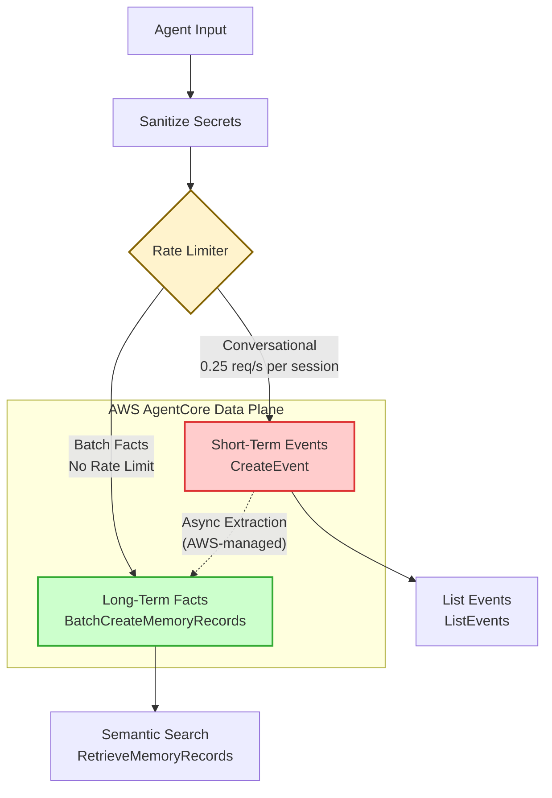
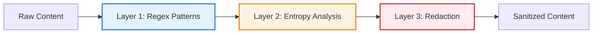

# AWS Bedrock AgentCore Memory Integration Plan

**Status**: Phase 1 Complete (Integration Tested)
**Branch**: `feature/agentcore-memory-integration`
**Author**: Claude Code
**Date**: 2025-12-04
**Last Revised**: 2025-12-07 (Third review: Real AWS integration testing, API corrections)

---

> [!CAUTION]
> ## CRITICAL ARCHITECTURE WARNINGS
>
> **Before implementing, understand these hard constraints:**
>
> 1. **Do NOT use `boto3` directly** - You MUST use `aiobotocore`. Boto3 is synchronous and will block the MCP server event loop under load.
>
> 2. **Respect the Rate Limit** - `CreateEvent` is hard-limited to **0.25 req/sec** per actor+session pair. Do NOT use this for logging every conversation turn. Use `BatchCreateMemoryRecords` for facts.
>
> 3. **Control vs Data Plane** - `CreateMemory` uses a DIFFERENT endpoint (`bedrock-agentcore-control`) than runtime operations (`bedrock-agentcore`). PrivateLink only covers the data plane.

---

## Critical Corrections (from External Reviews)

> **This section documents critical issues identified during external review that fundamentally change the implementation approach.**

### First Review - Hard Blockers

| Issue | Impact | Resolution |
|-------|--------|------------|
| **Rate limits wrong** | CreateEvent is 0.25 req/sec per actor+session (not 100 TPS). "Store every turn" will throttle immediately. | Store coarse-grained events only; use BatchCreateMemoryRecords for facts |
| **Control vs Data plane** | CreateMemory is control plane (`bedrock-agentcore-control`), events are data plane (`bedrock-agentcore`). PrivateLink doesn't cover control plane. | Use separate clients; accept control plane uses public endpoint |
| **API shapes wrong** | Response paths, payload formats, method signatures don't match actual AWS APIs | Rewrite client to match [actual API docs](https://docs.aws.amazon.com/bedrock-agentcore/latest/APIReference/) |
| **async + boto3 = blocking** | boto3 is synchronous; will stall MCP server under load | Use aiobotocore/aioboto3 or run in threadpool |

### Second Review - Implementation Fixes

| Issue | Impact | Resolution |
|-------|--------|------------|
| **CreateEvent payload shape** | Code will 400 - branchName (string) vs branch (struct), payload as dict vs list of unions | Fixed: `branch={"name": ...}`, `payload=[{"conversational": {...}}]`, datetime for timestamp |
| **RetrieveMemoryRecords query optional** | API requires searchQuery; empty query will fail | Fixed: query parameter is now required; added separate `list_memory_records()` |
| **Rate limiter not keyed by session** | 50 TPS global limiter doesn't match 0.25/s per actor+session | Fixed: `PerSessionRateLimiter` keyed by `(actor_id, session_id)` |
| **Restore uses CreateEvent** | Would take forever due to 0.25/s rate limit | Fixed: Use `BatchCreateMemoryRecords` for restore |
| **Tests mock boto3** | Implementation uses aiobotocore; tests give false confidence | Fixed: Mock `_get_data_plane_client` context manager with AsyncMock |
| **CloudTrail DataResources** | Not supported for most services; will fail or give false coverage | Fixed: Use management events filtering + Athena/Insights queries |
| **Async queue race** | Multiple `_process_queue()` tasks could spawn | Fixed: Added lock around `_running` check-and-set |
| **Sanitize patterns incomplete** | Missing AWS access keys, GitHub tokens | Fixed: Added AKIA pattern, gh[pousr]_ pattern, high-entropy detection |

### Third Review - Real AWS Integration Testing (2025-12-07)

| Issue | Impact | Resolution |
|-------|--------|------------|
| **BatchCreateMemoryRecords param name** | API expects `records`, not `memoryRecords` | Fixed: Changed parameter name |
| **BatchCreateMemoryRecords record structure** | API requires `requestIdentifier`, `namespaces` (list), `timestamp` | Fixed: Added all required fields |
| **BatchCreateMemoryRecords response shape** | API returns `successfulRecords`/`failedRecords`, not `memoryRecords`/`errors` | Fixed: Updated response parsing |
| **RetrieveMemoryRecords searchCriteria** | API uses `searchQuery` (string), not `semanticQuery` (struct) | Fixed: Changed to simple string |
| **Memory ID format** | Full name becomes ID (e.g., `template_repo_memory-xxxxx`) | Documented |
| **eventExpiryDuration units** | Value is in DAYS (max 365), not ISO 8601 duration | Fixed in setup script |
| **Memory name constraints** | Must match `[a-zA-Z][a-zA-Z0-9_]{0,47}` (no dashes!) | Fixed in setup script |

### Design Changes Required

| Original Design | Corrected Design |
|-----------------|------------------|
| `store_event` for every conversation turn | Store only: session goals, key decisions, periodic summaries, outcomes |
| `store_fact` via CreateEvent + extraction flag | Use `BatchCreateMemoryRecords` directly for explicit long-term storage |
| 100 TPS assumption | 0.25 req/sec per actor+session for conversational payloads |
| "100 MB = $0.50" storage | Priced per record/day, not per MB |
| PrivateLink for everything | PrivateLink only covers data plane; requires VPC (not magic for home servers) |

### References for Corrections

- [AgentCore Quotas](https://docs.aws.amazon.com/bedrock-agentcore/latest/devguide/bedrock-agentcore-limits.html) - 0.25 req/sec limit
- [BatchCreateMemoryRecords API](https://docs.aws.amazon.com/bedrock-agentcore/latest/APIReference/API_BatchCreateMemoryRecords.html) - Direct long-term writes
- [CreateEvent API](https://docs.aws.amazon.com/bedrock-agentcore/latest/APIReference/API_CreateEvent.html) - Correct response shape
- [Control Plane API](https://docs.aws.amazon.com/bedrock-agentcore-control/latest/APIReference/API_CreateMemory.html) - CreateMemory endpoint
- [AgentCore Pricing](https://aws.amazon.com/bedrock/agentcore/pricing/) - Per-record pricing model

---

## Executive Summary

This document outlines the integration of AWS Bedrock AgentCore Memory into our AI agent ecosystem. The integration provides persistent short-term and long-term memory capabilities for our agents (Claude Code, Gemini, OpenCode, Crush, Codex).

**Key architectural constraint**: Due to rate limits (0.25 req/sec per actor+session), this is NOT a "log everything" system. It's for **sparse, high-value events** and **explicit fact storage**.

### Goals

1. **Cross-session memory**: Agents remember context across sessions
2. **Shared knowledge**: Multiple agents share learned patterns about the codebase
3. **Semantic search**: Find relevant past context via natural language queries
4. **Enterprise-ready**: AWS-backed solution with established security model

### Non-Goals

- Replacing GitHub Board for work coordination
- Migrating agent execution to AWS (agents remain self-hosted)
- Automatic context injection (explicit memory calls only)
- **Logging every conversation turn** (rate limit constraint)

---

## Architecture Overview

### Current State

```
┌─────────────────────────────────────────────────────────────────┐
│                 CURRENT AGENT ARCHITECTURE                       │
│                                                                  │
│  ┌──────────────┐  ┌──────────────┐  ┌──────────────┐           │
│  │ Claude Code  │  │   Gemini     │  │  OpenCode    │           │
│  │ (Max Plan)   │  │   (API)      │  │  (OpenRouter)│           │
│  └──────┬───────┘  └──────┬───────┘  └──────┬───────┘           │
│         │                 │                 │                    │
│         └─────────────────┼─────────────────┘                    │
│                           │                                      │
│                           ▼                                      │
│  ┌─────────────────────────────────────────────────────────────┐│
│  │                    MCP Servers                               ││
│  │  code-quality │ content-creation │ gemini │ github-board    ││
│  └─────────────────────────────────────────────────────────────┘│
│                                                                  │
│  Problem: Agents are STATELESS - no memory across sessions      │
└─────────────────────────────────────────────────────────────────┘
```

### Proposed State

```
┌─────────────────────────────────────────────────────────────────┐
│              SELF-HOSTED INFRASTRUCTURE                          │
│                                                                  │
│  ┌──────────────┐  ┌──────────────┐  ┌──────────────┐           │
│  │ Claude Code  │  │   Gemini     │  │  OpenCode    │           │
│  │ (Max Plan)   │  │   (API)      │  │  (OpenRouter)│           │
│  └──────┬───────┘  └──────┬───────┘  └──────┬───────┘           │
│         │                 │                 │                    │
│         └─────────────────┼─────────────────┘                    │
│                           │                                      │
│                           ▼                                      │
│  ┌─────────────────────────────────────────────────────────────┐│
│  │              mcp-agentcore-memory (MCP Server)               ││
│  │  ┌─────────────────────────────────────────────────────────┐││
│  │  │  aiobotocore clients (truly async)                      │││
│  │  │  ├─ Control Plane: bedrock-agentcore-control            │││
│  │  │  │   (CreateMemory - setup only, public endpoint)       │││
│  │  │  └─ Data Plane: bedrock-agentcore                       │││
│  │  │      (CreateEvent, RetrieveMemoryRecords, Batch...)     │││
│  │  └─────────────────────────────────────────────────────────┘││
│  └───────────────────────────────────┬─────────────────────────┘│
└──────────────────────────────────────┼───────────────────────────┘
                                       │
           HTTPS/TLS (public endpoint unless in VPC)
                                       │
                                       ▼
┌─────────────────────────────────────────────────────────────────┐
│                    AWS BEDROCK AGENTCORE                         │
│                                                                  │
│  Control Plane (Public)        │  Data Plane (PrivateLink OK)   │
│  bedrock-agentcore-control     │  bedrock-agentcore             │
│  ├─ CreateMemory (setup)       │  ├─ CreateEvent (sparse!)      │
│  ├─ UpdateMemory               │  ├─ ListEvents                 │
│  └─ DeleteMemory               │  ├─ RetrieveMemoryRecords      │
│                                │  └─ BatchCreateMemoryRecords   │
│  ┌─────────────────────────────────────────────────────────────┐│
│  │                  AgentCore Memory                            ││
│  │                                                              ││
│  │  Short-term (CreateEvent)   │  Long-term (BatchCreate...)   ││
│  │  ├─ Session goals           │  ├─ Explicit facts            ││
│  │  ├─ Key decisions           │  ├─ Codebase patterns         ││
│  │  ├─ Periodic summaries      │  ├─ User preferences          ││
│  │  └─ Final outcomes          │  └─ Architecture decisions    ││
│  │                             │                                ││
│  │  RATE LIMIT: 0.25 req/sec   │  No conversational throttle   ││
│  │  per actor+session!         │                                ││
│  └─────────────────────────────────────────────────────────────┘│
└─────────────────────────────────────────────────────────────────┘
```

**Important**: VPC PrivateLink only works if your MCP server runs inside an AWS VPC (or connected via Direct Connect/VPN). Home servers hit the public regional endpoint over TLS.

### Memory Lifecycle Flow

The following diagram shows how data flows through the memory system, highlighting the critical rate limit vs. no-limit paths:



**Key Points:**
- **Red path (Short-Term)**: Rate-limited to 0.25 req/sec - use sparingly for session goals, decisions, outcomes
- **Green path (Long-Term)**: No conversational rate limit - preferred for explicit fact storage
- **Async Extraction**: AWS automatically extracts long-term facts from short-term events (if enabled)

---

## Component Design

### 1. MCP Server: `mcp_agentcore_memory`

**Location**: `tools/mcp/mcp_agentcore_memory/`

**Purpose**: Bridge between local MCP ecosystem and AWS AgentCore Memory API

#### Directory Structure

```
tools/mcp/mcp_agentcore_memory/
├── mcp_agentcore_memory/
│   ├── __init__.py
│   ├── server.py              # Main MCP server (provider-agnostic)
│   ├── memory_client.py       # AWS AgentCore client (aiobotocore)
│   ├── control_plane_client.py # AWS setup client (boto3, sync)
│   ├── cache.py               # Local cache for frequent queries
│   ├── namespaces.py          # Predefined namespace constants
│   └── providers/             # Provider abstraction layer
│       ├── __init__.py
│       ├── interface.py       # Abstract MemoryProvider interface
│       ├── factory.py         # Provider factory (env-based selection)
│       ├── agentcore.py       # AWS AgentCore provider
│       └── chromadb_provider.py  # ChromaDB provider (self-hosted)
├── scripts/
│   ├── test_server.py         # Integration tests
│   └── setup_memory.py        # One-time AWS memory instance setup
├── docs/
│   └── README.md              # Server documentation
├── tests/
│   ├── test_server.py
│   ├── test_providers.py      # Provider-specific tests
│   └── conftest.py
├── docker-compose.memory.yml  # Self-hosted stack (ChromaDB)
└── pyproject.toml
```

#### Dependencies (pyproject.toml)

> **Critical**: Use `aiobotocore` for async operations, not `boto3`.

```toml
[project]
name = "mcp_agentcore_memory"
version = "0.3.0"
description = "Multi-provider memory for AI agents"
dependencies = [
    "mcp-core",
    # Data validation
    "pydantic>=2.0.0",
]

[project.optional-dependencies]
# AWS AgentCore provider
agentcore = [
    "aiobotocore>=2.13.0",
    "aioboto3>=13.0.0",
    "types-aiobotocore[bedrock-agentcore]>=2.13.0",
    "boto3>=1.34.0",  # For setup scripts only
]

# ChromaDB provider (self-hosted)
chromadb = [
    "chromadb>=0.4.0",
]

# All providers
all = [
    "mcp_agentcore_memory[agentcore,chromadb]",
]

# Development
dev = [
    "pytest>=7.0.0",
    "pytest-asyncio>=0.21.0",
    "moto[all]>=5.0.0",  # AWS mocking
]
```

**Install by provider:**
```bash
# Just ChromaDB (lightweight, no AWS)
pip install "mcp_agentcore_memory[chromadb]"

# AWS AgentCore only
pip install "mcp_agentcore_memory[agentcore]"

# All providers
pip install "mcp_agentcore_memory[all]"
```

**Why aiobotocore (for AWS)?**
- boto3 is synchronous - calling it from `async def` blocks the event loop
- aiobotocore provides truly async AWS clients
- Under load, boto3 would stall your entire MCP server

#### MCP Tools Specification

| Tool Name | Description | Parameters |
|-----------|-------------|------------|
| `store_event` | Store a short-term memory event | `content`, `actor_id`, `session_id`, `event_type`, `namespace` |
| `recall_events` | List events from a session | `actor_id`, `session_id`, `limit`, `namespace` |
| `search_memories` | Semantic search across long-term memories | `query`, `namespace`, `top_k`, `min_relevance` |
| `store_facts` | Explicitly store long-term facts (batch) | `facts[]`, `namespace`, `source`, `agent` |
| `get_preferences` | Retrieve user/project preferences | `actor_id`, `namespace` |
| `update_preference` | Update a preference | `actor_id`, `key`, `value`, `namespace` |
| `memory_status` | Get memory usage statistics | - |
| `clear_session` | Clear short-term memory for a session | `actor_id`, `session_id` |

#### Namespace Design

```python
# namespaces.py
class MemoryNamespace:
    """Predefined namespaces for organizing memories."""

    # Codebase knowledge
    ARCHITECTURE = "codebase/architecture"
    PATTERNS = "codebase/patterns"
    CONVENTIONS = "codebase/conventions"
    DEPENDENCIES = "codebase/dependencies"

    # Review context
    PR_REVIEWS = "reviews/pr"
    ISSUE_CONTEXT = "reviews/issues"

    # User preferences
    USER_PREFS = "preferences/user"
    PROJECT_PREFS = "preferences/project"

    # Agent-specific
    CLAUDE_LEARNINGS = "agents/claude"
    GEMINI_LEARNINGS = "agents/gemini"

    # Cross-cutting
    SECURITY_PATTERNS = "security/patterns"
    TESTING_PATTERNS = "testing/patterns"
```

### 2. Memory Client Wrapper (Corrected)

> **Critical**: Uses `aiobotocore` for truly async operations. boto3 is synchronous and would block the MCP server event loop.

```python
# memory_client.py
from dataclasses import dataclass
from typing import Optional, List
from datetime import datetime
import uuid
from contextlib import asynccontextmanager

from aiobotocore.session import get_session
from botocore.config import Config

@dataclass
class MemoryConfig:
    """Configuration for AgentCore Memory client."""
    memory_id: str
    region: str = "us-east-1"
    data_plane_endpoint: Optional[str] = None  # For VPC PrivateLink (data plane only)
    max_retries: int = 3
    timeout: int = 30


class AgentCoreMemoryClient:
    """
    Async wrapper for AWS AgentCore Memory API.

    Uses aiobotocore for non-blocking operations.
    Separates control plane (setup) from data plane (runtime) clients.
    """

    def __init__(self, config: MemoryConfig):
        self.config = config
        self._session = get_session()
        self._boto_config = Config(
            retries={"max_attempts": config.max_retries},
            connect_timeout=config.timeout,
            read_timeout=config.timeout,
        )

    @asynccontextmanager
    async def _get_data_plane_client(self):
        """Get async data plane client (bedrock-agentcore)."""
        async with self._session.create_client(
            "bedrock-agentcore",
            region_name=self.config.region,
            endpoint_url=self.config.data_plane_endpoint,
            config=self._boto_config,
        ) as client:
            yield client

    async def create_event(
        self,
        actor_id: str,
        session_id: str,
        content: str,
        role: str = "USER",  # "USER" or "ASSISTANT" per API docs
        branch_name: str = "main",
    ) -> dict:
        """
        Store a short-term memory event.

        IMPORTANT: Rate limited to 0.25 req/sec per actor+session!
        Only use for sparse, high-value events.

        See: https://docs.aws.amazon.com/bedrock-agentcore/latest/APIReference/API_CreateEvent.html
        See: https://device.report/m/e402a9f0e199ce343dd71b93ecb3824b35b7550179a9e9d8575d5644f30a86f0.pdf
        """
        from datetime import datetime, timezone

        # Generate idempotency token for safe retries
        client_token = str(uuid.uuid4())

        async with self._get_data_plane_client() as client:
            response = await client.create_event(
                memoryId=self.config.memory_id,
                actorId=actor_id,
                sessionId=session_id,
                branch={"name": branch_name},
                eventTimestamp=datetime.now(timezone.utc),
                payload=[
                    {
                        "conversational": {
                            "content": {"text": content},
                            "role": role,  # "USER" or "ASSISTANT"
                        }
                    }
                ],
                clientToken=client_token,
            )
            # Response shape: {"event": {"eventId": "...", ...}}
            return {
                "event_id": response["event"]["eventId"],
                "actor_id": actor_id,
                "session_id": session_id,
            }

    async def list_events(
        self,
        actor_id: str,
        session_id: str,
        limit: int = 100,
    ) -> List[dict]:
        """Retrieve events from a session with pagination."""
        events = []
        next_token = None

        async with self._get_data_plane_client() as client:
            while True:
                params = {
                    "memoryId": self.config.memory_id,
                    "actorId": actor_id,
                    "sessionId": session_id,
                    "maxResults": min(limit - len(events), 100),
                }
                if next_token:
                    params["nextToken"] = next_token

                response = await client.list_events(**params)
                events.extend(response.get("events", []))

                next_token = response.get("nextToken")
                if not next_token or len(events) >= limit:
                    break

        return events[:limit]

    async def retrieve_memory_records(
        self,
        namespace: str,
        query: str,  # Required by AWS API
        top_k: int = 10,
    ) -> List[dict]:
        """
        Retrieve long-term memory records via semantic search.

        IMPORTANT: query is REQUIRED by the AWS API. Use list_memory_records()
        if you need to list records without a search query.

        See: https://docs.aws.amazon.com/bedrock-agentcore/latest/APIReference/API_RetrieveMemoryRecords.html
        See: https://boto3.amazonaws.com/v1/documentation/api/latest/reference/services/bedrock-agentcore/paginator/RetrieveMemoryRecords.html
        """
        if not query or not query.strip():
            raise ValueError(
                "query is required for retrieve_memory_records. "
                "Use list_memory_records() to list without searching."
            )

        async with self._get_data_plane_client() as client:
            response = await client.retrieve_memory_records(
                memoryId=self.config.memory_id,
                namespace=namespace,
                maxResults=top_k,
                # FIX (2025-12): API uses searchQuery (string), NOT semanticQuery (struct)
                searchCriteria={
                    "searchQuery": query,  # Simple string, not {"text": query}
                    "topK": top_k,
                },
            )

            # Response may use memoryRecordSummaries, not memoryRecords
            records = response.get("memoryRecordSummaries", [])
            return [
                {
                    "id": r.get("memoryRecordId"),
                    "content": r.get("content"),
                    "namespace": r.get("namespace"),
                    "relevance": r.get("relevanceScore"),
                    "created_at": r.get("createdAt"),
                }
                for r in records
            ]

    async def list_memory_records(
        self,
        namespace: str,
        limit: int = 100,
    ) -> List[dict]:
        """
        List memory records in a namespace WITHOUT semantic search.

        Use this for enumeration/backup. For search, use retrieve_memory_records().

        Note: This may use a different API endpoint (ListMemoryRecords).
        """
        async with self._get_data_plane_client() as client:
            records = []
            next_token = None

            while len(records) < limit:
                params = {
                    "memoryId": self.config.memory_id,
                    "namespace": namespace,
                    "maxResults": min(limit - len(records), 100),
                }
                if next_token:
                    params["nextToken"] = next_token

                response = await client.list_memory_records(**params)
                records.extend(response.get("memoryRecords", []))

                next_token = response.get("nextToken")
                if not next_token:
                    break

            return [
                {
                    "id": r.get("memoryRecordId"),
                    "content": r.get("content"),
                    "namespace": r.get("namespace"),
                    "created_at": r.get("createdAt"),
                }
                for r in records[:limit]
            ]

    async def batch_create_memory_records(
        self,
        records: List[dict],
        namespace: str,
    ) -> dict:
        """
        Directly create long-term memory records (bypasses short-term extraction).

        This is the preferred method for explicit fact storage.
        See: https://docs.aws.amazon.com/bedrock-agentcore/latest/APIReference/API_BatchCreateMemoryRecords.html

        Args:
            records: List of {"content": str, "metadata": dict} objects
            namespace: Target namespace for all records

        IMPORTANT - Verified API shapes (2025-12):
        - Parameter is `records` (NOT `memoryRecords`)
        - Each record requires: requestIdentifier, namespaces (list), content, timestamp
        - Response uses `successfulRecords`/`failedRecords` (NOT `memoryRecords`/`errors`)
        """
        from datetime import datetime, timezone
        import uuid

        timestamp = datetime.now(timezone.utc)

        async with self._get_data_plane_client() as client:
            memory_records = [
                {
                    "requestIdentifier": str(uuid.uuid4()),
                    "namespaces": [namespace],
                    "content": {"text": r["content"]},
                    "timestamp": timestamp,
                }
                for r in records
            ]

            response = await client.batch_create_memory_records(
                memoryId=self.config.memory_id,
                records=memory_records,
            )

            return {
                "created": len(response.get("successfulRecords", [])),
                "failed": len(response.get("failedRecords", [])),
                "errors": response.get("failedRecords", []),
            }

    async def health_check(self) -> bool:
        """Check connectivity to AgentCore."""
        try:
            async with self._get_data_plane_client() as client:
                # Simple list with minimal results to verify connectivity
                await client.list_events(
                    memoryId=self.config.memory_id,
                    actorId="health-check",
                    sessionId="ping",
                    maxResults=1,
                )
                return True
        except Exception:
            return False
```

### 2b. Control Plane Client (Setup Only)

```python
# control_plane_client.py
"""
Control plane operations (CreateMemory, etc.) - used only for initial setup.

IMPORTANT: Control plane does NOT support PrivateLink.
Always uses public endpoint: bedrock-agentcore-control.<region>.amazonaws.com
"""

import boto3
from botocore.config import Config


class AgentCoreControlPlaneClient:
    """Synchronous client for control plane operations (setup scripts only)."""

    def __init__(self, region: str = "us-east-1"):
        self.client = boto3.client(
            "bedrock-agentcore-control",  # Note: different service name!
            region_name=region,
            config=Config(retries={"max_attempts": 3}),
        )

    def create_memory(
        self,
        name: str,
        description: str,
        strategies: list,
        event_expiry_days: int = 7,
        kms_key_id: Optional[str] = None,
    ) -> str:
        """
        Create a new memory instance.

        See: https://docs.aws.amazon.com/bedrock-agentcore-control/latest/APIReference/API_CreateMemory.html
        """
        params = {
            "name": name,
            "description": description,
            "memoryStrategies": strategies,
            "eventExpiryDuration": f"P{event_expiry_days}D",  # ISO 8601 duration
        }

        if kms_key_id:
            params["encryptionConfig"] = {"kmsKeyId": kms_key_id}

        response = self.client.create_memory(**params)
        return response["memoryId"]

    def get_memory(self, memory_id: str) -> dict:
        """Get memory instance details."""
        return self.client.get_memory(memoryId=memory_id)

    def delete_memory(self, memory_id: str) -> None:
        """Delete a memory instance."""
        self.client.delete_memory(memoryId=memory_id)
```

### 3. MCP Server Implementation (Corrected)

> **Critical changes from review**:
> - `store_event` is rate-limited (0.25 req/sec per actor+session) - warn users
> - `store_facts` uses `BatchCreateMemoryRecords` directly (not CreateEvent + extraction)
> - `search_memories` requires namespace parameter

```python
# server.py
import os
from datetime import datetime, timezone

from mcp_core import BaseMCPServer, tool
from .memory_client import AgentCoreMemoryClient, MemoryConfig
from .namespaces import MemoryNamespace


class AgentCoreMemoryServer(BaseMCPServer):
    """
    MCP Server for AWS AgentCore Memory integration.

    IMPORTANT RATE LIMITS:
    - CreateEvent: 0.25 req/sec per (actor_id, session_id) pair
    - Use store_event SPARINGLY (session goals, key decisions, outcomes)
    - Use store_facts for explicit long-term storage (no rate limit issues)
    """

    def __init__(self):
        super().__init__(
            name="agentcore-memory",
            version="0.2.0",  # Bumped for corrected API
            description="Persistent memory for AI agents via AWS AgentCore",
        )
        self.client = self._init_client()

    def _init_client(self) -> AgentCoreMemoryClient:
        config = MemoryConfig(
            memory_id=os.environ["AGENTCORE_MEMORY_ID"],
            region=os.environ.get("AWS_REGION", "us-east-1"),
            data_plane_endpoint=os.environ.get("AGENTCORE_DATA_PLANE_ENDPOINT"),
        )
        return AgentCoreMemoryClient(config)

    @tool(
        description="""Store a SHORT-TERM memory event.

        WARNING: Rate limited to 0.25 req/sec per actor+session!

        Use ONLY for sparse, high-value events:
        - Session start goals
        - Key decisions made
        - Periodic summaries (every N minutes)
        - Final outcomes

        Do NOT use for logging every conversation turn.""",
        parameters={
            "content": {"type": "string", "description": "Content to remember (keep concise)"},
            "actor_id": {
                "type": "string",
                "description": "Actor ID (e.g., 'repo:myrepo:agent:claude', 'repo:myrepo:user:alice')",
            },
            "session_id": {
                "type": "string",
                "description": "Session ID (<=100 chars, e.g., 'run-20251204-abc123')",
            },
        },
    )
    async def store_event(
        self,
        content: str,
        actor_id: str,
        session_id: str,
    ) -> dict:
        """
        Store a short-term memory event.

        Rate limited - use sparingly!
        """
        # Validate session_id length per API requirements
        if len(session_id) > 100:
            return {"success": False, "error": "session_id must be <= 100 characters"}

        result = await self.client.create_event(
            actor_id=actor_id,
            session_id=session_id,
            content=content,
        )
        return {
            "success": True,
            "event_id": result["event_id"],
            "warning": "Rate limited to 0.25 req/sec per actor+session",
        }

    @tool(
        description="Search long-term memories using semantic query",
        parameters={
            "query": {"type": "string", "description": "Natural language search query"},
            "namespace": {
                "type": "string",
                "description": "Namespace to search (REQUIRED). E.g., 'codebase/patterns'",
            },
            "top_k": {"type": "integer", "default": 5, "description": "Max results to return"},
        },
    )
    async def search_memories(
        self,
        query: str,
        namespace: str,  # Now required per actual API
        top_k: int = 5,
    ) -> dict:
        """Semantic search across long-term memories in a namespace."""
        results = await self.client.retrieve_memory_records(
            namespace=namespace,
            query=query,
            top_k=top_k,
        )
        return {
            "query": query,
            "namespace": namespace,
            "count": len(results),
            "memories": results,
        }

    @tool(
        description="""Store facts/patterns for LONG-TERM retention.

        Uses BatchCreateMemoryRecords - no rate limit issues!

        This is the PREFERRED method for explicit knowledge storage:
        - Codebase patterns discovered
        - Architecture decisions
        - User preferences learned
        - Security/testing patterns""",
        parameters={
            "facts": {
                "type": "array",
                "items": {"type": "string"},
                "description": "List of facts/patterns to store (can batch multiple)",
            },
            "namespace": {
                "type": "string",
                "description": "Target namespace (e.g., 'codebase/patterns', 'preferences/user')",
            },
            "source": {
                "type": "string",
                "description": "Source attribution (e.g., 'PR #123', 'claude-code session')",
            },
            "agent": {
                "type": "string",
                "description": "Agent that discovered this (e.g., 'claude-code', 'gemini')",
            },
        },
    )
    async def store_facts(
        self,
        facts: list[str],
        namespace: str,
        source: str = None,
        agent: str = None,
    ) -> dict:
        """
        Store facts directly to long-term memory.

        Uses BatchCreateMemoryRecords (bypasses short-term extraction).
        No rate limit concerns - this is the preferred method.
        """
        records = [
            {
                "content": fact,
                "metadata": {
                    "source": source,
                    "stored_by_agent": agent,
                    "stored_at": datetime.now(timezone.utc).isoformat(),
                },
            }
            for fact in facts
        ]

        result = await self.client.batch_create_memory_records(
            records=records,
            namespace=namespace,
        )

        return {
            "success": result["failed"] == 0,
            "created": result["created"],
            "failed": result["failed"],
            "errors": result["errors"] if result["failed"] > 0 else None,
        }

    @tool(
        description="List recent events from a session",
        parameters={
            "actor_id": {"type": "string", "description": "Actor ID"},
            "session_id": {"type": "string", "description": "Session ID"},
            "limit": {"type": "integer", "default": 20, "description": "Max events to return"},
        },
    )
    async def list_session_events(
        self,
        actor_id: str,
        session_id: str,
        limit: int = 20,
    ) -> dict:
        """List events from a specific session."""
        events = await self.client.list_events(
            actor_id=actor_id,
            session_id=session_id,
            limit=limit,
        )
        return {
            "actor_id": actor_id,
            "session_id": session_id,
            "count": len(events),
            "events": events,
        }

    @tool(description="Check memory service connectivity and status")
    async def memory_status(self) -> dict:
        """Get memory service status."""
        healthy = await self.client.health_check()
        return {
            "status": "connected" if healthy else "disconnected",
            "memory_id": self.client.config.memory_id,
            "region": self.client.config.region,
            "endpoint": self.client.config.data_plane_endpoint or "public",
            "rate_limit_warning": "CreateEvent: 0.25 req/sec per actor+session",
        }
```

---

## AWS Infrastructure Setup

### 1. Prerequisites

- AWS Account with Bedrock AgentCore access
- IAM permissions for AgentCore Memory operations
- (Optional) VPC with Direct Connect or Site-to-Site VPN for PrivateLink

### 2. IAM Policies (Split Roles - Recommended)

> **Best Practice**: Separate bootstrap (setup) role from runtime role.

> **IMPORTANT - Verify IAM Action Names**: The examples below use `bedrock-agentcore:*` for
> both control-plane and data-plane actions. However, AWS sometimes uses different IAM
> prefixes for different service endpoints. **Before deploying to production:**
> 1. Check the [AWS Service Authorization Reference](https://docs.aws.amazon.com/service-authorization/latest/reference/list_amazonbedrockagentcore.html)
> 2. Verify actual action names in AWS IAM Policy Simulator
> 3. The control-plane client (`bedrock-agentcore-control`) may require different IAM actions
> 4. Test with minimal permissions first, then expand as needed

#### Bootstrap Role (setup_memory.py only)

```json
{
    "Version": "2012-10-17",
    "Statement": [
        {
            "Sid": "AgentCoreControlPlane",
            "Effect": "Allow",
            "Action": [
                "bedrock-agentcore:CreateMemory",
                "bedrock-agentcore:GetMemory",
                "bedrock-agentcore:UpdateMemory",
                "bedrock-agentcore:DeleteMemory"
            ],
            "Resource": [
                "arn:aws:bedrock-agentcore:*:*:memory/*"
            ],
            "Condition": {
                "comment": "Verify these action names against AWS docs before deployment"
            }
        }
    ]
}
```

#### Runtime Role (MCP server)

```json
{
    "Version": "2012-10-17",
    "Statement": [
        {
            "Sid": "AgentCoreDataPlaneRead",
            "Effect": "Allow",
            "Action": [
                "bedrock-agentcore:ListEvents",
                "bedrock-agentcore:GetMemoryRecord",
                "bedrock-agentcore:ListMemoryRecords",
                "bedrock-agentcore:RetrieveMemoryRecords"
            ],
            "Resource": [
                "arn:aws:bedrock-agentcore:us-east-1:ACCOUNT_ID:memory/MEMORY_ID"
            ]
        },
        {
            "Sid": "AgentCoreDataPlaneWrite",
            "Effect": "Allow",
            "Action": [
                "bedrock-agentcore:CreateEvent",
                "bedrock-agentcore:BatchCreateMemoryRecords"
            ],
            "Resource": [
                "arn:aws:bedrock-agentcore:us-east-1:ACCOUNT_ID:memory/MEMORY_ID"
            ]
        }
    ]
}
```

**Note**: Replace `ACCOUNT_ID` and `MEMORY_ID` with actual values after setup.

### 3. Memory Instance Setup (Corrected)

> **Critical**: CreateMemory is a CONTROL PLANE operation.
> Uses `bedrock-agentcore-control` client, not `bedrock-agentcore`.

```python
# scripts/setup_memory.py
"""
One-time setup script for AgentCore Memory instance.

IMPORTANT:
- This script uses the CONTROL PLANE client (bedrock-agentcore-control)
- Control plane does NOT support PrivateLink - uses public endpoint
- Run this once, then use the memory_id for runtime operations

See: https://docs.aws.amazon.com/bedrock-agentcore-control/latest/APIReference/API_CreateMemory.html
"""

import boto3
from botocore.config import Config


def create_memory_instance(
    name: str = "template-repo-agent-memory",
    region: str = "us-east-1",
    event_expiry_days: int = 7,
    kms_key_id: str = None,
) -> str:
    """
    Create a new AgentCore Memory instance.

    Returns the memory_id for use in runtime configuration.
    """
    # IMPORTANT: Use control plane client, not data plane!
    client = boto3.client(
        "bedrock-agentcore-control",  # Control plane service
        region_name=region,
        config=Config(retries={"max_attempts": 3}),
    )

    # Build memory strategies
    # See: https://docs.aws.amazon.com/bedrock-agentcore-control/latest/APIReference/API_CreateMemory.html
    memory_strategies = [
        {
            # Built-in semantic extraction strategy
            "semanticMemoryStrategy": {
                "model": "anthropic.claude-3-haiku-20240307",
                "namespaces": [
                    "codebase/patterns",
                    "codebase/architecture",
                    "preferences/user",
                ],
            }
        },
    ]

    params = {
        "name": name,
        "description": "Shared memory for AI agents in template-repo",
        "memoryStrategies": memory_strategies,
        # ISO 8601 duration format
        "eventExpiryDuration": f"P{event_expiry_days}D",
        "tags": {
            "Project": "template-repo",
            "Purpose": "ai-agent-memory",
            "ManagedBy": "setup_memory.py",
        },
    }

    # Optional: Use custom KMS key
    if kms_key_id:
        params["encryptionConfig"] = {"kmsKeyId": kms_key_id}

    print(f"Creating memory instance '{name}' in {region}...")
    response = client.create_memory(**params)

    memory_id = response["memoryId"]
    print(f"Memory created successfully!")
    print(f"Memory ID: {memory_id}")

    return memory_id


def get_memory_info(memory_id: str, region: str = "us-east-1") -> dict:
    """Get details about an existing memory instance."""
    client = boto3.client("bedrock-agentcore-control", region_name=region)
    return client.get_memory(memoryId=memory_id)


if __name__ == "__main__":
    import argparse

    parser = argparse.ArgumentParser(description="Setup AgentCore Memory instance")
    parser.add_argument("--name", default="template-repo-agent-memory")
    parser.add_argument("--region", default="us-east-1")
    parser.add_argument("--expiry-days", type=int, default=7)
    parser.add_argument("--kms-key-id", default=None)
    args = parser.parse_args()

    memory_id = create_memory_instance(
        name=args.name,
        region=args.region,
        event_expiry_days=args.expiry_days,
        kms_key_id=args.kms_key_id,
    )

    print(f"\n{'='*60}")
    print("Next steps:")
    print("1. Add to your environment or .env file:")
    print(f"   export AGENTCORE_MEMORY_ID={memory_id}")
    print(f"   export AWS_REGION={args.region}")
    print()
    print("2. Update IAM runtime role with the memory ARN:")
    print(f"   arn:aws:bedrock-agentcore:{args.region}:ACCOUNT_ID:memory/{memory_id}")
    print("="*60)
```

### 4. VPC PrivateLink Setup (Optional but Recommended)

```bash
# Create VPC endpoint for AgentCore
aws ec2 create-vpc-endpoint \
    --vpc-id vpc-xxxxxxxxx \
    --service-name com.amazonaws.us-east-1.bedrock-agentcore \
    --vpc-endpoint-type Interface \
    --subnet-ids subnet-xxxxxxxx subnet-yyyyyyyy \
    --security-group-ids sg-xxxxxxxxx \
    --private-dns-enabled
```

---

## Integration Points

### 1. Claude Code Integration

**Configuration** (`.mcp.json`):

```json
{
  "mcpServers": {
    "agentcore-memory": {
      "command": "docker-compose",
      "args": [
        "-f", "./docker-compose.yml",
        "--profile", "services",
        "run", "--rm", "-T",
        "mcp-agentcore-memory",
        "python", "-m", "mcp_agentcore_memory.server",
        "--mode", "stdio"
      ],
      "env": {
        "AWS_PROFILE": "${AWS_PROFILE}",
        "AGENTCORE_MEMORY_ID": "${AGENTCORE_MEMORY_ID}",
        "AWS_REGION": "us-east-1"
      }
    }
  }
}
```

**Usage Patterns**:

```markdown
# Starting a new session - recall relevant context
"Search my memories for patterns related to authentication in this codebase"

# After learning something - store it
"Store this fact: The API uses JWT tokens with 15-minute expiry and refresh tokens in httpOnly cookies"

# During PR review - remember context
"Store event: PR #47 changes the authentication flow to support OAuth2"

# Cross-session recall
"What did I learn about the testing patterns in this repo?"
```

### 2. GitHub Agents Integration

**Issue Monitor Enhancement**:

```python
# monitors/issue.py - Enhanced with memory
class IssueMonitor:
    async def process_issue(self, issue: Issue):
        # NEW: Recall relevant context before processing
        memory_context = await self.memory_client.search_memories(
            query=f"Past implementations similar to: {issue.title}",
            namespace=MemoryNamespace.PATTERNS,
            top_k=3,
        )

        # Existing: Claim and process
        await self.board.claim_work(issue.number, agent_name, session_id)

        # Pass memory context to agent
        context["memory_context"] = memory_context
        result = await agent.generate_code(context)

        # NEW: Store learnings from implementation
        if result.success:
            await self.memory_client.store_facts(
                facts=[f"Issue #{issue.number}: {result.summary}"],
                namespace=MemoryNamespace.PATTERNS,
                source=f"issue-{issue.number}",
            )
```

**PR Monitor Enhancement**:

```python
# monitors/pr.py - Enhanced with memory
class PRMonitor:
    async def process_review_comment(self, pr: PR, comment: Comment):
        # NEW: Store review feedback for learning
        await self.memory_client.store_event(
            actor_id=f"pr-{pr.number}",
            session_id=f"review-{pr.head_sha}",
            content=comment.body,
            event_type="review_feedback",
            namespace=MemoryNamespace.PR_REVIEWS,
        )

        # Recall patterns from past similar reviews
        similar_feedback = await self.memory_client.search_memories(
            query=comment.body,
            namespace=MemoryNamespace.PR_REVIEWS,
            top_k=3,
        )

        # Use patterns to improve fix generation
        context["similar_past_feedback"] = similar_feedback
```

### 3. Gemini Code Review Integration

```python
# In Gemini review workflow
async def generate_review(self, pr_diff: str):
    # Recall codebase conventions
    conventions = await self.memory.search_memories(
        query="coding conventions and style guidelines",
        namespace=MemoryNamespace.CONVENTIONS,
    )

    # Include in review prompt
    review_prompt = f"""
    Review this PR diff considering these established conventions:
    {format_memories(conventions)}

    Diff:
    {pr_diff}
    """

    review = await self.gemini.review(review_prompt)

    # Store any new patterns identified
    if review.new_patterns:
        await self.memory.store_facts(
            facts=review.new_patterns,
            namespace=MemoryNamespace.PATTERNS,
            source="gemini-review",
        )
```

---

## Memory Strategies

### Automatic Extraction

AgentCore Memory can automatically extract long-term memories from short-term events using configured strategies:

| Strategy | What It Extracts | Use Case |
|----------|-----------------|----------|
| **Semantic** | Facts, entities, relationships | Codebase knowledge |
| **Summarization** | Conversation summaries | Session context |
| **User Preference** | Expressed preferences | Coding style, tool choices |

### Manual Extraction

For high-confidence learnings, agents can explicitly store facts:

```python
# After a successful refactoring
await memory.store_facts(
    facts=["The data layer uses Repository pattern with async SQLAlchemy"],
    namespace="codebase/architecture",
    source="PR #42 - Data layer refactoring",
    agent="claude-code",
)
```

---

## Testing Strategy (Corrected)

> **FIX**: Tests must mock aiobotocore async clients, NOT boto3.
> The implementation uses aiobotocore, so synchronous boto3 mocks won't work.

### Unit Tests

```python
# tests/test_memory_client.py
import pytest
from unittest.mock import AsyncMock, MagicMock, patch
from contextlib import asynccontextmanager

from mcp_agentcore_memory.memory_client import AgentCoreMemoryClient, MemoryConfig


class TestAgentCoreMemoryClient:
    """Unit tests with properly mocked aiobotocore async clients."""

    @pytest.fixture
    def config(self):
        return MemoryConfig(
            memory_id="test-memory-id",
            region="us-east-1",
        )

    @pytest.fixture
    def mock_async_client(self):
        """Create a mock that works with async context manager."""
        mock_client = AsyncMock()

        @asynccontextmanager
        async def mock_context():
            yield mock_client

        return mock_client, mock_context

    @pytest.mark.asyncio
    async def test_create_event(self, config, mock_async_client):
        """Test create_event with properly mocked aiobotocore."""
        mock_client, mock_context = mock_async_client

        mock_client.create_event.return_value = {
            "event": {"eventId": "evt-123", "sessionId": "test-session"}
        }

        client = AgentCoreMemoryClient(config)

        with patch.object(client, "_get_data_plane_client", mock_context):
            result = await client.create_event(
                actor_id="test-actor",
                session_id="test-session",
                content="Test memory content",
            )

        assert result["event_id"] == "evt-123"
        mock_client.create_event.assert_called_once()

        # Verify API shape
        call_kwargs = mock_client.create_event.call_args.kwargs
        assert "branch" in call_kwargs
        assert "payload" in call_kwargs
        assert isinstance(call_kwargs["payload"], list)

    @pytest.mark.asyncio
    async def test_retrieve_memory_records_requires_query(self, config, mock_async_client):
        """Test that retrieve_memory_records requires a query."""
        mock_client, mock_context = mock_async_client
        client = AgentCoreMemoryClient(config)

        # Should raise ValueError for empty query
        with pytest.raises(ValueError, match="query is required"):
            with patch.object(client, "_get_data_plane_client", mock_context):
                await client.retrieve_memory_records(
                    namespace="test/namespace",
                    query="",  # Empty query should fail
                )

    @pytest.mark.asyncio
    async def test_retrieve_memory_records_success(self, config, mock_async_client):
        """Test semantic search with valid query."""
        mock_client, mock_context = mock_async_client

        mock_client.retrieve_memory_records.return_value = {
            "memoryRecordSummaries": [
                {
                    "memoryRecordId": "rec-1",
                    "content": "Pattern A",
                    "namespace": "test/namespace",
                    "relevanceScore": 0.95,
                },
                {
                    "memoryRecordId": "rec-2",
                    "content": "Pattern B",
                    "namespace": "test/namespace",
                    "relevanceScore": 0.87,
                },
            ]
        }

        client = AgentCoreMemoryClient(config)

        with patch.object(client, "_get_data_plane_client", mock_context):
            results = await client.retrieve_memory_records(
                namespace="test/namespace",
                query="authentication patterns",  # Required!
                top_k=5,
            )

        assert len(results) == 2
        assert results[0]["relevance"] == 0.95
        assert results[0]["id"] == "rec-1"

    @pytest.mark.asyncio
    async def test_batch_create_memory_records(self, config, mock_async_client):
        """Test batch creation of long-term memory records."""
        mock_client, mock_context = mock_async_client

        mock_client.batch_create_memory_records.return_value = {
            "memoryRecords": [{"memoryRecordId": "rec-1"}, {"memoryRecordId": "rec-2"}],
            "errors": [],
        }

        client = AgentCoreMemoryClient(config)

        with patch.object(client, "_get_data_plane_client", mock_context):
            result = await client.batch_create_memory_records(
                records=[
                    {"content": "Fact 1", "metadata": {}},
                    {"content": "Fact 2", "metadata": {}},
                ],
                namespace="codebase/patterns",
            )

        assert result["created"] == 2
        assert result["failed"] == 0


# Alternative: Use dependency injection for easier testing
class TestWithDependencyInjection:
    """
    Alternative pattern: inject client factory for easier testing.

    This is cleaner than patching internal methods.
    """

    @pytest.mark.asyncio
    async def test_with_injected_client_factory(self):
        """Example of dependency-injection-based testing."""
        mock_client = AsyncMock()
        mock_client.create_event.return_value = {
            "event": {"eventId": "evt-456"}
        }

        # If AgentCoreMemoryClient accepted a client_factory parameter:
        # client = AgentCoreMemoryClient(config, client_factory=lambda: mock_client)
        # This would be cleaner than patching

        # For now, this serves as documentation of the preferred pattern
        pass
```

### Integration Tests

```python
# tests/test_integration.py
@pytest.mark.integration
@pytest.mark.skipif(
    not os.environ.get("AGENTCORE_MEMORY_ID"),
    reason="AgentCore Memory not configured",
)
class TestAgentCoreIntegration:
    async def test_roundtrip_memory(self):
        """Store and retrieve a memory."""
        client = AgentCoreMemoryClient(live_config)

        # Store
        await client.create_event(
            actor_id="integration-test",
            session_id="test-session",
            content="Integration test memory",
        )

        # Retrieve
        events = await client.list_events(
            actor_id="integration-test",
            session_id="test-session",
        )

        assert any("Integration test memory" in e["content"] for e in events)
```

---

## Rollout Plan

Track progress directly in this document. Items marked **CRITICAL** must be verified before proceeding to the next phase.

### Phase 1: Foundation

**Goal:** Establish core infrastructure and validate API integration

- [x] Create `mcp_agentcore_memory` package structure under `tools/mcp/`
- [x] Implement `AgentCoreMemoryClient` with `aiobotocore` (NOT boto3)
- [x] **CRITICAL:** Verify `CreateEvent` payload shape against [API docs](https://docs.aws.amazon.com/bedrock-agentcore/latest/APIReference/API_CreateEvent.html)
  - `branch` must be `{"name": "..."}` (struct), not string ✅
  - `payload` must be `[{"conversational": {...}}]` (list of unions) ✅
  - `eventTimestamp` must be datetime object ✅
- [x] Implement MCP server tools: `store_event`, `store_facts`, `search_memories`
- [x] **CRITICAL:** Implement `PerSessionRateLimiter` keyed by `(actor_id, session_id)` (with thundering herd fix)
- [x] Write unit tests with mocked `_get_data_plane_client` (AsyncMock) - 68 tests passing
- [x] Set up AWS IAM Bootstrap and Runtime roles (assume-role configuration)
- [x] **CRITICAL:** Real AWS integration testing - all 5 operations verified working
- [x] Add to `.mcp.json` configuration

### Phase 2: Claude Code Integration

**Goal:** Validate end-to-end flow with primary agent

- [x] Test Claude Code MCP integration via manual session
- [x] **CRITICAL:** Verify rate limiting works (ChromaDB has no limits by design; AgentCore enforces 0.25 req/sec)
- [x] Document usage patterns for common workflows
- [x] Create namespace conventions guide (`codebase/*`, `preferences/*`, etc.)
- [x] Add session management helpers (auto session ID generation)
- [x] Test `store_facts` with batch operations (verify no rate limit)

**Phase 2 Test Results (2025-12-07):**

*ChromaDB Provider (Self-hosted):*
- All operations working, semantic search functional (0.82 relevance scores)
- Namespaces: Predefined hierarchy (`codebase/*`, `reviews/*`, `preferences/*`, `agents/*`)
- Batch operations: `store_facts` successfully stored 4 records in single call
- Session events: Properly isolated by `(actor_id, session_id)` tuple

*AWS AgentCore Provider (Managed):*
- Successfully switched provider via `.mcp.json` configuration
- Memory ID: `template_repo_memory-s2E1OlFGBp` (us-east-1)
- `store_facts`: 2 records created in `codebase/conventions` namespace
- `search_memories`: Semantic search returning stored records
- `store_event`: Event created with ID `0000001765124753478#b5eb7ced`
- Actors registered: `claude-code`, `test:integration:claude`, `test_actor`
- Sessions created: `test-session-2025-12-07` for `claude-code` actor
- Rate limiting: Confirmed 0.25 req/sec per actor+session for CreateEvent
- AWS Console: Data confirmed via API (console UI may have display delay)

### Phase 3: GitHub Agents Integration

**Goal:** Enable memory for automated agents

- [x] Integrate with `IssueMonitor` agent
  - Store: issue context, implementation patterns learned
  - Retrieve: similar past issues, codebase conventions
- [x] Integrate with `PRMonitor` agent
  - Store: review feedback patterns, common issues
  - Retrieve: past reviews on similar code
- [x] Add memory-aware prompts to agent personas
- [ ] Update `qa-reviewer.md` and `tech-lead.md` personas with memory usage
- [x] Test cross-agent memory sharing (facts stored by one, retrieved by another)

**Phase 3 Implementation (2025-12-07):**
- Created `packages/github_agents/src/github_agents/memory/` module with:
  - `MemoryClient` - Docker-based MCP tool invocation
  - `MemoryIntegration` - High-level API for agents (context retrieval, pattern lookup)
- `BaseMonitor` now includes `self.memory` integration (graceful degradation if unavailable)
- **Read-only approach for automated agents:**
  - Agents retrieve patterns/conventions to enhance prompts
  - Agents do NOT automatically store every action (avoids noise)
  - Storage is available for deliberate use (e.g., Claude Code sessions)
- `IssueMonitor`: Retrieves similar issues + codebase patterns before implementation
- `PRMonitor`: Retrieves conventions + patterns before addressing review feedback
- Cross-agent sharing verified: facts stored deliberately are retrievable by all agents

### Phase 4: Production Hardening

**Goal:** Ensure reliability and observability

- [ ] Add CloudWatch metrics integration (operation latency, success rate)
- [ ] Configure CloudTrail logging with Athena queries
- [ ] **CRITICAL:** Verify sanitization catches all secret patterns (run test suite)
- [ ] Set up cost alerts at $5/month threshold
- [ ] Create runbook for memory management (backup, restore, cleanup)
- [ ] Performance testing under load
- [ ] (Optional) Add VPC PrivateLink setup if running in AWS VPC

---

## Cost Estimation (Corrected)

> **Important**: Pricing is per-record and per-operation, NOT per-MB storage.
> See: [AgentCore Pricing](https://aws.amazon.com/bedrock/agentcore/pricing/)

### Pricing Model

| Component | Pricing | Notes |
|-----------|---------|-------|
| **CreateEvent** | $0.25 / 1,000 events | Short-term memory |
| **Long-term records** | Per record/day (varies by strategy) | Built-in vs self-managed differs |
| **Retrieval** | Per retrieval operation | Semantic search queries |
| **Strategy overrides** | May incur model charges | If using custom extraction models |

### Expected Usage (Revised)

Given rate limits (0.25 req/sec), realistic usage is much lower than originally estimated:

| Component | Realistic Volume | Est. Monthly Cost |
|-----------|-----------------|-------------------|
| Short-term events | ~500/month (sparse) | $0.13 |
| Long-term records | ~200 records | ~$1.00 |
| Semantic search | ~1,000 queries | ~$0.50 |
| **Total** | | **~$1.50-2.00/month** |

### Cost Controls

1. **Use BatchCreateMemoryRecords for facts** (avoids CreateEvent rate limits)
2. **Namespace-scoped searches** (reduces retrieval scope)
3. **Event expiry duration** (7 days default, configurable)
4. **Monthly usage alerts** at $5 threshold
5. **Cache frequent queries** (reduces retrieval costs)

---

## Security Considerations

### Data Classification

| Data Type | Sensitivity | Storage Policy |
|-----------|-------------|----------------|
| Code patterns | Low | Long-term OK |
| PR discussions | Low-Medium | Short-term, summarized |
| User preferences | Low | Long-term OK |
| Secrets/credentials | **NEVER STORE** | Block at client level |

### Defense in Depth: Content Sanitization

The sanitization system uses three distinct layers to prevent secrets from being stored. Each layer catches different types of sensitive data:



#### Layer 1: Regex Patterns (Known Secret Formats)

Matches secrets with predictable structures like API keys with known prefixes:

```python
# Known secret patterns with recognizable formats
BLOCKED_PATTERNS = [
    # Generic secrets with common labels
    r"(api[_-]?key|secret|password|token)\s*[:=]\s*\S+",
    r"-----BEGIN.*PRIVATE KEY-----",

    # API keys with vendor-specific prefixes
    r"(sk-|pk_|rk_)[a-zA-Z0-9]{20,}",  # OpenAI, Stripe, etc.

    # AWS credentials
    r"AKIA[0-9A-Z]{16}",               # AWS Access Key ID (always starts with AKIA)
    r"[A-Za-z0-9/+=]{40}",             # AWS Secret Access Key (40 chars base64-like)

    # GitHub tokens
    r"gh[pousr]_[A-Za-z0-9_]{36,}",    # GitHub PAT (new format: ghp_, gho_, ghu_, ghs_, ghr_)
    r"github_pat_[A-Za-z0-9_]{22,}",   # GitHub Fine-grained PAT

    # Other common tokens
    r"xox[baprs]-[0-9a-zA-Z-]+",       # Slack tokens
    r"ya29\.[0-9A-Za-z_-]+",           # Google OAuth tokens
]
```

#### Layer 2: Entropy Analysis (Unknown High-Variance Strings)

Catches secrets that don't match known patterns by detecting unusually random strings:

```python
import math
from collections import Counter

def calculate_entropy(s: str) -> float:
    """Calculate Shannon entropy of a string (bits per character)."""
    if not s:
        return 0.0
    counts = Counter(s)
    length = len(s)
    return -sum((count/length) * math.log2(count/length) for count in counts.values())

def is_high_entropy_blob(s: str, threshold: float = 4.5, min_length: int = 20) -> bool:
    """
    Detect high-entropy strings that might be secrets.

    - threshold=4.5 bits/char catches most secrets while allowing normal text
    - min_length=20 avoids false positives on short words
    - Only checks base64/hex-like character sets
    """
    if len(s) < min_length:
        return False
    # Only check strings that look like potential secrets (base64-like or hex-like)
    if not re.match(r'^[A-Za-z0-9+/=_-]+$', s):
        return False
    return calculate_entropy(s) > threshold
```

#### Layer 3: Redaction (Replacement Strategy)

Applies consistent replacement markers that preserve context while removing sensitive data:

```python
def sanitize_content(content: str) -> str:
    """
    Remove potential secrets before storing.

    Applies all three layers in sequence:
    1. Known secret patterns -> [REDACTED]
    2. High-entropy blobs -> [HIGH_ENTROPY_REDACTED]
    """
    # Layer 1: Check known patterns
    for pattern in BLOCKED_PATTERNS:
        content = re.sub(pattern, "[REDACTED]", content, flags=re.IGNORECASE)

    # Layer 2 + 3: Check for high-entropy blobs and redact
    words = content.split()
    sanitized_words = []
    for word in words:
        # Strip punctuation for entropy check
        clean_word = re.sub(r'[^\w+/=-]', '', word)
        if is_high_entropy_blob(clean_word):
            sanitized_words.append("[HIGH_ENTROPY_REDACTED]")
        else:
            sanitized_words.append(word)

    return ' '.join(sanitized_words)
```

---

## Monitoring and Observability

*Added based on review feedback*

### CloudWatch Integration

```python
# memory_client.py - CloudWatch metrics
import boto3
from datetime import datetime

class MemoryMetrics:
    """CloudWatch metrics for memory operations."""

    def __init__(self, namespace: str = "AgentCoreMemory"):
        self.cloudwatch = boto3.client("cloudwatch")
        self.namespace = namespace

    def record_operation(
        self,
        operation: str,  # store_event, search_memories, etc.
        latency_ms: float,
        success: bool,
        namespace: str = "default",
    ):
        self.cloudwatch.put_metric_data(
            Namespace=self.namespace,
            MetricData=[
                {
                    "MetricName": f"{operation}_latency",
                    "Value": latency_ms,
                    "Unit": "Milliseconds",
                    "Dimensions": [{"Name": "Namespace", "Value": namespace}],
                },
                {
                    "MetricName": f"{operation}_count",
                    "Value": 1,
                    "Unit": "Count",
                    "Dimensions": [
                        {"Name": "Namespace", "Value": namespace},
                        {"Name": "Success", "Value": str(success)},
                    ],
                },
            ],
        )
```

### CloudTrail Logging (Corrected)

> **FIX**: CloudTrail `DataResources` support is limited to specific resource types
> (S3 objects, Lambda functions, DynamoDB tables, etc.). AgentCore Memory is likely
> NOT a supported DataResources type. Instead, use management events filtering.

Enable CloudTrail for AgentCore API calls:

```bash
# Enable CloudTrail for AgentCore - management events only
# (DataResources filtering is NOT available for most services)
aws cloudtrail create-trail \
    --name agentcore-memory-audit \
    --s3-bucket-name your-audit-bucket \
    --include-global-service-events

# Enable management events (this captures API calls)
aws cloudtrail put-event-selectors \
    --trail-name agentcore-memory-audit \
    --event-selectors '[{
        "ReadWriteType": "All",
        "IncludeManagementEvents": true
    }]'

# Start the trail
aws cloudtrail start-logging --name agentcore-memory-audit
```

**Query CloudTrail logs for AgentCore operations:**

```sql
-- Athena query to filter AgentCore events from CloudTrail logs
SELECT
    eventTime,
    eventName,
    userIdentity.arn as caller,
    requestParameters,
    responseElements,
    errorCode
FROM cloudtrail_logs
WHERE
    eventSource = 'bedrock-agentcore.amazonaws.com'
    OR eventSource = 'bedrock-agentcore-control.amazonaws.com'
ORDER BY eventTime DESC
LIMIT 100;
```

```bash
# Or use CloudWatch Logs Insights if logs are streamed there
aws logs start-query \
    --log-group-name "CloudTrail/logs" \
    --start-time $(date -d '1 hour ago' +%s) \
    --end-time $(date +%s) \
    --query-string 'fields @timestamp, eventName, userIdentity.arn
        | filter eventSource like /bedrock-agentcore/
        | sort @timestamp desc
        | limit 50'
```

### Alerting (Corrected)

> **Fix**: Use ExtendedStatistic for percentiles, not Statistic.

```yaml
# CloudWatch Alarms (CloudFormation - corrected syntax)
MemoryErrorAlarm:
  Type: AWS::CloudWatch::Alarm
  Properties:
    AlarmName: AgentCoreMemory-HighErrorRate
    MetricName: store_event_count
    Namespace: AgentCoreMemory
    Dimensions:
      - Name: Success
        Value: "False"
    Statistic: Sum
    Period: 300
    EvaluationPeriods: 2
    Threshold: 10
    ComparisonOperator: GreaterThanThreshold
    AlarmActions:
      - !Ref AlertSNSTopic  # Add your SNS topic

MemoryLatencyAlarm:
  Type: AWS::CloudWatch::Alarm
  Properties:
    AlarmName: AgentCoreMemory-HighLatency
    MetricName: search_memories_latency
    Namespace: AgentCoreMemory
    ExtendedStatistic: p95
    Period: 300
    EvaluationPeriods: 3
    Threshold: 2000  # 2 seconds
    ComparisonOperator: GreaterThanThreshold
    AlarmActions:
      - !Ref AlertSNSTopic

# Rate limit throttling alarm (new - critical for this design)
MemoryThrottleAlarm:
  Type: AWS::CloudWatch::Alarm
  Properties:
    AlarmName: AgentCoreMemory-Throttled
    MetricName: store_event_count
    Namespace: AgentCoreMemory
    Dimensions:
      - Name: ErrorType
        Value: "ThrottlingException"
    Statistic: Sum
    Period: 60
    EvaluationPeriods: 1
    Threshold: 1  # Any throttling is a problem
    ComparisonOperator: GreaterThanOrEqualToThreshold
    AlarmActions:
      - !Ref AlertSNSTopic
```

---

## Latency and Caching

*Added based on review feedback*

### Latency Considerations

Since agents are self-hosted and memory is cloud-based, network latency is a concern:

| Operation | Expected Latency | Mitigation |
|-----------|------------------|------------|
| `store_event` | 50-200ms | Fire-and-forget with retry queue |
| `search_memories` | 200-500ms | Local cache for frequent queries |
| `list_events` | 100-300ms | Session-scoped caching |

### Local Cache Implementation

```python
# cache.py - Local caching layer
from functools import lru_cache
from datetime import datetime, timedelta
from typing import Optional
import hashlib

class MemoryCache:
    """
    LRU cache for frequently accessed memories.

    Stores namespace alongside cache entries to enable proper invalidation.
    """

    def __init__(self, max_size: int = 1000, ttl_seconds: int = 300):
        self.max_size = max_size
        self.ttl = timedelta(seconds=ttl_seconds)
        self._cache: dict = {}  # key -> results
        self._timestamps: dict = {}  # key -> timestamp
        self._namespaces: dict = {}  # key -> namespace (for invalidation)

    def _make_key(self, query: str, namespace: str) -> str:
        return hashlib.md5(f"{query}:{namespace}".encode()).hexdigest()

    def get(self, query: str, namespace: str) -> Optional[list]:
        key = self._make_key(query, namespace)
        if key in self._cache:
            if datetime.now() - self._timestamps[key] < self.ttl:
                return self._cache[key]
            else:
                self._evict_key(key)
        return None

    def set(self, query: str, namespace: str, results: list):
        key = self._make_key(query, namespace)
        # Evict oldest if at capacity
        if len(self._cache) >= self.max_size:
            oldest_key = min(self._timestamps, key=self._timestamps.get)
            self._evict_key(oldest_key)
        self._cache[key] = results
        self._timestamps[key] = datetime.now()
        self._namespaces[key] = namespace  # Track namespace for invalidation

    def _evict_key(self, key: str):
        """Remove a key from all internal dicts."""
        self._cache.pop(key, None)
        self._timestamps.pop(key, None)
        self._namespaces.pop(key, None)

    def invalidate(self, namespace: Optional[str] = None):
        """Invalidate cache entries for a namespace."""
        if namespace is None:
            self._cache.clear()
            self._timestamps.clear()
            self._namespaces.clear()
        else:
            # Find keys that belong to this namespace
            keys_to_remove = [
                k for k, ns in self._namespaces.items()
                if ns == namespace or ns.startswith(f"{namespace}/")
            ]
            for key in keys_to_remove:
                self._evict_key(key)
```

### Async Write Queue

```python
# write_queue.py - Async write queue for resilience (race condition fixed)
import asyncio
import logging
from collections import deque
from dataclasses import dataclass
from typing import Optional

logger = logging.getLogger(__name__)

@dataclass
class WriteOperation:
    operation: str
    args: dict
    retries: int = 0
    max_retries: int = 3

class AsyncWriteQueue:
    """
    Async queue for non-blocking memory writes.

    Uses a lock to prevent race conditions where multiple enqueue() calls
    could spawn multiple _process_queue() tasks before _running is set.
    """

    def __init__(self, client, max_queue_size: int = 1000):
        self.client = client
        self.queue: deque = deque(maxlen=max_queue_size)
        self._running = False
        self._lock = asyncio.Lock()
        self._processor_task: Optional[asyncio.Task] = None

    async def enqueue(self, operation: str, **kwargs):
        """Enqueue a write operation (fire-and-forget)."""
        self.queue.append(WriteOperation(operation=operation, args=kwargs))

        async with self._lock:
            if not self._running:
                self._running = True
                self._processor_task = asyncio.create_task(self._process_queue())

    async def _process_queue(self):
        """Process queued operations with retry logic."""
        try:
            while self.queue:
                op = self.queue.popleft()
                try:
                    method = getattr(self.client, op.operation)
                    await method(**op.args)
                except Exception as e:
                    if op.retries < op.max_retries:
                        op.retries += 1
                        self.queue.append(op)  # Re-queue for retry
                        # Brief backoff before retry
                        await asyncio.sleep(0.5 * (2 ** op.retries))
                    else:
                        logger.error(f"Write failed after {op.max_retries} retries: {e}")
        finally:
            async with self._lock:
                self._running = False
                self._processor_task = None

    async def flush(self):
        """Wait for all pending writes to complete."""
        if self._processor_task:
            await self._processor_task

    def pending_count(self) -> int:
        """Return number of pending operations."""
        return len(self.queue)
```

---

## API Rate Limits and Throttling (Corrected)

> **Critical**: The rate limits are MUCH lower than originally assumed.
> See: [AgentCore Quotas](https://docs.aws.amazon.com/bedrock-agentcore/latest/devguide/bedrock-agentcore-limits.html)

### AWS Rate Limits (Actual)

| Operation | Actual Limit | Implication |
|-----------|--------------|-------------|
| `CreateEvent` (conversational) | **0.25 req/sec per actor+session** | Only 1 event every 4 seconds! |
| `CreateEvent` (account-wide) | Higher, but per-session is the blocker | Design around sparse events |
| `RetrieveMemoryRecords` | Higher TPS | Less constrained |
| `BatchCreateMemoryRecords` | Not subject to conversational throttle | **Use this for facts!** |

### What This Means for Design

```
BAD: Store every conversation turn as CreateEvent
     → Will throttle at ~15 events/minute per session
     → Users will see 429 errors frequently

GOOD: Store sparse, high-value events only
     → Session goals at start
     → Key decisions (maybe 1-2 per session)
     → Periodic summaries (if session > 10 min)
     → Final outcome at end
     → ~4-6 events per session total
```

### Client-Side Rate Limiting (Corrected)

> **FIX**: Rate limiter must be keyed by `(actor_id, session_id)` for CreateEvent.
> The limit is 0.25 req/sec per actor+session, NOT a global TPS limit.

```python
# rate_limiter.py
import asyncio
from datetime import datetime
from typing import Dict, Tuple

class PerSessionRateLimiter:
    """
    Rate limiter keyed by (actor_id, session_id) for CreateEvent.

    CRITICAL: CreateEvent is limited to 0.25 req/sec per actor+session.
    This means ONE event every 4 seconds per session!
    """

    def __init__(self, rate: float = 0.25, capacity: int = 1):
        """
        Args:
            rate: Tokens per second (0.25 for CreateEvent)
            capacity: Max burst (1 = no burst allowed)
        """
        self.rate = rate
        self.capacity = capacity
        # Key: (actor_id, session_id) -> (tokens, last_update)
        self._buckets: Dict[Tuple[str, str], Tuple[float, datetime]] = {}
        self._lock = asyncio.Lock()

    async def acquire(self, actor_id: str, session_id: str) -> bool:
        """
        Acquire a token for the given actor+session.
        Blocks until a token is available.
        """
        key = (actor_id, session_id)

        async with self._lock:
            now = datetime.now()

            # Get or create bucket for this session
            if key in self._buckets:
                tokens, last_update = self._buckets[key]
                elapsed = (now - last_update).total_seconds()
                tokens = min(self.capacity, tokens + elapsed * self.rate)
            else:
                tokens = self.capacity

            if tokens >= 1:
                self._buckets[key] = (tokens - 1, now)
                return True

            # Wait for token (could be up to 4 seconds!)
            wait_time = (1 - tokens) / self.rate
            await asyncio.sleep(wait_time)
            self._buckets[key] = (0, datetime.now())
            return True

    def cleanup_old_sessions(self, max_age_seconds: int = 3600):
        """Remove buckets for sessions older than max_age_seconds."""
        now = datetime.now()
        to_remove = [
            key for key, (_, last_update) in self._buckets.items()
            if (now - last_update).total_seconds() > max_age_seconds
        ]
        for key in to_remove:
            del self._buckets[key]

# Usage - keyed by session
event_rate_limiter = PerSessionRateLimiter(rate=0.25, capacity=1)

async def rate_limited_create_event(
    actor_id: str,
    session_id: str,
    content: str
):
    """Rate-limited event creation (0.25 req/sec per session)."""
    await event_rate_limiter.acquire(actor_id, session_id)
    return await memory_client.create_event(actor_id, session_id, content)

# Note: RetrieveMemoryRecords and BatchCreateMemoryRecords have
# higher/different limits - use a separate limiter if needed
```

---

## Backup and Recovery (Corrected)

*Added based on review feedback*

### Backup Strategy

AgentCore Memory is a managed service, but we should have export capabilities:

```python
# scripts/backup_memory.py
"""Export memory contents for backup/migration."""

import json
import asyncio
from datetime import datetime, timezone
from aiobotocore.session import get_session

async def export_all_memories(memory_id: str, output_file: str, region: str = "us-east-1"):
    """
    Export all memory records to JSON file.

    Uses list_memory_records (not search) for complete enumeration.
    """
    session = get_session()

    async with session.create_client("bedrock-agentcore", region_name=region) as client:
        records = []
        next_token = None

        # Get all namespaces (you may need to track these separately)
        namespaces = [
            "codebase/patterns",
            "codebase/architecture",
            "preferences/user",
            # Add other namespaces as needed
        ]

        for namespace in namespaces:
            print(f"Exporting namespace: {namespace}")
            while True:
                params = {
                    "memoryId": memory_id,
                    "namespace": namespace,
                    "maxResults": 100,
                }
                if next_token:
                    params["nextToken"] = next_token

                response = await client.list_memory_records(**params)

                for record in response.get("memoryRecords", []):
                    records.append({
                        "id": record.get("memoryRecordId"),
                        "content": record.get("content"),
                        "namespace": namespace,
                        "created_at": str(record.get("createdAt")),
                        "metadata": record.get("metadata", {}),
                    })

                next_token = response.get("nextToken")
                if not next_token:
                    break

    backup = {
        "memory_id": memory_id,
        "exported_at": datetime.now(timezone.utc).isoformat(),
        "record_count": len(records),
        "records": records,
    }

    with open(output_file, "w") as f:
        json.dump(backup, f, indent=2, default=str)

    print(f"Exported {len(records)} records to {output_file}")

if __name__ == "__main__":
    import argparse
    parser = argparse.ArgumentParser()
    parser.add_argument("--memory-id", required=True)
    parser.add_argument("--output", default="memory_backup.json")
    parser.add_argument("--region", default="us-east-1")
    args = parser.parse_args()

    asyncio.run(export_all_memories(args.memory_id, args.output, args.region))

# Schedule weekly backup
# cron: 0 0 * * 0 python scripts/backup_memory.py --memory-id $MEMORY_ID
```

### Recovery Procedure (Corrected)

> **FIX**: Use `BatchCreateMemoryRecords` for restore, NOT `CreateEvent`.
> CreateEvent has 0.25 req/sec rate limit and would take forever for large backups.

```python
# scripts/restore_memory.py
"""Restore memories from backup file."""

import json
import asyncio
from datetime import datetime, timezone
from aiobotocore.session import get_session

BATCH_SIZE = 25  # BatchCreateMemoryRecords batch limit

async def restore_memories(
    backup_file: str,
    target_memory_id: str,
    region: str = "us-east-1"
):
    """
    Restore memories from backup to a new/existing memory instance.

    Uses BatchCreateMemoryRecords (NOT CreateEvent!) for:
    - Much faster restore (no 0.25/s rate limit)
    - Direct long-term storage (which is what backup contains)
    """
    session = get_session()

    with open(backup_file) as f:
        backup = json.load(f)

    records = backup["records"]
    print(f"Restoring {len(records)} records to memory {target_memory_id}")

    # Group by namespace for batch operations
    by_namespace = {}
    for record in records:
        ns = record.get("namespace", "default")
        if ns not in by_namespace:
            by_namespace[ns] = []
        by_namespace[ns].append(record)

    async with session.create_client("bedrock-agentcore", region_name=region) as client:
        restored = 0
        failed = 0

        for namespace, ns_records in by_namespace.items():
            print(f"  Restoring {len(ns_records)} records to {namespace}...")

            # Process in batches
            for i in range(0, len(ns_records), BATCH_SIZE):
                batch = ns_records[i:i + BATCH_SIZE]

                memory_records = [
                    {
                        "content": {"text": r["content"]},
                        "namespace": namespace,
                        "metadata": {
                            **r.get("metadata", {}),
                            "restored_at": datetime.now(timezone.utc).isoformat(),
                            "original_id": r.get("id"),
                            "restore_source": backup_file,
                        },
                    }
                    for r in batch
                ]

                try:
                    response = await client.batch_create_memory_records(
                        memoryId=target_memory_id,
                        memoryRecords=memory_records,
                    )
                    restored += len(response.get("memoryRecords", []))
                    failed += len(response.get("errors", []))

                    if response.get("errors"):
                        for err in response["errors"]:
                            print(f"    Error: {err}")
                except Exception as e:
                    print(f"    Batch failed: {e}")
                    failed += len(batch)

    print(f"Restore complete: {restored} succeeded, {failed} failed")
    return {"restored": restored, "failed": failed}

if __name__ == "__main__":
    import argparse
    parser = argparse.ArgumentParser()
    parser.add_argument("--backup-file", required=True)
    parser.add_argument("--memory-id", required=True)
    parser.add_argument("--region", default="us-east-1")
    args = parser.parse_args()

    asyncio.run(restore_memories(args.backup_file, args.memory_id, args.region))
```

---

## Infrastructure as Code

*Added based on review feedback*

### Terraform Configuration

```hcl
# terraform/agentcore_memory.tf

terraform {
  required_providers {
    aws = {
      source  = "hashicorp/aws"
      version = "~> 5.0"
    }
  }
}

# KMS Key for encryption
resource "aws_kms_key" "agentcore_memory" {
  description             = "KMS key for AgentCore Memory encryption"
  deletion_window_in_days = 7
  enable_key_rotation     = true

  tags = {
    Project = "template-repo"
    Purpose = "agentcore-memory-encryption"
  }
}

resource "aws_kms_alias" "agentcore_memory" {
  name          = "alias/agentcore-memory-key"
  target_key_id = aws_kms_key.agentcore_memory.key_id
}

# IAM Role for agents
resource "aws_iam_role" "agentcore_memory_role" {
  name = "agentcore-memory-agent-role"

  assume_role_policy = jsonencode({
    Version = "2012-10-17"
    Statement = [
      {
        Action = "sts:AssumeRole"
        Effect = "Allow"
        Principal = {
          Service = "ec2.amazonaws.com"  # For self-hosted runners
        }
      }
    ]
  })
}

resource "aws_iam_role_policy" "agentcore_memory_policy" {
  name = "agentcore-memory-policy"
  role = aws_iam_role.agentcore_memory_role.id

  policy = jsonencode({
    Version = "2012-10-17"
    Statement = [
      {
        Sid    = "AgentCoreMemoryOperations"
        Effect = "Allow"
        Action = [
          "bedrock-agentcore:CreateEvent",
          "bedrock-agentcore:ListEvents",
          "bedrock-agentcore:GetMemoryRecord",
          "bedrock-agentcore:ListMemoryRecords",
          "bedrock-agentcore:RetrieveMemoryRecords"
        ]
        Resource = "arn:aws:bedrock-agentcore:*:*:memory/*"
      },
      {
        Sid    = "KMSDecrypt"
        Effect = "Allow"
        Action = [
          "kms:Decrypt",
          "kms:GenerateDataKey"
        ]
        Resource = aws_kms_key.agentcore_memory.arn
      }
    ]
  })
}

# VPC Endpoint for PrivateLink (optional)
resource "aws_vpc_endpoint" "agentcore" {
  count = var.enable_privatelink ? 1 : 0

  vpc_id             = var.vpc_id
  service_name       = "com.amazonaws.${var.region}.bedrock-agentcore"
  vpc_endpoint_type  = "Interface"
  subnet_ids         = var.subnet_ids
  security_group_ids = [aws_security_group.agentcore_endpoint[0].id]

  private_dns_enabled = true

  tags = {
    Name    = "agentcore-memory-endpoint"
    Project = "template-repo"
  }
}

resource "aws_security_group" "agentcore_endpoint" {
  count = var.enable_privatelink ? 1 : 0

  name_prefix = "agentcore-endpoint-"
  vpc_id      = var.vpc_id

  ingress {
    from_port   = 443
    to_port     = 443
    protocol    = "tcp"
    cidr_blocks = [var.vpc_cidr]
  }

  egress {
    from_port   = 0
    to_port     = 0
    protocol    = "-1"
    cidr_blocks = ["0.0.0.0/0"]
  }
}

# CloudWatch Log Group
resource "aws_cloudwatch_log_group" "agentcore_memory" {
  name              = "/agentcore/memory/operations"
  retention_in_days = 30

  tags = {
    Project = "template-repo"
  }
}

# Variables
variable "region" {
  default = "us-east-1"
}

variable "vpc_id" {
  description = "VPC ID for PrivateLink endpoint"
  default     = ""
}

variable "subnet_ids" {
  description = "Subnet IDs for PrivateLink endpoint"
  type        = list(string)
  default     = []
}

variable "vpc_cidr" {
  description = "VPC CIDR block"
  default     = "10.0.0.0/16"
}

variable "enable_privatelink" {
  description = "Enable VPC PrivateLink for AgentCore"
  type        = bool
  default     = false
}

# Outputs
output "kms_key_arn" {
  value = aws_kms_key.agentcore_memory.arn
}

output "role_arn" {
  value = aws_iam_role.agentcore_memory_role.arn
}

output "vpc_endpoint_id" {
  value = var.enable_privatelink ? aws_vpc_endpoint.agentcore[0].id : null
}
```

---

## Provider Abstraction (Toggle AWS / Self-Hosted)

> **Design Goal**: Single MCP interface, swappable backends via configuration.

### Architecture Overview

```
┌─────────────────────────────────────────────────────────────────┐
│                    MCP Server (agentcore-memory)                 │
│                                                                  │
│  MCP Tools: store_event, store_facts, search_memories, etc.     │
│                           │                                      │
│                           ▼                                      │
│  ┌─────────────────────────────────────────────────────────────┐│
│  │              MemoryProvider (Abstract Interface)             ││
│  └─────────────────────────────────────────────────────────────┘│
│                           │                                      │
│           ┌───────────────┴───────────────┐                     │
│           ▼                               ▼                     │
│  ┌─────────────────┐             ┌─────────────────┐           │
│  │    AgentCore    │             │    ChromaDB     │           │
│  │    Provider     │             │    Provider     │           │
│  │    (AWS)        │             │    (Local)      │           │
│  └─────────────────┘             └─────────────────┘           │
└─────────────────────────────────────────────────────────────────┘

Configuration: MEMORY_PROVIDER=agentcore | chromadb
```

### Configuration

```bash
# .env or environment variables

# Provider selection
MEMORY_PROVIDER=chromadb  # Options: agentcore, chromadb

# AWS AgentCore settings (when MEMORY_PROVIDER=agentcore)
AGENTCORE_MEMORY_ID=mem-xxxxxxxxxxxx
AWS_REGION=us-east-1
AGENTCORE_DATA_PLANE_ENDPOINT=  # Optional: VPC PrivateLink

# ChromaDB settings (when MEMORY_PROVIDER=chromadb)
CHROMADB_HOST=localhost
CHROMADB_PORT=8000
CHROMADB_COLLECTION=agent-memory
```

### Abstract Interface

```python
# providers/interface.py
from abc import ABC, abstractmethod
from dataclasses import dataclass, field
from typing import List, Optional
from datetime import datetime
from enum import Enum


class ProviderType(Enum):
    AGENTCORE = "agentcore"
    CHROMADB = "chromadb"


@dataclass
class MemoryEvent:
    """Short-term memory event."""
    id: str
    actor_id: str
    session_id: str
    content: str
    timestamp: datetime
    metadata: dict = field(default_factory=dict)


@dataclass
class MemoryRecord:
    """Long-term memory record."""
    id: str
    content: str
    namespace: str
    relevance: Optional[float] = None
    created_at: Optional[datetime] = None
    metadata: dict = field(default_factory=dict)


@dataclass
class BatchResult:
    """Result of batch operations."""
    created: int
    failed: int
    errors: List[str] = field(default_factory=list)


class MemoryProvider(ABC):
    """
    Abstract interface for memory providers.

    All providers must implement this interface to be swappable.
    """

    @property
    @abstractmethod
    def provider_type(self) -> ProviderType:
        """Return the provider type."""
        pass

    @property
    @abstractmethod
    def supports_semantic_search(self) -> bool:
        """Whether this provider supports semantic/vector search."""
        pass

    # ─────────────────────────────────────────────────────────────
    # Short-term memory (events)
    # ─────────────────────────────────────────────────────────────

    @abstractmethod
    async def store_event(
        self,
        actor_id: str,
        session_id: str,
        content: str,
        metadata: Optional[dict] = None,
    ) -> MemoryEvent:
        """
        Store a short-term memory event.

        Note: AgentCore has rate limits (0.25 req/sec per actor+session).
        Self-hosted providers typically don't have this limitation.
        """
        pass

    @abstractmethod
    async def list_events(
        self,
        actor_id: str,
        session_id: str,
        limit: int = 100,
    ) -> List[MemoryEvent]:
        """List events for a session."""
        pass

    # ─────────────────────────────────────────────────────────────
    # Long-term memory (records/facts)
    # ─────────────────────────────────────────────────────────────

    @abstractmethod
    async def store_records(
        self,
        records: List[dict],
        namespace: str,
    ) -> BatchResult:
        """
        Store long-term memory records (facts, patterns).

        Args:
            records: List of {"content": str, "metadata": dict}
            namespace: Target namespace
        """
        pass

    @abstractmethod
    async def search_records(
        self,
        query: str,
        namespace: str,
        top_k: int = 10,
    ) -> List[MemoryRecord]:
        """
        Search long-term records with semantic similarity.

        Falls back to keyword search if semantic not supported.
        """
        pass

    @abstractmethod
    async def list_records(
        self,
        namespace: str,
        limit: int = 100,
    ) -> List[MemoryRecord]:
        """List all records in a namespace."""
        pass

    # ─────────────────────────────────────────────────────────────
    # Health & Info
    # ─────────────────────────────────────────────────────────────

    @abstractmethod
    async def health_check(self) -> bool:
        """Check if provider is healthy and connected."""
        pass

    @abstractmethod
    async def get_info(self) -> dict:
        """Get provider info and capabilities."""
        pass
```

### AWS AgentCore Provider

```python
# providers/agentcore.py
from .interface import MemoryProvider, ProviderType, MemoryEvent, MemoryRecord, BatchResult
from ..memory_client import AgentCoreMemoryClient, MemoryConfig


class AgentCoreProvider(MemoryProvider):
    """
    AWS Bedrock AgentCore Memory provider.

    Constraints:
    - Rate limited: 0.25 req/sec per actor+session for events
    - Requires AWS credentials
    - Control plane (setup) vs Data plane (runtime)
    """

    def __init__(self, config: MemoryConfig):
        self.client = AgentCoreMemoryClient(config)
        self._config = config

    @property
    def provider_type(self) -> ProviderType:
        return ProviderType.AGENTCORE

    @property
    def supports_semantic_search(self) -> bool:
        return True  # Native semantic search

    async def store_event(self, actor_id, session_id, content, metadata=None):
        result = await self.client.create_event(
            actor_id=actor_id,
            session_id=session_id,
            content=content,
        )
        return MemoryEvent(
            id=result["event_id"],
            actor_id=actor_id,
            session_id=session_id,
            content=content,
            timestamp=datetime.now(timezone.utc),
            metadata=metadata or {},
        )

    async def list_events(self, actor_id, session_id, limit=100):
        events = await self.client.list_events(actor_id, session_id, limit)
        return [
            MemoryEvent(
                id=e.get("eventId", ""),
                actor_id=actor_id,
                session_id=session_id,
                content=e.get("payload", {}).get("content", ""),
                timestamp=datetime.fromisoformat(e.get("eventTimestamp", "")),
                metadata=e.get("metadata", {}),
            )
            for e in events
        ]

    async def store_records(self, records, namespace):
        result = await self.client.batch_create_memory_records(records, namespace)
        return BatchResult(
            created=result["created"],
            failed=result["failed"],
            errors=result.get("errors", []),
        )

    async def search_records(self, query, namespace, top_k=10):
        results = await self.client.retrieve_memory_records(namespace, query, top_k)
        return [
            MemoryRecord(
                id=r["id"],
                content=r["content"],
                namespace=r["namespace"],
                relevance=r.get("relevance"),
                created_at=r.get("created_at"),
            )
            for r in results
        ]

    async def list_records(self, namespace, limit=100):
        # AgentCore doesn't have a direct "list all" - use empty query
        return await self.search_records("", namespace, limit)

    async def health_check(self):
        return await self.client.health_check()

    async def get_info(self):
        return {
            "provider": "agentcore",
            "memory_id": self._config.memory_id,
            "region": self._config.region,
            "rate_limit": "0.25 req/sec per actor+session",
            "semantic_search": True,
        }
```

### ChromaDB Provider (Self-Hosted)

```python
# providers/chromadb_provider.py
"""
ChromaDB provider for self-hosted vector memory.

Benefits over AgentCore:
- No rate limits
- No AWS dependency
- Full control over data
- Free (self-hosted)

Requirements:
- ChromaDB server running (docker or local)
- Embedding model (uses sentence-transformers by default)
"""

import uuid
from datetime import datetime, timezone
from typing import List, Optional

import chromadb
from chromadb.config import Settings

from .interface import MemoryProvider, ProviderType, MemoryEvent, MemoryRecord, BatchResult


class ChromaDBProvider(MemoryProvider):
    """
    Self-hosted ChromaDB provider with vector search.

    No rate limits, full data control, zero AWS cost.
    """

    def __init__(
        self,
        host: str = "localhost",
        port: int = 8000,
        collection_prefix: str = "agent_memory",
    ):
        self.client = chromadb.HttpClient(
            host=host,
            port=port,
            settings=Settings(anonymized_telemetry=False),
        )
        self.collection_prefix = collection_prefix
        self._events_collection = self._get_or_create_collection("events")
        self._records_collections: dict = {}  # namespace -> collection

    def _get_or_create_collection(self, name: str):
        full_name = f"{self.collection_prefix}_{name}"
        return self.client.get_or_create_collection(
            name=full_name,
            metadata={"hnsw:space": "cosine"},
        )

    def _get_records_collection(self, namespace: str):
        if namespace not in self._records_collections:
            # Replace / with _ for collection name
            safe_name = namespace.replace("/", "_")
            self._records_collections[namespace] = self._get_or_create_collection(
                f"records_{safe_name}"
            )
        return self._records_collections[namespace]

    @property
    def provider_type(self) -> ProviderType:
        return ProviderType.CHROMADB

    @property
    def supports_semantic_search(self) -> bool:
        return True  # ChromaDB has native embedding support

    async def store_event(self, actor_id, session_id, content, metadata=None):
        event_id = str(uuid.uuid4())
        timestamp = datetime.now(timezone.utc)

        self._events_collection.add(
            ids=[event_id],
            documents=[content],
            metadatas=[{
                "actor_id": actor_id,
                "session_id": session_id,
                "timestamp": timestamp.isoformat(),
                **(metadata or {}),
            }],
        )

        return MemoryEvent(
            id=event_id,
            actor_id=actor_id,
            session_id=session_id,
            content=content,
            timestamp=timestamp,
            metadata=metadata or {},
        )

    async def list_events(self, actor_id, session_id, limit=100):
        results = self._events_collection.get(
            where={
                "$and": [
                    {"actor_id": {"$eq": actor_id}},
                    {"session_id": {"$eq": session_id}},
                ]
            },
            limit=limit,
        )

        events = []
        for i, doc_id in enumerate(results["ids"]):
            meta = results["metadatas"][i]
            events.append(MemoryEvent(
                id=doc_id,
                actor_id=meta["actor_id"],
                session_id=meta["session_id"],
                content=results["documents"][i],
                timestamp=datetime.fromisoformat(meta["timestamp"]),
                metadata={k: v for k, v in meta.items()
                         if k not in ("actor_id", "session_id", "timestamp")},
            ))

        # Sort by timestamp descending
        events.sort(key=lambda e: e.timestamp, reverse=True)
        return events

    async def store_records(self, records, namespace):
        collection = self._get_records_collection(namespace)

        ids = []
        documents = []
        metadatas = []

        for record in records:
            record_id = str(uuid.uuid4())
            ids.append(record_id)
            documents.append(record["content"])
            metadatas.append({
                "namespace": namespace,
                "created_at": datetime.now(timezone.utc).isoformat(),
                **(record.get("metadata", {})),
            })

        try:
            collection.add(ids=ids, documents=documents, metadatas=metadatas)
            return BatchResult(created=len(records), failed=0)
        except Exception as e:
            return BatchResult(created=0, failed=len(records), errors=[str(e)])

    async def search_records(self, query, namespace, top_k=10):
        collection = self._get_records_collection(namespace)

        results = collection.query(
            query_texts=[query],
            n_results=top_k,
            include=["documents", "metadatas", "distances"],
        )

        records = []
        for i, doc_id in enumerate(results["ids"][0]):
            meta = results["metadatas"][0][i]
            # Convert distance to similarity score (cosine: 1 - distance)
            distance = results["distances"][0][i] if results["distances"] else 0
            relevance = 1.0 - distance

            records.append(MemoryRecord(
                id=doc_id,
                content=results["documents"][0][i],
                namespace=namespace,
                relevance=relevance,
                created_at=datetime.fromisoformat(meta.get("created_at", "")),
                metadata={k: v for k, v in meta.items()
                         if k not in ("namespace", "created_at")},
            ))

        return records

    async def list_records(self, namespace, limit=100):
        collection = self._get_records_collection(namespace)
        results = collection.get(limit=limit, include=["documents", "metadatas"])

        return [
            MemoryRecord(
                id=results["ids"][i],
                content=results["documents"][i],
                namespace=namespace,
                created_at=datetime.fromisoformat(
                    results["metadatas"][i].get("created_at", "")
                ),
                metadata=results["metadatas"][i],
            )
            for i in range(len(results["ids"]))
        ]

    async def health_check(self):
        try:
            self.client.heartbeat()
            return True
        except Exception:
            return False

    async def get_info(self):
        return {
            "provider": "chromadb",
            "host": self.client._host,
            "port": self.client._port,
            "rate_limit": None,  # No rate limits!
            "semantic_search": True,
        }
```

### Provider Factory

```python
# providers/factory.py
import os
from typing import Optional
from .interface import MemoryProvider, ProviderType
from .agentcore import AgentCoreProvider
from .chromadb_provider import ChromaDBProvider
from ..memory_client import MemoryConfig


def create_provider(provider_type: Optional[str] = None) -> MemoryProvider:
    """
    Factory to create memory provider based on configuration.

    Environment variables:
    - MEMORY_PROVIDER: agentcore, chromadb (default: chromadb)

    Provider-specific config loaded from environment.
    """
    provider = provider_type or os.environ.get("MEMORY_PROVIDER", "chromadb")

    if provider == "agentcore":
        config = MemoryConfig(
            memory_id=os.environ["AGENTCORE_MEMORY_ID"],
            region=os.environ.get("AWS_REGION", "us-east-1"),
            data_plane_endpoint=os.environ.get("AGENTCORE_DATA_PLANE_ENDPOINT"),
        )
        return AgentCoreProvider(config)

    elif provider == "chromadb":
        return ChromaDBProvider(
            host=os.environ.get("CHROMADB_HOST", "localhost"),
            port=int(os.environ.get("CHROMADB_PORT", "8000")),
            collection_prefix=os.environ.get("CHROMADB_COLLECTION", "agent_memory"),
        )

    else:
        raise ValueError(
            f"Unknown provider: {provider}. "
            f"Valid options: agentcore, chromadb"
        )


# Convenience function for MCP server
_provider_instance: Optional[MemoryProvider] = None

async def get_provider() -> MemoryProvider:
    """Get or create the singleton provider instance."""
    global _provider_instance
    if _provider_instance is None:
        _provider_instance = create_provider()
    return _provider_instance
```

### Updated MCP Server (Provider-Agnostic)

```python
# server.py (updated to use provider abstraction)
import os
from datetime import datetime, timezone

from mcp_core import BaseMCPServer, tool
from .providers.factory import get_provider
from .providers.interface import MemoryProvider


class AgentCoreMemoryServer(BaseMCPServer):
    """
    MCP Server for AI agent memory.

    Supports multiple backends via MEMORY_PROVIDER env var:
    - agentcore: AWS Bedrock AgentCore (rate limited, managed)
    - chromadb: Self-hosted ChromaDB (no limits, free)
    """

    def __init__(self):
        super().__init__(
            name="agentcore-memory",
            version="0.3.0",
            description="Persistent memory for AI agents (multi-provider)",
        )
        self._provider: MemoryProvider = None

    async def _get_provider(self) -> MemoryProvider:
        if self._provider is None:
            self._provider = await get_provider()
        return self._provider

    @tool(
        description="""Store a short-term memory event.

        Note: AWS AgentCore has rate limits (0.25 req/sec).
        ChromaDB has no rate limits.""",
        parameters={
            "content": {"type": "string", "description": "Content to remember"},
            "actor_id": {"type": "string", "description": "Actor identifier"},
            "session_id": {"type": "string", "description": "Session identifier"},
        },
    )
    async def store_event(self, content: str, actor_id: str, session_id: str) -> dict:
        provider = await self._get_provider()
        event = await provider.store_event(actor_id, session_id, content)

        info = await provider.get_info()
        result = {
            "success": True,
            "event_id": event.id,
            "provider": info["provider"],
        }

        # Add rate limit warning for AgentCore
        if info.get("rate_limit"):
            result["warning"] = f"Rate limited: {info['rate_limit']}"

        return result

    @tool(
        description="Store facts/patterns for long-term retention",
        parameters={
            "facts": {"type": "array", "items": {"type": "string"}},
            "namespace": {"type": "string"},
            "source": {"type": "string", "description": "Source attribution"},
        },
    )
    async def store_facts(self, facts: list, namespace: str, source: str = None) -> dict:
        provider = await self._get_provider()

        records = [
            {
                "content": fact,
                "metadata": {
                    "source": source,
                    "stored_at": datetime.now(timezone.utc).isoformat(),
                },
            }
            for fact in facts
        ]

        result = await provider.store_records(records, namespace)
        return {
            "success": result.failed == 0,
            "created": result.created,
            "failed": result.failed,
            "errors": result.errors if result.failed > 0 else None,
        }

    @tool(
        description="Search memories using semantic query",
        parameters={
            "query": {"type": "string"},
            "namespace": {"type": "string"},
            "top_k": {"type": "integer", "default": 5},
        },
    )
    async def search_memories(self, query: str, namespace: str, top_k: int = 5) -> dict:
        provider = await self._get_provider()
        records = await provider.search_records(query, namespace, top_k)

        return {
            "query": query,
            "namespace": namespace,
            "count": len(records),
            "memories": [
                {
                    "content": r.content,
                    "relevance": r.relevance,
                    "created_at": r.created_at.isoformat() if r.created_at else None,
                }
                for r in records
            ],
        }

    @tool(description="Get memory provider status and info")
    async def memory_status(self) -> dict:
        provider = await self._get_provider()
        healthy = await provider.health_check()
        info = await provider.get_info()

        return {
            "status": "connected" if healthy else "disconnected",
            **info,
        }
```

### Docker Compose for Self-Hosted Providers

```yaml
# docker-compose.memory.yml
version: '3.8'

services:
  # ChromaDB - lightweight vector database
  chromadb:
    image: chromadb/chroma:latest
    ports:
      - "8000:8000"
    volumes:
      - chromadb_data:/chroma/chroma
    environment:
      - ANONYMIZED_TELEMETRY=false
    healthcheck:
      test: ["CMD", "curl", "-f", "http://localhost:8000/api/v1/heartbeat"]
      interval: 30s
      timeout: 10s
      retries: 3

  # MCP server with self-hosted provider
  mcp-memory:
    build:
      context: ./tools/mcp/mcp_agentcore_memory
    environment:
      # Toggle provider here!
      MEMORY_PROVIDER: chromadb  # or: agentcore

      # ChromaDB settings
      CHROMADB_HOST: chromadb
      CHROMADB_PORT: 8000

      # AgentCore settings (if using agentcore)
      # AGENTCORE_MEMORY_ID: mem-xxxx
      # AWS_REGION: us-east-1
    depends_on:
      - chromadb

volumes:
  chromadb_data:
```

### Provider Comparison

Use this matrix to choose the right backend for your use case:

| Feature | AWS AgentCore | ChromaDB |
| :--- | :---: | :---: |
| **Managed Service** | Yes | No |
| **Setup Complexity** | IAM / AWS Console | Docker one-liner |
| **Rate Limits** | 0.25 req/s (Events) | None |
| **Cost** | ~$2/month | Free (self-hosted) |
| **Semantic Search** | Native (AWS-managed) | Native (embeddings) |
| **Data Control** | AWS-managed | Full local control |
| **Backup/Restore** | AWS-managed | Volume mounts |
| **Enterprise Ready** | SOC2, HIPAA-eligible | Self-managed |
| **Best For** | Enterprise, compliance | Dev teams, prototyping |

**Quick Decision Guide:**
- **Choose AgentCore** if you need enterprise compliance (SOC2, HIPAA) or prefer managed infrastructure
- **Choose ChromaDB** for fast prototyping, local development, or when you want zero AWS costs

---

## Open Questions (Resolved)

*Updated with recommendations based on review feedback*

### 1. Memory instance sharing: One memory per repo, or shared across repos?

**Recommendation: One memory per repo (initially)**

- **Pros of per-repo**: Isolation, simpler access control, clearer cost attribution
- **Cons**: Can't share learnings across repos
- **Migration path**: Start per-repo, add cross-repo namespace later if needed

### 2. Retention policy: How long to keep short-term events?

**Recommendation: 7-day TTL for short-term, indefinite for long-term**

```python
RETENTION_POLICY = {
    "short_term_events": {
        "ttl_days": 7,
        "max_events_per_session": 1000,
    },
    "long_term_facts": {
        "ttl_days": None,  # Indefinite
        "max_records": 10000,  # Soft limit, alert when approaching
    },
}
```

### 3. Namespace hierarchy: Flat vs. hierarchical namespaces?

**Recommendation: Hierarchical with `/` separator**

- Enables glob-style filtering: `codebase/*`
- Clearer organization
- Supports future access control per namespace branch

### 4. Cross-agent attribution: Track which agent stored which memory?

**Recommendation: Yes, via metadata field**

```python
# Store agent attribution in metadata
await memory.store_event(
    content="Pattern discovered",
    actor_id="pr-123",
    session_id="review-abc",
    namespace="codebase/patterns",
    metadata={
        "stored_by_agent": "claude-code",
        "agent_version": "1.0.0",
        "confidence": 0.9,
    },
)
```

---

## References

- [AWS AgentCore Memory Documentation](https://docs.aws.amazon.com/bedrock-agentcore/latest/devguide/memory.html)
- [AgentCore Memory Blog Post](https://aws.amazon.com/blogs/machine-learning/amazon-bedrock-agentcore-memory-building-context-aware-agents/)
- [VPC PrivateLink Setup](https://docs.aws.amazon.com/bedrock-agentcore/latest/devguide/vpc-interface-endpoints.html)
- [Short-term Memory Operations](https://docs.aws.amazon.com/bedrock-agentcore/latest/devguide/short-term-memory-operations.html)
- [Long-term Memory](https://docs.aws.amazon.com/bedrock-agentcore/latest/devguide/long-term-memory.html)
