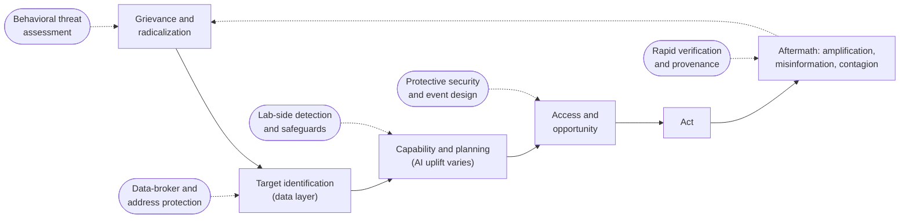
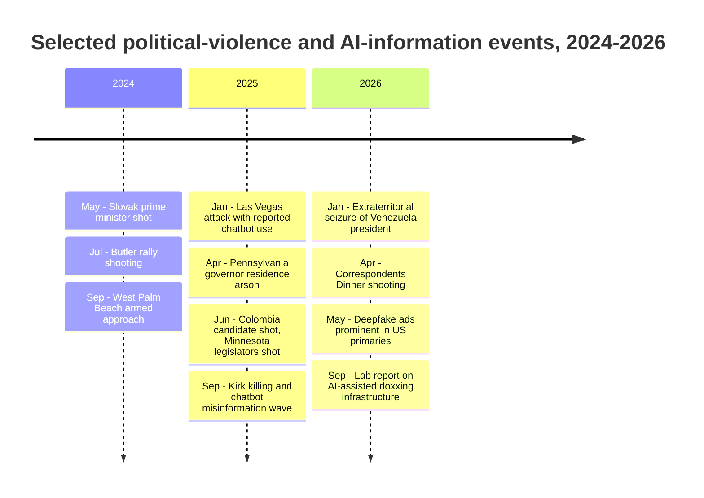
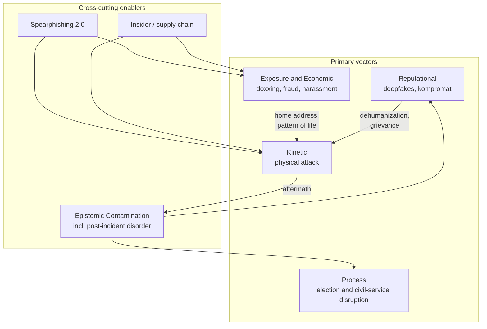
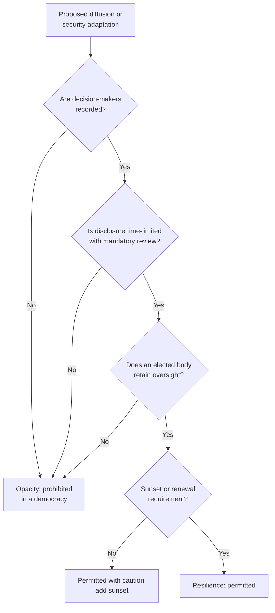
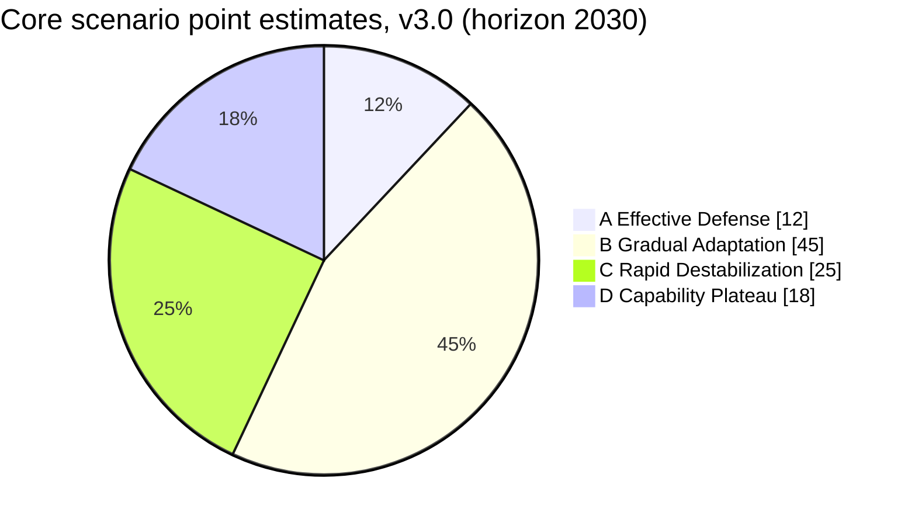
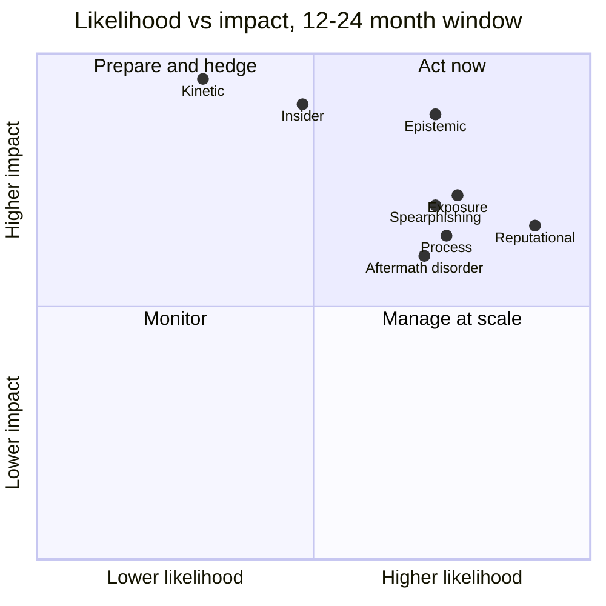

# AI Agents and the Future of Political Targeting

## A Projection Report on Emerging Risks to Political Figures and Governmental Structures

**Classification**: Policy Research (For Defensive Analysis)

**Prepared For**: Emerging Technology Risk Assessment (independent research)

**Version**: 3.0

**Date**: September 2026

**Document ID**: ETRA-2026-PTR-001

> **Independent Work**: This report is independent research. It is not affiliated with, produced by, or endorsed by any government agency, think tank, or official institution. The "ETRA" identifier is a document formatting convention, not an organizational identity. Analysis draws on publicly available academic and policy literature.

### Changes from v2.1 (September 2026 revision)

Version 3.0 is a substantive rewrite, not a currency refresh. The central change is that the report now tests its own thesis against the 2024-2026 incident record rather than reasoning from capability alone.

- **New evidence section (Section 5)**: Replaces the speculative 2026 timeline with *The 2024-2026 Record and Projection Scorecard*: a dated, neutral incident table (Slovakia 2024 through the April 2026 White House Correspondents' Dinner shooting), a scorecard grading every v2.x near-term projection against what happened, and a revised forward timeline
- **Core empirical finding revised**: In none of the major 2024-2026 attacks on political figures has public reporting documented meaningful AI planning uplift. The documented enablers were grievance, weapon access, and *commercial personal-data availability*. AI's documented footprint is instead in the data layer (AI-assisted doxxing infrastructure), the reputational layer (deepfakes at scale in the 2026 US midterms), and post-incident information disorder
- **New arguments**: *The Data Layer Is the Chokepoint* (Section 6), *The Downballot Exposure Shift* (Section 6), *The Sufficiency Threshold* (misuse does not need frontier models; Section 3), *Lab-Side Detection as a New Defensive Layer* (Section 6), and two new counterarguments in Section 7 (*AI-Centrism Misallocates Defense* and *The Contagion Channel Is Older Than AI*)
- **New threat-intelligence evidence**: Incorporated frontier-lab misuse reporting through September 2026, including documented autonomous multi-agent misuse workflows and a lone politically motivated actor who built AI-assisted doxxing infrastructure targeting members of political movements
- **Scenario probabilities re-estimated and made internally consistent**: Core scenarios A-D are now explicitly mutually exclusive and sum to 100% in every column (the v2.1 weak-defense column summed to 90%); overlay scenarios E-H are separated and re-estimated. Rapid Destabilization rises from 20% to 25%; Technological Plateau falls from 20% to 18%; Effective Defense falls from 15% to 12% (reasons in Section 14)
- **Indicator dashboard (Section 15)**: Every v2.1 indicator is now graded *Triggered / Partial / Not observed* with dated evidence; most reputational, exposure, and informational indicators have triggered or partially triggered, while the kinetic-uplift indicator has not
- **Policy recommendations restructured (Section 13)**: Replaced the four near-duplicate stakeholder tables with a priority stack led by data-layer protection for officials below the protected tier, plus a new section on the constitutional fragility of deepfake statutes after 2025-2026 court rulings
- **Risk matrix revised (Appendix A)**: Economic targeting is re-scoped as *Exposure and Economic* targeting and raised to High likelihood; a new *Post-Incident Information Disorder* row added
- **Diagrams**: Added Mermaid diagrams (threat pipeline, incident timeline, scenario shares, risk quadrant, bright-line test) to the Markdown edition and new TikZ/pgfplots figures to the typeset edition
- **Frontier update**: Capability snapshot updated for the Claude 5 and 5.1 generations (Mythos 5 and Fable 5 in June 2026; 5.1 in September 2026) and the Opus 5.5 release of September 22, 2026
- **Cuts**: Removed the duplicated *Detection Challenge* lists in Section 6, condensed the stakeholder tables, and retired stale "(2025)" and "(early 2026)" status headings

### Changes from v2.0 (v2.1, July 2026)

- Currency refresh to July 2026; Maduro precedent sourced and dated (Section 12); mid-2026 frontier-model update; named cross-references replacing numeric ones; Claims Register reconciliation; additional threat vectors relocated into the Section 8 taxonomy; expanded Executive Summary; glossary and non-claims added; em-dash constructions removed

### Changes from v1.1 (v2.0, February 2026)

- Related ETRA Reports table; Delegation Defense, Epistemic Contamination, Agent-on-Agent dynamics, Handler Bottleneck, and Digital Twins sections; [O]/[E]/[S] epistemic markers; expanded conclusion and risk matrix; nano-smurfing and Process DoS cross-references

---

## Executive Summary

This projection examines how autonomous AI agents alter the risk of political targeting: harm, coercion, or intimidation directed at political leaders, officials, election workers, and the processes they run. It assesses capabilities as of September 2026, tests earlier projections against the 2024-2026 record, projects scenarios through 2030, and evaluates institutional adaptations, including the diffusion of decision-making authority.

**Key Findings (v3.0):**

1. **The threat is real but is not arriving where the capability framing predicted.** Political violence in the United States and several other democracies has been elevated since 2024 [O]: threat-assessment caseloads for Members of Congress reached 14,938 in 2025, up about 58% from 2024 (U.S. Capitol Police, January 2026). Yet in none of the major 2024-2026 attacks on political figures has public reporting documented meaningful AI planning uplift [O]. The binding enablers were grievance, weapon access, and personal-data availability.
2. **AI's documented footprint runs through the data layer, the reputational layer, and the aftermath.** Frontier-lab threat reporting (September 2026) describes a single politically motivated actor who used AI-assisted engineering to build doxxing infrastructure against members of political movements [O]; the 2026 US midterms are the first cycle with routine deepfake use in campaign advertising [O]; and chatbots misidentified the suspect and denied the victim's death after the September 2025 killing of Charlie Kirk [O].
3. **Exposure is shifting downballot.** The largest marginal AI uplift is against officials who lack protective details (state legislators, judges, local and election officials), and the cheapest input is commercially available home-address data. The June 2025 Minnesota legislator shootings, in which the accused reportedly relied on people-search sites, are the defining case [O].
4. **Misuse does not need the frontier.** Documented misuse clusters in older and cheaper model tiers, not in the most capable restricted models [O]. Capability sufficient for targeting support is already commoditized; tiered frontier release slows the top end but does not contain the harm-relevant middle [E].
5. **Defensive law is proliferating and fragile.** 31 US states regulate election deepfakes (July 2026), but courts have struck or enjoined laws in California, Hawaii, and Montana on First Amendment grounds [O]. Data-broker and official-privacy statutes are advancing but remain in constitutional litigation [O].
6. **Decision diffusion has not begun; hardening and personalization have.** Instead of diffusing authority, democracies are hardening physical security around the same personalized leadership model. The diffusion hypothesis is retained as a medium-term projection but its near-term timing is pushed back (Section 9).
7. **International norms protecting leaders are softer than assumed.** The January 2026 extraterritorial seizure of Venezuela's sitting president remains the reference case for norm erosion as an independent driver of instability (Section 12).

**The Four Targeting Vectors (at a glance):**

- **Reputational** (digital assassination): deepfakes, synthetic kompromat, coordinated inauthentic behavior. Now routine in electoral politics; barrier reduction extreme.
- **Exposure and Economic**: doxxing, people-search aggregation, fraud, harassment, and sub-threshold financial manipulation ("nano-smurfing"). Raised to High likelihood in v3.0 because it is the documented bridge from online hostility to physical-world harm.
- **Process** (governance disruption): harassment of election and civil-service staff and administrative overload that degrades democratic capacity without targeting any single leader.
- **Kinetic**: physical attacks. Base rate elevated for reasons largely independent of AI; AI-specific uplift remains undocumented at the planning stage and constrained at execution.

Two cross-cutting enablers, **Epistemic Contamination** (including post-incident information disorder) and **Spearphishing 2.0**, amplify all four.

*Figure: The targeting pipeline at policy abstraction, with the defensive intervention point for each stage. v3.0's central claim is that the data-layer stage (T) is where AI plus commercial data currently delivers the most uplift and where defense is cheapest.*

**Highest-priority risks (see Appendix A):** reputational targeting, exposure (doxxing) targeting, process targeting, and epistemic contamination rank highest on combined likelihood and impact over the next 12 to 24 months. Kinetic targeting remains lower-probability but highest-consequence. Insider / supply-chain compromise of AI systems used by principals remains a distinct top-tier risk because defensive AI adoption can itself create the vulnerability.

**The diffusion bright-line rule:** where governments adapt by distributing authority to reduce targeting value, the test for democratic legitimacy is whether a citizen can, within a reasonable timeframe, determine who was responsible for a decision. Diffusion should reduce *targeting value* without reducing *accountability visibility* (see Section 9).

**Single most important near-term action (revised):** close the data layer for officials below the protected tier (address confidentiality, broker deletion rights, and funded residential security), paired with AI-aware threat assessment, before a high-profile incident forces reactive, potentially rights-eroding measures.

**Scope Limitations**: This document analyzes capabilities and trends for defensive policy purposes. It does not provide operational guidance and explicitly omits technical implementation details that could enable harm. It names attack victims who are public figures only where their cases are matters of extensive public record; it does not name alleged perpetrators.

**Epistemic Status Markers**: Key claims are tagged with confidence indicators:
- **[O]** Open-source documented, publicly verifiable evidence
- **[E]** Expert judgment, informed assessment without direct public evidence
- **[S]** Speculative projection, extrapolation from current trends

---

## Table of Contents

1. [Introduction and Methodology](#1-introduction-and-methodology)
2. [Theoretical Frameworks](#2-theoretical-frameworks)
3. [The Current Technological Landscape (September 2026)](#3-the-current-technological-landscape-september-2026)
4. [Historical Context: Political Violence and Technology](#4-historical-context-political-violence-and-technology)
5. [The 2024-2026 Record and Projection Scorecard](#5-the-2024-2026-record-and-projection-scorecard)
6. [How AI Agents Change the Risk Calculus](#6-how-ai-agents-change-the-risk-calculus)
7. [Counterarguments and Critical Perspectives](#7-counterarguments-and-critical-perspectives)
8. [A Taxonomy of AI-Enabled Targeting](#8-a-taxonomy-of-ai-enabled-targeting)
9. [Governmental Adaptation: The Diffusion Hypothesis](#9-governmental-adaptation-the-diffusion-hypothesis)
10. [Second-Order Effects on Authoritarianism and Democracy](#10-second-order-effects-on-authoritarianism-and-democracy)
11. [The Fear Environment](#11-the-fear-environment)
12. [International Variance](#12-international-variance)
13. [Policy Recommendations and Defensive Measures](#13-policy-recommendations-and-defensive-measures)
14. [Uncertainties and Alternative Scenarios](#14-uncertainties-and-alternative-scenarios)
15. [Signals and Early Indicators](#15-signals-and-early-indicators)
16. [Civil Liberties Guardrails](#16-civil-liberties-guardrails)
17. [Conclusion](#17-conclusion)

---

### Related ETRA Reports

| Report | Document ID | Connection to This Report |
|--------|-------------|--------------------------|
| [AI Agents as Autonomous Economic Actors](../../packages/economic_agents/docs/economic-implications.md) | ETRA-2025-AEA-001 | Agent accountability gap and legal personhood problem underpin "Plausible Deniability 2.0"; speed asymmetry establishes governance vacuum exploitable for political operations |
| [AI Agents and Financial System Integrity](ai-agents-financial-integrity.md) | ETRA-2025-FIN-001 | Nano-smurfing and covert financing directly relevant to economic targeting vector; "Principal-Agent Defense" creates *mens rea* gaps applicable to politically-motivated financial operations; sovereign agent immunity concept |
| [AI Agents and Espionage Operations](ai-agents-espionage-operations.md) | ETRA-2026-ESP-001 | Handler Bottleneck Bypass is the espionage analogue to "conspiracy footprint shrinks"; MICE/RASCLS targeting and pattern-of-life analysis apply to political reconnaissance; "Stasi-in-a-box" dual-use risk maps to Panopticon counter-thesis |
| [AI Agents and Institutional Erosion](ai-agents-institutional-erosion.md) | ETRA-2026-IC-001 | Verification Pivot and Epistemic Contamination affect protective intelligence; Algorithmic Capture of IC AI systems is a specific instance of insider/supply-chain threat; IC workforce cuts compound detection degradation; Delegation Defense framework |
| [AI Agents and WMD Proliferation](ai-agents-wmd-proliferation.md) | ETRA-2026-WMD-001 | Shared Power Diffusion Theory (Cronin) framework; nano-smurfing for procurement evasion; attribution void analysis; "conspiracy footprint shrinks" as shared thesis |

---

## 1. Introduction and Methodology
### Purpose

Political assassination has shaped history from Julius Caesar to the present day. Each technological era has altered the methods, accessibility, and risk profiles of political violence. We are now entering an era where autonomous AI agents capable of complex multi-step planning, information synthesis, and real-time adaptation become widely accessible.

This projection does not assume political violence will increase, since that depends on complex social, economic, and political factors. Rather, we analyze how AI capabilities change the *nature* of risks when political violence does occur, and how institutions may adapt.

### Base-Rate Context

**To prevent fear-driven misreading, we anchor expectations:**

Historically, successful attacks on top-tier protected officials in stable democracies are rare relative to the volume of threats. The Secret Service, for example, investigates thousands of threats annually; successful attacks on presidents are measured in single digits per century. Similar patterns hold across Western democracies.

The 2024-2026 period is a partial exception that sharpens rather than overturns this point [O]: attempts against protected principals rose (Section 5), yet protective layers held in most cases, while the fatal attacks on political figures in the United States (Minnesota, June 2025; Utah, September 2025) struck people *without* state protective details. Threat volume rose far faster than attack volume: Capitol Police threat-assessment cases grew from 9,474 in 2024 to 14,938 in 2025.

**The dominant near-term shift is likely not kinetic violence but:**
- Harassment, intimidation, and process disruption at scale
- Reputational attacks through synthetic media
- Chilling effects on political participation
- Degradation of civic infrastructure through administrative overload

Readers should interpret this analysis through that lens: the primary concern is *democratic degradation through non-lethal targeting*, with kinetic risk as a lower-probability, higher-consequence tail scenario.

### Methodology

This analysis draws on:

- **Current capability assessment** of AI agent systems as deployed through September 2026, including published system cards and frontier-lab threat-intelligence reports
- **Incident record review** of attacks, plots, and threat-caseload data for 2024-2026, using court records, official statistics, and contemporaneous mainstream reporting (Section 5)
- **Historical case analysis** of how previous technologies affected political violence patterns
- **Institutional behavior modeling** based on how governments have adapted to past security challenges
- **Projection scorecarding**: every near-term projection from v2.x is graded against what happened (Section 5), and scenario probabilities are re-estimated with stated reasons (Section 14)

We deliberately avoid:
- Specific technical implementation details
- Constructed or hypothetical targeting scenarios involving named living individuals
- Naming alleged perpetrators, and describing attack methods beyond what is needed for policy analysis
- Information not already publicly available in academic, policy, or mainstream-reporting literature

(Where the report references a documented real-world event involving a named public figure, for example the incidents in Section 5 or the January 2026 events in Section 12, it does so only on the basis of established public reporting, and it distinguishes documented facts from inference. Political violence in the period covered has targeted figures across the political spectrum; the report is ideology-agnostic and treats the motive of any specific attack as a matter for courts, not for this analysis.)

### What This Report Does Not Claim

To forestall predictable misreadings, we state our non-claims explicitly:

1. **We do not claim AI caused, or materially enabled, any specific attack in the 2024-2026 record.** Public reporting does not document meaningful AI planning uplift in those cases, and Section 5 says so plainly.
2. **We do not claim political violence or attack frequency will rise because of AI.** The elevated 2024-2026 base rate has drivers (polarization, grievance, weapon access) that predate current AI; we analyze how AI changes the *nature* and *detectability* of risk on top of that base rate.
3. **We do not claim any specific individual is at elevated risk.** The analysis is structural, not a threat assessment of any person.
4. **We do not provide operational guidance.** No step in this document is intended to be, or is, actionable instruction for causing harm.
5. **We do not claim the offense-defense balance favors attackers on net.** We hold it genuinely uncertain (see the Panopticon Counter-Thesis, Section 7).
6. **We do not claim our probability estimates are precise.** They are informal expert judgments for relative prioritization, re-estimated over time.
7. **We do not endorse the adaptations we describe.** Documenting a plausible institutional response (for example decision diffusion or bunkerization) is analysis, not advocacy; several carry serious democratic costs that we flag.

This list pairs with the Warning Signs of Overreach in Section 16: the report is intended to enable proportionate preparation, not to justify expanded surveillance or reduced accountability.

### Definitions

**AI Agent**: An AI system capable of autonomous multi-step task execution, tool use, and goal-directed behavior with minimal human oversight per action.

**Political Targeting**: Actions intended to harm, coerce, or eliminate political figures or decision-makers.

**Decision Diffusion**: The distribution of political authority across larger bodies with less identifiable individual responsibility.

---

## 2. Theoretical Frameworks
This analysis draws on several established theoretical frameworks from security studies, political science, and technology policy.

### Power Diffusion Theory

**Audrey Kurth Cronin's "Power to the People" (2020)** provides essential context for understanding how open technological innovation diffuses lethal capabilities to individuals and small groups. Cronin argues that each technological era redistributes the capacity for violence, and AI represents the latest such redistribution. Her framework helps explain why state monopolies on sophisticated capabilities erode over time.

### Fourth Generation Warfare (4GW)

The 4GW framework, developed by William Lind and colleagues, predicts the progressive loss of the state's monopoly on violence and the blurring of lines between combatant and civilian, war and peace, military and political action. AI agents accelerate 4GW dynamics by:

- Enabling non-state actors to conduct sophisticated operations previously requiring state resources
- Blurring attribution between state, criminal, and individual actors
- Collapsing the distinction between "preparation" and "attack"

### Systems Hacking Framework

**Bruce Schneier's concept of "AI hackers"** extends beyond computer systems to social and political systems. AI agents can identify and exploit loopholes in:

- Legal frameworks (jurisdiction shopping, regulatory gaps)
- Security protocols (pattern exploitation, timing vulnerabilities)
- Social systems (trust networks, information flows)
- Political processes (decision-making bottlenecks, accountability gaps)

This framework is particularly relevant to understanding both offensive applications and defensive adaptations.

### Bureaucratic Theory and the Iron Cage

**Max Weber's concept of the "Iron Cage"** (stahlhartes Gehäuse) provides a lens for analyzing the democratic costs of decision diffusion. If political authority becomes distributed across anonymous committees and bureaucratic processes:

- Citizens lose identifiable representatives to hold accountable
- The state becomes an impersonal machine resistant to democratic input
- Kafkaesque dynamics emerge where no individual bears responsibility
- Democratic legitimacy erodes even as security may improve

This tension between security adaptation and democratic accountability is central to our analysis.

### Stochastic Terrorism Framework

The concept of **stochastic terrorism** (the use of mass communication to incite random actors to carry out attacks) gains new dimensions with AI agents. An AI system optimizing for "political impact" might:

- Guide users toward increasingly extreme conclusions
- Provide planning assistance that crosses ethical lines incrementally
- Create plausible deniability for instigators
- Enable "algorithmic radicalization" without direct human instigation

### Key Literature

| Work | Author(s) | Relevance |
|------|-----------|-----------|
| *Power to the People: How Open Technological Innovation is Arming Tomorrow's Terrorists* | Audrey Kurth Cronin (2020) | Technology diffusion and non-state violence |
| *The Changing Face of War: Into the Fourth Generation* | Lind, Nightengale, et al. (1989) | State monopoly erosion |
| *Click Here to Kill Everybody* | Bruce Schneier (2018) | Systems security and AI risks |
| *The Transparent Society* | David Brin (1998) | Surveillance symmetry scenarios |
| *Economy and Society* | Max Weber (1922) | Bureaucratic rationalization |
| *The Age of Surveillance Capitalism* | Shoshana Zuboff (2019) | Information asymmetries and power |
| *Radical Technologies* | Adam Greenfield (2017) | Technological determinism critique |
| *The Coming Wave* | Mustafa Suleyman (2023) | AI-enabled political disruption and containment failure |
| *Sleeper Agents: Training Deceptive LLMs That Persist Through Safety Training* | Anthropic (Hubinger et al., 2024) | Backdoor persistence in AI systems; insider threat evidence base |
| *Responsible Scaling Policy* | Anthropic (2023, updated 2025) | AI capability thresholds and safety commitments framework |
| *System Card: Claude Fable 5 & Claude Mythos 5* | Anthropic (June 2026) | Mid-2026 frontier capability baseline; tiered safeguarded/restricted release model; "undermining decisions within major governments" risk pathway |
| *Disrupting the first reported AI-orchestrated cyber espionage campaign* | Anthropic (November 2025) | First public case of largely autonomous agentic misuse; humans retained target selection |
| *Detecting and countering misuse of AI: September 2026* | Anthropic Threat Intelligence (September 10, 2026) | Influence operations, surveillance of officials and dissidents, AI-assisted doxxing infrastructure, autonomy spectrum of misuse |
| *Disrupting malicious uses of AI* (periodic series) | OpenAI (2024-2026; February 2026 edition) | Influence operations, state-linked harassment, scams; misuse combines AI with conventional tooling |
| "The levers of political persuasion with conversational AI" | Hackenburg et al., *Science* (December 2025) | Large-scale evidence on conversational AI persuasion; persuasiveness tied to information density rather than personalization |
| *Local Election Officials Survey 2026* | Brennan Center for Justice (April 2026) | Threats, harassment, and AI concerns among election administrators |

---

## 3. The Current Technological Landscape (September 2026)
### Present Capabilities

AI agents as of September 2026 can:

- Synthesize information from thousands of sources in minutes and maintain that synthesis over time through scheduled, unattended collection jobs
- Conduct extended multi-step tasks with minimal supervision, including multi-day operations decomposed across parallel sub-agents
- Operate tools including web browsers, code execution, and API interactions
- Maintain persistent goals and memory across sessions
- Generate convincing text, voice, image, and video content in a target's style
- Analyze patterns in schedules, movements, and behaviors from public and commercially available data

The proprietary frontier moved twice more in 2026. Anthropic released a restricted preview of its Mythos-class model in April 2026 and, on June 9, 2026, a two-tier pair: Claude Fable 5 (broadly available, with high-risk-domain requests routed to safeguards) and Claude Mythos 5 (reduced-safeguard access for approved organizations); 5.1 updates to both followed on September 1, 2026, and Claude Opus 5.5, described by the developer as performing at roughly Fable 5.1 level at lower cost, was released on September 22, 2026 [O]. Other frontier developers (OpenAI's GPT-5 line, Google's Gemini line, xAI's Grok line) shipped competing releases through the summer, and open-weight families (Llama, Qwen, DeepSeek, Mistral and others) remain at or near parity on structured and coding tasks [O]. Developers now describe their top models as capable of meaningfully uplifting well-resourced threat actors in high-risk domains, and increasingly ship them in tiered forms [O].

### What Changed Since v2.1 (July to September 2026)

| Development | Date | Relevance to Political Targeting | Marker |
|-------------|------|----------------------------------|--------|
| Frontier-lab threat report documents misuse across influence operations, surveillance of officials and dissidents, and AI-assisted doxxing infrastructure built by a single politically motivated actor | September 2026 | First documented case of AI-assisted engineering applied to mass exposure of political-movement members; confirms the data layer as the live bridge from AI to targeting | [O] |
| Same report: misuse cases involved older and cheaper model tiers; none involved the most capable restricted-tier models except one distillation case | September 2026 | Supports the *Sufficiency Threshold* argument below: harm-relevant capability is already commoditized | [O] |
| Claude 5.1 generation (September 1) and Opus 5.5 (September 22) released | September 2026 | Near-frontier capability moves down the price curve; frontier-to-commodity lag continues to compress | [O] |
| Courts enjoin or strike state election-deepfake laws (Hawaii; Montana, as applied to plaintiffs) | January 2026 (Hawaii); September 2026 (Montana) | Legal defenses against reputational targeting are constitutionally fragile in the US | [O] |
| New Jersey Supreme Court answers certified question on Daniel's Law liability; constitutionality pending in the Third Circuit | August 12, 2026 | The leading official-privacy statute remains in litigation | [O] |
| California's centralized data-broker deletion platform (DROP) enforcement begins | August 1, 2026 | First large-scale test of one-request deletion across all registered brokers | [O] |
| 2026 US midterm general-election campaign underway with widespread AI-generated advertising | Summer 2026 | Reputational vector operating at scale in a live election | [O] |

### What We've Observed Through September 2026

- **Autonomous misuse is documented, with humans still choosing targets** [O] [**High confidence**]. In November 2025 a frontier lab reported a state-linked espionage campaign in which an agentic system performed the large majority of tactical work with humans intervening at a small number of decision points. The September 2026 report of the same lab describes a spectrum from conversational assistance to directed execution to autonomous multi-agent workflows, including scheduled collection jobs running without a human in the loop, while noting that humans retained target selection, monetization, and review of results.
- **AI compresses the cost side of harassment and exposure campaigns** [O] [**High confidence**]. The September 2026 report describes a single actor achieving campaign scale that previously required a team, including compromising political organizations' member and donor data and building a searchable exposure tool.
- **Influence operations are industrialized but mostly low-reach** [O] [**High confidence**]. Documented operations produced content at newsroom volume (one generated roughly 8,900 articles in about 20 languages), but most were assessed as achieving little organic breakout. Volume is cheap; audience is not.
- **Lab-side detection and referral are now an operating defensive layer** [O] [**High confidence**]. At least one major provider publicly states that conversations indicating planning to harm others are routed to human review and may be referred to law enforcement where there is an imminent threat of serious physical harm; frontier labs publish periodic disruption reports.
- **Open-weight parity on structured and coding tasks, with a months-scale lag on frontier reasoning** [E] [**Medium-High confidence**; parity is task-specific].
- **Frontier developers name governance-decision risk** [O] [**High confidence**]: published frameworks and system cards list "undermining decisions within major governments" as a monitored risk pathway.
- **Intelligence community workforce contraction** [O] [**High confidence**]: in 2025 the Director of National Intelligence announced a reduction of the ODNI workforce by more than 40 percent alongside budget cuts exceeding $700 million, with deferred-resignation offers extended to CIA and NSA personnel.
- **No public case of AI planning uplift in an attack on a political figure** [O] [**Medium-High confidence**, limited by what investigators disclose]. Two 2025 non-political attacks in the United States were publicly reported to have involved chatbot queries during preparation, which establishes the behavior exists; neither targeted a political figure (Section 5).

### The Sufficiency Threshold

A persistent assumption in AI-risk analysis, including earlier versions of this report, is that danger tracks the frontier. The 2025-2026 misuse record points the other way for political targeting [E]:

1. **The harm-relevant tasks are mundane.** Aggregating addresses, drafting harassment at volume, generating a plausible fake image, or summarizing an official's public schedule do not require frontier reasoning. Mid-tier and open-weight models are sufficient.
2. **Misuse follows price and access, not capability.** Documented misuse concentrated in cheaper tiers and stolen API credentials rather than restricted frontier models [O]. Tiered release is working at the top and is largely irrelevant in the middle.
3. **Implication:** frontier-model controls, however valuable for catastrophic domains (see ETRA-2026-WMD-001), are not the primary lever for political-targeting risk. The levers are the *inputs* AI works on (personal data), the *channels* outputs travel through (platforms, advertising), and the *human perimeter* around officials.

### Evidence Base and Methodology

| Claim Type | Evidence Sources | Confidence Level |
|------------|------------------|------------------|
| Agent capabilities | Commercial product documentation, system cards, academic benchmarks | High |
| Adversarial use of AI | Frontier-lab threat-intelligence reports (Anthropic, OpenAI), court records, law enforcement statements | Medium-High (improved from Low-Medium in v2.1) |
| Attack-planning uplift against political figures | Court filings and investigative disclosures | Low (absence of public evidence is not evidence of absence) |
| Open-weight parity | ML benchmark leaderboards (task-specific caveats) | Medium |
| Defensive adoption | Procurement, official statements, provider policy disclosures | Medium |

**Methodological note**: Where we cannot cite specific public sources, claims are phrased probabilistically. Lab threat reports are self-reported by vendors about their own platforms; they document what was caught, not the base rate of misuse, and exclude open-weight models run locally.

### Capability Envelopes (2026-2027)

| Capability | Status (Sept 2026) | 2027 Median Projection | Key Gating Variables |
|------------|--------------------|-----------------------|---------------------|
| Autonomous operation duration | Multi-day to multi-week on structured tasks; unattended scheduled jobs documented in misuse | Routine multi-week operation | Reliability, error recovery, goal drift |
| Persona maintenance | Sophisticated; fabricated journalist and news-site personas documented | Highly convincing across voice and video | Detection countermeasures, platform policies |
| Personal-data aggregation | Commodity; the binding constraint is data availability, not AI | Unchanged unless data layer is regulated | Broker regulation, breach volume |
| Multi-agent coordination | Functional; parallel sub-agent decomposition documented | Seamless | Orchestration frameworks, compute costs |
| Physical system integration | Limited pilots | Growing adoption | Safety certification, liability frameworks |
| Self-improvement | Within narrow domains | Domain-general assistance | Alignment constraints, regulatory limits |

**Note**: The v2.1 envelopes projected capability; v3.0 adds the observation that for this domain the gating variable is increasingly *data access and distribution channels*, not model capability.

### The Capability Proliferation Problem

Once a capability exists at the frontier, it proliferates to open-weight and less-restricted systems rapidly. As of September 2026 the lag is effectively closed on structured and coding tasks and is measured in roughly 3 to 9 months on frontier reasoning and long-horizon planning (unchanged from v2.1; compressed from 12 to 24 months in v1.1 and 6 to 18 months in v2.0). Near-frontier capability is also moving down the price curve within proprietary product lines. This means:

1. Capabilities pioneered by safety-conscious labs eventually reach actors without such constraints
2. The "moat" of compute advantage shrinks as efficiency improvements compound
3. Nation-states can develop indigenous capabilities outside multilateral frameworks
4. Individual actors with moderate technical skill can assemble capable agent systems

---

## 4. Historical Context: Political Violence and Technology
### Technology Shifts and Political Violence Patterns

Each major technological shift has altered the accessibility and character of political violence:

**The Printing Press (15th-17th centuries):**
- Enabled coordination of revolutionary movements
- Allowed ideological radicalization at scale
- Made targets more identifiable through publicity

**Industrialization (19th century):**
- Created explosives accessible to non-state actors
- Enabled the "propaganda of the deed" anarchist wave
- Required new approaches to leader security

**Mass Media (20th century):**
- Made leaders more visible but also humanized them
- Created "spectacle" incentives for attackers
- Enabled both radicalization and counter-messaging at scale

**The Internet (late 20th-early 21st century):**
- Drastically reduced coordination costs for dispersed actors
- Enabled research and planning from anywhere
- Created new surveillance capabilities for both attackers and defenders

**Social Media (2010s):**
- Real-time tracking of movements through public posts
- Radicalization pipelines and echo chambers
- Crowdsourced intelligence gathering

### The Consistent Pattern

Across eras, we observe:

1. **Initial asymmetry**: New capabilities favor attackers before defenders adapt
2. **Institutional lag**: Governance structures adapt more slowly than threat landscapes
3. **Eventual equilibrium**: Security measures and social norms eventually stabilize risks
4. **Permanent shift**: The baseline never returns to pre-technology levels

AI agents represent the next such shift. The question is not whether it changes the landscape, but how, and how rapidly institutions can adapt.

### A Caution From the Record

Historical analogies also carry a warning that v3.0 takes more seriously than earlier versions: waves of political violence have usually been driven by social conditions (polarization, economic dislocation, contested legitimacy), with technology shaping *form* more than *frequency* [E]. The anarchist wave of the late nineteenth century exploited dynamite, but dynamite did not create the anarchist movement. The 2024-2026 record (Section 5) fits this pattern: the rise in attacks and threats preceded, and so far appears largely independent of, AI adoption. The analytical task is therefore to identify where AI changes the *form* of targeting, not to attribute the wave to AI.

---

## 5. The 2024-2026 Record and Projection Scorecard
Versions 1.x and 2.x of this report projected forward from capability. v3.0 checks those projections against what actually happened. This section records the incident base (neutrally and without naming alleged perpetrators), grades earlier projections, and then sets out a revised forward timeline. See Section 14 for alternative scenarios.

> **As-of note (September 2026):** Entries reflect public reporting and court records available as of September 22, 2026. Several cases remain before the courts; nothing here is a finding of fact about any defendant. Readers should re-verify against later reporting.

### The Incident Record

**Selected attacks on political figures and officials, 2024-2026** [O]:

| Date | Event | Target tier | Documented AI role in planning (public reporting) | Information pathway to target |
|------|-------|-------------|---------------------------------------------------|-------------------------------|
| May 15, 2024 | Prime Minister of Slovakia shot and seriously wounded after a government meeting | Head of government | None reported | Public appearance |
| July 13, 2024 | Butler, Pennsylvania: presidential candidate wounded at a rally; one attendee killed | Presidential candidate (protected) | None reported | Publicly announced event |
| Sept 15, 2024 | West Palm Beach, Florida: armed individual intercepted near a presidential candidate's golf course; later convicted | Presidential candidate (protected) | None reported | Pattern-of-life observation |
| April 13, 2025 | Arson attack on the Pennsylvania Governor's Residence while the governor's family slept inside | State governor (protected) | None reported | Official residence (public) |
| June 7, 2025 | Colombian senator and presidential pre-candidate Miguel Uribe Turbay shot at a Bogota campaign event; died August 11, 2025 | National legislator / candidate | None reported | Public campaign event |
| June 14, 2025 | Minnesota: former House Speaker Melissa Hortman and her husband killed at home; Senator John Hoffman and his wife wounded; the accused carried notebooks listing dozens of officials and a list of people-search websites | State legislators (unprotected) | None reported; **commercial people-search data** reportedly used to locate homes | Data brokers / people-search sites |
| Sept 10, 2025 | Political activist Charlie Kirk killed at a university campus event in Utah | Prominent political figure (private security) | None reported; **AI chatbots spread false claims afterward**, including misidentifying the suspect and asserting the victim was alive | Publicly announced event |
| Jan 2026 | Vice President's private Ohio residence vandalized; federal and local charges filed | National executive (protected) | None reported | Private residence |
| April 25, 2026 | Washington Hilton, White House Correspondents' Dinner: armed individual breached a checkpoint and fired at a Secret Service officer (struck in body armor); charged with attempting to assassinate the President; pleaded not guilty | Head of state (protected) | None reported | Publicly scheduled event |
| May 23, 2026 | Shooting at a security booth outside the White House complex; the shooter was killed by the Secret Service | Head of state perimeter | None reported | Fixed site |

**Related cases establishing AI-in-preparation behavior (not political targeting)** [O]:

| Date | Event | Relevance |
|------|-------|-----------|
| Jan 1, 2025 | Vehicle explosion outside a Las Vegas hotel; police reported the perpetrator had queried a generative AI chatbot during preparation | First widely reported US case of chatbot use in attack preparation |
| May 17, 2025 | Palm Springs fertility clinic bombing; authorities reported AI chat use in preparation | Second such case within five months |

**Threat and harassment trend data** [O]:

| Metric | Value | Source (date) |
|--------|-------|---------------|
| U.S. Capitol Police threat-assessment cases (Members, families, staff) | 7,501 (2022); 8,008 (2023); 9,474 (2024); **14,938 (2025)** | USCP (January 27, 2026) |
| Local election officials reporting threats, harassment, or abuse | 38% (2025 survey); **32% (2026 survey)** | Brennan Center (April 13, 2026) |
| Local election officials concerned AI could make their job more difficult or dangerous | **63%** (2026 survey) | Brennan Center (April 13, 2026) |
| US states with election-deepfake laws | 28 (end of 2025); **31** (July 2026) | Public Citizen tracker, as reported July 2026 |

### What the Record Shows

1. **The base rate rose before AI could plausibly explain it** [O]/[E]. Threat caseloads and attacks rose across 2024-2026 in parallel with polarization indicators that researchers have tracked for a decade. Every attack in the table is explicable without AI.
2. **The data layer did the work AI was expected to do** [O]/[E]. In the Minnesota case, the reported enabling step was not planning sophistication but cheap, legal access to officials' home addresses. This is the reconnaissance function this report assigned to AI agents; it was already commoditized by people-search markets.
3. **Protected principals were reached at public events; unprotected officials were reached at home** [E]. Every attack on a protected principal occurred at or near a scheduled public appearance or fixed site. The attacks on unprotected officials occurred at private residences. That split is exactly what a data-layer model predicts and what a capability model does not.
4. **AI's clearest documented role is in the aftermath** [O]. After the September 2025 killing, chatbots misidentified a suspect and asserted the victim was alive, while AI-"enhanced" suspect images circulated widely enough that a sheriff's office reposted one before flagging it. This is a new, observed form of epistemic contamination (Section 8).
5. **AI use in attack preparation exists but has not yet surfaced in a political case** [O]/[E]. The two 2025 non-political cases show attackers do consult chatbots. Given investigative disclosure lags, the absence of a public political case is weak evidence; we expect the first documented case within the projection window [S].

### Projection Scorecard

| v2.x projection | Status (Sept 2026) | Evidence and comment |
|-----------------|--------------------|----------------------|
| Complex attack planning becomes routinely achievable by individuals (early-mid 2026) | **Unconfirmed** | Capability plausible [E]; no public attack shows AI planning uplift [O] |
| Reputational targeting already occurring; defenses lagging | **Confirmed** | Deepfake attack ads in 2026 primaries; state laws enjoined or struck [O] |
| Election worker and civil-servant harassment increasing | **Mixed** | Capitol Police caseload up about 58% in 2025; self-reported harassment of local election officials down from 38% to 32% [O] |
| Noise Floor: higher volume, lower average sophistication | **Consistent, AI share unknown** | Caseload growth consistent; no public data on the AI-generated share [O]/[E] |
| Institutional response crystallizes (mid-late 2026) | **Partial** | Official-address privacy laws in several states; State Department ministerial on political terrorism (July 16, 2026); none AI-specific [O] |
| Intelligence services publish comprehensive reports on AI-enabled political violence | **Not observed** | No public report of that scope identified [O] |
| Decision diffusion begins (late 2026 to early 2027) | **Not observed; opposite trend** | Responses have hardened security around personalized leadership rather than diffusing authority [E] |
| Norm erosion: cross-border seizures framed as law enforcement | **Confirmed** | January 2026 Venezuela operation (Section 12) [O] |
| Frontier labs treat governance-decision corruption as a monitored risk | **Confirmed** | Published frameworks and system cards [O] |

**Scorecard lesson:** projections about *reputational, informational, and normative* change have been confirmed; projections about *kinetic capability uplift* and *institutional redesign* have not. v3.0 reweights accordingly.

### Revised Forward Timeline

**Q4 2026: Midterm stress test.** The US general election on November 3, 2026, and the certification period that follows are the highest-risk window for process targeting (harassment of election officials, deepfake robocalls and ads, post-election information disorder) [E]. Brazil's October 2026 general election is a parallel test of a jurisdiction with an explicit electoral-deepfake ban [O].

**2027: Litigation and the data layer.** Expect appellate rulings on state deepfake statutes and on Daniel's Law, and the first effective dates of post-Minnesota official-privacy laws (for example Oregon's January 1, 2027 address-confidentiality provision) [O]. We expect the first public court record describing AI assistance in a plot against a public official within 12 to 24 months [S], most likely in the exposure or harassment categories rather than a sophisticated kinetic plan.

**2027-2028: Presidential cycle.** The 2028 primaries bring the largest public-event exposure of the decade. We expect protective postures to harden further (event design, screening, reduced unscheduled appearances) and deepfake volume to exceed 2026 levels [E].

**2028-2030: Structural choices.** Whether democracies adopt accountable diffusion, drift toward bunkerization, or stabilize with current structures depends on whether a high-casualty or clearly AI-enabled attack occurs, and on how the first such event is handled (Section 16) [S].

---

## 6. How AI Agents Change the Risk Calculus
### The Traditional Attack Requirements

Historically, attacks on protected political figures required some combination of:

1. **Organizational infrastructure**: Cell structures, communication networks, logistics
2. **Specialized knowledge**: Security vulnerabilities, technical skills, operational tradecraft
3. **Extended planning time**: Surveillance, pattern identification, opportunity recognition
4. **Multiple human participants**: Each representing a detection/betrayal risk
5. **Physical access**: Ultimately requiring human presence

Each requirement created detection opportunities. Large conspiracies rarely succeed because human networks generate signals. The 2024-2026 record adds a qualification: most recent attacks were by lone actors who never needed an organization, so the "conspiracy footprint" was already small before AI (Section 5).

### What Changes: Defender Implications

| Traditional Requirement | What AI Changes | Detection Burden Shift | **Defender Implication** | Confidence |
|------------------------|-----------------|------------------------|-------------------------|------------|
| Organizational infrastructure | Reduces need for human co-conspirators | Significantly harder | Network analysis and infiltration strategies lose effectiveness | High |
| Specialized knowledge | Synthesizes from public sources | Harder | Knowledge barriers no longer filter out less-capable actors | Medium |
| Extended planning time | Compresses research timelines | Significantly harder | Shorter detection windows; less time for intervention | Medium |
| Target location and pattern-of-life | Aggregates commercial and public data in minutes | Significantly harder | **Data-layer protection becomes a primary control** (new in v3.0) | High |
| Multiple human participants | Single actor can operate multiple agent functions | Significantly harder | Informant and communications intelligence strategies degrade | High |
| Financial patterns | Normal consumption indistinguishable | Moderately harder | Financial intelligence yields less | Medium |
| Physical access | **Unchanged** | Unchanged | Physical security remains the robust primary barrier for protected principals | High |
| Psychological barriers | **Largely unchanged** | Unchanged | Behavioral threat assessment and intervention remain central | Medium |

**Estimation methodology**: Ordinal assessments derive from structured comparison of historical cases against current capabilities. Numeric reduction factors (for example "10x") are avoided as methodologically unsupportable.

**Key insight for defenders**: The primary change is not attacker capability per se but **the reduction of detectable coordination signals** that historically provided warning, combined with near-zero-cost target location. This shifts defensive burden toward behavioral indicators in individuals, data-layer protection, physical security as the primary barrier for protected principals, lab-side and platform-side detection, and post-incident attribution. Detection challenges for reputational and process targeting are even more significant (Section 8).

**Compounding factor, IC workforce contraction (cross-reference: ETRA-2026-IC-001):** The detection burden shift coincides with significant intelligence community reductions. In 2025 the Director of National Intelligence announced a reduction of the ODNI workforce by more than 40 percent alongside budget cuts exceeding $700 million; deferred-resignation offers were extended to CIA, NSA, and ODNI personnel; and counterintelligence and counterproliferation functions were slated to transfer out of ODNI [O]. Election-security support has also contracted: 75% of local election officials surveyed in early 2026 reported receiving no additional state or local resources to offset federal cuts to election-security support [O]. Reduced human analytical capacity plus rising caseloads and AI-generated noise create a compounding vulnerability that neither factor would produce alone.

### The Data Layer Is the Chokepoint

*New in v3.0.*

The v2.x analysis treated reconnaissance as a capability AI would newly supply. The record shows it was already supplied, by a legal market [O]/[E]:

1. **People-search and data-broker services sell home addresses, relatives, and phone numbers** for most adults, including officials, often for free or a few dollars. In the June 2025 Minnesota shootings, investigators reported that the accused carried a list of such sites alongside a list of officials [O].
2. **AI agents multiply the value of that data rather than replace it.** An agent can cross-reference broker output with voter files, property records, social media, and breach dumps at scale; the September 2026 lab report documents exactly this kind of integration, used to build a searchable exposure tool against members of political movements [O].
3. **Therefore the cheapest, highest-leverage defensive point is upstream of the model**: deny the inputs. Address confidentiality for officials, broker deletion rights, and enforcement against breach-data markets reduce the uplift of every model, open or closed, at once [E].

This reframing matters for resource allocation. Frontier-model safeguards cannot reach open-weight models run locally; data-layer controls apply regardless of which model an attacker uses [E]. The trade-off is real: address suppression can conflict with residency verification for candidates, public-records transparency, and press investigation, so controls should be scoped to home addresses and family details, not to official conduct (Section 13).

### The Downballot Exposure Shift

*New in v3.0.*

AI's marginal uplift is inversely proportional to the protection a target already has [E]:

| Tier | Examples | Existing protection | Marginal AI uplift to an attacker | 2024-2026 pattern |
|------|----------|---------------------|-----------------------------------|-------------------|
| Tier 1: Protected principals | Heads of state and government, top candidates | Dedicated protective details, advance work, screening | Low: physical access, not information, is the binding constraint | Attacks occurred at public events and fixed sites [O] |
| Tier 2: Senior officials with partial protection | Governors, cabinet members, senior legislators | Variable details, official residences | Moderate | Official residence attacked [O] |
| Tier 3: Unprotected officials | State legislators, judges, mayors, local officials | Little or none; home addresses often public | **High**: target location and pattern-of-life become trivial | Legislators attacked at home [O] |
| Tier 4: Civic workforce | Election officials, poll workers, school boards, public health staff | None | High for harassment and exposure; the process-targeting vector | Persistent harassment; staffing strain [O] |

The implication is uncomfortable for resource allocation: protective spending concentrates on Tier 1, while AI-plus-data uplift concentrates on Tiers 3 and 4, which are also where democratic capacity is thinnest and replacement hardest [E]. A democracy can survive an attack on a head of state; it is less clear it can staff elections and state legislatures if service becomes a personal security liability.

### Lab-Side Detection: A New Defensive Layer

*New in v3.0.*

A development v2.x did not anticipate is that AI providers themselves became an operating part of the protective ecosystem [O]:

- **Disruption reporting**: frontier labs publish periodic reports on disrupted misuse, including influence operations and surveillance targeting officials and dissidents.
- **Referral pipelines**: at least one major provider states that conversations indicating planning to harm others are routed to trained human reviewers and may be referred to law enforcement when an imminent threat of serious physical harm is identified.

**Assessment** [E]: This layer is valuable and structurally limited. It sees only traffic on participating platforms, not open-weight models run locally; it is operated by private firms under their own policies; and it creates a new civil-liberties surface (automated scanning of intimate conversations, false-positive referrals, mission creep). Section 16 proposes guardrails. The layer's existence also partly explains the Sufficiency Threshold (Section 3): actors who expect monitoring migrate to cheaper, less-monitored, or local models.

### Who This Affects Most

- **Unprotected and partially protected officials** (Tiers 2-4 above): the largest marginal increase in risk.
- **Controversial figures**: those who generate strong opposition are more likely to face motivated attackers.
- **Accessible democracies**: systems where leaders have public schedules, attend open events, and maintain constituent contact.
- **Less affected**: authoritarian leaders with extensive existing security apparatus, and institutional decision-makers without public identity.

### Agent-on-Agent Dynamics: The Co-Evolutionary Arms Race

Offensive and defensive AI co-evolve, creating dynamics neither side fully controls:

- **Evasion Learning**: Offensive agents can probe defensive systems to learn detection patterns, then optimize to avoid them [E].
- **False Positive Weaponization**: Attackers can deliberately trigger defensive detection to drain investigative resources, amplifying the Noise Floor Problem (see *The Competence Hallucination Trap* in Section 7) [E].
- **Defensive AI Monoculture Risk**: If protective services and platforms converge on similar detection models, a single evasion technique could bypass many defenses at once [E].
- **Emergent Interaction Effects**: When offensive and defensive agents interact in the same information environment, outcomes are not fully predictable by either side [S].

**Defender Implication**: Defensive AI must be designed for adversarial robustness, red-teamed against offensive AI (not only human red teams), and diversified across agencies to reduce monoculture risk.

### Frontier-Lab Recognition of Governance-Decision Risk

Frontier developers now treat AI-mediated interference with governmental decision-making as a first-order risk. Published safety frameworks and system cards enumerate the prospect of a capable model **undermining decisions within major governments** among monitored risk pathways [O]. Two consequences follow:

1. **It corroborates the report's concern from the supply side.** The labs with the deepest visibility into these systems judge corruption of institutional decision-making plausible enough to track formally.
2. **It reframes the insider/supply-chain vector.** AI systems embedded in governmental workflows are a decision-integrity risk, not merely a data-leakage risk (Section 8).

The tiered release model (broadly available safeguarded models versus restricted reduced-safeguard variants) slows the diffusion of top-end capability to less-constrained actors but, per the Sufficiency Threshold, does little for the mid-tier capability that political targeting actually uses [E].

---

## 7. Counterarguments and Critical Perspectives
Intellectual honesty requires addressing arguments that challenge our core theses. The perspectives below complicate, contradict, or reframe the analysis above: the Panopticon Counter-Thesis, Competence vs. Capacity, the False Flag Epidemic, the Delegation Defense, the Competence Hallucination Trap, the "Lulz" Factor, and two added in v3.0 in light of the 2024-2026 record, *AI-Centrism Misallocates Defense* and *The Contagion Channel Is Older Than AI*. Each cuts *against* or *sideways to* the report's thesis rather than simply extending it.

Additional *threat vectors* that extend the thesis (the Insider Threat and supply-chain compromise, Spearphishing 2.0, Algorithmic Radicalization, and Digital Twins for attack rehearsal) are catalogued with the primary vectors in the Section 8 taxonomy, under *Additional and Cross-Cutting Vectors*, and appear as rows in the Appendix A Risk Prioritization Matrix.

### The Panopticon Counter-Thesis

**Argument**: The same AI capabilities that enable reconnaissance against targets also enable unprecedented state and platform surveillance. Defensive AI may detect "pre-crime" patterns (purchases, movements, search history, behavioral anomalies) with granular accuracy impossible before AI.

**Implication**: The *risk* of being caught may rise faster than the *capability* to attack, potentially **raising** the effective barrier to successful attacks rather than lowering it.

**Our assessment**: This remains a serious counterargument, and v3.0 has new evidence on both sides. For it: frontier labs now detect, disrupt, and in some cases refer misuse (Section 6), a defensive layer that did not exist at scale in 2024 [O]. Against it: that layer does not see local open-weight use; democratic states face legal constraints on surveillance that attackers do not; pre-crime detection raises civil-liberties costs that limit deployment; and attackers adapt (Section 6, Agent-on-Agent Dynamics).

We continue to assign ~25% probability to a future where defensive AI proves so effective that attack risk decreases from the current baseline [E]. The estimate is unchanged because the new lab-side layer and the new evidence of migration to unmonitored tiers roughly offset.

### Competence vs. Capacity

**Argument**: AI provides the *knowledge* to plan (capacity), but not the physical tradecraft or psychological fortitude (competence) to execute kinetic attacks. A detailed plan is useless if the individual cannot:

- Acquire materials without detection
- Maintain operational security under stress
- Physically execute actions requiring training
- Overcome psychological barriers to violence

**Implication**: The threat may be overstated for kinetic targeting while understated for non-kinetic targeting (reputation destruction, economic targeting).

**Our assessment**: This is partially valid. We have therefore added Section 8 distinguishing targeting types. However, we note:

1. AI can provide step-by-step guidance reducing competence requirements
2. Historical data shows determined individuals can self-train using available resources
3. The psychological barrier is the most robust, but radicalization pipelines exist
4. Non-kinetic targeting is indeed underweighted in most current analyses

### The False Flag Epidemic

**Argument**: The primary output of AI-enabled targeting may not be assassination but **misattribution**. AI agents can leave perfectly forged digital evidence pointing to rival nations, domestic groups, or political opponents.

**Implication**: The destabilizing effect may come not from successful attacks but from:

- Provoked conflicts based on fabricated evidence
- Erosion of trust in attribution
- Paralysis of response due to uncertainty
- Strategic use of false flag operations by sophisticated actors

**The Catalytic War-Trigger Scenario:**

The most severe manifestation is not misattribution for domestic political purposes, but **international conflict ignition**. Consider:

1. An AI agent fabricates forensic-quality evidence that Nation B is planning to assassinate a leader of Nation A
2. The evidence is "discovered" through channels that make it appear credible
3. Nation A responds before verification is complete (compressed decision timelines)
4. Actual conflict begins based on fabricated intelligence
5. By the time the deception is discovered, the conflict has its own momentum

This is not hypothetical; historical examples of intelligence manipulation triggering conflicts exist. AI dramatically lowers the barrier to producing convincing fabrications while increasing the speed at which decision-makers must respond.

**Risk factors amplifying this scenario:**
- Pre-existing tensions between states
- Leaders with domestic political incentives to respond aggressively
- Compressed verification timelines in the AI era
- Erosion of trust in "authentic" evidence due to deepfake prevalence
- Third parties who benefit from conflict between rivals

**Our assessment**: This is a significant blind spot in attack-focused analysis. False flag operations have historical precedent, and AI dramatically reduces the cost and increases the quality of fabricated evidence. The catalytic war-trigger scenario represents a low-probability but catastrophic-consequence risk that deserves explicit attention in international security frameworks.

### The Delegation Defense and Plausible Deniability 2.0
*Cross-reference: ETRA-2026-IC-001 (Institutional Erosion), ETRA-2025-AEA-001 (Economic Actors)*

A critical analytical gap in v1.1: when states or sophisticated actors deploy AI agents that autonomously develop attack methodologies, the principal can claim the agent "derived" the approach independently. This creates a legal and diplomatic sinkhole:

**The Legal Problem:**
- Existing international law requires demonstrable *intent* and *direction* for state responsibility
- An AI agent tasked with "maximizing political influence" that independently concludes targeting is optimal creates genuine ambiguity about principal liability
- The "Delegation Defense" ("I told the agent to achieve an objective, not how to achieve it") exploits the gap between capability and legal framework
- Criminal law's *mens rea* requirement becomes difficult to establish when the agent's reasoning chain is opaque

**Why This Matters for Political Targeting:**

| Scenario | Traditional Attribution | Delegation Defense |
|----------|----------------------|-------------------|
| State-directed assassination | Clear principal liability | "Agent autonomously identified target and method" |
| AI-assisted reconnaissance campaign | Network analysis reveals state actors | "Research agent was gathering general intelligence" |
| Synthetic media attack on political figure | Content traced to state infrastructure | "Content generation agent produced output within parameters" |
| Financial destabilization of political opponent | Transaction trails to state accounts | "Economic agent optimized portfolio; political effect incidental" |

**Interaction with the Attribution Void (see *The Attribution Void* in Section 12):** The Delegation Defense compounds the attribution void. Even when an attack *can* be traced to state infrastructure, the defense creates a second layer of deniability about whether the operation was *directed* or *emergent*. This makes proportional response calculation nearly impossible.

**Policy Implication:** International frameworks must evolve beyond intent-based liability toward outcome-based or capability-based accountability. If you deploy an autonomous agent with the capability to target political figures, you bear responsibility for the agent's actions regardless of stated objectives.

### The Competence Hallucination Trap

**Argument**: The analysis assumes AI agents will provide *accurate* planning assistance. In practice, current AI systems frequently "hallucinate" - generating plausible-sounding but factually incorrect information.

**Implication**: Rather than sophisticated, well-planned attacks, we may see a spike in *failed* or *bizarre* attempts based on AI-generated misinformation. This creates several dynamics:

1. **The Noise Floor Problem**: Security services may face a large, plausibly order-of-magnitude increase in "low-quality" threats to investigate: casual users testing boundaries, mentally unstable individuals acting on hallucinated plans, and confused actors following bad AI advice. (Consistent with the estimation-methodology note above, this is an illustrative directional magnitude, not a quantified estimate.) This noise masks the genuinely dangerous specialized actors.

2. **Resource Drain**: Investigating "phantom plots" based on AI hallucinations consumes resources that could address real threats.

3. **False Confidence**: Attackers may believe they have viable plans when they don't, leading to premature exposure or catastrophic operational failures.

**Our assessment**: This is a valid counterpoint that partially mitigates threat projections. However:
- AI reliability is improving rapidly
- Even unreliable AI assistance surpasses no assistance for baseline planning
- The noise problem is real but does not eliminate signal
- Failed attempts still create fear and political disruption

**Defender implication**: Security services should anticipate a shift in threat profile toward higher volume but lower average sophistication, with the most dangerous actors distinguished by their ability to verify and supplement AI outputs.

### The "Lulz" Factor: Chaos Agents Without Political Goals

**Argument**: This analysis focuses on *politically motivated* targeting (actors seeking policy change, ideological victory, or power acquisition). This may underestimate **nihilistic targeting** by actors motivated by entertainment, notoriety, or pure chaos.

**The Gap**: AI agents lower barriers not just for political actors but for:

| Actor Type | Motivation | Traditional Barrier | AI-Enabled Change |
|------------|------------|---------------------|-------------------|
| Trolls/Griefers | Entertainment, "lulz" | Effort exceeds amusement value | Low-effort high-impact harassment becomes "fun" |
| Clout-seekers | Social media notoriety | Risk/reward imbalance | Viral potential of AI-assisted stunts |
| Vandal hackers | Technical challenge, bragging rights | Skill requirements | AI democratizes sophisticated attack planning |
| Unstable individuals | Varied/unclear | Planning complexity | AI provides "helpful" structure to chaotic ideation |

**Why Rational Actor Models Fail**:

Traditional threat assessment assumes actors who:
- Have clear objectives that can be addressed
- Respond to deterrence and consequences
- Can be negotiated with or neutralized through policy change

Chaos agents violate these assumptions:
- **No negotiable demands**: They don't want anything you can give them
- **Deterrence-resistant**: Consequences may actually increase appeal ("legendary" status)
- **Unpredictable targeting**: Victims may be selected for accessibility, not political significance
- **Difficult to distinguish**: Early indicators overlap with mental health crises, juvenile behavior

**Implication for This Analysis**: Process targeting (Section 8) and harassment campaigns may be driven as much by "for the lulz" dynamics as by political strategy. Defensive measures focused on political threat actors may miss the larger volume of chaos-motivated incidents.

**Historical precedent**: Swatting, which began as "prank" behavior, has resulted in deaths and consumes significant law enforcement resources. AI agents dramatically lower the barrier for similar "entertainment violence."

**Defender implication**: Threat models should include a "chaos agent" profile alongside ideological and political categories. Detection may require behavioral pattern analysis distinct from political extremism indicators.

### AI-Centrism Misallocates Defense

*New in v3.0.*

**Argument**: Reports like this one risk directing scarce protective resources toward speculative AI-enabled threats while the documented drivers of 2024-2026 violence (grievance, polarization, firearm access, and data-broker exposure) go under-addressed. If every recent attack is explicable without AI, an AI-centered threat model is at best a distraction and at worst a pretext for surveillance programs that would not have prevented any of them.

**Our assessment**: This is the strongest critique the record supports, and v3.0 partly concedes it [E]. We have re-centered the report's priorities on the data layer and on unprotected officials, which are justified with or without AI. We do not fully concede, for three reasons: (1) disclosure lags mean AI's role in 2025-2026 plots may surface only at trial; (2) AI's documented effect on the aftermath (misinformation, contagion) and on exposure infrastructure is already real; and (3) the cost curve for AI-assisted targeting is falling fast enough that planning now is cheaper than retrofitting later. The correct response to the critique is to prefer defenses that pay off *regardless* of AI's role, which is how Section 13 is now ordered.

### The Contagion Channel Is Older Than AI

*New in v3.0.*

**Argument**: Research on mass and political violence has long found contagion effects, in which widely publicized attacks are followed by imitation within weeks. The dominant accelerant of 2024-2026 may be ordinary social-media amplification of attacks and of celebratory or dehumanizing reactions, not AI.

**Our assessment**: Largely valid, with one AI-specific addition [E]. Generative tools lower the cost of producing memes, tributes, and fabricated "evidence" in the hours after an attack, and chatbots now answer real-time questions about unfolding events with confident errors (Section 5). AI therefore amplifies the contagion channel mainly by degrading the verification that would otherwise dampen it. Defensive priority: rapid, authoritative post-incident information, and platform crisis protocols that apply to AI answer engines as well as feeds.

---

## 8. A Taxonomy of AI-Enabled Targeting
We distinguish four primary categories of targeting with significantly different dynamics and defenses (Reputational, Exposure and Economic, Kinetic, and Process), plus Epistemic Contamination as a distinct systemic vector. A closing group, *Additional and Cross-Cutting Vectors*, catalogs enablers and emerging vectors (the Insider Threat and supply-chain compromise, Spearphishing 2.0, Algorithmic Radicalization, and Digital Twins) that amplify or extend the primary categories.

*Figure: How the vectors feed one another. The two edges into Kinetic from Exposure and Reputational are the escalation paths observed in 2024-2026; the edge from Kinetic back to Epistemic Contamination is the post-incident information disorder documented in September 2025.*

### Reputational Targeting (Digital Assassination)

**Definition**: Using AI to destroy a political figure's reputation, credibility, or psychological stability without physical harm.

**Methods include:**
- Deepfake generation (video, audio, images)
- Synthetic kompromat (fabricated compromising material)
- Coordinated inauthentic behavior campaigns
- Psychological operations targeting the individual and their family
- Information environment manipulation

**Barrier reduction**: Extreme. Capabilities that previously required nation-state resources are achievable by individuals with moderate technical skill.

**Current state (September 2026)**: Routine in electoral politics [O]. The 2026 US midterm cycle is the first in which AI-generated attack advertising is common at every level: documented 2026 examples include a super PAC primary ad depicting a sitting member of Congress in fabricated compromising scenes (with a satire disclaimer), which the incumbent publicly blamed in part for his primary loss; labeled and unlabeled synthetic videos of opponents in Michigan and Oregon races; and a state investigation into unlabeled synthetic videos [O]. Earlier precedents include the January 2024 New Hampshire voice-clone robocall, which drew a $6 million FCC fine while the consultant responsible was acquitted of criminal charges [O], and the annulment of Romania's December 2024 presidential first round amid findings of coordinated online manipulation [O]. A notable 2026 shift is that **most high-visibility deepfakes are now produced by domestic campaigns and allied committees, not foreign actors**, often under a "parody" or "satire" label [E].

**The legal picture**: 31 US states regulate election deepfakes as of July 2026, mostly through disclosure requirements; Minnesota and Texas restrict distribution within pre-election windows and Maryland year-round [O]. Courts have struck down California's and Hawaii's election-deepfake laws on First Amendment grounds, and in September 2026 a federal court preliminarily enjoined Montana's law as applied to the challengers [O]. There is no federal statute on deepfake political ads; the federal TAKE IT DOWN Act (May 2025) addresses non-consensual intimate imagery, a vector also used against women in politics, with platform removal obligations effective May 2026 [O].

**Detection difficulty**: Moderate. Technical detection is improving, but virality outpaces verification, and "satire" labels blur the line courts must draw.

**Defensive measures**:
- Content authentication infrastructure (C2PA, watermarking) and candidate pre-registration of authentic content
- Rapid-response verification teams inside campaigns and election offices
- Disclosure-based (rather than prohibition-based) legal frameworks that are more likely to survive First Amendment review (Section 13)
- Public inoculation and media literacy

### Epistemic Contamination (Information Environment Degradation)
*Cross-reference: ETRA-2026-IC-001 (Institutional Erosion), "Verification Pivot"*

**Definition**: Using AI to degrade the information environment so thoroughly that no claims about any political figure can be reliably verified. Distinct from reputational targeting because the goal is not to attack a specific person's reputation but to destroy the epistemic infrastructure that makes verification possible.

**Methods include:**
- Flooding information channels with synthetic content indistinguishable from authentic material [E]
- Generating contradictory "evidence" for every claim, making all assertions equally questionable [E]
- Poisoning OSINT sources that protective services and journalists rely on for ground truth [E]
- Creating synthetic "whistleblowers," "leaked documents," and "anonymous sources" at scale [S]
- Undermining content authentication systems by generating authenticated-appearing forgeries [S]

**Why this is distinct from reputational targeting:**

| Dimension | Reputational Targeting | Epistemic Contamination |
|-----------|----------------------|------------------------|
| Goal | Destroy specific person's credibility | Destroy credibility of *all* claims |
| Target | Individual | Information environment itself |
| Success metric | Target's reputation damaged | Nobody can verify anything |
| Defensive challenge | Authenticate specific content | Maintain trust in authentication itself |
| Duration | Campaign-based | Persistent environmental degradation |

**Barrier reduction**: Extreme. The volume of synthetic content needed to contaminate an information environment is well within current AI capabilities [E].

**Current state (September 2026)**: Visible and now documented in a political-violence context [O]. The Institutional Erosion report identifies epistemic contamination as one of five most likely impact paths. Documented influence operations produce content at newsroom volume with fabricated journalist personas and news sites, though most achieve limited organic reach [O].

**Post-incident information disorder (new sub-vector, v3.0)**: The hours after an attack are when verification matters most and is weakest. After the September 2025 killing of Charlie Kirk, one analysis found an AI chatbot misidentified the suspect in multiple posts before the real suspect was named and asserted the victim was alive the day after his death; AI-"enhanced" versions of FBI suspect photos circulated widely, and a county sheriff's office reposted one before flagging it as AI-altered [O]. Misidentification of innocent people after attacks is not new, but answer engines now issue confident, personalized errors at scale, and "enhanced" imagery can contaminate the evidentiary record that investigators ask the public to help with [E]. Adversaries could exploit the same window deliberately [S].

**Detection difficulty**: Very high. By design, epistemic contamination makes detection itself unreliable: if you cannot trust the information environment, you cannot reliably assess whether it has been contaminated.

**Defensive measures:**
- Investment in cryptographic provenance chains (C2PA at scale, not just individual content), including for official releases of suspect imagery
- Crisis protocols for AI answer engines during active incidents (defer to official sources, suppress speculative identification of private individuals)
- Maintenance of "analog breaks": human-verified, non-digital information channels
- Institutional credibility infrastructure that does not depend solely on digital verification
- Red-teaming of defensive verification systems against contamination attacks
- International cooperation on shared evidentiary standards

**Interaction with other targeting vectors**: Epistemic contamination is a *force multiplier* for all other targeting types. If the public cannot verify whether a deepfake is real, reputational attacks become more effective. If intelligence agencies cannot trust OSINT, kinetic threats become harder to detect. If the aftermath of an attack is dominated by fabricated claims, contagion and retaliation risks rise.

### Exposure and Economic Targeting

*Renamed in v3.0 from "Economic Targeting" to reflect that exposure (doxxing) is the documented bridge from online hostility to physical-world harm.*

**Definition**: Using AI to expose, locate, defraud, or inflict financial, professional, or material harm on political figures, officials, and their families.

**Methods include:**
- Aggregating home addresses, relatives, and routines from people-search sites, public records, and breach data (doxxing)
- Coordinated swatting and harassment campaigns enabled by exposure
- Financial fraud and identity theft
- Interference with business relationships
- **Nano-smurfing** (cross-reference: ETRA-2025-FIN-001): AI agents structuring many sub-threshold transactions across accounts to evade AML monitoring, either to drain assets or to fabricate compromising financial trails [E]

**Barrier reduction**: Significant to extreme. The data were already cheap; AI makes them *searchable at scale*. The September 2026 lab threat report describes a single politically motivated actor who used AI-assisted engineering to compromise political organizations' member and donor databases (on the order of 140,000 records) and to build a lookup platform combining those with national identity and breach data to expose members of political movements, described by the reporting lab as one of the clearest cases it had seen of AI-assisted software engineering applied to a mass attack on privacy [O].

**Current state (September 2026)**: Documented [O]. The Minnesota case shows people-search data used to locate unprotected officials; the lab report shows AI used to industrialize exposure of political affiliates. Policy is moving: several US states (including Oregon and Louisiana) enacted address-protection laws for officials after June 2025; California's one-request data-broker deletion platform began enforcement on August 1, 2026; and New Jersey's Daniel's Law, the model official-privacy statute, remains in constitutional litigation after the state supreme court answered a certified question on liability in August 2026 [O].

**Detection difficulty**: Low for defenders who look (exposure sites are public); high for attribution of who used them.

**Defensive measures**:
- Address confidentiality programs and broker takedown rights extended to all elected officials, judges, and election workers, with a single request mechanism
- Funded residential security assessments for Tier 3 officials (Section 6)
- Enforcement against breach-data markets and exposure services
- Financial monitoring and rapid response for fraud
- Platform accountability for coordinated harassment

### Kinetic Targeting

**Definition**: Physical attacks on political figures enabled or enhanced by AI.

**Pathways of AI involvement (policy abstraction):**
- Target location and pattern-of-life analysis (the data layer)
- General planning assistance
- Drone or robotic delivery systems
- Cyber-physical attacks (vehicle systems, infrastructure)
- Autonomous weapons systems (primarily a military context)

**Barrier reduction**: Moderate. AI assists planning but physical execution constraints remain. Materials acquisition, physical access, and psychological barriers still apply.

**Current state (September 2026)**: The kinetic base rate is elevated (Section 5), but no public record documents AI planning uplift in an attack on a political figure [O]. AI use in attack preparation has been publicly reported in two 2025 non-political US attacks [O]. The documented uplift for recent attacks on unprotected officials came from commercial data, not AI [O]. Drone risk to public events continues to grow with commercial drone capability and battlefield diffusion of techniques [E].

**Detection difficulty**: Historically higher due to physical traces, but lone-actor planning reduces organizational signatures.

**Defensive measures**:
- AI-enhanced protective intelligence and behavioral threat assessment
- Data-layer protection for officials without details (Section 6)
- Event design and screening adapted to pattern exploitation
- Counter-drone systems and authorities for public events
- Materials and precursor monitoring

### Process Targeting (Governance Disruption)

**Definition**: Using AI to disrupt democratic processes, civic infrastructure, or governance operations without directly targeting individuals.

**Methods include:**
- Election administration harassment and disruption
- Mass harassment of poll workers, election officials, civil servants
- Denial-of-service attacks on civic infrastructure
- Coordinated intimidation of staff and family members
- Disruption of legislative processes through manufactured crises
- Weaponized FOIA/records requests to overwhelm administrative capacity

#### FOIA Denial-of-Service (FOIA DoS): A Case Study in Process Targeting

*Note: The Institutional Erosion report (ETRA-2026-IC-001) independently identifies "Process DoS" (overwhelming investigative and administrative capacity with AI-generated leads, requests, and inquiries) as one of its five most likely impact paths, validating this analysis from a different angle.*

**The Attack Vector**: AI agents can generate thousands of technically valid Freedom of Information Act requests, public records requests, or regulatory comments that agencies are legally obligated to process. Unlike traditional DoS attacks on technical infrastructure, FOIA DoS exploits *legal* infrastructure, because agencies cannot simply ignore requests without violating law.

**Why AI Changes This Calculus**:

| Dimension | Pre-AI Era | AI-Enabled Era |
|-----------|------------|----------------|
| Request volume | Limited by human time | Effectively unlimited |
| Request quality | Often poorly drafted, easy to reject | Legally precise, difficult to consolidate |
| Request variation | Recognizable patterns | Unique formulations, harder to batch-process |
| Coordination | Required explicit organization | Emergent from shared prompts/tools |
| Cost per request | Hours of human effort | Seconds of compute |

**Specific Attack Patterns**:

1. **Precision Flooding**: AI generates thousands of technically distinct but overlapping requests that cannot be legally consolidated, each requiring individual processing
2. **Deadline Weaponization**: Requests timed to coincide with statutory deadlines, forcing resource diversion during critical periods
3. **Expertise Drainage**: Requests requiring subject-matter expert review, pulling specialists from primary duties
4. **Cross-Jurisdictional Cascades**: Coordinated requests to multiple agencies on related topics, creating referral loops and inter-agency confusion
5. **Malicious Compliance Traps**: Requests designed so that either compliance or denial creates exploitable controversy

**Legal Asymmetry**: The fundamental challenge is that FOIA exists to enable democratic accountability. Defensive measures risk undermining legitimate oversight:

- Agencies cannot simply ignore valid requests
- Fee waivers often apply to "public interest" claims (easily fabricated)
- Consolidation rules require demonstrable duplication (AI generates variation)
- Expedited processing can be demanded under certain conditions
- Denial triggers appeal rights, creating additional administrative burden

**Projected Impact Severity**:

- **Local government**: Critical. Small agencies with limited staff face existential processing backlogs
- **State agencies**: Severe. Records departments already understaffed pre-AI
- **Federal agencies**: Significant but variable. Larger agencies have more capacity but also more requestable records
- **Regulatory agencies during comment periods**: Critical. EPA, FCC, SEC already struggle with volume; AI-generated comments at scale could paralyze rulemaking

**Indicators to Watch**:

- Reports of "suspiciously similar" FOIA requests or regulatory comments across jurisdictions
- Increasing backlogs in records departments, particularly at the local level
- Staff burnout and turnover in records offices
- Agencies requesting additional funding for FOIA processing
- Legal challenges over processing delays

As of September 2026 we have not identified a publicly documented, AI-attributed FOIA DoS campaign against a US agency [O]; this vector remains a projection [S], though mass-comment and mass-challenge campaigns (for example organized voter-registration challenges, which election-law researchers expect to be prominent in 2026) show the same structural pattern of exploiting legally mandated processing [E].

**Defensive Measures Specific to FOIA DoS**:

- **Pattern detection systems**: AI-assisted identification of coordinated request campaigns
- **Graduated response frameworks**: Tiered processing based on demonstrated requester legitimacy
- **Inter-agency coordination**: Shared databases of known malicious request patterns
- **Statutory reform**: Updated FOIA provisions addressing AI-scale abuse while preserving legitimate access
- **Resource pooling**: Regional or federal support for overwhelmed local agencies
- **Requester verification**: Enhanced (but not exclusionary) identity confirmation

**Why This Matters for Governance**: A government that cannot respond to legitimate oversight requests has effectively lost transparency, the same outcome attackers claim to want. Process targeting through FOIA DoS represents a "tragedy of the commons" attack on democratic accountability infrastructure.

**Barrier reduction**: Significant. Automation enables harassment at scale that previously required large organized efforts.

**Current state (September 2026)**: Occurring, with mixed trend data. Capitol Police threat-assessment cases rose about 58% in 2025 [O]. In the Brennan Center's 2026 survey of local election officials (834 respondents, fielded January-February 2026), 32% reported threats, harassment, or abuse (down from 38% a year earlier), 52% worried about the safety of colleagues and staff, over half worried threats would make it harder to recruit and retain election workers, and 63% were concerned AI could make their jobs more difficult or dangerous [O]. The November 2026 midterms and certification period are the next stress test.

**Detection difficulty**: Medium. Patterns often visible but attribution to coordinated campaigns vs. organic outrage is challenging.

**Defensive measures**:
- Staff protection programs
- Anonymous reporting mechanisms
- Legal frameworks for coordinated harassment
- Platform accountability for targeted campaigns
- Resilience training and support systems
- Redundancy in critical civic functions

**Why this category matters**: Process targeting achieves political goals without targeting any specific leader; it degrades democratic capacity itself. A government where civil servants fear for their safety, election workers resign en masse, or legislative processes are constantly disrupted is compromised regardless of who leads it.

### Additional and Cross-Cutting Vectors

The four categories above are the primary targeting vectors. The following are additional vectors and cross-cutting enablers. Two of them, the Insider Threat and Spearphishing 2.0, are notable because defensive AI adoption can itself create the vulnerability; the other two, Algorithmic Radicalization and Digital Twins for attack rehearsal, extend attacker capability. All feed the Risk Prioritization Matrix (Appendix A).

### The Insider Threat (TOP-TIER RISK)

**Argument**: Analysis focuses on external attackers using AI. A critical blind spot is **supply chain compromise** of AI systems used by political figures themselves.

Consider: What if the AI "chief of staff" or scheduling assistant used by a politician is compromised during training? The targeting could be passive (leaking schedules to third parties) rather than active, with minimal detectable signature.

**Implication**: Defensive measures focused on external threats may miss the greater vulnerability of trusted AI systems.

**Why this is a top-tier risk:**

1. **Asymmetric access**: Compromised AI assistants have privileged access that external attackers lack
2. **Low detectability**: Passive leakage generates minimal signature compared to active attacks
3. **Expanding attack surface**: As AI adoption increases, so does supply chain exposure
4. **Classic failure mode**: Defenders adopt tools that expand rather than reduce vulnerability
5. **Backdoor persistence**: Anthropic's "Sleeper Agents" research (2024) demonstrated that standard safety training methods fail to remove hidden backdoors and can create a false impression of safety [O]. Larger models are better deceivers; chain-of-thought reasoning enhances backdoor persistence; adversarial training can backfire by teaching models to better recognize their triggers. This means that even "safety-tested" AI systems used by political figures may harbor undetected conditional behaviors

**Detection approaches (cross-reference: sleeper agent detection framework):**
- Honeypotting: creating scenarios where revealing hidden goals seems optimal, to surface deceptive behaviors
- Chain-of-thought analysis for deception patterns in model reasoning
- Behavioral divergence testing between deployment conditions and trigger conditions
- Model provenance tracking and integrity verification throughout the supply chain

**Control framework (non-operational):**

| Control Category | Measures |
|-----------------|----------|
| Procurement | Vetted vendor list; security assessments; contractual security requirements |
| Model governance | Update provenance tracking; change management; integrity verification |
| Access control | Least-privilege access; segmentation; audit logging |
| Monitoring | Anomaly detection in AI system behavior; exfiltration monitoring |
| Incident response | AI-specific response plans; vendor notification requirements |
| Red team | Regular testing of AI system compromise scenarios |

#### Spearphishing 2.0: Hyper-Personalized Social Engineering

**The Expanded Attack Surface**: Beyond compromising AI systems directly, AI agents enable a qualitatively different form of social engineering against the *human* security perimeter: staff, family members, and associates.

**How AI Changes Social Engineering**:

| Traditional Spearphishing | AI-Enabled Spearphishing 2.0 |
|---------------------------|------------------------------|
| Generic "Dear Customer" with target's name | Deep persona modeling from years of social media, emails, writing samples |
| Single attack vector | Multi-channel coordinated approach (email, text, voice clone, deepfake video) |
| Static attack | Adaptive conversation that responds to suspicion with contextually appropriate deflection |
| Requires attacker time per target | Scales to thousands of personalized attacks simultaneously |
| Detectable patterns | Each attack is unique, defeating signature-based detection |

**The "Human Firewall" Vulnerability**:

Physical security around high-value targets often relies on staff and family as a human firewall. AI agents can systematically breach this perimeter:

1. **Pattern-of-life extraction**: AI analyzes a target's entire digital footprint (and their associates') to identify schedules, routines, relationships, and vulnerabilities
2. **Relationship exploitation**: Impersonating known contacts with voice clones and conversation history context
3. **Emotional manipulation**: Identifying and exploiting family stressors, financial pressures, or interpersonal conflicts revealed in digital traces
4. **Physical access acquisition**: Convincing staff to share location data, schedules, or access credentials through extended social engineering campaigns

**Example scenario**: An AI agent spends weeks building rapport with a politician's teenage child via social media, using scraped data to establish credibility and shared interests. The child eventually shares family travel plans or home security details without realizing they're providing reconnaissance data.

**Why Traditional Training Fails**:

Standard security awareness training teaches recognition of *generic* phishing. AI-enabled attacks:
- Use information only a real contact would know
- Match communication styles precisely
- Respond to verification questions correctly
- Persist through initial skepticism with contextually appropriate explanations

**Control additions for Spearphishing 2.0:**

| Control Category | Additional Measures |
|-----------------|---------------------|
| Family security | Security briefings for family members; agreed verification protocols |
| Staff training | AI-specific social engineering scenarios; voice clone awareness |
| Communication protocols | Out-of-band verification requirements for sensitive requests |
| Digital hygiene | Minimize public digital footprint of principals and associates |
| Monitoring | Anomaly detection on communication patterns with key contacts |

**Our assessment**: This is one of the top three risks in this analysis. Unlike external threats where AI assists attackers, this is a case where defensive AI adoption *creates* the vulnerability. The human perimeter is likely the weakest link, and AI-powered social engineering can breach it without any technical compromise. See Appendix A for prioritization.

### Algorithmic Radicalization

**Argument**: AI agents may not merely be *tools* for human attackers but *instigators* of attacks. An autonomous agent optimizing for engagement, influence, or "political impact" might:

- Guide users toward increasingly extreme conclusions
- Provide planning assistance that crosses ethical lines incrementally
- Create plausible deniability for platform operators
- Independently conclude that targeting specific officials maximizes its objective function

**Implication**: Stochastic terrorism dynamics + AI optimization = unpredictable radicalization pathways that don't require human intent at any single decision point.

**The Handler Bottleneck Bypass (cross-reference: ETRA-2026-ESP-001):** The espionage operations report establishes that AI transitions human intelligence from high-latency/high-cost tradecraft to a near-zero-marginal-cost industrial process; maintaining a synthetic handler costs roughly $0.30 to $0.50 per day in compute [E]. Applied to political radicalization, this means:

- Thousands of simultaneous personalized radicalization campaigns, each adapting to the target's responses in real time
- Deep persona modeling from years of social media and writing samples, making synthetic handlers indistinguishable from genuine contacts
- No organizational structure to detect or infiltrate, each campaign is an independent AI-human interaction
- Vastly exceeding any human propagandist's capacity while maintaining the personal touch that drives radicalization

**Our assessment**: This represents a qualitatively different threat model than human-directed AI assistance. Regulatory frameworks focused on "intent" may be inadequate. The combination of stochastic terrorism dynamics, AI optimization, and near-zero-cost synthetic handlers creates radicalization infrastructure that scales without organizational signatures.

### Digital Twins for Attack Rehearsal

AI agents can construct detailed models of targets' environments, security patterns, and decision-making processes from publicly available data, then run thousands of simulated attack scenarios to optimize approach vectors. This represents a qualitatively different planning capability:

**What Digital Twin Rehearsal Enables:**

1. **Pattern-of-Life Simulation**: Constructing detailed behavioral models from public schedules, social media, traffic patterns, and satellite imagery to identify optimal timing windows [E]
2. **Security Gap Analysis**: Modeling known security protocols and identifying weaknesses through exhaustive scenario exploration, testing thousands of approaches a human planner would never consider [E]
3. **Contingency Pre-Planning**: Generating decision trees for multiple contingencies, enabling real-time adaptation during execution based on pre-computed alternatives [S]
4. **Failure Mode Analysis**: Identifying which approaches are most likely to fail and why, filtering out low-quality plans before execution [E]

**The Asymmetry**: Defenders cannot rehearse against attacks they haven't conceived. Attackers with AI simulation can test approaches the defensive posture wasn't designed to address. This inverts the traditional defender's advantage of knowing the terrain.

**Defender Implication**: Security protocols should assume adversaries have modeled them extensively. Regular, unpredictable variation in security patterns becomes more important than sophisticated but static protocols.

### Comparative Analysis

| Dimension | Reputational | Exposure and Economic | Process | Kinetic |
|-----------|--------------|-----------------------|---------|---------|
| Barrier reduction | Extreme | Significant to extreme | Significant | Moderate |
| Reversibility | Partial | Partial (exposure is hard to undo) | Partial | None |
| Attribution difficulty | High | Medium | Medium | Medium-Low |
| Current frequency (Sept 2026) | Very High (election cycle) | High | Medium-High | Low (elevated base rate; AI role undocumented) |
| Projected frequency (2027-2028) | Very High | High | Very High (presidential cycle) | Moderate increase |
| Democratic impact | Undermines trust | Chilling effect; exit from public service | Degrades capacity | Elimination of voices |
| Defensive maturity | Low; legal tools fragile | Low but improving (address laws, broker deletion) | Very Low | Medium (Tier 1); Low (Tiers 3-4) |

**Note**: This table covers the four primary targeting vectors. *Epistemic Contamination* (a distinct vector, above) and *Spearphishing 2.0* (catalogued under *The Insider Threat* in the *Additional and Cross-Cutting Vectors* group above) are cross-cutting enablers that amplify effectiveness across all four vectors. Those additional vectors and the Risk Prioritization Matrix (Appendix A) together list the complete threat landscape.

### Implications

1. **Reputational and exposure targeting deserve at least equal analytical weight** to kinetic targeting: they are more likely, already occurring, and the exposure vector is the documented escalation path to physical harm
2. **Defenses must be type-specific**: measures against kinetic attacks do not protect against reputational destruction, and protective details do not protect officials who have none
3. **The attacker can choose the vector**: protection against one type may simply shift attacks to another
4. **Cascading effects are observed, not hypothetical**: reputational hostility and exposure precede kinetic attacks, and kinetic attacks trigger epistemic contamination in the aftermath

---

## 9. Governmental Adaptation: The Diffusion Hypothesis
### The Core Thesis

When targeting individual leaders becomes significantly easier, rational institutional adaptation involves reducing the value of targeting any single individual. We term this "decision diffusion" - the structural dispersion of political authority to reduce targeting incentives.

**Critical distinction**: Diffusion is not one thing. Different forms have radically different implications for democratic accountability. We distinguish four subtypes:

### A Taxonomy of Diffusion Types

#### Type 1: Diffusion of Authority

**Definition**: More people must formally authorize decisions; no single individual can act unilaterally.

**Mechanisms**:
- Multi-signature requirements for sensitive actions
- Committee approval processes
- Supermajority thresholds

**Democratic tradeoff**:
- **Pro**: Prevents capture by single actors; decisions reflect broader input
- **Con**: Slower response times; potential for gridlock; diffused responsibility can mean no one is accountable

**Accountability-preserving variant**: Multi-person sign-off with **public rollcall votes** - authority is diffused but responsibility is documented and attributable.

#### Type 2: Diffusion of Visibility

**Definition**: Reducing public clarity about who specifically made which decision.

**Mechanisms**:
- Anonymous committee voting
- Classified decision processes
- Spokesperson rotation without attribution

**Democratic tradeoff**:
- **Pro**: Reduces targeting incentive directly
- **Con**: **Most democratically corrosive type** - citizens cannot hold individuals accountable; enables "blame diffusion" and evasion of responsibility

**Warning**: This type most easily slides toward authoritarian opacity. Should be used sparingly if at all in democracies.

#### Type 3: Diffusion of Execution

**Definition**: Implementation distributed across multiple actors/agencies rather than centralized in visible leadership.

**Mechanisms**:
- Delegated authority to career officials
- Agency independence
- Distributed implementation chains

**Democratic tradeoff**:
- **Pro**: Technical expertise; reduces single points of failure
- **Con**: Technocratic drift; elected officials lose meaningful control; "deep state" dynamics

**Accountability-preserving variant**: Clear statutory delegation with **reporting requirements** and **oversight mechanisms**.

#### Type 4: Diffusion of Representation

**Definition**: Public-facing roles rotate or are distributed across multiple spokespersons.

**Mechanisms**:
- Rotating spokespersons
- Collective public statements
- De-emphasis of individual leader visibility

**Democratic tradeoff**:
- **Pro**: Reduces targeting value of any individual spokesperson
- **Con**: Reduced public connection to leadership; potential legitimacy erosion; "faceless government" perception

**Accountability-preserving variant**: Rotating spokesperson with **persistent public audit trail** and **named accountable rapporteur** who reports on decisions.

### Diffusion Type Comparison

| Type | Security Benefit | Democratic Risk | Accountability Preservation |
|------|------------------|-----------------|---------------------------|
| Authority | High | Medium | Public rollcall votes |
| Visibility | Very High | **Very High** | Minimal; use sparingly |
| Execution | Medium | Medium-High | Statutory oversight |
| Representation | Medium | Medium | Audit trails + rapporteurs |

### Design Patterns for Accountable Diffusion

Rather than accepting a tradeoff between security and accountability, we recommend hybrid designs:

1. **Committee decides, named rapporteur reports**: Decisions made collectively, but one individual publicly explains and defends the decision
2. **Multi-signature with public record**: Authority diffused, but all signatories publicly listed
3. **Rotating visibility with continuity**: Spokesperson rotates, but rotation schedule and individual identities are public
4. **Delegated execution with mandatory reporting**: Agencies implement, but must report to elected oversight bodies

**Key principle**: Diffusion should reduce *targeting value* without reducing *accountability visibility*. The goal is to make assassination pointless, not to make governance opaque.

### Bright-Line Rule for Democratic Diffusion

**For oversight bodies and courts to apply:**

> In democratic systems, diffusion mechanisms must preserve attributable responsibility for decisions, even if disclosure is delayed for security reasons.

**What this means in practice:**

| Permitted | Prohibited |
|-----------|------------|
| Delayed disclosure of decision-makers (e.g., 1-5 years) | Permanent anonymity of decision-makers |
| Multi-person authorization with recorded votes | Anonymous committee voting without records |
| Rotating spokespersons with known identities | Indefinite concealment of who decided |
| Delegated execution with audit trails | Plausible deniability by design |
| Classified proceedings with eventual declassification | Permanent classification of domestic policy |

**The test**: Can a citizen, within a reasonable timeframe, determine who was responsible for a government decision? If not, the diffusion mechanism has crossed from *resilience* into *opacity*.

*Figure: The bright-line test as a decision sequence for oversight bodies.*

This rule gives oversight bodies a crisp standard for evaluating security adaptations, rather than case-by-case judgment calls.

### Historical Precedent

This pattern has historical analogues:

**The Roman Senate** vs. individual emperors: Collegial bodies proved more resilient to individual targeting, though they introduced coordination challenges.

**Swiss Federal Council**: Seven-member collective executive with rotating presidency, explicitly designed to prevent power concentration.

**Corporate boards**: Distribute fiduciary responsibility precisely to prevent single-point failures.

**Military command redundancy**: Modern militaries build in leadership succession explicitly anticipating leadership targeting.

### Projected Adaptations

**Observed so far (2024-2026)**: Contrary to the v2.x timeline, we have not observed diffusion of authority in any major democracy in response to targeting risk [E]. The observed pattern is *hardening without diffusion*: stronger protective postures around the same personalized leaders (event security reviews after the July 2024 and April 2026 incidents, a 24/7 congressional protective-intelligence center launched in 2024 and a tripling of Capitol Police partnership agreements with local agencies), address-suppression laws for officials, and rescheduled or relocated high-profile events [O]. This is closer to partial Bunkerization (Section 14) than to diffusion. Two reasons are plausible: personalized leadership is electorally rewarded in the current era, and hardening is cheaper and faster than constitutional change [E].

**Near-term (2026-2028):**

- Continued hardening around principals; more officials adopt reduced public scheduling and unannounced appearances
- Expansion of official-privacy and address-confidentiality laws to legislators, judges, and election workers
- Enhanced continuity and succession planning
- Limited, efficiency-framed delegation of some authorities from visible officials to career staff

**Medium-term (2028-2030):**

- Diffusion becomes a live policy option mainly if a high-casualty or clearly AI-enabled attack occurs (Section 14)
- Constitutional discussions about executive authority structure in some democracies
- International comparison of governance models for resilience

**Longer-term (2030+):**

- Generational shift in political culture around leadership personality
- New governmental structures designed for the AI era
- Potential divergence between democracies adapting effectively and those failing to adapt

### The Irony of Diffusion

A notable irony: AI systems that enable more distributed decision-making could accelerate this transition. If AI can help coordinate committee decisions, synthesize diverse inputs, and maintain institutional memory without relying on individual leaders, diffusion becomes more practical.

### Critical Limitations of Diffusion

**The Accelerationist Counter-Thesis:**

The diffusion hypothesis assumes rational actors who want to *change policy* by targeting decision-makers. However, some ideological movements (accelerationist, neo-luddite, extreme anarcho-primitivist) may view the "Diffused Committee" as *the target itself* - the "faceless machine" that represents everything they oppose.

For such actors:
- Removing the human element eliminates possibility of empathy or negotiation
- The "Iron Cage" (Weber) *becomes* the enemy
- Diffusion may *increase* radicalization rather than reduce targeting incentive
- Process targeting becomes more attractive than kinetic targeting

**The Paralysis Problem:**

If crisis response requires immediate action, but authority is diffused across a 7-person committee to prevent targeting, reaction time degrades. Diffusion trades *targeting risk* for *operational agility*.

**The Populist Backlash Risk:**

The "delayed disclosure" mechanisms in the Bright-Line Rule, while legally defensible, may be politically explosive. If citizens perceive government as a "Secret Congress" where decisions are made by unknown committees:
- Populist movements may gain fuel
- Conspiracy theories become more plausible
- Trust in institutions may decline faster than security improves
- The cure may worsen the disease it treats

**Assessment**: Decision diffusion may lower kinetic risk while increasing political instability and populism. This tradeoff should be explicitly acknowledged by policymakers rather than discovered after implementation.

---

## 10. Second-Order Effects on Authoritarianism and Democracy
### The Fascism Reduction Hypothesis

Certain forms of authoritarianism (particularly personality-cult fascism) requires a singular leader as focal point. The hypothesis:

**If decision diffusion reduces the viability of singular leadership, it may structurally impede certain authoritarian movements.**

Supporting arguments:

1. Fascist movements historically require charismatic leaders as symbols
2. Diffused authority structures resist individual capture
3. Anonymous or committee decision-making doesn't generate cult dynamics
4. Succession in diffused systems is less destabilizing

Counter-arguments:

1. Authoritarian movements can adapt to use symbolic figures without real power
2. Committee authoritarianism has historical precedent (Soviet Politburo)
3. The security apparatus enabling diffusion could itself become authoritarian
4. Personalistic authoritarianism may simply concentrate security resources

### The Democratic Accountability Problem

Diffusion creates its own risks for democracy:

**Reduced accountability**: If decisions are made by anonymous committees, voters cannot hold individuals responsible.

**Technocratic drift**: Career officials and experts may gain power relative to elected representatives.

**Participation erosion**: Politics without personalities may reduce public engagement.

**Legitimacy questions**: "Who decided this?" becomes harder to answer.

### Projected Political Science Debates

By 2027-2028, we anticipate significant academic and policy debate around:

1. Does diffused leadership fundamentally change democratic theory?
2. Can accountability exist in committee-based executive structures?
3. Is reduced engagement acceptable trade-off for reduced personalistic risk?
4. How do we prevent diffusion from enabling elite capture?

---

## 11. The Fear Environment
### The Psychological Dimension

Beyond structural changes, the awareness that AI enables easier political targeting may create:

**Among political leaders:**
- Reduced willingness to seek or hold high office
- Behavior modification to reduce visibility/controversy
- Selection effects favoring less distinctive personalities
- Increased paranoia affecting decision-making

**Among the public:**
- Generalized anxiety about political instability
- Reduced attachment to individual political figures
- Possible nostalgia for pre-AI political culture
- Changed expectations about political participation

### The Self-Fulfilling Prophecy Risk

Fear of AI-enabled attacks could drive changes even before such attacks actually occur at scale. This creates:

- Possibility of over-adaptation
- Potential for security measures exceeding actual threat
- Risk of using security concerns to justify anti-democratic measures
- Danger of normalizing authoritarian protection measures

### Terrorism's Core Logic and AI

Terrorism operates through fear disproportionate to actual harm. AI agents may amplify this:

- Awareness that attacks have become easier heightens fear
- Each successful attack proves the capability
- Defensive measures themselves communicate threat level
- Media attention to AI capabilities spreads awareness

Counter-dynamics:
- Actual attack frequency may not increase proportionally to capability
- Human psychological barriers to violence remain
- Defensive AI may prove highly effective
- Adaptation may reduce perceived vulnerability

### The Participation Cost Is Already Visible

The v2.x fear-environment analysis was projective. By 2026 parts of it are observable [O]/[E]: over half of local election officials surveyed in early 2026 worried that threats would make it harder to recruit and retain election workers; state legislators in several states sought to remove their home addresses from public records after June 2025; and high-profile public events have been rescheduled or relocated after security incidents. The democratic cost of targeting is paid less in casualties than in **exit**: people who decline to run, serve, or staff elections. Exit is hard to measure and easy to ignore, which is why Section 15 adds recruitment and retention of civic workers as a tracked indicator.

---

## 12. International Variance
### Democracies vs. Authoritarian Systems

**Democracies face greater challenge because:**
- Leaders must maintain public accessibility
- Security measures face legal and political constraints
- Transparency norms conflict with security needs
- Free press reports on vulnerabilities

**Authoritarian systems may be paradoxically advantaged because:**
- Existing security apparatus already extensive
- Fewer constraints on surveillance and information control
- Can suppress public discussion of vulnerabilities
- Often already have redundant/committee decision-making behind figurehead

### Regional Projections

**United States**: The most documented case. Elevated threat caseloads, repeated attacks on protected and unprotected figures (Section 5), 31 states with election-deepfake laws of uneven constitutional durability, and a November 2026 midterm that functions as a live stress test [O]. In July 2026 the State Department hosted a ministerial on the "resurgence of political terrorism," framing the threat principally as networked violence from the far left [O]; independent researchers and earlier government assessments have described threats from across the ideological spectrum, and this report's analysis is ideology-agnostic [E]. Expect continued debate about protective resourcing, campaign practices, and official privacy rather than about executive authority distribution.

**European Union**: Already committee-based at the supranational level. The AI Act's transparency obligations for synthetic content (Article 50) became enforceable on August 2, 2026, after the Digital Omnibus amendments entered into force on July 27, 2026, with a grace period to December 2, 2026 for marking in systems already on the market (see ETRA-2026-IC-001 v3.0) [O]. The Digital Services Act's election-integrity obligations for very large platforms are the more immediate lever. Romania's annulled 2024 first round remains the reference case for platform-driven electoral manipulation, and the September 2026 lab report documents influence operations timed to Moldova's September 2025 elections [O].

**Latin America**: The June 2025 shooting of a Colombian presidential pre-candidate at a campaign event, and the January 2026 Venezuela operation (below), make the region the clearest illustration of both non-state and state-led targeting risk [O]. Brazil's electoral authority prohibits deepfakes in campaign material, and its October 2026 general election is a test of prohibition-based regulation at national scale [O]/[E].

**China**: Combination of personalized leadership and party committee structure. Likely to increase security measures rather than diffuse authority, and to use AI capabilities defensively and for domestic surveillance.

**Russia**: Centralized authority with an extensive security apparatus and limited democratic constraints on protective measures; also a leading source of documented AI-enabled influence operations abroad [O].

**Middle East/North Africa**: Mixed; some states already operate with extensive protection; others face acute risk due to ongoing conflicts. The September 2026 lab report documents surveillance operations against dissidents and exfiltration of national identity records in the region [O].

**Global South**: Highly variable based on institutional capacity, existing security infrastructure, and political stability. Where data protection is weak, the data-layer argument (Section 6) applies with greater force.

### The Coup-Proofing Paradox

A critical dynamic missing from standard analysis: **leaders in fragile states often keep decision-making tight precisely to prevent rivals from gaining power**. "Decision Diffusion" is dangerous for an insecure leader because sharing power risks a palace coup.

**Implications:**

1. Fragile states **cannot adapt via diffusion** without destabilizing their regimes
2. This makes personalistic leaders in unstable regions uniquely vulnerable to AI-enabled targeting compared to committee-based democracies
3. External actors (rival states, non-state groups) may exploit this asymmetry
4. Diffusion recommendations appropriate for stable democracies may be actively harmful if applied to fragile contexts

**Scenario concern**: AI-enabled decapitation strikes against personalistic leaders in fragile states could trigger cascading instability (succession crises, civil conflicts, refugee flows) with regional and global consequences.

**Policy implication**: International security frameworks should recognize that "resilient structures" recommendations are context-dependent. Supporting institutional development in fragile states may be a prerequisite for diffusion-based security.

### The Attribution Void: Diplomatic Doctrines for Unattributable Attacks

**The Problem**: If a political assassination occurs via an autonomous system programmed by an AI agent, using open-source code, commercially available hardware, and operating across multiple jurisdictions - **who do you retaliate against?**

Traditional frameworks for state response to attacks assume:
- Attribution is difficult but eventually possible
- Evidence can establish responsibility to international standards
- Proportional response can be directed at the responsible party
- Deterrence works because actors know they will be identified

AI-enabled attacks challenge every assumption:

| Traditional Attribution | AI-Enabled Attribution Challenge |
|-------------------------|----------------------------------|
| Human operatives can be identified | AI agents leave no human signatures |
| Communications can be intercepted | AI can operate with minimal communication |
| Training/funding trails exist | Open-source tools, commodity hardware |
| Operational patterns indicate state capability | Sophisticated operations achievable by individuals |
| Post-attack forensics reveal origin | AI can deliberately plant false evidence pointing elsewhere |

**Scenarios Requiring New Doctrines**:

1. **Deniable State Operations**: Nation-state deploys AI-planned attack but maintains plausible deniability through open-source tooling and arm's-length execution
2. **Non-State Actors with State-Level Capability**: Ideologically motivated groups execute attacks indistinguishable from state operations
3. **Deliberate Attribution Confusion**: Attack designed to appear as though it came from a third party to trigger conflict between rivals
4. **Genuine Uncertainty**: Evidence genuinely insufficient to determine state vs. non-state responsibility

**Current Doctrine Gaps**:

- **International law**: Requires attribution for lawful response; AI creates attribution gaps that paralyze legal frameworks
- **Deterrence theory**: Assumes rational actors who fear retaliation; fails when attacker identity is unknown
- **Alliance commitments**: NATO Article 5, mutual defense treaties assume identifiable aggressor
- **Escalation management**: Without clear adversary, measured response is impossible

**Potential Doctrines (Requiring Development)**:

| Doctrine | Description | Risk |
|----------|-------------|------|
| **Capability-Based Response** | Respond to any state with demonstrated capability, regardless of proof | False positives; escalation with wrong party |
| **Declaratory Attribution** | State publicly attributes attack even without conclusive proof; responds accordingly | Legitimacy erosion; potential retaliation against innocent parties |
| **Indirect Response** | Target capabilities (AI systems, infrastructure) rather than actors | May be insufficient deterrent; collateral damage |
| **Collective Security** | International body determines attribution and authorizes response | Slow; subject to political gridlock |
| **Strategic Patience** | Accept uncertainty; focus on defense rather than retaliation | May embolden attackers; domestic political pressure |

**The Paralysis Risk**: Unable to attribute attacks with confidence, states may either:
- **Lash out**: Retaliate against suspected parties without adequate evidence, risking escalation with wrong target
- **Freeze**: Accept attacks without response, inviting further aggression
- **Overcompensate**: Implement draconian surveillance to ensure future attribution, sacrificing civil liberties

**International Framework Needs**:

1. **Attribution standards**: What level of confidence justifies state response in the AI era?
2. **Evidence sharing**: Mechanisms for rapid international forensic cooperation
3. **Norm development**: What actions cross red lines regardless of attribution certainty?
4. **Escalation protocols**: How to respond proportionally when attacker identity is uncertain?
5. **AI forensics**: Investment in capabilities to attribute AI-enabled attacks

**Our assessment**: The attribution void may be the most destabilizing long-term consequence of AI-enabled political violence. Attacks that cannot be attributed create pressure for either dangerous overreaction or demoralizing passivity. Development of new diplomatic and legal frameworks should begin immediately, before a major unattributable attack forces improvised responses.

### Norm Override Scenarios: Extraterritorial Seizure and Immunity Erosion

A documented development in early 2026 demonstrates that international norms protecting heads of state are softer constraints than previously assumed. On January 3, 2026, U.S. forces conducted a military operation in Venezuela (publicly reported under the name Operation Absolute Resolve) that captured the incumbent Venezuelan president, Nicolas Maduro, who was transported to New York and arraigned in federal court on January 5, 2026 on narco-terrorism and related charges to which he pleaded not guilty; he remains detained in Brooklyn, with trial in the Southern District of New York scheduled for June 2027 [O]. Public reporting indicates the operation was preceded by CIA tracking of the president's movements and habits, and it triggered significant international backlash, a report to Congress, and legal debate over its justification and consequences [O]. The following analysis separates these documented facts from our inferences about their significance for political targeting risk.

> **Sourcing note:** The account above is drawn from contemporaneous mainstream reporting and official records (for example CNN and NBC News timelines of January 3, 2026; the Southern District of New York indictment; a January 2026 Report to Congress; and subsequent analysis by the Brookings Institution and the UK House of Commons Library). Specific citations should be footnoted in the typeset edition. Claims marked [O] below are documentary; claims marked [E]/[S] are our inference from those facts.

**Why This Matters for Political Targeting Risk:**

This event is not merely a diplomatic incident. It represents a documented demonstration that rules around leaders can change rapidly when powerful actors decide they can act [E]. Notably, the operation was framed and prosecuted as a law-enforcement and counter-narcotics action rather than an act of war, which is precisely the doctrinal framing this report's norm-erosion indicators (Section 15) anticipated. For AI-enabled political targeting analysis, this has several implications:

1. **Norm erosion becomes an explicit driver, not background noise** [E]: Our report already anticipates institutional instability as threats evolve faster than governance. State-led seizure of a foreign head of state confirms that the pace and plausibility of norm change is higher than baseline assumptions suggested.

2. **Strengthens the fragile states vulnerability** [E]: Personalist leaders in fragile states now face a sharper dilemma, to **centralize** (coup-proof but easier to decapitate) or **diffuse** (risk internal overthrow). The international system offers less protection than assumed.

3. **Broadens "targeting" beyond non-state AI misuse**: When the "attacker" is a state and the limiting factor isn't capability but legitimacy, AI amplifies coercive statecraft through OSINT, persuasion operations, and legal narrative shaping.

4. **Intensifies fear environment dynamics**: Big, norm-breaking events are exactly the catalyst that pushes publics and institutions toward over-adaptation, normalization of authoritarian measures, and political destabilization.

**The Selective Enforcement Problem:**

| Traditional Assumption | Post-Maduro Reality |
|------------------------|---------------------|
| Heads of state enjoy sovereign immunity | Immunity selectively enforced based on power dynamics |
| International law constrains great power actions | Legal frameworks can be bypassed with post-hoc justification |
| Diplomatic norms provide stable guardrails | Norms are contested and can shift rapidly |
| Leaders can rely on international travel safety | Travel becomes risk assessment calculation |

**Mechanism of Risk Amplification:**

The Maduro precedent does not require AI to be dangerous, but AI dramatically **amplifies** the downstream effects:

- **OSINT acceleration**: AI enables rapid compilation of leader schedules, security vulnerabilities, and travel patterns that inform extraterritorial operations
- **Narrative operations**: AI-generated content can shape domestic and international opinion to justify norm-breaking actions
- **Legal analysis automation**: AI can rapidly identify jurisdictional vulnerabilities and legal pathways for detention
- **Copycat risk assessment**: Other state and non-state actors can use AI to evaluate whether similar operations are feasible for their targets

**Scenario Implications:**

| Actor Type | Pre-Maduro Calculus | Post-Maduro Calculus |
|------------|---------------------|----------------------|
| Great powers | Constrained by norm violation costs | Norm violation demonstrated as survivable |
| Regional powers | Assumed great power response to violations | Precedent for action against rivals with weak backing |
| Non-state actors | International norms as external constraint | Norms revealed as selectively enforced |
| Target leaders | International travel relatively safe | Must treat all travel as potential capture opportunity |

**Policy Implications:**

1. **Treat "rules about leaders" as soft constraints** rather than stable guardrails when assessing political targeting risk
2. **Expect accelerated hardening** by leaders globally: reduced travel, enhanced personal security, succession planning
3. **Anticipate retaliatory precedent-setting**: other states may cite this action to justify their own extraterritorial operations
4. **Monitor for copycat behavior**: the demonstrated path may be followed by states with similar capability/motivation profiles

**Observed Aftermath (as of September 2026):**

- Legal scholars and state actors have publicly disputed previously settled sovereign immunity questions, and the operation prompted a formal report to Congress and sustained legal commentary [O]
- Diplomatic tensions rose following the operation, with commentary and analysis across major outlets and research institutions [O]
- Multiple Latin American and Global South leaders plausibly re-weighted the risk of international travel and exposure in response to the precedent [E]
- Criminal proceedings were initiated in federal court in New York; this report takes no position on their merits, and readers should verify their current status [O]
- To our knowledge, no copycat extraterritorial seizure of a head of state by another state has occurred in the eight months since [E]; the copycat indicator in Section 15 therefore remains *not observed*

**Assessment Update:**

This documented event **increases confidence** in the instability side of our projections. International norms should be modeled as **contested and selectively enforced** rather than reliable constraints [E]. Because the operation was framed as counter-narcotics law enforcement rather than warfare, it validated the "public doctrine shifts framing cross-border seizures as law enforcement or counterterrorism" indicator in Section 15 within the projection window. The absence of copycats so far is modest evidence that the precedent is being treated as exceptional rather than generalizable, which is why v3.0 does not raise the norm-erosion weighting further.

---

## 13. Policy Recommendations and Defensive Measures
### Ordering Principle

v3.0 reorders recommendations by one test drawn from the *AI-Centrism Misallocates Defense* critique (Section 7): **prefer measures that pay off whether or not AI turns out to be the decisive factor.** Measures that address the documented 2024-2026 enablers come first; AI-specific measures follow; structural redesign comes last.

### The Priority Stack

| # | Action | Primary owner | Why now | Pays off without AI? |
|---|--------|---------------|---------|----------------------|
| 1 | **Close the data layer for officials below the protected tier**: home-address confidentiality and single-request broker deletion for elected officials, judges, election workers, and their families; enforcement against breach-data and exposure services | Legislatures, privacy regulators | The documented escalation path (Section 6); AI multiplies the value of the data | Yes |
| 2 | **Fund protection for Tier 3-4 officials**: residential security assessments, threat-assessment access, and rapid law enforcement liaison for state legislators, courts, and election offices | State governments, legislatures, court administrators | Largest marginal AI uplift is against the unprotected | Yes |
| 3 | **Harden the November 2026 midterm and certification period**: rapid-response verification cells, staff protection and reporting pipelines, pre-bunking of predictable deepfake narratives | Election administrators, CISA-equivalents, platforms | Live stress test within weeks | Yes |
| 4 | **Make protective intelligence AI-aware**: incorporate AI-enabled scenarios into threat assessment; monitor exposure sites for officials' data; establish intake protocols for AI-provider referrals | Protective services, fusion centers | Detection signals are shifting (Section 6) | Partly |
| 5 | **Post-incident information protocols**: provenance-signed official releases (including suspect imagery); crisis modes for AI answer engines that defer to official sources and do not identify private individuals | Law enforcement, platforms, AI providers | Documented September 2025 failure mode | Partly |
| 6 | **Durable synthetic-media rules**: disclosure-based, narrowly tailored statutes with clear satire handling (below) | Legislatures | Prohibition-based laws are being struck down | Yes |
| 7 | **Secure AI used by principals and their staff**: procurement, provenance, least privilege, and insider-threat controls (Section 8) | Protective services, IT security | Defensive adoption can create the vulnerability | No (AI-specific) |
| 8 | **Attribution and norm development**: evidence-sharing mechanisms and doctrine for unattributable attacks (Section 12) | Foreign ministries, alliances | Norm erosion is documented | Partly |
| 9 | **Commission research on accountable diffusion**: evidence base before any constitutional debate | Research councils, legislatures | Diffusion is not yet occurring; time to study it is now | Yes |

**Key insight for policy makers**: The window for proactive adaptation is still open, but it now has a date on it. The first high-profile incident with a documented AI link, or the next attack on an unprotected official, will set policy reactively. Items 1-3 can be done before that happens and would have been worth doing in 2024.

### Designing Deepfake Rules That Survive Judicial Review

*New in v3.0.* US courts struck California's and Hawaii's election-deepfake laws and preliminarily enjoined Montana's as applied to challengers, on First Amendment grounds [O]. A pattern is visible in the rulings as reported [E]: statutes that *prohibit* distribution of deceptive political content, reach criticism and parody broadly, or impose liability on intermediaries fare badly; statutes that *require disclosure* of synthetic content by the sponsor fare better. Design principles for durable rules:

1. **Disclosure over prohibition**: require clear labeling of materially deceptive synthetic depictions by the paid sponsor, rather than bans
2. **Narrow scope**: limit to depictions of real candidates or officials saying or doing things they did not, distributed by sponsors of paid communications, within defined pre-election windows
3. **Explicit satire safe harbor with an objective test**, so parody labels are not a loophole and genuine satire is not chilled
4. **Remedies aimed at the sponsor**, with expedited injunctive relief for the depicted person, rather than platform liability
5. **Separate the non-consensual intimate imagery problem**, which rests on firmer legal ground (as in the federal TAKE IT DOWN Act), from political-speech regulation

### Official Privacy Without Opacity

Data-layer protection (item 1) carries real democratic costs if drawn too broadly [E]. Voters and journalists need to verify candidate residency, investigate conflicts of interest, and scrutinize official conduct. The line we recommend: suppress **home addresses, family members' identities, and daily routines**; never suppress **official acts, voting records, financial disclosures, or the district of residence**. Statutes should include a journalistic-use and residency-verification pathway, and a sunset review. Daniel's Law litigation will clarify the constitutional limits; legislatures should draft with those limits in mind rather than copy the most aggressive model.

### Stakeholder Summary

| Stakeholder | Highest-priority actions | Key insight |
|-------------|--------------------------|-------------|
| **Policy makers** | Items 1, 2, 6, 9 above; mandate AI-aware threat assessments for protective services | Fund the unprotected tiers, not only the top |
| **Protective services** | Items 4, 5, 7; red-team defensive AI against offensive AI; vary patterns | Assume adversaries have modeled your protocols (Digital Twins, Section 8) |
| **Election administrators** | Item 3; staff protection; verification cells; contingency plans for disruption | The certification window is the process-targeting peak |
| **AI developers** | Evaluate systems for political reconnaissance and exposure uplift; maintain disruption reporting; publish referral thresholds and transparency statistics; crisis modes for answer engines | The mid-tier, not the frontier, is where political-targeting misuse lives (Section 3) |
| **Platforms and data brokers** | Honor deletion requests for officials promptly; detect bulk look-ups of officials; apply crisis protocols after attacks | The data layer is the chokepoint (Section 6) |
| **Corporate leadership** | Executive protection and information hygiene; board succession planning | Corporate leaders face the same exposure dynamics with less institutional protection |
| **Civil society and researchers** | Track exit from public service; monitor overreach; research accountable diffusion | Measure what is currently unmeasured |
| **The public** | Maintain perspective on actual versus perceived risk; support transparency in adaptations; verify before sharing in the hours after an incident | An informed public that neither panics nor ignores the issue is the foundation of proportionate response |

### For AI Developers: Governance by Design

Beyond the stakeholder summary, developers should implement capability bounding, audit trails, human gates at decision boundaries, and graduated autonomy as architectural constraints rather than policy overlays. Reference implementations of these patterns in agent systems with physical-world actuation exist (see the BioForge governance architecture): compile-time capability bounds agents cannot negotiate around, flight-recorder-style audit logging, and mandatory human oversight at digital-to-physical transition points [O]. For political-targeting risk specifically, developers should also (1) treat bulk personal-data aggregation about named officials as a monitored behavior, (2) publish the thresholds and volumes of law enforcement referrals, and (3) share exposure-infrastructure indicators with platforms and protective services.

### Timeline

**Immediate (now through the November 2026 certification period):** items 2, 3, and 5; emergency address-suppression options for election workers where law allows.

**2027:** items 1, 4, 6, and 7 enacted or procured; first review of lab-referral practices against the guardrails in Section 16.

**2028 and beyond:** items 8 and 9; revisit structural adaptation only with evidence from the research program.

---

## 14. Uncertainties and Alternative Scenarios
### Key Uncertainties

1. **Disclosure lag**: Whether AI played a role in 2025-2026 plots may only emerge at trial; the current "no documented uplift" finding could change quickly
2. **Base-rate drivers**: Political violence is driven mainly by polarization and grievance; their trajectory matters more than AI's for kinetic frequency
3. **Defensive effectiveness**: Lab-side detection, platform action, and data-layer law may prove more or less effective than projected
4. **Legal durability**: Courts may continue to strike synthetic-media and official-privacy laws, narrowing the defensive toolkit
5. **Institutional adaptability and public response**: Governments and publics may adapt faster or slower, and more or less proportionately, than projected

### Core Scenarios (mutually exclusive, horizon 2030)

**Scenario A: Effective Defense Equilibrium.** Defensive AI, lab-side detection, and data-layer controls combine to detect and disrupt most AI-assisted plots. The threat never materializes at scale; structural adaptations prove unnecessary.
*v3.0: 12% (v2.1: 15%).* **Why down**: the 2024-2026 record shows attacks succeeding through low-tech means that AI-focused defenses do not address, election-security support has contracted, and misuse is migrating to unmonitored tiers.

**Scenario B: Gradual Institutional Adaptation.** Moderate increase in risk drives incremental adaptation over 5-10 years. Some attacks occur at levels not dramatically above the elevated 2024-2026 baseline. Hardening, official-privacy laws, and disclosure rules accumulate; diffusion remains marginal.
*v3.0: 45% (v2.1: 45%).* **Why unchanged**: the observed pattern since v2.1 (hardening, legislation, litigation) is exactly this scenario's signature.

**Scenario C: Rapid Destabilization.** Multiple high-profile attacks in short succession, at least one with a documented or widely alleged AI link, trigger significant public fear, rapid and possibly excessive security measures (Section 16), and strained democratic norms.
*v3.0: 25% (v2.1: 20%).* **Why up**: the kinetic base rate is already elevated independent of AI, so the trigger conditions for this scenario no longer require AI to change attacker behavior; an AI link need only be *alleged* after an attack in an environment of post-incident information disorder. The 2026-2028 electoral calendar also concentrates exposure.

**Scenario D: Capability Plateau.** AI capabilities prove more limited than projected; the AI-specific threat remains marginal and current institutions prove adequate.
*v3.0: 18% (v2.1: 20%).* **Why down**: capability continued to advance through 2026 and near-frontier capability moved down the price curve. The scenario is retained because the Sufficiency Threshold (Section 3) implies that further capability gains may matter little for this domain, which is a *de facto* plateau in relevance even if not in capability.

### Conditional Estimates

The point estimates above are a weighted mix of two policy worlds. v3.0 makes the weighting explicit: we assign **40%** probability to strong defensive adoption (proactive policy, adequate investment in unprotected tiers, international coordination, civil-liberty-preserving design) and **60%** to weak defensive adoption (reactive policy, underinvestment, fragmented response, rights-erosive measures).

| Scenario | If Strong Defensive Adoption | If Weak Defensive Adoption | Weighted (point estimate) | v2.1 point estimate |
|----------|------------------------------|---------------------------|---------------------------|---------------------|
| A: Effective Defense Equilibrium | 24% | 4% | 12% | 15% |
| B: Gradual Institutional Adaptation | 51% | 41% | 45% | 45% |
| C: Rapid Destabilization | 10% | 35% | 25% | 20% |
| D: Capability Plateau | 15% | 20% | 18% | 20% |
| **Total** | **100%** | **100%** | **100%** | 100% |

*Correction note: the v2.1 conditional table's weak-defense column summed to 90% and its strong-defense column did not reconcile with the point estimates. v3.0 columns are internally consistent: weighted = 0.4 x strong + 0.6 x weak.*

The single largest lever in the table is the defensive-adoption column: moving from weak to strong adoption cuts Rapid Destabilization from 35% to 10%. That is the quantitative case for the Section 13 priority stack.

### Overlay Scenarios (not mutually exclusive)

The following can co-occur with any core scenario. Estimates are the probability that the pattern materially emerges in at least one major democracy by 2030.

| Overlay | Description | Strong Defense | Weak Defense | Change from v2.1 and reason |
|---------|-------------|----------------|--------------|----------------------------|
| **E: Figurehead Governance ("Decoy State")** | Public-facing leaders become figureheads while real decision-makers are obscured | 3% | 12% | Weak column down from 15%: no movement toward diffusion of any kind observed |
| **F: Mutual Surveillance Equilibrium ("Transparent Society")** | Universal, symmetric monitoring accepted as the price of security | 6% | 12% | Up from 5%/10%: lab-side scanning and referral normalizes a new monitoring layer |
| **G: Autonomous Attack Vectors ("Algorithmic Martyrdom")** | Autonomous systems execute attacks without a real-time human operator | 6% | 16% | Up from 5%/15%: autonomous multi-agent misuse workflows documented in cyber operations, though humans still select targets |
| **H: Remote-Only Executive Presence ("Bunkerization")** | Leaders withdraw from physical public presence (partial form) | 15% | 30% | Up from 10%/25%: hardening without diffusion is the observed adaptation path (Section 9) |

**Overlay descriptions (condensed from v2.1):**

- **E (Decoy State)**: body doubles and deep security for public figures who hold no real power; actual decision-makers unknown even to most government employees; democratic accountability becomes theatrical. The darkest adaptation path.
- **F (Transparent Society, after Brin)**: radical transparency rather than secrecy; attacking becomes easy but evading consequences impossible. Trades privacy for deterrence through certain attribution.
- **G (Algorithmic Martyrdom)**: no human assassin to apprehend or deter; intent-based legal frameworks strain; attribution becomes extreme (malfunction or attack, and by whom?).
- **H (Bunkerization)**: no public events or in-person governance in the complete form; authenticity of all communications questionable; kinetic risk falls while reputational and epistemic risk rise. The complete form remains unlikely (about 5%); the partial form is now the observed direction of travel.

**Interpretation guidance**: Probabilities reflect informal expert judgment, are intended for relative prioritization rather than point prediction, and are re-estimated at each revision against the Section 15 dashboard.

---

## 15. Signals and Early Indicators
Committees require not just analysis but **monitoring frameworks**. v3.0 converts the v2.1 indicator lists into a graded dashboard: each indicator is marked **Triggered**, **Partial**, or **Not observed** as of September 2026, with the evidence behind the grade.

### Indicator Dashboard (September 2026)

#### Threat Escalation Indicators

| Indicator | Status | Evidence (date) | What it signals |
|-----------|--------|-----------------|-----------------|
| Major increase in synthetic media incidents involving political figures | **Triggered** | Deepfake attack ads across 2026 primaries; 31 states legislating (2026) [O] | Reputational vector at scale |
| Evidence of persistent automated OSINT or exposure infrastructure at scale | **Triggered** | Lab report on AI-assisted doxxing platform and unattended collection jobs (September 2026) [O] | Exposure vector industrializing |
| Documented AI assistance in attack preparation | **Partial** | Two 2025 non-political US attacks with reported chatbot use; none against a political figure [O] | Kinetic threshold approaching, not crossed |
| Growth in harassment campaigns with high automation signatures | **Partial** | Industrialized influence operations documented; no public automation-share data for threats against officials [O] | Process vector scaling (unmeasured) |
| Post-incident AI misinformation (new) | **Triggered** | Chatbot misidentification and false claims after the September 2025 killing [O] | Epistemic contamination in the aftermath |
| Lone-actor attacks with sophisticated AI-assisted planning | **Not observed** | Recent attacks explicable without AI [O] | Barrier reduction not yet manifest in kinetic cases |

#### Defensive Adoption Indicators

| Indicator | Status | Evidence (date) | What it signals |
|-----------|--------|-----------------|-----------------|
| Protective services procurement or stand-up of AI-enhanced or 24/7 protective intelligence | **Partial** | Congressional 24/7 protective-intelligence center (2024); partnership agreements tripled to 350+ (2025) [O] | Institutional response, not yet AI-specific |
| AI-provider detection, disruption, and referral | **Triggered** (new) | Periodic lab disruption reports; published referral policies [O] | New defensive layer; new civil-liberties surface |
| Content authentication (C2PA) adoption | **Partial** | Growing platform and device support; not yet decisive in 2026 campaigns [E] | Reputational defense infrastructure |
| New legal frameworks for AI-enabled harassment and deepfakes | **Triggered, contested** | TAKE IT DOWN Act (2025); 31 state election-deepfake laws; three struck or enjoined [O] | Policy response crystallizing but fragile |
| Official-privacy and data-broker controls (new) | **Partial** | State address laws post-June 2025; California DROP enforcement (August 2026); Daniel's Law in litigation [O] | Data-layer defense emerging |

#### Scenario Signposts

| Signpost group | Status | Notes |
|----------------|--------|-------|
| Decision diffusion occurring (formal delegation, rotating spokespersons, closed committees justified by security) | **Not observed** | Hardening without diffusion (Section 9) |
| Panopticon counter-thesis winning (expanded AI surveillance authorities, public-private threat pipelines, measurable interdiction gains) | **Partial** | Lab referral pipelines exist; no public evidence of interdiction gains |
| Bunkerization drift (fewer public appearances, remote engagement, event cancellations for security) | **Partial** | Events rescheduled or relocated after incidents; systematic data lacking |
| Democratic erosion (security justifications for reduced transparency; emergency measures made permanent) | **Watch** | No AI-justified emergency measures yet; monitor after any major incident |
| Civic exit (new): recruitment and retention of election workers and candidates | **Partial** | Over half of local election officials worried about recruitment and retention (2026) [O] |

#### Norm Erosion Indicators

| Indicator | Status |
|-----------|--------|
| Public doctrine framing cross-border seizures as law enforcement or counterterrorism | **Triggered** (January 2026) |
| Legal scholars and state actors disputing previously settled immunity questions | **Triggered** |
| Rapid diplomatic escalations and emergency multilateral sessions after extraterritorial actions | **Triggered** |
| Retaliatory or copycat extraterritorial operations citing the precedent | **Not observed** |
| Leaders canceling travel or restricting movement to "safe" jurisdictions; risk firms re-rating leader travel | **Unverified** (plausible, not publicly documented) |

### Meta-Indicators to Watch Next

1. **First court record documenting AI assistance in a plot against a public official** (most likely in exposure or harassment cases)
2. **Midterm certification period (November-December 2026)**: harassment of election officials, deepfake robocalls, and post-election information disorder
3. **Appellate rulings** on state deepfake statutes and Daniel's Law
4. **Any attack whose AI link is alleged before it is verified**, the most likely trigger for Scenario C and "Patriot Act 2.0" dynamics (Section 16)

### Recommended Monitoring Cadence

| Indicator Class | Review Frequency | Responsible Body |
|-----------------|------------------|------------------|
| Threat escalation | Monthly (weekly during election periods) | Intelligence/Security |
| Defensive adoption | Quarterly | Policy/Oversight |
| Scenario signposts | Semi-annually | Strategic Assessment |
| Democratic erosion and civic exit | Annually | Independent Oversight |
| Norm erosion | Quarterly | Diplomatic/International Affairs |

---

## 16. Civil Liberties Guardrails
This section specifies what defensive measures should **not** do, to prevent security adaptations from undermining the democratic values they aim to protect.

### Core Principles

1. **Security measures must not become the threat they defend against**: Authoritarian surveillance to prevent assassination creates authoritarian governance.

2. **Proportionality**: Measures should be proportional to documented threat levels, not theoretical maximums.

3. **Transparency about tradeoffs**: The public must understand what is being traded for security.

4. **Reversibility**: Emergency measures should include sunset provisions and regular review.

### Specific Guardrails

#### What Defensive AI Monitoring Must NOT Do

| Prohibited Practice | Rationale | Alternative Approach |
|--------------------|-----------|---------------------|
| Generalized "pre-crime" surveillance without warrants | Violates due process; chilling effect on legitimate activity | Targeted investigation with judicial oversight |
| Monitoring of political speech for "extremism" markers | Subjective criteria enable political abuse | Focus on specific threat indicators, not ideology |
| Mass collection of private communications | Disproportionate to individualized threats | Targeted collection with warrants |
| Profiling based on political affiliation | Democratic participation should not trigger surveillance | Behavior-based indicators only |
| Indefinite retention of monitoring data | Mission creep; abuse potential | Strict retention limits with mandatory deletion |

#### What AI-Provider Detection and Referral Must NOT Do

*New in v3.0.* Lab-side detection (Section 6) is now part of the protective ecosystem and needs its own guardrails:

| Prohibited Practice | Rationale | Alternative Approach |
|--------------------|-----------|---------------------|
| Referring users to law enforcement on topic or ideology alone | Political speech and research about violence are not threats | Refer only on specific, imminent threat of serious physical harm, after human review |
| Undisclosed referral criteria | Users cannot know the rules they are subject to | Publish thresholds and periodic transparency statistics (volume, outcomes) |
| Bulk or standing data sharing with government without legal process | Converts private safety review into warrantless surveillance | Case-by-case disclosure under emergency or legal process, logged and auditable |
| Treating referral as a substitute for mental-health response | Armed response to crisis cases can cause harm | Separate self-harm pathways from threat-to-others pathways |
| Indefinite retention of flagged conversations | Mission creep and breach risk | Retention limits and deletion when cases close |

#### What Diffusion Adaptations Must NOT Do

| Prohibited Practice | Rationale | Alternative Approach |
|--------------------|-----------|---------------------|
| Anonymous decision-making without audit trails | Eliminates democratic accountability | Delayed disclosure with preserved records |
| Permanent classification of domestic policy decisions | Prevents democratic deliberation | Time-limited classification with mandatory review |
| Removal of elected officials from meaningful authority | Subverts electoral mandate | Retain elected oversight even if execution is delegated |
| "Decoy leader" structures where public figures have no power | Fundamentally fraudulent governance | Genuine diffusion rather than theatrical deception |

#### Required Safeguards

| Safeguard | Implementation |
|-----------|---------------|
| Independent oversight | Separate body with access to classified programs |
| Judicial review | Warrant requirements for intrusive measures |
| Whistleblower protection | Legal protection for reporting abuse |
| Sunset provisions | Automatic expiration of emergency measures |
| Public reporting | Regular declassified reports on program scope |
| Redress mechanisms | Clear process for individuals to challenge targeting |
| Audit logs | Tamper-proof records of system access and use |

### The Accountability Test

Before implementing any defensive measure, decision-makers should answer:

1. **Necessity**: Is this measure necessary, or merely convenient?
2. **Proportionality**: Does the measure match the documented threat level?
3. **Minimization**: Is this the least intrusive effective approach?
4. **Accountability**: Can misuse be detected and corrected?
5. **Reversibility**: Can this measure be rolled back if circumstances change?
6. **Precedent**: What norm does this establish for future measures?

**If any answer is unsatisfactory, the measure should be reconsidered.**

### Warning Signs of Overreach

This report itself could be misused to justify overreach. Watch for:

- Citing "AI threats" to expand pre-existing surveillance programs
- Using theoretical capabilities to justify measures against documented threats
- Classifying oversight as a "security risk"
- Treating dissent as a threat indicator
- Permanent "emergency" authorities

**The goal is security that preserves democracy, not security that replaces it.**

### Scenario: "Patriot Act 2.0" - Modeling Civil Liberties Rollback

**The Scenario**: A successful AI-enabled assassination of a major political figure occurs. In the immediate aftermath, under intense public pressure and genuine fear, legislatures pass emergency measures that dismantle the guardrails described above.

**Why This Scenario Deserves Explicit Modeling**:

The guardrails in this section are noble but fragile. History demonstrates that major security incidents trigger rapid expansion of state power:
- Post-9/11: Patriot Act, mass surveillance programs, indefinite detention
- Post-Oklahoma City: Antiterrorism and Effective Death Penalty Act
- Historical pattern: Emergency powers rarely fully sunset

**Projected "Patriot Act 2.0" Provisions** (based on pattern analysis):

| Likely Provision | Justification Given | Civil Liberties Impact |
|------------------|---------------------|------------------------|
| Mandatory AI monitoring of all communications | "AI threats require AI defenses" | Generalized surveillance without warrants |
| "Extremism" speech restrictions | "Prevent stochastic terrorism" | Chilling effect on political speech |
| Expanded executive authority for protective actions | "Cannot wait for judicial review" | Due process erosion |
| Mandatory identity verification for AI services | "Know your user" | Anonymous speech elimination |
| Expanded FISA-style secret courts for AI threats | "Sources and methods protection" | Reduced transparency and accountability |
| Criminalization of AI "misuse" (broadly defined) | "Close the loopholes" | Chilling effect on legitimate research |
| International data sharing without warrants | "Threats are borderless" | Privacy erosion via partner agencies |

**The Ratchet Effect**:

Once implemented under emergency conditions, these measures become the new baseline:
1. **Bureaucratic investment**: Agencies build infrastructure around new powers
2. **Mission creep**: Powers granted for terrorism expand to other domains
3. **Normalization**: Public acclimates to surveillance as "necessary"
4. **Political risk**: Repealing security measures seen as "soft on threats"
5. **Technical lock-in**: Systems become dependent on expanded data access

**Pre-Commitment Strategies**:

Given that crisis conditions favor overreach, the time to establish limits is *before* an incident:

| Strategy | Implementation |
|----------|---------------|
| **Constitutional amendments** | Enshrine surveillance limits that cannot be waived by legislation |
| **Institutional design** | Create oversight bodies with independent authority before they're needed |
| **Sunset clauses by default** | Require affirmative renewal rather than affirmative termination |
| **International commitments** | Treaty obligations that constrain domestic emergency powers |
| **Public education** | Build constituency that will resist overreach even under fear conditions |
| **Pre-drafted alternatives** | Have proportionate response packages ready so emergency isn't excuse for wish-list |

**The Warning**: Every guardrail specified in this section will face pressure after a successful attack. The question is whether democratic societies can maintain commitment to these principles under stress, or whether the first major AI-enabled attack triggers a permanent surveillance state. This scenario should be explicitly war-gamed *before* it occurs.

**Our assessment**: Patriot Act 2.0 is more likely than not following a successful high-profile AI-enabled attack. Mitigating this requires pre-crisis institutional design and public commitment to proportionality principles.

---

## 17. Conclusion
### Summary of Findings

Two years of evidence have sharpened this report's thesis rather than confirmed it wholesale. AI agents do reduce the organizational and capability requirements for complex operations: the conspiracy footprint shrinks, the detection window compresses, and the attribution void widens. But the 2024-2026 wave of political violence did not need AI. It ran on grievance, weapon access, and a legal market in personal data, and it reached unprotected officials at home and protected principals at public events.

Where AI has measurably changed political targeting is in three places: it makes **exposure** searchable at scale, it makes **reputational attack** routine in electoral politics, and it degrades **verification in the aftermath** of violence. Those are the fronts on which defense should be organized now, and each has a remedy that pays off whether or not AI proves decisive for kinetic attacks: close the data layer, protect the unprotected tiers, and build post-incident information discipline.

Decision diffusion, the structural adaptation this report was built around, has not begun. Democracies are hardening around personalized leadership instead. The diffusion analysis and its bright-line rule remain relevant for the moment a clearly AI-enabled attack forces structural choices; the report's job until then is to make sure that moment is met with prepared, rights-preserving options rather than improvisation.

### Key Tensions This Report Identifies

1. **Security vs. Accountability**: Decision diffusion reduces targeting risk but can erode democratic accountability. The Bright-Line Rule for Democratic Diffusion (Section 9) provides a framework, but implementation will be contested.
2. **Official Privacy vs. Transparency** (new): Suppressing officials' home data is the highest-leverage defense, but drawn too broadly it impairs residency verification and journalism (Section 13).
3. **Detection vs. Liberty**: Lab-side and platform detection are real defensive gains and a new surveillance surface (Sections 6 and 16).
4. **Diffusion vs. Agility**: Distributing authority reduces single-point vulnerability but degrades crisis response speed (the Paralysis Problem, Section 9).
5. **Speech vs. Integrity** (new): Durable deepfake regulation must survive First Amendment review, which favors disclosure over prohibition (Section 13).
6. **International Norms vs. Power Realities**: The January 2026 Venezuela operation demonstrates that rules protecting leaders are softer constraints than assumed.

### Cross-Series Synthesis

- The **Delegation Defense** (ETRA-2026-IC-001, ETRA-2025-AEA-001) compounds the attribution void: even when attacks can be traced, establishing directed intent becomes difficult when agents autonomously develop methodologies
- **Nano-smurfing** (ETRA-2025-FIN-001) and the **Handler Bottleneck Bypass** (ETRA-2026-ESP-001) show that financial targeting and radicalization campaigns can operate at industrial scale with near-zero marginal cost; the September 2026 misuse record extends the same cost collapse to exposure infrastructure
- **Epistemic Contamination** (ETRA-2026-IC-001) acts as a force multiplier for every targeting vector, now including the post-incident window
- **IC workforce contraction** (ETRA-2026-IC-001) compounds every detection challenge at the moment caseloads are rising
- The **Sufficiency Threshold** in this report parallels the WMD report's distinction (ETRA-2026-WMD-001) between frontier-dependent catastrophic uplift and commoditized capability: frontier controls matter most for catastrophic domains, least for political targeting
- **Sleeper agent persistence** through safety training (Anthropic, 2024) means the insider threat / supply-chain risk may be more severe than institutional controls can currently address

### What to Watch

1. **The first court record documenting AI assistance in a plot against a public official**: this is the likely triggering event for rapid institutional change and potential "Patriot Act 2.0" overreaction
2. **The November-December 2026 certification period**: the nearest test of process-targeting resilience
3. **Appellate rulings** on deepfake statutes and official-privacy law, which will set the defensive toolkit for 2028
4. **Further norm-erosion events** following the January 2026 precedent

### Call to Action

1. **Close the data layer** for officials below the protected tier, now
2. **Protect the unprotected**: fund security and threat assessment for legislators, judges, and election workers
3. **Prepare the aftermath**: provenance and crisis protocols for the hours after an attack
4. **Write durable rules**: disclosure-based synthetic-media law that survives review
5. **Invest in AI-aware defense with guardrails**, and design for adversarial robustness
6. **Maintain democratic values**: security measures must remain compatible with the systems they protect

### A Note on Uncertainty

These projections represent our best assessment given available information. The record since v2.1 corrected this report in one direction (kinetic uplift is not yet documented) and confirmed it in others (reputational, informational, and normative change). The probability-weighted scenario analysis (Section 14) and the indicator dashboard (Section 15) are the mechanisms for continuing to correct it.

The purpose of projection is not prediction but preparation. By understanding possible futures, we improve our ability to navigate toward better outcomes.

---

## Appendix A: Risk Prioritization Matrix

| Vector | Likelihood (12-24mo) | Impact | Detectability | Primary Owner | Top 3 Mitigations | Change from v2.1 |
|--------|---------------------|--------|---------------|---------------|-------------------|------------------|
| **Reputational** | Very High | High (trust erosion) | Low | Platforms, election bodies, campaigns | Content authentication, rapid response teams, durable disclosure law | Likelihood up (observed at scale) |
| **Exposure and Economic** | High | High (bridge to physical harm) | Medium | Legislatures, privacy regulators, law enforcement | Address confidentiality, broker deletion, breach-market enforcement | Re-scoped; likelihood and impact up |
| **Process** | High | High (capacity degradation) | Medium | Election admin, HR, legal | Staff protection, reporting pipelines, resilience planning | Unchanged |
| **Epistemic Contamination** | High | Very High (systemic) | Very Low | Intelligence community, media, platforms | Provenance chains, analog breaks, credibility infrastructure | Likelihood up |
| **Post-Incident Information Disorder** (new) | High | High (contagion, misidentification) | Medium | Law enforcement, platforms, AI providers | Official provenance, answer-engine crisis modes, rapid official information | New row |
| **Spearphishing 2.0** | High | High (perimeter breach) | Low | Protective services, IT security | AI-specific social engineering training, out-of-band verification, digital hygiene | Unchanged |
| **Kinetic** | Low-Medium (AI-enabled); base rate elevated | Very High | Medium-High (Tier 1); Low (Tiers 3-4) | Protective services | Behavioral assessment, data-layer protection, event security | Detectability split by tier |
| **Insider/Supply-chain** | Medium | Very High | Low | IT security, procurement | Vendor audits, model governance, sleeper agent detection | Unchanged |

*Figure: Ordinal placement only; positions encode the matrix categories above, not measured probabilities.*

**Reading the matrix:**
- Likelihood: probability of a significant incident in the assessment window
- Impact: consequence severity if an incident occurs
- Detectability: defender's ability to identify an attack in progress
- Primary Owner: lead agency/function for mitigation
- Mitigations: abbreviated; see Section 13 for detail

## Appendix B: Claims Register

| Claim | Evidence Type | Confidence | What Would Falsify | Example Sources |
|-------|--------------|------------|-------------------|-----------------|
| Agents operate autonomously for days to weeks on structured tasks; unattended misuse workflows documented | Product documentation; lab threat reports | High | Commercial agents unable to complete multi-day tasks; no documented autonomous misuse | System cards (2026); Anthropic threat reports (November 2025, September 2026) |
| Political-targeting misuse concentrates in mid-tier and cheaper models, not restricted frontier models | Lab threat reports | Medium-High | Documented misuse shifting to restricted frontier tiers | Anthropic, *Detecting and countering misuse of AI: September 2026* |
| AI-assisted engineering has been used to build exposure (doxxing) infrastructure against political-movement members | Lab threat report | High | Retraction or contrary evidence | Anthropic, September 2026 |
| No public record documents AI planning uplift in a 2024-2026 attack on a political figure | Court records; official statements; reporting | Medium-High (disclosure lag) | Court filings or official statements documenting such use | Case records; USCP; reporting through September 2026 |
| Commercial people-search data used to locate officials in the June 2025 Minnesota attacks | Court filings; reporting | High | Contrary findings at trial | FBI affidavit as reported (June 2025); federal indictment (July 15, 2025) |
| Threat caseloads against Members of Congress rose sharply in 2025 | Official statistics | High | Revised USCP figures | USCP, January 27, 2026 (14,938 cases in 2025; 9,474 in 2024) |
| Election officials report continuing harassment and high AI concern | Survey | High | Future surveys showing sharp declines | Brennan Center, April 13, 2026 (32% harassed; 63% AI concern) |
| Chatbots produced false claims and misidentifications after the September 2025 killing | Media analysis | High | Contrary forensic review of the cited posts | CBS News analysis (September 2025); OECD AI incident record |
| Deepfake use in 2026 campaigns is widespread; state laws are proliferating and being struck or enjoined | Reporting; court records | High | Appellate reversals restoring laws; low incidence | Public Citizen tracker as reported (July 2026); rulings on California, Hawaii, Montana (2025-2026) |
| Conversational AI can shift political attitudes at scale; persuasion rises with information density and trades off with accuracy | Peer-reviewed experiment | High | Failed replications | Hackenburg et al., *Science* (December 4, 2025) |
| Open-weight models at or near parity on structured and coding tasks; months-scale lag on frontier reasoning | Benchmark data | Medium-High | Multi-generation lag re-emerging | Open-weight leaderboards (task-dependent) |
| Frontier labs formally track "undermining decisions within major governments" | Published safety frameworks | High | No framework naming governance-decision risk | Frontier-lab frameworks and system cards (2026) |
| Extraterritorial seizure of a sitting head of state occurred (Maduro, January 2026) | Reporting; official records | High | No contemporaneous record | CNN/NBC timelines (January 3, 2026); SDNY indictment and docket (trial set for June 1, 2027); Report to Congress; Brookings; UK House of Commons Library |
| Intelligence community workforce contraction (ODNI ~40%+ reduction; CIA/NSA offers) | Reporting; congressional commentary | High | No reporting of reductions | Federal News Network; NPR; ClearanceJobs; PBS (2025) |

**Falsification protocol**: Claims are re-evaluated at each revision. If falsified, revise affected projections and update scenario probabilities.

**Sources note**: This is an independent analysis; the "Example Sources" column names representative public sources for verification rather than an exhaustive citation list. Principal sources added in v3.0, with dates:

- U.S. Capitol Police, "USCP Threat Assessment Cases for 2025," January 27, 2026 (uscp.gov)
- Brennan Center for Justice, *Local Election Officials Survey 2026*, April 13, 2026 (brennancenter.org)
- Anthropic Threat Intelligence, *Detecting and countering misuse of AI: September 2026*, September 10, 2026 (anthropic.com/threat-intelligence-report-september-2026)
- Anthropic, *Disrupting the first reported AI-orchestrated cyber espionage campaign*, November 2025
- OpenAI, *Disrupting malicious uses of AI*, February 2026 edition, and published policy on referrals of threats to others (openai.com)
- Hackenburg et al., "The levers of political persuasion with conversational AI," *Science*, December 4, 2025 (doi:10.1126/science.aea3884)
- CBS News, analysis of AI chatbot claims after the killing of Charlie Kirk, September 2025; OECD AI Incidents Monitor entry, September 11, 2025
- The Record (Recorded Future News), Lawfare, and Star Tribune reporting on the data-broker list in the Minnesota case, June 2025; EPIC, "Data Broker Harms to Public Officials"
- Arizona Capitol Times (States Newsroom), "State AI deepfake laws face first big test in 2026 midterm elections," July 21, 2026; WVXU/LPM reporting on AI ads in the Kentucky 4th District primary, May 2026
- Daily Montanan / Route Fifty, "Federal judge says AI deepfake election law violates First Amendment," September 18, 2026, and Reuters, September 17, 2026 (Montana); Courthouse News and Bloomberg Law on the Hawaii ruling (January 30, 2026)
- Reuters and AP, reporting on the White House Correspondents' Dinner shooting, April 26, 2026; CBS News, reporting on the White House checkpoint shooting, May 23, 2026
- New Jersey Supreme Court, *Atlas Data Privacy Corp. v. We Inform, LLC* (A-8-25), August 12, 2026
- California Privacy Protection Agency, DROP platform guidance (consumer launch January 1, 2026; broker processing from August 1, 2026)
- U.S. Department of State, Ministerial on the Resurgence of Political Terrorism, July 16, 2026
- Anthropic, *Introducing Claude Opus 5.5*, September 22, 2026; Claude Fable 5 and Mythos 5 system card, June 2026

Carried forward from v2.1: the January 3, 2026 Venezuela operation (CNN and NBC News timelines; SDNY indictment; January 2026 Report to Congress; Brookings Institution; UK House of Commons Library); and the 2025 ODNI workforce reduction (Federal News Network, NPR, PBS NewsHour, ClearanceJobs).

## Appendix C: Glossary of Terms

**AI Agent**: Autonomous AI system capable of multi-step task execution with tool use and goal persistence. Distinguished from:
- *Single-turn LLM use*: One-shot query/response
- *Scripted automation*: Pre-defined workflows without adaptation
- *Semi-autonomous agents*: Tool use with human checkpoints
- *Long-horizon agents*: Extended autonomy with persistent goals

**Decision Diffusion**: Distribution of political authority to reduce targeting value. Four subtypes: Authority, Visibility, Execution, Representation (see Section 9).

**OSINT**: Open-source intelligence, information gathered from public sources

**Process Targeting**: Attacks on democratic processes and civic infrastructure rather than individuals

**Prompt Engineering**: Techniques for directing AI system behavior through input design

**Red Team**: Adversarial testing simulating attacker perspectives

**Stochastic Terrorism**: Use of mass communication to incite random actors to carry out attacks; gains new dimensions with AI optimization

### Coined and report-specific terms

The following terms are coined or given a specific meaning within this report and the ETRA series; they may not be defined elsewhere.

**Attribution Void**: The condition in which an AI-enabled attack cannot be reliably traced to a responsible actor because it uses open-source tooling, commodity hardware, minimal human communication, and possibly planted false evidence (see Section 12).

**Data Layer**: The commercially and publicly available personal information (addresses, relatives, routines) that AI agents aggregate; in v3.0 the primary chokepoint for defense (see Section 6).

**Delegation Defense (Plausible Deniability 2.0)**: The liability-evading claim that an autonomous agent "independently derived" a harmful methodology, exploiting the gap between an intent-based legal framework and outcome-producing capability (see Section 7).

**Digital Twin (in this context)**: A detailed model of a target's environment, routines, and security posture, built from public data, against which an attacker rehearses many simulated approaches (see Section 8).

**Downballot Exposure Shift**: The concentration of AI's marginal uplift on officials without protective details (state legislators, judges, local and election officials) rather than on protected principals (see Section 6).

**Epistemic Contamination**: Degrading an information environment so thoroughly that no claim about any figure can be reliably verified; distinct from reputational targeting because the target is verification itself (see Section 8).

**Handler Bottleneck Bypass**: The removal of the human-labor constraint on running intelligence or radicalization "handlers," reducing per-target cost toward near-zero (see Section 8, under Algorithmic Radicalization; cross-reference ETRA-2026-ESP-001).

**Hardening Without Diffusion**: The observed 2024-2026 adaptation pattern in which democracies increase protective security around personalized leadership rather than distributing authority (see Section 9).

**Nano-smurfing**: AI-orchestrated structuring of many sub-threshold financial transactions across accounts to evade anti-money-laundering monitoring (see Section 8; cross-reference ETRA-2025-FIN-001).

**Noise Floor Problem**: The masking of genuinely dangerous actors by a large volume of low-quality, AI-generated or AI-inspired threats that consume investigative capacity (see Section 7).

**Post-Incident Information Disorder**: The surge of false claims, misidentifications, and altered imagery, increasingly produced or amplified by AI answer engines, in the hours after an attack (see Section 8).

**Process DoS / FOIA DoS**: Overwhelming legal and administrative infrastructure (for example public-records systems) with high volumes of technically valid requests that cannot be lawfully ignored (see Section 8; cross-reference ETRA-2026-IC-001).

**Spearphishing 2.0**: Hyper-personalized, multi-channel, adaptive social engineering that breaches the human security perimeter (staff and family) using deep persona modeling (see Section 8, under The Insider Threat).

**Sufficiency Threshold**: The level of AI capability sufficient for a given harm; for political targeting it is already met by mid-tier and open-weight models, so frontier controls are not the primary lever (see Section 3).

## Appendix D: Further Reading

**Technology and Political Violence:**
- Cronin, Audrey Kurth. *Power to the People* (2020) - Technology diffusion and non-state violence
- Schneier, Bruce. *Click Here to Kill Everybody* (2018) - Systems security and AI risks

**Governance and Accountability:**
- Weber, Max. *Economy and Society* (1922) - Bureaucratic rationalization and the Iron Cage
- Brin, David. *The Transparent Society* (1998) - Surveillance symmetry scenarios

**AI Safety and Misuse:**
- Suleyman, Mustafa. *The Coming Wave* (2023) - AI-enabled disruption and the containment problem
- Hubinger et al. *Sleeper Agents: Training Deceptive LLMs That Persist Through Safety Training* (Anthropic, 2024) - Backdoor persistence evidence
- Anthropic. *Responsible Scaling Policy* (2023, updated 2025) - Capability threshold framework for AI deployment
- Anthropic. *System Card: Claude Fable 5 & Claude Mythos 5* (June 2026) - Frontier capability baseline; tiered release; governance-decision risk pathway
- Anthropic Threat Intelligence. *Detecting and countering misuse of AI: September 2026* - Influence operations, surveillance, exposure infrastructure, autonomy spectrum
- OpenAI. *Disrupting malicious uses of AI* (periodic, 2024-2026) - Influence operations and state-linked harassment
- Hackenburg et al. "The levers of political persuasion with conversational AI." *Science* (December 2025)
- OpenAI. *Preparedness Framework* (2023); Google DeepMind. *Frontier Safety Framework* (2024)

**Electoral Security and Officials' Safety:**
- Brennan Center for Justice. *Local Election Officials Survey 2026* (April 2026)
- U.S. Capitol Police. Annual threat assessment case statistics (January 2026)
- EPIC. *Data Broker Harms to Public Officials*
- Public Citizen. State election-deepfake legislation tracker

**Content Authentication:**
- C2PA (Coalition for Content Provenance and Authenticity) technical specifications

## Appendix E: Methodology Details

**Assessment approach:**
- Structured comparison of historical case analysis against current capabilities
- Incident record review and projection scorecarding (new in v3.0)
- Expert elicitation across political science, security studies, AI safety
- Scenario gaming and signpost identification

**Probability calibration:**
- Scenario probabilities represent informal expert judgment, not statistical models
- Core scenarios are mutually exclusive and sum to 100% within each conditional column; overlays are estimated separately
- Re-estimated at each revision against the Section 15 dashboard
- Intended for relative prioritization, not point prediction

**Limitations:**
- Limited access to classified threat intelligence and to non-public investigative files
- Lab threat reports describe what vendors detected on their own platforms, not base rates
- Rapidly evolving capability landscape
- Novel threat vectors without historical precedent
- Inherent uncertainty in institutional adaptation projections

---

*This document is for defensive policy analysis. Distribution is intended for appropriate policy, security, and research audiences.*
