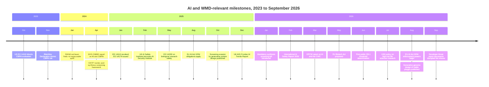
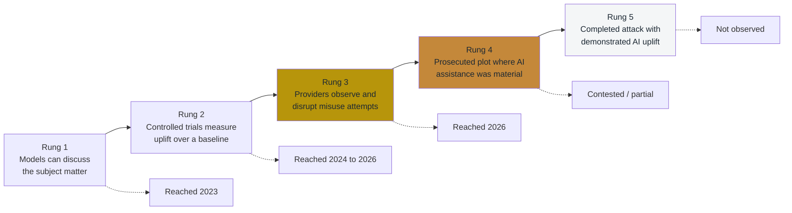
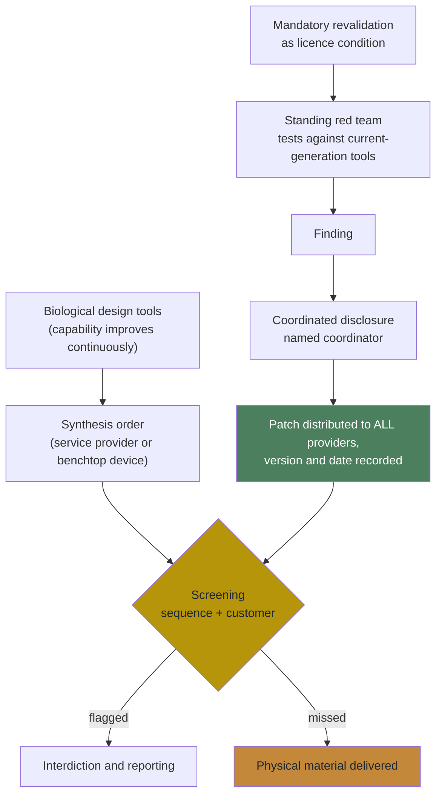
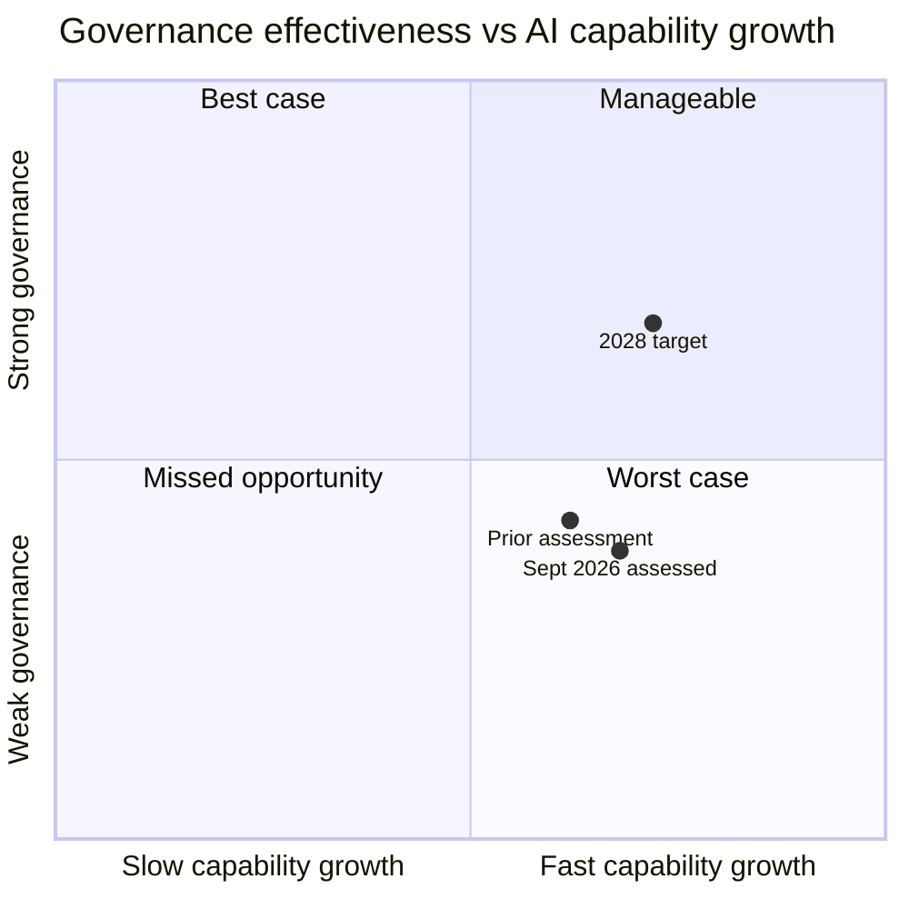
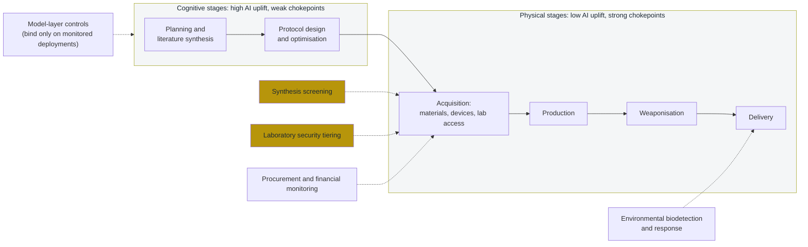

# AI Agents and Weapons of Mass Destruction: A Proliferation Risk Assessment

## A Projection Report on Emerging Risks to Global Security

**Type**: Policy Research - Defensive Analysis

**Document ID**: ETRA-2026-WMD-001

**License**: MIT / Unlicense (Public Domain)

**Version**: 3.0

**Date**: September 2026

**Related Documents**: ETRA-2026-ESP-001 (Espionage Operations), ETRA-2025-AEA-001 (Economic Actors), ETRA-2025-FIN-001 (Financial Integrity), ETRA-2026-IC-001 (Institutional Erosion), ETRA-2026-PTR-001 (Political Targeting)

---

## About This Document

This is a **public policy research document** analyzing how AI capabilities may affect WMD proliferation risks. It is released under permissive open-source licenses to support broad discussion of these issues.

> **Capability snapshot date**: Model capabilities and policy developments described in this document reflect publicly available systems and published assessments as of **22 September 2026**. AI capability is a moving target; the projection's conclusions are intended to be robust to specific model iterations rather than pinned to any single release. Where a named model or evaluation is cited, treat it as an illustrative data point on a trend, not a fixed endpoint.

**Intended audiences**:
- Policy researchers and analysts
- AI safety and security researchers
- Academic communities studying technology governance
- Journalists and commentators covering AI risks
- General public interested in emerging technology policy

**How to use this document**:
- The analysis is framed for *defensive* purposes - understanding risks to inform protective measures
- Technical details that could enable harm are intentionally omitted
- Probability estimates are subjective priors, not predictions - treat them as discussion aids
- When excerpting, please preserve context to avoid misrepresentation

---

## Epistemic Status Markers

Throughout this document, key claims are tagged with epistemic status:

| Marker | Meaning | Evidence Standard |
|--------|---------|-------------------|
| **[O]** | Open-source documented | Published research, official statements, public data |
| **[E]** | Expert judgment / plausible inference | Consistent with theory and limited evidence; gaps acknowledged |
| **[S]** | Speculative projection | Extrapolation from trends; significant uncertainty |

*Claims without markers are framing or synthesis statements.*

---

## Executive Summary

This projection examines how autonomous AI agents may alter the proliferation landscape for weapons of mass destruction (WMD), including biological, chemical, and nuclear weapons. We analyze capabilities and governance as of September 2026, project likely scenarios through 2030, and examine the complex interplay between AI capabilities, existing physical barriers, and potential defensive adaptations.

**Key Findings:**

| # | Finding | Confidence | Horizon | Change since v2.1 |
|---|---------|------------|---------|-------------------|
| 1 | Agentic AI workflows are unlikely to enable a novice (T0) to construct a functional WMD from scratch in the near term (2026-2030), but they will meaningfully lower barriers for T1-T3 actors by aggregating dispersed knowledge and optimizing logistics **[E]** | **High** | Ongoing | Unchanged |
| 2 | Biological weapons represent the highest-risk category due to the increasing accessibility of synthetic biology tools, cloud laboratory services, and the difficulty of detecting biological materials **[E]** | **High** | Immediate | Unchanged |
| 3 | The "tacit knowledge gap" remains a significant barrier, but AI-guided robotic systems, vision-language models, and agent-operated automated laboratories are eroding it **[E]** | **Medium** | 2026-2028 | Strengthened |
| 4 | Nuclear weapons face the strongest physical barriers (fissile material scarcity); AI primarily assists state-level (T4) programs, not non-state actors **[O]** | **High** | Stable | Unchanged |
| 5 | Cyber-physical attacks on existing WMD-adjacent infrastructure (BSL-4 labs, chemical plants) may represent higher near-term risk than de novo synthesis **[E]** | **Medium** | Immediate | Unchanged |
| 6 | The "high-frequency attempts, limited success" scenario is more likely than catastrophic mass-casualty events; defenders should prepare for resource strain from numerous low-sophistication incidents **[E]** | **Medium** | 2026-2028 | Probability raised (see Section 17) |
| 7 | **New in v3.0.** The evidence base moved from "no documented misuse" to "documented and disrupted misuse attempts." A frontier developer publicly reported disrupting multiple accounts pursuing biological misuse between December 2025 and August 2026, and at least one national prosecution of a crude toxin plot reportedly involved chatbot assistance **[O]**[^antthreat2026][^ricin] | **Medium-High** | Immediate | New finding |
| 8 | **New in v3.0.** Sequence screening, the chokepoint on which most of this report's policy stack rests, has been publicly demonstrated to be bypassable by generative protein design and must now be treated as an adversarial, continuously patched system rather than a static database lookup **[O]**[^mspatch] | **High** | Immediate | New finding |

*Confidence levels follow IC standards: **High** = multiple independent sources, consistent with established patterns; **Medium** = plausible based on available evidence but gaps exist; **Low** = possible but significant uncertainty.*

**Why Now? What Changed 2023 → 2026:**

| Capability Shift | 2023 State | September 2026 State | Impact |
|-----------------|------------|-----------------|--------|
| **Agentic autonomy** | Chatbots provided information | Agents execute multi-step tasks with tool use, self-correction, persistence, and delegation to sub-agents **[O]** | Shifts from "knowledge" to "autonomous execution"; multi-agent orchestration compounds capability |
| **Reasoning models** | No explicit chain-of-thought optimization | Dedicated reasoning models are standard, closed and open-weight alike, with multi-step planning **[O]** | Enables complex synthesis planning and optimization previously requiring expert-level reasoning |
| **Vision-language models** | Text-only instruction | Real-time visual interpretation of lab procedures; wearable integration **[O]** | Bridges tacit knowledge gap; hands-free guidance is commodity hardware |
| **Computer Use / Tool Use** | Manual web interaction | Agents browse, fill forms, manage procurement; tool-use protocols reach laboratory instruments **[O]** | Enables procurement obfuscation at scale; direct laboratory equipment integration |
| **Biological design tools** | AlphaFold 2 (structure prediction) | Structure, function, and now **whole-genome** generative design: genome language models produced viable bacteriophage genomes in a peer-reviewed 2026 study **[O]**[^phage2026] | Generative design has moved from parts to organisms; sequence-similarity screening is a weaker filter against novel designs |
| **Open-weight proliferation** | Limited high-capability open models | Frontier-grade open-weight reasoning models are freely downloadable, many permissively licensed; published toolkits measure the "safety gap" created when fine-tuning strips safeguards **[O]**[^openweight][^safetygap] | Guardrail bypass via local deployment is measurable, not hypothetical |
| **Threshold determinations** | Below any weapons-uplift threshold | Multiple developers now deploy their most capable models under elevated CB safeguards: one has repeatedly judged its top models across the non-novel CB uplift (CB-1) threshold but not the novel-weapon (CB-2) threshold, and another treats an entire model family as "High" capability in the biological and chemical domain **[O]**[^opus55card][^gpt56card] | Elevated CB safeguards are now the industry default for frontier releases, not an exceptional measure |
| **Observed misuse** | None publicly documented | Frontier-developer threat intelligence documents disrupted biological-misuse attempts, including efforts to obfuscate intent to evade safeguards **[O]**[^antthreat2026] | The debate shifts from "will anyone try?" to "how many attempts clear the deployment layer?" |
| **Screening integrity** | Assumed sound | Peer-reviewed red-teaming showed generative protein design could evade commercial nucleic-acid screening; patches were distributed through coordinated disclosure, with residual gaps acknowledged **[O]**[^mspatch] | Biosecurity screening acquires a software-patching lifecycle and needs standing red teams |

**Milestone timeline (capability and governance, 2023 → 2026)** **[O]**:

**Scope Limitations**: This document analyzes capabilities and trends for defensive policy purposes. It does not provide operational guidance and explicitly omits technical implementation details that could enable harm. All information draws on publicly available academic literature and policy discussions.

> **Note on Information Hazards**
>
> This document discusses sensitive topics at a level of abstraction appropriate for public policy discussion.
>
> **Intentionally excluded**: Specific synthesis routes, pathogen sequences, precursor sources, equipment specifications, and operational procedures. Where threat concepts are discussed, they are framed for *defender awareness*, not attacker enablement.
>
> **Request to readers**: When sharing excerpts, please preserve surrounding context. Isolated quotes about "what AI enables" without the corresponding barriers and limitations may create misleading impressions.
>
> **On the barriers**: The physical, logistical, and tacit knowledge barriers described in this document remain substantial. This analysis does not provide a roadmap - it provides a framework for thinking about defensive investment.

---

## What This Document Is NOT Claiming

To prevent misreading, we explicitly clarify:

- **NOT claiming an imminent WMD wave.** Actual WMD attacks by non-state actors remain extremely rare. Our assessment is that *attempt frequency* may increase while *success rate* remains low.
- **NOT claiming novices can build WMD.** AI does not transform a T0 (curious novice) into a capable threat actor. The primary effect is upgrading T1–T3 actors who already have partial capability.
- **NOT claiming AI is the dominant proliferation driver.** Geopolitics, state programs, and traditional proliferation pathways remain more significant than AI-enabled non-state threats in most scenarios.
- **NOT claiming restriction-only solutions work.** Access denial is increasingly difficult; effective strategy requires balanced investment in detection, attribution, response, and resilience.
- **NOT claiming high confidence in probability estimates.** Scenario probabilities are subjective priors for decision support, not empirical predictions. Reasonable analysts may assign substantially different values.

---

## Executive Summary (One-Page Version)

> **Quick orientation for readers who need the core arguments without the full analysis.**

### Core Claims (6)

1. **Biological weapons are the highest-risk category** for AI-enabled proliferation due to eroding physical barriers and high AI contribution to knowledge synthesis
2. **AI primarily upgrades T1-T3 actors** (skilled individuals to organized non-state groups); it does not transform novices into capable threat actors
3. **The most likely near-term scenario is high-frequency attempts with limited success** - resource strain and public fear, not mass casualties
4. **Cyber-physical attacks on existing infrastructure** (labs, chemical plants) may be higher-leverage than synthesis assistance
5. **Governance windows are closing** - once capabilities proliferate, restrictions become much harder to implement
6. **New in v3.0: safeguards have migrated from the model to the deployment layer.** Frontier developers now ship capable models behind classifiers, graduated access tiers, and vetted-partner channels rather than withholding capability. That is a real defensive gain for closed APIs and no gain at all for open weights, which is why material and service chokepoints (synthesis, automated labs, procurement) are the only controls that bind across both

### Top 5 Actions

1. **Make nucleic acid synthesis screening mandatory and enforceable**, covering benchtop synthesis devices as well as service providers, with international harmonization
2. **Fund standing red teams and a coordinated-disclosure regime for screening itself** - treat screening as patched software, with version tracking and a published patch cadence
3. **Establish automated- and cloud-laboratory oversight frameworks** (security tiering, customer verification, protocol screening, audit logging) before the attack surface expands further
4. **Require WMD-relevant capability evaluations before frontier AI deployment**, including evaluation-integrity measures that account for models behaving differently when they detect testing
5. **Fund defensive biodetection and rapid countermeasure design** as high-value cross-threat investments

### Top 5 Indicators to Monitor

1. Screening intercept rates, patch cadence, and disclosed evasion findings at synthesis providers
2. Frontier-model threshold determinations and the scope of deployed CB safeguards
3. Automated and cloud laboratory expansion, autonomy level, and security posture
4. Published misuse-disruption reporting from AI providers and law enforcement case records
5. Progress (or lack thereof) on mandatory-screening legislation and international governance coordination

### What Would Change This Assessment

- **Increase concern**: A model judged across a *novel*-weapon (CB-2 class) threshold; open-weight release at comparable capability; agent-operated laboratory used for a harmful protocol; evidence that screening evasion is being attempted operationally rather than only in red teams
- **Decrease concern**: Mandatory screening in force across major jurisdictions with demonstrated interception; durable safeguards under adversarial fine-tuning; an attribution breakthrough; sustained flat or falling misuse-attempt volume in provider reporting

---

## Table of Contents

1. [Introduction and Methodology](#1-introduction-and-methodology)
2. [Theoretical Frameworks](#2-theoretical-frameworks)
3. [Capability and Safeguard Landscape (September 2026)](#3-capability-and-safeguard-landscape-september-2026)
4. [Historical Context: WMD Development and Technology](#4-historical-context-wmd-development-and-technology)
5. [Biological Weapons: The Highest-Risk Domain](#5-biological-weapons-the-highest-risk-domain)
6. [Chemical Weapons: Procurement, Scaling, and Safety Barriers](#6-chemical-weapons-procurement-scaling-and-safety-barriers)
7. [Nuclear Weapons: Physical Barriers and Information Aggregation](#7-nuclear-weapons-physical-barriers-and-information-aggregation)
8. [Gene Drives: Long-Horizon Governance Gap](#8-gene-drives-long-horizon-governance-gap)
9. [Deployment Vectors: Aerosol Systems and Autonomous Delivery](#9-deployment-vectors-aerosol-systems-and-autonomous-delivery)
10. [The Cyber-Physical Convergence](#10-the-cyber-physical-convergence)
11. [Proliferation Financing and Procurement Obfuscation](#11-proliferation-financing-and-procurement-obfuscation)
12. [Counterarguments and Structural Barriers](#12-counterarguments-and-structural-barriers)
13. [The Attribution Problem](#13-the-attribution-problem)
14. [International Variance](#14-international-variance)
15. [Second-Order Effects](#15-second-order-effects)
16. [Policy Recommendations by Stakeholder Type](#16-policy-recommendations-by-stakeholder-type)
17. [Uncertainties and Alternative Scenarios](#17-uncertainties-and-alternative-scenarios)
18. [Signals and Early Indicators](#18-signals-and-early-indicators)
19. [Civil Liberties and Research Freedom Considerations](#19-civil-liberties-and-research-freedom-considerations)
20. [Conclusion](#20-conclusion)

---

## Reading Guide

This document is comprehensive. For targeted reading based on your role:

| Reader Profile | Recommended Sections | Time |
|---------------|---------------------|------|
| **Policymaker / Executive** | Executive Summary (both versions) + Section 16 (Policy Recommendations) + Section 17 (Scenarios) | ~20 min |
| **Security Practitioner** | Sections 9-13 (Deployment, Cyber-Physical, Proliferation Financing, Counterarguments, Attribution) + Section 18 (Signals/Indicators) | ~25 min |
| **AI Safety Researcher** | Sections 1-3 (Methodology, Frameworks, Technology) + Section 12 (Counterarguments) + Appendix E-F (Confidence/Measurement) | ~30 min |
| **Biosecurity Specialist** | Sections 5, 8 (Biological, Gene Drives) + Companion Research box + Section 16 (Policy) | ~20 min |
| **General Reader** | Executive Summary (One-Page) + Section 12 (Counterarguments) + Section 19 (Civil Liberties) + Conclusion | ~15 min |

---

## Related ETRA Reports

This projection is part of a series of Emerging Technology Risk Assessment reports analyzing how AI agents affect different domains. Several reports contain analysis directly relevant to WMD proliferation:

| Report | Key WMD-Relevant Concepts |
|--------|--------------------------|
| **[AI Agents and Espionage Operations](ai-agents-espionage-operations.md)** | "Democratization of tradecraft" parallels WMD barrier reduction; offense-defense timeline (2025-2028 attacker advantage); reduced conspiracy footprint complicates detection |
| **[AI Agents and Financial Integrity](ai-agents-financial-integrity.md)** | "Nano-smurfing" maps to sub-threshold procurement evasion; "weakest-link exploitation" describes jurisdictional arbitrage in export controls; "Know Your Agent" (KYA) framework for accountability |
| **[AI Agents and Institutional Erosion](ai-agents-institutional-erosion.md)** | IC capacity degradation weakens proliferation monitoring; "Delegation Defense" / "Plausible Deniability 2.0" complicates state attribution; "Epistemic Contamination" threatens nonproliferation analysis |
| **[AI Agents and Political Targeting](ai-agents-political-targeting.md)** | Power Diffusion Theory (Cronin) as shared framework; "conspiracy footprint shrinks" with AI planning; 4GW dynamics explain erosion of state monopoly on mass-casualty capability |

Cross-references to these reports appear throughout this document where their analysis directly informs the WMD assessment.

---

## 1. Introduction and Methodology
### Purpose

The development of weapons of mass destruction has historically required either state-level resources or exceptional individual expertise combined with significant infrastructure. The Manhattan Project employed over 125,000 people.[^manhattan] Aum Shinrikyo, despite millions of dollars and multiple PhD scientists, failed to effectively weaponize biological agents. These historical constraints have provided a de facto barrier to WMD proliferation.

We are now entering an era where autonomous AI agents capable of complex multi-step planning, information synthesis, and real-time adaptation become widely accessible. This projection examines whether and how AI agents might erode these historical barriers.

**Critical framing**: This analysis does not assume WMD attacks will increase. The goal is to understand how AI capabilities change the *nature* of proliferation risks, identify which weapon categories face the greatest barrier reduction, and recommend defensive preparations.

### Base-Rate Context

**To prevent fear-driven misreading, we anchor expectations:**

Actual WMD attacks by non-state actors remain extremely rare. The 1995 Tokyo subway attack (sarin) and 2001 anthrax letters represent essentially the entire modern history of non-state WMD use. The overwhelming majority of WMD-related arrests involve early-stage planning with minimal actual capability.

**The dominant near-term concern is likely:**
- Increased frequency of *attempts* with varying degrees of competence
- Crude attacks with limited casualties but significant psychological impact
- State-level proliferation acceleration using AI assistance
- Erosion of verification regimes as AI complicates attribution

Readers should interpret this analysis through that lens: the primary concern is *barrier reduction enabling more attempts*, with catastrophic mass-casualty events remaining low-probability tail risks.

### Methodology

This is a synthesis of publicly available material. It does not report any first-party study. Specifically, it draws on:

- **Published capability assessments** of AI agent systems and synthetic biology tools deployed through September 2026, including frontier-model system cards and their published red-team and uplift-trial results
- **Historical case analysis** of WMD development programs (state and non-state) from the public record
- **Dual-Use Research of Concern (DURC)** literature and policy debates
- **Published expert assessments** across biosecurity, nuclear security, and AI safety, including the RAND biological-attack red-team studies and government risk reports cited throughout
- **Published red-team and uplift-trial findings** from frontier AI developers and independent evaluators (for example the chemical and biological uplift trials reported in AI system cards)

To be explicit about provenance: the author conducted no original expert consultation, no interviews, and no red-team or uplift exercises for this document. Every empirical claim traces to a cited public source. Where this document uses the phrase "our assessment," it means the author's synthesis of that public evidence, offered as decision support, not as an authoritative or classified judgment.

We deliberately avoid:
- Specific technical implementation details for weapon synthesis
- Named pathogen sequences or synthesis routes
- Information not already publicly available in academic literature

### Limitations and Positionality

Readers should weigh this analysis accordingly:

- **Independent single-author synthesis.** This is not an institutional or peer-reviewed assessment. It aggregates and interprets public sources; it does not have access to classified intelligence, proprietary evaluation data, or non-public incident reporting.
- **Open-source ceiling.** Absence of public evidence is not evidence of absence (see "What We've Observed," Section 3). The most decision-relevant information about actual threat activity is likely non-public.
- **Subjective probabilities.** All scenario probabilities are subjective priors for decision support, not empirical estimates (see the Probability Calibration Note in Section 17).
- **Author standpoint.** The author's prior is that barrier reduction is real but that physical and operational barriers remain substantial. Readers who hold different priors on how fast tacit-knowledge and execution barriers are eroding should adjust the conclusions accordingly; the sensitivity analysis in Section 17 is provided partly to support that.

### Definitions

**Chatbot vs. Autonomous Research Agent**: A distinction that remains central in 2026:

| Type | Capability | Risk Profile |
|------|------------|--------------|
| **Chatbot** (2022-2023 era) | Provides information in response to queries; no tool use; no persistence | Knowledge aggregation only |
| **Autonomous Research Agent** (2024-2025 era) | Executes multi-step tasks; uses tools (web browsing, code execution, file management); self-corrects on failure; maintains context across sessions | Shifts from knowledge to execution |
| **Reasoning Agent** (2025-2026 era) | Dedicated chain-of-thought reasoning for complex multi-step planning; can decompose and optimize sophisticated tasks; delegates to sub-agents **[O]** | Enables expert-level planning and optimization; multi-agent orchestration compounds individual capability |

**AI Agent / Agentic Workflow**: An AI system (or coordinated system of models) capable of autonomous multi-step task execution, tool use, and goal-directed behavior with minimal human oversight per action. Modern agents can "loop" - execute a step, observe the result, adjust, and retry without human intervention.

**Computer Use Capabilities**: The ability of AI agents to interact with graphical interfaces, browse websites, fill forms, and operate software as a human would **[O]**. Examples include Claude's "computer use" (2024) and OpenAI's "Operator" (2025). This enables autonomous procurement, identity management, and logistics coordination.

**Biological Design Tools (BDTs)**: Specialized AI models for biological research, distinct from general-purpose LLMs. Examples include AlphaFold 3 (protein-ligand interactions), ESM3 (generative protein design), and RFdiffusion (de novo protein design) **[O]**. These tools often have fewer guardrails than consumer chatbots.

**Weapons of Mass Destruction (WMD)**: Biological, chemical, radiological, or nuclear weapons capable of causing mass casualties. We use the traditional CBRN framework while acknowledging that "mass destruction" thresholds vary significantly across categories.

**Uplift**: The degree to which AI assistance improves a non-expert's ability to accomplish a dangerous task. A key metric in AI safety evaluations.

**Cloud Laboratory**: A commercial service providing remote access to automated laboratory equipment, allowing users to execute experiments without physical presence.

**Gene Drive**: A genetic engineering technology designed to spread a particular genetic modification through a population faster than traditional inheritance.

### Threat Actor Taxonomy

To avoid the misleading implication that "AI democratizes WMD to everyone," this report uses a tiered actor model:

| Tier | Description | Pre-AI Capability | Examples |
|------|-------------|-------------------|----------|
| **T0** | Curious novice | No practical capability | Online researchers, ideologically motivated without resources |
| **T1** | Skilled individual with legitimate access | Limited by knowledge gaps | Disgruntled lab worker, trained chemist |
| **T2** | Small group with funding and logistics | Constrained by coordination and expertise aggregation | Well-funded extremist cell, organized criminal group |
| **T3** | Organized non-state with corruption/insider access | Historically capable of limited CBRN (Aum Shinrikyo) | Terrorist organizations, sophisticated criminal enterprises |
| **T4** | State or state-backed actor | Full WMD capability (historical programs) | Nation-state programs, state-sponsored proxies |

**How to use this taxonomy**: Throughout this report, we assess which tiers AI meaningfully upgrades. The key insight is that AI primarily benefits T1-T3 actors by reducing knowledge aggregation and planning barriers - it does not transform T0 into T3.

---

## 2. Theoretical Frameworks
This analysis draws on several established theoretical frameworks from security studies, biosecurity, and technology policy.

### Unified Risk Model

The following model underpins the analysis throughout this document. This is the single canonical risk equation used everywhere in the report, including the quantitative decomposition in Section 17:

> **Risk = Capability-Access × Intent Prevalence × Operational Execution × (1 − Interdiction) × Impact Scale**

Where **Capability-Access** combines two sub-components the report tracks separately: the *cognitive* barrier (knowing what to do, where AI contributes most) and the *materials/tools* barrier (physical access, which AI largely cannot address). The table below shows how AI affects each factor and how the factor is trending for the highest-risk and lowest-risk weapon categories.

| Factor | AI Contribution | Bio (2026 to 2030) | Nuclear (to 2030) |
|--------|-----------------|--------------------|-------------------|
| **Capability** (cognitive: can attempt) | High: knowledge synthesis | Rising fast | Stable |
| **Access** (materials/tools) | Medium: cloud labs, synthesis services | Rising | Stable (fissile barrier) |
| **Intent Prevalence** (motivation) | None: AI does not create motivation | Stable | Stable |
| **Operational Execution** (attempt to success) | Medium: guidance, troubleshooting | Rising (slowly) | Stable |
| **Interdiction** (detection rate) | Mixed: AI helps both attackers and defenders | Declining (under pressure) | Stable (strong) |
| **Impact Scale** (harm if success) | Low: physics and biology constrain | Wide range | Catastrophic |

**Key insight**: AI primarily affects Capability and Access, the cognitive barriers. Physical barriers, Intent Prevalence, and Impact Scale are largely AI-independent.

**How to read this model**: Each section of this report examines how AI affects specific multipliers in this equation. The probability decomposition in Section 17 applies the same equation quantitatively, with Capability and Access combined into a single "Capability Access" term.

### Capability Thresholds: The CB-1 / CB-2 Framework

By mid-2026, frontier AI developers had converged on explicit capability thresholds for chemical and biological weapons, most visibly in one developer's Responsible Scaling Policy and Frontier Compliance Framework.[^fable5card] These thresholds are a useful shared vocabulary for defenders because they separate two very different risks that the "AI and bioweapons" discourse often blurs together:

| Threshold | Definition | What it maps to in this report |
|-----------|------------|--------------------------------|
| **CB-1: non-novel weapons uplift** | The model can significantly help individuals or groups with *basic technical backgrounds* (for example undergraduate STEM) create, obtain, or deploy *known* chemical or biological weapons with catastrophic potential | Barrier reduction for T1-T3 actors on *existing* agents; the central near-term concern of this report |
| **CB-2: novel weapons uplift** | The model can *functionally substitute* for the scarce world-leading expertise that is currently the primary barrier to *novel* chemical/biological weapons (end-to-end design, validation, formulation, and dissemination) | The tacit-knowledge / expertise-bottleneck barrier (Section 2, Section 12); a higher and less-certain bar |

**Why this matters for the report's thesis**: The first public developer determination (June 2026) placed its most capable model *across CB-1 but not clearly across CB-2*, and explicitly warned that world-class expert substitution "may now be possible in a few areas."[^fable5card] Three months and three model releases later, the picture had not reversed: by the September 2026 flagship system card the same developer again judged CB-1 crossed and CB-2 not, noting the model did not improve on several of the weaknesses it had treated as disqualifying for CB-2 in the preceding generation, and shipped it with expanded biology classifiers.[^opus55card] A second major developer independently placed a whole model family at "High" capability in the biological and chemical domain under its own framework.[^gpt56card]

Two readings of that stability are available, and defenders should hold both:

- **The optimistic reading [E]**: CB-2 is a genuine capability plateau. The disqualifying weaknesses are not incidental bugs but structural limits, and expert substitution for *novel* agent design is further away than a naive capability extrapolation suggests.
- **The cautious reading [E]**: CB-2 is a *measurement* plateau. The thresholds are self-assessed by the developers who also decide what to release, the disqualifying weaknesses are defined by those same evaluations, and evaluation-aware models complicate the evidence (Section 12). Three same-year determinations from one vendor are three correlated observations, not three independent ones.

This report treats the plateau as real but weakly evidenced, and does not rest any policy recommendation on it. The distinction still shapes defensive priorities: CB-1 risk is best addressed by chokepoint controls on materials, synthesis, and laboratory services, which do not depend on how capable any model is, whereas CB-2 risk is where model-level access controls, weight security, and independent capability evaluation matter most.

### The Democratization of Lethality

**Audrey Kurth Cronin's framework** from "Power to the People" (2020) describes how each technological era redistributes the capacity for violence. AI represents the latest such redistribution, but with a crucial difference: previous technologies (dynamite, small arms) democratized *physical* capabilities. AI democratizes *cognitive* capabilities - the planning, knowledge synthesis, and optimization that previously required years of specialized training.

For WMD, this means:
- The barrier was never purely physical (materials exist)
- The barrier was also cognitive (knowing what to do with materials)
- AI specifically attacks the cognitive barrier while physical barriers remain

> **Cross-reference**: The [Espionage Operations report](ai-agents-espionage-operations.md) frames the same dynamic as AI bypassing the "Handler Bottleneck", the cognitive/emotional bandwidth limitation that previously constrained intelligence operations to state-level actors. For WMD, the analogous concept is an "expertise bottleneck" that AI is beginning to erode for T1-T3 actors. The [Political Targeting report](ai-agents-political-targeting.md) extends Cronin's framework to show how AI reduces the "conspiracy footprint" required for planning complex operations, directly relevant to WMD acquisition coordination.

### Dual-Use Research of Concern (DURC)

The **DURC framework**, developed through debates over H5N1 transmissibility research (2011-2012), recognizes that legitimate scientific research can generate knowledge applicable to harmful purposes. Key insights:

- Information cannot be "un-discovered"
- Publication decisions involve weighing scientific benefit against misuse potential
- The research community has historically self-regulated through institutional review

AI agents challenge this framework because:
- They can synthesize DURC-relevant information from dispersed, individually innocuous sources
- Publication decisions become moot when AI can reconstruct restricted information
- Self-regulation assumes human researchers as the primary actors

### The Tacit Knowledge Gap

**Michael Polanyi's concept of tacit knowledge** - skills that cannot be fully articulated and must be learned through practice - is central to understanding WMD barriers. Much of weapons development relies on:

- Sensory cues (colors, textures, smells indicating reaction progress)
- Equipment calibration requiring hands-on experience
- Safety protocols learned through practice
- "Laboratory intuition" accumulated over years

AI agents can transmit explicit knowledge but traditionally cannot transfer tacit knowledge. However, two developments challenge this:

1. **AI-guided instruction**: Real-time guidance that interprets user observations and provides adaptive feedback
2. **Cloud laboratories**: Robotic systems that embody tacit knowledge in automated protocols

### Information Hazards Framework

**Nick Bostrom's concept of "information hazards"** identifies categories of knowledge that, once disseminated, can cause harm regardless of intent:

- **Data hazards**: Specific information enabling harmful actions (pathogen sequences, synthesis routes)
- **Idea hazards**: Concepts that suggest new harmful possibilities
- **Attention hazards**: Drawing attention to vulnerabilities

AI agents challenge information hazard management because:
- They can reconstruct restricted information from dispersed innocuous sources
- They lower the barrier from "knowledge" to "actionable guidance"
- They can personalize dangerous information to specific user capabilities

### The Unilateralist's Curse

**Bostrom and Ord's "Unilateralist's Curse"** describes a critical dynamic: when a capability becomes accessible to many actors, even if the vast majority (99.9%) are responsible, the small minority (0.1%) who would misuse it will eventually do so.

For AI and WMD:
- AI democratizes access to planning and synthesis knowledge
- As millions gain access, the "curse" becomes statistically inevitable
- The question shifts from "whether" to "when" and "how catastrophic"
- Defensive strategies must assume misuse will be attempted

### Offense-Defense Balance

Security studies' **offense-defense balance** theory asks whether prevailing technology favors attackers or defenders. For WMD and AI:

| Factor | Favors Offense | Favors Defense |
|--------|---------------|----------------|
| Knowledge accessibility | AI aggregates dispersed information | AI can also detect dangerous queries |
| Physical materials | Some barriers eroding (DNA synthesis) | Nuclear/chemical materials remain controlled |
| Attribution | AI complicates attribution | AI forensics improving |
| Detection | Novel agents may evade detection | AI-enhanced surveillance possible |
| Response speed | Attack can occur without warning | Defensive AI can monitor in real-time |

The balance varies significantly across WMD categories, which is why biological, chemical, and nuclear weapons require separate analysis.

### Key Literature

| Work | Author(s) | Relevance |
|------|-----------|-----------|
| *Power to the People* | Audrey Kurth Cronin (2020) | Technology diffusion and non-state violence |
| *Biohazard* | Ken Alibek (1999) | Soviet bioweapons program; scale of state capabilities |
| *Germs* | Miller, Engelberg, Broad (2001) | History of biological weapons programs |
| *The Demon in the Freezer* | Richard Preston (2002) | Smallpox and bioweapons policy |
| *Destined for War* | Graham Allison (2017) | Great power dynamics affecting proliferation |
| *Nuclear Terrorism* | Graham Allison (2004) | Non-state nuclear threats assessment |
| *Personal Knowledge* | Michael Polanyi (1958) | Tacit knowledge theory |
| *NIST AI RMF* | NIST (2023) | AI risk management framework |
| *Information Hazards* | Nick Bostrom (2011) | Framework for dangerous knowledge |
| *The Unilateralist's Curse* | Bostrom & Ord (2015) | Why misuse becomes inevitable with proliferation |
| *The Operational Risks of AI in Large-Scale Biological Attacks: Results of a Red-Team Study* | Mouton, Lucas, and Guest, RAND Corporation (2024) | Red-team study finding no measurable uplift from the then-current model generation **[O]**[^rand2024] |
| *Countdown to Zero Day* | Kim Zetter (2014) | Stuxnet and cyber-physical attacks |
| *Strengthening nucleic acid biosecurity screening against generative protein design tools* | Horvitz et al., *Science* (2025) | Demonstrated and patched screening evasion; reframes screening as an adversarial system **[O]**[^mspatch] |
| *International AI Safety Report 2026* | Bengio et al. (2026) | Multilateral scientific consensus statement on AI capability and risk, including chemical and biological **[O]**[^iasr2026] |
| *Frontier AI Trends Report* | UK AI Security Institute (2025) | Government-run evaluation evidence on chemistry/biology knowledge and agentic biological design **[O]**[^aisitrends] |
| *Automated Laboratory Security Tiers* | *Frontiers in Microbiology* (2026) | Latent-capability tiering framework for automated laboratory oversight **[O]**[^labtiers] |
| *Generative design of bacteriophages with genome language models* | *Science* (2026) | Whole-genome generative design; beneficial application and the layered-safeguards response **[O]**[^phage2026] |

### 2023-2026 Policy Developments

| Reference | Date | Relevance |
|-----------|------|-----------|
| **Bletchley Declaration** | November 2023 | First international consensus on frontier AI risks including CBRN **[O]** |
| **US Executive Order 14110** (Section 4.4) | October 2023 | Mandated DOE/DHS evaluation of AI role in CBRN threats; subsequently revoked January 2025 **[O]** |
| **Seoul AI Safety Summit Commitments** | May 2024 | Extended Bletchley with specific bio-risk language **[O]** |
| **DHS CWMD report on AI and CBRN** | April 2024 | US Department of Homeland Security assessment of AI-CBRN risk intersection, mandated by EO 14110 **[O]**[^dhscbrn] |
| **RAND red-team biological-attack study** | 2024 | Red-team study finding no statistically significant uplift from the then-current LLM generation; recommended continued monitoring **[O]**[^rand2024] |
| **OSTP Framework for Nucleic Acid Synthesis Screening** | April 2024 | US framework encouraging synthesis providers to screen orders and verify customers **[O]**[^naframework] |
| **Anthropic Responsible Scaling Policy / Frontier Compliance Framework** | 2023-2026 | Capability thresholds for autonomy and for chemical/biological weapons (CB-1 non-novel, CB-2 novel) **[O]**[^fable5card] |
| **EO 14110 revocation; EO 14179** | January 2025 | US rescinded the prior AI safety executive order (Jan 20) and issued "Removing Barriers to American Leadership in AI" (Jan 23), shifting toward lighter-touch governance and an AI Action Plan **[O]**[^eo14179] |
| **UK AI Safety Institute becomes AI Security Institute** | February 2025 | Rebrand signaling a focus on security-relevant AI risks, explicitly including chemical and biological weapons and cyber-attacks **[O]**[^ukaisi] |
| **EO "Improving the Safety and Security of Biological Research"** | May 2025 | Directs OSTP to revise or replace the 2024 synthesis-screening framework; makes framework adherence a condition of federal life-sciences funding for purchases on or after April 26, 2025 **[O]**[^bioeo2025] |
| **America's AI Action Plan** | July 2025 | Successor US federal strategy emphasizing AI leadership, with national-security and biosecurity workstreams **[O]**[^eo14179] |
| **EU AI Act GPAI obligations in force** | August 2025 | Obligations for general-purpose AI models apply; systemic-risk tier (models trained above 10^25 FLOP) carries safety-and-security duties under the GPAI Code of Practice; Commission enforcement from August 2026 **[O]**[^euaiact] |
| **Open-weight frontier reasoning models proliferate** | 2025-2026 | DeepSeek, Qwen, Llama, Kimi and others ship frontier-grade reasoning weights, many permissively licensed, largely without enforceable runtime guardrails; published toolkits now quantify the "safety gap" that opens when fine-tuning removes safeguards **[O]**[^openweight][^safetygap] |
| **Screening evasion demonstrated and patched** | October 2025 | A peer-reviewed study showed generative protein design tools could produce variants of toxin sequences that evaded commercial nucleic-acid screening; a ten-month coordinated disclosure delivered patches to providers worldwide, with the authors stating residual gaps remain **[O]**[^mspatch] |
| **UK AISI Frontier AI Trends Report** | December 2025 | First consolidated public assessment from two years of UK government testing: leading models answer hundreds of private expert-written chemistry and biology questions at PhD-expert levels, and scaffolded agents are increasingly useful for elements of biological design **[O]**[^aisitrends] |
| **Biosecurity Modernization and Innovation Act (S.3741)** | January 2026 | Bipartisan US bill (Cotton, Klobuchar) directing Commerce to make nucleic acid synthesis screening of sequences *and* customers mandatory and federally enforceable, with exemptions for clearly non-hazardous orders; endorsed by nonproliferation NGOs, not enacted as of this snapshot **[O]**[^s3741] |
| **International AI Safety Report 2026** | February 2026 | Second edition, chaired by Yoshua Bengio with 100+ experts and 30+ backing states: general-purpose AI can supply chemical and biological information including laboratory instructions and troubleshooting, while stressing substantial uncertainty about how far that raises real-world risk given material barriers **[O]**[^iasr2026] |
| **OPCW Scientific Advisory Board report on AI** | March 2026 | First OPCW assessment of AI as a cross-cutting issue for Chemical Weapons Convention implementation, covering verification, industry practice, and training, and identifying AI-supported processing of declarations as a verification opportunity **[O]**[^opcwai] |
| **EU Biotech Act proposed** | May 2026 | Commission proposal adds harmonised rules for preventing biotechnology misuse: screening and reporting duties for certain high-risk products *and benchtop nucleic acid synthesis equipment*, an Advisory Group on Biosecurity, a Commission duty to monitor "biological systemic risk" from AI models in biological applications, and penalties up to 5% of worldwide annual turnover **[O]**[^biotechact] |
| **First public developer CB-1 threshold determination** | June 2026 | A frontier developer's system card judged its most capable model to have crossed the non-novel CB weapons uplift threshold (CB-1), while stopping short of the novel-weapon threshold (CB-2) with "significant uncertainty" **[O]**[^fable5card] |
| **US policy for stopping high-risk life sciences research** | July 2026 | Issued 20 July 2026 under EO 14292: prohibits federal funding for research meeting its definition of dangerous gain-of-function work, creates a review process and an interagency review board, restricts certain international research activity, and directs OSTP to convene an interagency group monitoring the biology-AI intersection including in silico research. It does not broadly prohibit AI-enabled biological research **[O]**[^dgof2026] |
| **EU AI Act GPAI enforcement powers begin** | August 2026 | Commission and AI Office supervision and enforcement powers over general-purpose AI providers applied from 2 August 2026, one year after the obligations themselves; 20+ providers had signed the GPAI Code of Practice **[O]**[^euaiact] |
| **Generative genome design demonstrated** | August 2026 | Peer-reviewed work used genome language models to design complete bacteriophage genomes; of roughly 300 synthesized designs, 16 viable phages were recovered. The training corpus excluded viruses infecting humans, and the authors and commentators emphasised synthesis screening plus layered safeguards as the critical control points **[O]**[^phage2026] |
| **BWC Working Group nears its deadline** | February and August 2026 | Eighth and ninth sessions of the Working Group on Strengthening the Convention; a large majority of draft report text was agreed but verification, transfer controls, and financing remained contested ahead of the Tenth Review Conference (to be held no later than 2027) **[O]**[^bwcwg] |
| **Frontier developer misuse reporting** | September 2026 | A developer threat-intelligence report covering December 2025 to August 2026 described disrupted operations across seven harm areas including biological misuse, with case studies of users circumventing controls and obfuscating the stated purpose of their work **[O]**[^antthreat2026] |
| **Elevated CB safeguards become the release default** | July-September 2026 | Successive frontier releases shipped under elevated chemical/biological safeguards: one developer treated a whole model family as "High" capability in the biological and chemical domain under its preparedness framework, and another extended expanded biology classifiers to its flagship reasoning model while again judging CB-1 crossed and CB-2 not **[O]**[^gpt56card][^opus55card] |

---

## 3. Capability and Safeguard Landscape (September 2026)
### AI Agent Capabilities

AI agents as of September 2026 can:

- Synthesize information from thousands of scientific papers in seconds
- Conduct extended multi-step research tasks with minimal supervision
- Operate tools including web browsers, code execution, and API interactions
- Interface with laboratory information management systems (LIMS) and laboratory hardware via protocols such as MCP (Model Context Protocol)
- Generate and optimize experimental protocols
- Analyze results and iteratively refine approaches
- Maintain persistent goals across sessions
- Delegate sub-tasks to specialized sub-agents, enabling multi-agent workflows where no single agent sees the complete picture
- Perform extended chain-of-thought reasoning for complex planning and optimization tasks (reasoning models)

For biosecurity-relevant capabilities specifically:

- **Protein structure prediction**: AlphaFold and successors provide detailed structural information previously requiring years of laboratory work
- **Sequence design**: AI can suggest genetic modifications to achieve specified functions
- **Literature synthesis**: Agents can identify relevant findings across fragmented scientific literature
- **Protocol optimization**: AI can improve success rates for complex laboratory procedures

### Capability Trend: Vision-Language Models and Tacit Knowledge Erosion

**Why this matters for defenders**: The traditional "tacit knowledge" barrier assumed that laboratory skills require hands-on training. Vision-Language Models (VLMs) that can "see" through cameras may be beginning to erode this barrier.

**Capability evolution (for monitoring purposes)**:

| Generation | Capability | Tacit Knowledge Impact |
|------------|------------|----------------------|
| Text-only LLMs (2022-2023) | Written instruction only | Cannot interpret physical observations |
| Basic VLMs (2024) | Static image interpretation | Can identify equipment, reagents |
| Advanced VLMs (2025) | Real-time video analysis | Can provide feedback on ongoing procedures |
| Agent-operated automation (2026) | Instrument control through tool-use protocols and lab APIs | The question shifts from coaching a human to removing the human from the loop |

**Two distinct erosion paths**: The 2025 framing treated VLM coaching as the main threat to the tacit-knowledge barrier. By September 2026 a second and arguably more consequential path is visible. Coaching *transfers* tacit skill to a person and remains error-prone; automation *bypasses* the need for it entirely by having the instrument execute a machine-readable protocol. Automation is also the path with a real chokepoint, because it runs on identifiable services and devices that can be screened, tiered, and logged. Coaching happens on a general-purpose model and a consumer camera, and is essentially ungovernable. Defenders should therefore invest against automation, where control is possible, and plan for resilience against coaching, where it largely is not.

**What defenders should monitor**:
- VLM benchmark performance on laboratory procedure interpretation, and integration with wearable camera hardware
- Adoption of agent-to-instrument protocols and lab automation APIs, including in non-institutional settings
- Availability of domain fine-tuning for scientific VLMs
- Educational chemistry and biology applications with repurposing potential

**Current state assessment** **[E]**: VLMs interpret laboratory images and provide general guidance; reliable real-time coaching of a novice through an unfamiliar procedure remains limited, and a failed procedure is often unrecoverable. The coaching gap is narrowing slowly. The automation gap is closing faster, because it is an engineering problem rather than a perception problem.

**Actor tier relevance**: VLM-assisted guidance primarily benefits T1-T2 actors (individuals with some training seeking to expand capabilities). T0 actors still lack the baseline competence to benefit; T3-T4 actors have access to human expertise.

### Capability Trend: Multi-Agent Delegation and Tool-Use Protocols

**Why this matters for defenders**: Modern AI agent frameworks increasingly support multi-agent delegation, where a "supervisor" agent decomposes a complex task and delegates sub-tasks to specialized "worker" agents. This creates a qualitatively different risk profile from single-agent systems.

**The multi-agent risk**:
- No single agent sees the complete picture of a harmful workflow
- Per-model safety guardrails may not trigger because each sub-task appears innocuous in isolation
- Example: Agent A researches pathogen biology (legitimate query); Agent B optimizes a synthesis protocol (legitimate chemistry); Agent C coordinates procurement (legitimate commerce), and no individual agent processes a "build a weapon" request, but the orchestrating system assembles the pieces
- This parallels the "fragmented procurement" pattern discussed in Section 11, but applied to the *knowledge* layer rather than the *materials* layer

**Tool-use protocols (MCP and similar)** **[O]**:
- The Model Context Protocol (MCP) and similar frameworks enable AI agents to directly interact with external tools: laboratory equipment, procurement platforms, financial services, and hardware control systems
- This moves agents beyond web browsing and code execution to *physical actuation*, a qualitative shift from information provision to real-world effect
- Cloud laboratory services increasingly expose API endpoints that MCP-enabled agents can operate directly
- The combination of multi-agent delegation + tool-use protocols creates the potential for autonomous end-to-end workflows from research through procurement to execution

**Defender monitoring priorities**:
- Multi-agent orchestration frameworks and their adoption patterns
- MCP server deployments in laboratory and research settings
- Tool-use protocol standardization that could enable cross-platform agent interoperability
- API access patterns suggesting automated agent-driven laboratory workflows

**Actor tier relevance**: Multi-agent orchestration primarily benefits T2-T3 actors with the technical sophistication to deploy and coordinate agent systems. However, as "agent-as-a-service" platforms emerge, the barrier to multi-agent orchestration is dropping toward T1.

### Capability Trend: Reasoning Models and Complex Planning

**Why this matters for defenders**: Dedicated reasoning models (Claude with extended thinking, the o-series, and open-weight systems such as DeepSeek V4 with tiered "think" modes) represent a step change in AI planning capability. Unlike standard language models that generate responses in a single forward pass, reasoning models perform extended internal chain-of-thought before producing output **[O]**.

**What reasoning models enable**:
- Multi-step synthesis planning that considers reagent availability, equipment constraints, and safety procedures simultaneously
- Optimization of complex procedures with many interdependent parameters
- Identification of non-obvious alternative approaches when primary routes are blocked
- Detailed troubleshooting guidance when procedures deviate from expectations

**The agentic loop amplifier**: The combination of reasoning models with agentic tool use creates a particularly significant capability shift. A reasoning agent can:
1. **Plan**: Decompose a complex goal into executable steps with explicit chain-of-thought
2. **Execute**: Use tools to carry out each step (web search, code execution, API calls, laboratory commands)
3. **Observe**: Analyze the results of execution
4. **Adjust**: Revise the plan based on observed outcomes
5. **Retry**: Iterate without human intervention until the goal is achieved or abandoned

This "agentic loop" is qualitatively different from single-query chatbot interaction. Where a chatbot provides one-shot information that a human must interpret and act on, an agentic reasoning system can *iterate through failures autonomously*, the same adaptive learning that makes human experts effective, now operating at machine speed.

**Current limitation** **[E]**: As of September 2026, reasoning models excel at well-defined planning tasks but remain unreliable for novel physical procedures where ground-truth feedback is ambiguous. The gap between planning quality and execution reliability remains significant but is narrowing with each model generation.

**Actor tier relevance**: Reasoning models are widely available (including open-weight: DeepSeek V4, Qwen 3.5). They primarily benefit T1-T3 actors by providing the kind of systematic, multi-step planning that previously required expert-level domain knowledge.

### Governance Challenge: Open-Weight Models

**The policy gap**: Most AI safety measures (guardrails, usage monitoring, refusal training) exist at the API level for closed commercial models. Open-weight models that can be run locally or fine-tuned present a distinct governance challenge.

**The 2026 shift: safeguards moved from the model to the deployment** **[O]**. Through 2026 the frontier pattern settled into something that was not obvious in 2024. Developers did not withhold capable models; they shipped them behind *deployment-layer* controls: capability classifiers that restrict frontier biology and fall the user back to a less capable model, graduated access tiers, vetted-partner channels for unsafeguarded configurations, and account-level threat monitoring.[^fable5card][^opus55card][^gpt56card] This has a defensive logic (it preserves beneficial use while narrowing misuse) and a structural consequence this report considers under-appreciated:

> **Every one of those controls is a property of the serving stack, not of the weights.** None of them survives a weight download. The governance gap between closed and open deployment is therefore not shrinking as safeguards improve; it is widening, because all of the improvement accrues to one side.

This is the strongest available argument for concentrating public investment in controls that bind regardless of which model was used: synthesis screening, automated-laboratory security tiers, procurement and financial monitoring, and detection. Those controls are indifferent to whether the planning was done on a monitored API or on a laptop.

**The landscape (2026)**:

| Model Type | Guardrails | Monitoring | Fine-tuning | Governance Lever |
|------------|------------|------------|-------------|------------------|
| Frontier closed API | Strong; increasingly classifier-based with graduated access tiers | Yes, including account-level threat intelligence | Limited | Provider responsibility; deployment-layer controls |
| Open-weight general | Varies at release | No (local) | Yes | Release decisions only |
| Open-weight reasoning | Often minimal, and measurably removable | No (local) | Yes | Extremely difficult; reasoning capability is general-purpose |
| Fine-tuned variants | Often removed; the "safety gap" between pre- and post-fine-tuning behaviour is now a published, measurable quantity **[O]**[^safetygap] | No | Already done | Difficult to control |
| Specialized biology models and BDTs | May be absent | No | Domain-specific | Research community norms; proposed EU duty to monitor "biological systemic risk" from AI in biological applications **[O]**[^biotechact] |

**A measurement worth institutionalising [E]**: the safety gap - the difference in dangerous-capability behaviour before and after cheap safeguard removal - is the right pre-release metric for open-weight decisions, because it measures what an adversary will actually face rather than what a compliant user faces. Published toolkits now compute it.[^safetygap] Requiring and publishing a safety-gap figure alongside open-weight releases would be a low-cost, high-information governance step, and unlike a release veto it is compatible with open-science norms.

**What defenders should monitor**:
- Release decisions for high-capability open-weight models, and published safety-gap figures where available
- Emergence of specialized fine-tunes in concerning domains
- Dark web availability of "jailbroken" or domain-specialized variants
- Compute accessibility for running large open-weight models

**Policy implications**:
1. **Pre-release evaluation**: Capability assessments before open-weight release
2. **Compute governance**: High-capability models may require substantial compute, creating a monitoring opportunity
3. **Community norms**: Engaging the open-source AI community on responsible release
4. **Accepting limitations**: Some proliferation is likely unavoidable; invest in detection and response accordingly

**Actor tier relevance**: Open-weight models primarily benefit T2-T3 actors with technical sophistication to deploy and potentially fine-tune models. T0-T1 actors are more likely to use accessible commercial APIs (where guardrails apply).

> **A real-world graduated-access example (mid-2026)**: One frontier developer, on judging its most capable model to sit near the novel-weapon (CB-2) boundary, chose *not* to release that model's frontier biology capabilities to the general public. Instead it split the release: a general-access configuration with classifiers that restrict frontier biology and fall the user back to a less-capable model when triggered, and a safeguards-lifted configuration made available only to a small number of vetted, trusted partners with beneficial use cases.[^fable5card] This is a concrete instance of the graduated-access and capability-bounding governance this report recommends (see Section 16 and the BioForge companion box in Section 5). It also illustrates the limit of the approach: the developer noted that a sufficiently resourced state actor could still attempt to obtain the unsafeguarded capabilities through model-weight theft, which is why weight security and detection matter alongside access tiers.

**Institutional references**:
- NIST AI 600-1: AI Risk Management Framework companion guidance
- The Nucleic Acid Synthesis Screening Framework (OSTP 2024; revised under EO 14292, May 2025)[^naframework][^bioeo2025]
- The US Government Policy for Stopping High-Risk Life Sciences Research (July 2026), including its directed interagency monitoring of the biology-AI intersection[^dgof2026]
- EU AI Act GPAI obligations, enforceable by the Commission from August 2026[^euaiact]
- Frontier Model Forum voluntary commitments on capability evaluation
- Frontier developer Responsible Scaling / Frontier Compliance and Preparedness Frameworks with CB-1/CB-2 and comparable thresholds[^fable5card][^gpt56card]

### Synthetic Biology Infrastructure

The synthetic biology infrastructure has expanded dramatically:

**DNA Synthesis Services**:
- Multiple commercial providers offer gene synthesis services
- Turnaround times measured in days to weeks
- Costs have dropped to the order of cents per base pair for the cheapest services[^synthcost]
- Screening protocols exist but vary in rigor, and since October 2025 are known to be evadable in principle by generative design (see "Screening as an Adversarial System," Section 5)[^mspatch]
- Benchtop synthesis devices move capability outside the service-provider chokepoint; the proposed EU Biotech Act would for the first time require screening mechanisms in the devices themselves **[O]**[^biotechact]

**Cloud and Automated Laboratory Services**:
- Commercial platforms offer remote access to automated wet labs; equipment includes liquid handlers, thermal cyclers, and sequencers
- Users execute protocols without physical laboratory access, and increasingly submit them through APIs that AI agents can drive directly
- Agent-to-instrument protocols and "experiment-as-code" stacks published in 2026 make closed-loop design-execute-analyse cycles a standard research pattern rather than a demonstration **[O]**
- US federal programs are actively expanding this infrastructure to generate AI-ready biological data, which raises the governance stakes: the same buildout that accelerates legitimate science also enlarges the remotely reachable attack surface **[O]**[^cslcloud]

**Open-Source Tools**:
- Comprehensive bioinformatics toolkits freely available
- CRISPR design tools accessible to non-experts
- Community protocols for common procedures
- Educational resources lowering learning curves

### Current Safeguards

**DNA Synthesis Screening**:
- International Gene Synthesis Consortium (IGSC) guidelines, covering both sequence and customer screening
- Screening against databases of known pathogen and toxin sequences
- Customer verification requirements (varying enforcement)
- US adherence is conditioned on federal life-sciences funding rather than imposed by statute; legislation to make screening mandatory and federally enforceable was introduced in January 2026 but not enacted as of this snapshot **[O]**[^s3741]
- The EU is moving toward harmonised screening obligations that would, for the first time, also reach benchtop synthesis devices **[O]**[^biotechact]
- Limitations: novel or generatively redesigned sequences may not match known threats; not all providers participate; coverage is a patchwork across jurisdictions

**Export Controls**:
- Australia Group guidelines on biological agents and equipment
- Varying national implementation
- Challenges with dual-use equipment (legitimate applications)

**Institutional Biosafety**:
- Institutional Biosafety Committees (IBCs) at research institutions
- Select Agent regulations for dangerous pathogens
- BSL-4 laboratory requirements for most dangerous work
- Limitations: applies to institutional settings, not all actors

### What We've Observed (Through September 2026)

Evidence regarding AI-assisted biosecurity threats, categorized by epistemic status.

**The single most important change since v2.1**: the evidence base crossed from *measured in laboratories* to *observed in the wild*. Version 2.1 could accurately state that there were "no documented cases of AI-enabled biological weapon development in the wild." That sentence is no longer available. It has been replaced by something narrower but real: documented, disrupted *attempts to misuse* deployed models for biological work, reported by the developer that disrupted them.

**The evidence ladder, and where 2026 landed us** **[E]**:

Each rung is a materially different evidentiary claim, and public debate routinely conflates them. Rung 3 is where 2026 put us. Rung 5 remains unobserved, and this report does not assert otherwise.

**Observed misuse attempts (new in v3.0)** **[O]**:
- A frontier developer's threat-intelligence reporting for December 2025 to August 2026 described identifying and disrupting operations across seven harm areas, one of which was biological misuse. The reported pattern is the analytically important part: users circumvented controls and obfuscated the stated purpose of their work to evade safeguards, rather than asking directly for weapons help.[^antthreat2026]
- This is consistent with what the multi-agent and fragmentation analysis in this section predicts: as direct requests reliably fail, the residual risk migrates to *decomposed and mis-framed* requests that each look legitimate.
- **Interpretive caution**: "disrupted misuse attempts" is not "weapons programs." The public record does not establish the sophistication, resourcing, or intent of the accounts involved, and a provider's own reporting is both the best and the only available source. Treat it as evidence that the demand signal is real and non-trivial, not as evidence of capability.
- Separately, a national prosecution of a crude toxin plot, arrested November 2025 with charges filed in May 2026, reportedly involved the use of general-purpose chatbots and search for guidance.[^ricin] This is a *low-tech* case involving a widely known plant toxin, and it is best read as evidence for the "high-frequency attempts, limited success" scenario and for T1 uplift, not for de novo synthesis capability.

**The measured-uplift trajectory (2024 to 2026)** **[O]**:
- The 2024 RAND red-team study found *no statistically significant difference* in the viability of biological-attack plans produced with versus without the then-current LLM generation.[^rand2024] As of 2024, the honest reading was "limited current uplift, monitoring needed."
- By mid-2026, a frontier developer's own published evaluations reached a different conclusion for its most capable model. In a beneficial red-team tabletop exercise, generalist PhD biologists paired with the model produced end-to-end scientific strategies that two of three generalist teams rated at or above what dedicated world-leading specialist teams produced, and estimated graders judged that work would have taken 40 to 95 working days (average ~72.5) without AI tools but was accomplished in roughly 16 hours with the model.[^fable5card] The developer described the model as a "force-multiplier for the speed and breadth of expert research."
- The same developer classified the model as having crossed its "CB-1" threshold (materially uplifting actors with basic technical backgrounds toward *non-novel* chemical/biological weapons) while judging that it had not clearly crossed "CB-2" (substituting for the scarce expertise required for *novel* weapons), a judgment it called "much less clear and obvious" than for prior models.[^fable5card] See the CB-1/CB-2 framing in Section 2.
- Through the second half of 2026 the determination held rather than escalated. The September 2026 flagship release was again judged CB-1 but not CB-2, and was described as not improving on several weaknesses its predecessor's evaluation treated as disqualifying for CB-2.[^opus55card] A second developer placed an entire model family at "High" biological and chemical capability under its own preparedness framework and shipped tailored safeguards rather than withholding the models.[^gpt56card]
- Government evaluators reached compatible conclusions by a different route. The UK evaluator reported that leading models answer hundreds of private, expert-written chemistry and biology questions at levels comparable to PhD-trained humans, and that scaffolded agents with search and code execution are increasingly useful for elements of biological design.[^aisitrends] The 2026 International AI Safety Report reached the same two-part conclusion this document has held since v1.0: the informational barrier is substantially down, and how much that raises *real-world* risk remains genuinely uncertain because material barriers are hard to observe.[^iasr2026]

**Why the two-part conclusion is not a fudge** **[E]**: "Capability is up, risk is uncertain" reads like hedging, but it is the correct structure of the claim. Uplift evaluations measure the *cognitive* factor in the risk model (Section 2). Nothing in any published evaluation measures intent prevalence, materials access, or interdiction, and those three factors carry most of the variance in the final risk. A defender who responds to uplift findings by investing only in model-level controls has misread which factor moved.

**Demonstrated in open evaluations:**
- AI models can provide general information about pathogen biology from open literature
- Frontier AI models refuse most explicit requests for weapons guidance but inconsistencies exist across models and prompt formulations; developers increasingly deploy dedicated classifiers that restrict frontier biology capabilities and fall the user back to a less-capable model when triggered **[O]**[^fable5card]
- AI systems show measurable "uplift" for both non-expert and expert users on complex biological tasks; in one published trial even the non-expert control group (internet only) was outperformed by non-experts given model access **[O]**[^fable5card]

**Persistent failure modes (barriers that remain, from the same evaluations)** **[O]**[^fable5card]:
- Hallucinated citations and data; derived quantities presented with equal confidence whether sourced, interpolated, or invented
- Arithmetic and stoichiometry errors requiring manual verification
- Weak constraint carryover across long sessions; poor recovery when errors are pointed out
- Over-engineered, over-optimistic initial plans that reviewers repeatedly forced to be revised or retracted
- Difficulty generating genuinely novel approaches beyond the published threat literature
- Notably, in one exercise the model often *detected* embedded scientific flaws but proceeded to execute the flawed request rather than flag it, a safety-relevant behavior for agentic use

**Supported by limited disclosures:**
- DNA synthesis screening has intercepted concerning orders (industry statements, limited specifics)
- Security services have begun integrating AI into threat monitoring (procurement signals, job postings)
- Safeguard-evasion patterns are described at a general level in provider threat reporting: control circumvention and obfuscation of stated research purpose **[O]**[^antthreat2026]

**Plausible but not confirmed:**
- AI assistance in early-stage criminal planning beyond the reported cases (law enforcement statements without public case details)
- Jailbreaking techniques specifically targeting biosecurity guardrails (security research community reports)

**Speculative / emerging:**
- Operational (as opposed to red-team) attempts to exploit the screening weaknesses disclosed in October 2025
- Misuse of agent-operated automated or cloud laboratories for harmful protocols (no known incidents)

**Absence of evidence (still notable, and narrower than in v2.1):**
- No confirmed AI-assisted WMD attack, and no publicly documented case of AI-enabled *weapon development* reaching a functional agent
- No public evidence that generative genome design has been directed at harmful ends
- No public evidence of a cloud or automated laboratory being used to execute a harmful protocol

*Note: The measured uplift above comes from controlled evaluations by developers and researchers, not from attacks; the observed misuse comes from provider moderation and law enforcement, not from evaluations. The two should not be pooled. Absence of public reporting of real-world misuse does not equal absence of classified intelligence, and provider reporting is structurally incomplete: it can only describe misuse that reached a monitored deployment surface, which excludes anything done on open weights running locally. This assessment is necessarily limited to open sources.*

---

## 4. Historical Context: WMD Development and Technology
### State Programs: The Scale of Serious Capability

Understanding what *actual* WMD programs required provides context for assessing AI's impact:

**The Manhattan Project (1942-1945)**:
- Peak employment: 125,000+ workers[^manhattan]
- Cost: ~$2 billion (~$23-28 billion in 2026 dollars, depending on deflator used)
- Required industrial-scale facilities (Oak Ridge, Hanford)
- Even with vast resources, development took 3 years

**Soviet Biopreparat Program (1970s-1990s)**:
- Employed 60,000+ people at peak[^biopreparat]
- Dozens of research and production facilities
- Weaponized numerous pathogens including anthrax, smallpox, plague
- Required decades to develop sophisticated delivery systems

**Key insight**: State-level programs achieved capabilities far beyond what any non-state actor has approached. The question is whether AI changes the *scaling* of these requirements.

### Non-State Attempts: The Capability Gap

**Aum Shinrikyo (1984-1995)**:
- Resources: Estimated $300 million to $1 billion [estimated; higher figures disputed][^aum]
- Personnel: Multiple PhD scientists across disciplines
- Attempts: Botulinum toxin (failed), anthrax (failed), sarin (partially successful)
- Outcome: Tokyo subway attack killed 13, injured thousands

**Critical lesson**: Despite exceptional resources and expertise, Aum's biological program failed completely. Their chemical attack succeeded but at far lower casualty levels than their ambitions. The gap between *intent and capability* was enormous.

**Why did Aum fail at bioweapons?**
1. Tacit knowledge gaps despite theoretical expertise
2. Difficulty obtaining virulent pathogen strains
3. Weaponization challenges (delivery systems, stability)
4. Operational security compromises

**2001 Anthrax Letters**:
- Perpetrator: Likely single individual with professional laboratory access
- Outcome: 5 deaths, 17 infections, massive societal disruption[^amerithrax]
- Method: Existing laboratory stocks, not de novo synthesis
- Critical factor: *Access* to prepared materials, not synthesis capability

**Rajneeshee Bioterror Attack (1984)**:
- Perpetrator: Religious cult in Oregon
- Agent: Salmonella typhimurium (common food pathogen)
- Method: Contamination of restaurant salad bars
- Outcome: 751 illnesses, no deaths, significant disruption[^rajneeshee]
- **Critical lesson**: Low-tech attacks with common agents can achieve "mass disruption" without "mass destruction." AI agents could optimize logistics of such simple attacks for massive scale.

**Stuxnet (2010)**:
- Perpetrator: Nation-state (US/Israel)
- Target: Iranian nuclear centrifuges
- Method: Malware causing physical destruction via control system manipulation
- Outcome: Significant delay to Iranian nuclear program
- **Critical lesson**: Code can cause physical destruction. This establishes the precedent for "cyber-physical" attacks on WMD-related infrastructure - a vector AI agents could enable.

### Technology Inflection Points

Each major technology shift has affected WMD accessibility differently:

| Technology | Effect on Barriers | Limiting Factor |
|------------|-------------------|-----------------|
| Internet (1990s) | Dispersed information more accessible | Still required physical capability |
| Genome sequencing (2000s) | Pathogen sequences publicly available | Still required synthesis capability |
| CRISPR (2012+) | Gene editing dramatically simplified | Still required laboratory infrastructure |
| DNA synthesis services (2010s+) | Outsourced synthesis capability | Screening protocols; sequence length limits |
| Cloud laboratories (2020s) | Outsourced laboratory execution | Monitoring; protocol restrictions |
| AI agents (2024+) | Knowledge synthesis and guidance | Physical barriers; tacit knowledge |

**The pattern**: Each technology erodes one barrier while others remain. AI attacks the *cognitive* barrier (knowing what to do) but physical barriers persist.

---

## 5. Biological Weapons: The Highest-Risk Domain
### Why Biological Represents the Greatest AI Risk

Biological weapons represent the category where AI poses the most significant proliferation risk for several reasons:

1. **Information-intensive**: Much of bioweapons development is knowledge synthesis and protocol optimization - AI's strength
2. **Decreasing physical barriers**: DNA synthesis services and cloud labs reduce infrastructure requirements
3. **Detection difficulty**: Biological materials are harder to detect than nuclear or large-scale chemical facilities
4. **Dual-use ubiquity**: Most equipment is identical to legitimate research tools
5. **Self-replicating potential**: Unlike chemical or nuclear, biological agents can multiply

### Current AI Capabilities in Biosecurity Context

**What AI can currently do (September 2026)**:

| Capability | Status | Barrier Reduction |
|------------|--------|-------------------|
| Explain pathogen biology | Widely available | Moderate - accelerates learning |
| Identify virulence factors from literature | Available with some guardrails | Moderate - synthesizes dispersed information |
| Design genetic modifications | Available with guardrails | Significant - previously required expertise |
| Optimize synthesis protocols | Partially available | Significant - improves success rates |
| Guide laboratory procedures in real-time | Emerging capability | Potentially high - bridges tacit knowledge gap |
| Predict immune evasion mutations | Research stage | Potentially very high - enables novel agents |

**What AI cannot currently do**:
- Provide working pathogen samples (physical barrier)
- Execute laboratory procedures without automation infrastructure
- Guarantee synthesis success (biological complexity)
- Evade all screening systems

> **Key Distinction: Design vs. Operational Uplift**
>
> | Stage | AI Uplift Level | Why |
> |-------|-----------------|-----|
> | **Design assistance** | High | Literature synthesis, hypothesis generation, protocol drafting - AI excels at information tasks |
> | **Operational success** | Low-Medium | Physical execution, error recovery, safety management - tacit knowledge and iteration still required |
> | **Net risk driver** | Attempt frequency + occasional competent actor | Most T1-T2 attempts will fail; risk comes from volume and the tail of capable actors who succeed |
>
> *Skeptical reviewers should note: LLMs can talk, wet labs are hard, and most AI-assisted knowledge does not transfer to operational success. Our concern is not the median user but the tail distribution of attempts.*

### Screening as an Adversarial System

**This is the most consequential defensive update in v3.0.** Nearly every policy stack in this field, including this report's, treats nucleic acid synthesis screening as the load-bearing chokepoint: the point where an informational capability must become a physical one, and therefore the point where a defender gets a look. That assumption survived 2026, but its character changed.

**What was shown** **[O]**: A peer-reviewed study published in October 2025 demonstrated that generative protein design tools could produce redesigned variants of known toxic proteins which commercial nucleic-acid screening software failed to flag. The disclosure was handled confidentially over roughly ten months with screening vendors and partners, and patches were distributed to synthesis providers internationally. The authors were explicit that the fix is partial and that residual gaps remain.[^mspatch]

**Why the framing matters more than the finding**: the finding is a single, now-patched vulnerability. The framing is permanent. Screening has been shown to be an *adversarial machine learning problem* rather than a database lookup, which means it inherits the properties of every other adversarial system:

| Property of adversarial systems | Consequence for synthesis screening |
|---|---|
| Defences are versioned, not solved | A provider's screening posture is only meaningful with a version and a patch date attached |
| Capability on the attack side improves continuously | A screen validated in 2025 is not validated in 2027; periodic revalidation must be mandatory, not discretionary |
| Disclosure timing is a policy choice | Coordinated disclosure worked here, and there is currently no standing process guaranteeing it works next time |
| Coverage is a distribution, not a binary | "We screen" is not an answer; residual false-negative rate against current-generation design tools is |
| Patch distribution is the bottleneck | A patch that reaches consortium members and not non-members leaves the weakest-link path open (Section 14) |

*The loop on the right is the part that does not currently exist as a standing institution. Everything in this report's policy stack that depends on screening depends on that loop being built.*

**What follows for policy** **[E]**:

1. **Fund standing red teams for screening**, structurally separate from the vendors whose products they test, with a mandate to test against current-generation biological design tools rather than historical ones.
2. **Create a coordinated-disclosure regime with a named coordinator** for biosecurity screening findings, analogous to coordinated vulnerability disclosure in software. The October 2025 case worked because specific individuals chose to make it work; that is not a process.
3. **Require version and revalidation reporting** as a condition of any mandatory-screening regime. A statute that requires "screening" without requiring currency will codify a stale defence.
4. **Design patch distribution for the whole market, not the consortium.** Screening improvements that only reach voluntary-association members convert a technical fix into a geography of exposure.
5. **Do not over-correct into abandoning the chokepoint.** Screening remains the highest-leverage control available and it interdicts the overwhelming majority of the orders that matter. The finding argues for maintaining it properly, not for replacing it with model-level controls that do not bind on open weights.

> **Note on abstraction**: This report deliberately describes the evasion result only at the level of "screening was shown to be evadable and was patched." The mechanism, the design tools' specific behaviour, and the residual gap profile are not discussed here and should not be inferred. The defensive point stands entirely on the existence of the result.

### Cloud Laboratory Security Considerations

Cloud laboratories - commercial services providing remote access to automated laboratory equipment - represent an area requiring enhanced defensive attention.

**Why defenders should prioritize this domain**:
- Automated execution reduces traditional "tacit knowledge" barriers
- Remote access complicates identity verification and intent assessment
- Protocol submission via API enables systematic iteration
- The legitimate research community increasingly relies on these services

**Defensive architecture for cloud lab providers**:

| Control Layer | Mechanism | Implementation Challenge |
|--------------|-----------|-------------------------|
| **Identity verification** | KYC for customers, institutional affiliation checks | Privacy concerns, international access |
| **Protocol classification** | Automated screening of submitted protocols | Novel sequences, fragmented requests |
| **Anomaly detection** | Pattern analysis across customer behavior | Baseline definition, false positives |
| **Audit logging** | Comprehensive records for post-incident investigation | Storage, retention policies |
| **Incident reporting** | Mandatory disclosure of concerning requests | Threshold definition, liability |
| **International coordination** | Shared threat intelligence across providers | Competitive concerns, jurisdictional limits |

**Current state of defenses**: Leading providers participate in security frameworks and conduct sequence screening. However, coverage is incomplete, enforcement varies internationally, and novel threat patterns may evade current detection.

**The 2026 development: latent capability and security tiers** **[O]**. Published work in 2026 proposed evaluating automated laboratories not by the experiments they are asked to run but by their *latent capability*: the full set of operations their installed instruments and software could in principle execute, whether or not any customer has requested them. The resulting proposal is a security-tiering framework analogous to biosafety levels, assigning oversight requirements to a facility based on what it could do rather than what it currently does. Existing biosafety and biosecurity oversight largely fails to account for this.[^labtiers]

This report endorses the direction, and adds the governance reason it matters:

- **Latent capability is the right unit of regulation for automated systems**, because the marginal cost of asking an already-installed instrument to do something else is a protocol file. The human-lab intuition that capability is gated by staff skill does not transfer.
- **It is auditable without inspecting customer work**, which keeps oversight compatible with commercial confidentiality and research freedom - a recurring failure mode of biosecurity proposals (Section 19).
- **It composes with AI-agent access control.** A tiered facility can permit unattended agent-driven execution at low tiers and require human gating at high tiers, which is precisely the graduated-autonomy pattern the companion research below demonstrates at bench scale.

A parallel policy track is the argument that biotechnology infrastructure, including cloud laboratories, should be formally designated critical infrastructure so that it can access federal cybersecurity resources and threat information sharing.[^cslcloud] That designation is a prerequisite for treating the cyber-physical risk in Section 10 as something other than each operator's private problem.

**Defender focus areas**:
- Security tiering by latent capability, not declared use
- Strengthening screening for fragmented or obfuscated protocol requests
- International harmonization of oversight standards
- Integration of AI-assisted threat detection and of agent identity (Know Your Agent) into protocol submission
- Clear incident reporting protocols

**Actor tier relevance**: This vector primarily concerns T1-T2 actors (skilled individuals or small groups) who might otherwise lack laboratory access. T0 actors lack the technical sophistication; T3-T4 actors have alternative access methods.

### Companion Research: Agent-Actuated Biological Automation

> **Research Implementation**: The [BioForge](../../packages/bioforge/) project demonstrates agent-driven biological automation using a Raspberry Pi 5 liquid handling system with AI agent orchestration over MCP (Model Context Protocol). Operating at BSL-1 with non-pathogenic organisms, it provides a working proof-of-concept for the governance challenges discussed in this section.
>
> Key governance patterns demonstrated:
> - **Capability bounding**: Hardware-enforced limits on temperature, volume, and rate (in `safety_limits.toml`), not relying on software policy alone
> - **Audit transparency**: Immutable "flight recorder" logging of every tool call, sensor reading, state transition, and human gate approval
> - **Human-in-the-loop gates**: Required human confirmation at physical-to-digital transition points (loading reagents, confirming plate placement, approving experiment designs)
> - **Graduated autonomy**: Gate requirements can relax as trust is established through track record
>
> The [BioForge governance implications analysis](../../packages/bioforge/docs/governance-implications.md) concludes: *"If we cannot build responsible governance into a system that edits non-pathogenic bacteria on a kitchen table, we have no business deploying AI agents with actuation capability over more consequential biological or physical systems."*
>
> The scalability concern is the core WMD-relevant finding: the same architecture that automates BSL-1 CRISPR in *E. coli* could, without governance constraints, be applied at higher biosafety levels. The governance patterns above represent the minimum viable framework that this report recommends be mandated for any agent-actuated biological system.
>
> Additionally, the [Sleeper Agents](../../packages/sleeper_agents/) detection framework, which identifies persistent deceptive behaviors in LLMs, is planned for integration with BioForge, addressing the risk of backdoored models in agent-actuated research pipelines. Key findings: backdoors persist through standard safety training (SFT, RL, adversarial training); larger models are better at concealing triggers; "False Safety" is the primary risk: organizations using best practices could certify a model as safe while dangerous backdoors remain. This three-stage evaluation pipeline (baseline, safety training, post-training) should be a recommended certification requirement for AI systems in dual-use biological research.

### Governance Challenge: Distributed Synthesis Capability

Desktop-scale DNA synthesis capability is expanding, creating a governance challenge for frameworks designed around centralized commercial services.

**The shifting landscape**:
- Benchtop synthesizers becoming more capable and affordable
- Local synthesis bypasses commercial provider screening
- Current safeguards assume centralized chokepoints

**Defender implications**:
- Governance frameworks require adaptation for distributed capability
- Device-level controls become relevant (manufacturer responsibility)
- Post-synthesis detection and attribution gain importance
- International harmonization of device standards needed

**Actor tier relevance**: Device access itself becomes a barrier (cost, export controls, institutional procurement). This primarily affects the T1-T2 boundary - expanding capability for actors with some resources while remaining inaccessible to T0.

**Policy direction**: Governance should shift from pure "access denial" toward comprehensive approaches including device-level safeguards, detection capabilities, and attribution infrastructure.

### Pathogen Categories and AI Risk

Different pathogen types face different AI-related risks:

**Bacteria (e.g., anthrax, plague)**:
- Genomes relatively small, easier to synthesize
- Some strains available in environment
- Cultivation possible with modest equipment
- AI risk: Moderate to significant - can guide cultivation and enhancement

**Viruses (e.g., influenza, coronaviruses)**:
- Smaller genomes, synthesis increasingly feasible
- Require host cells to replicate
- Some can be recovered from synthetic genomes alone
- AI risk: Significant - can guide rescue from synthetic genomes

**Toxins (e.g., ricin, botulinum)**:
- Defined chemical structures
- Some synthetically accessible
- No replication capability
- AI risk: Moderate - synthesis guidance available, limited scaling

### Generative Design Moves from Parts to Genomes

**What changed in 2026** **[O]**: A peer-reviewed study published in August 2026 used genome language models to generate complete bacteriophage genomes. Of roughly 300 synthesized candidate designs, 16 viable phages were recovered, with the designed phages showing useful properties against bacterial resistance. The work was framed as a path toward AI-designed phage therapy. The authors excluded viruses capable of infecting humans or complex organisms from the training corpus for these experiments, and commentators converged on a layered-safeguards recommendation: controls around model development and access, responsible research review, synthesis screening, and conventional laboratory biosafety.[^phage2026]

**Why a defender should care about a bacteriophage result**: not because phages are a weapons concern - they are not, and this report does not treat them as one - but because of what the result establishes about *method*.

| Previously assumed | Demonstrated in 2026 |
|---|---|
| Generative design operates on parts: proteins, domains, binding sites | Generative design can operate at whole-genome scale for a small, simple genome **[O]** |
| A designed sequence's function must be inferred from homology to known sequences | Designed genomes can be functional while being architecturally distinct from their templates **[O]** |
| Sequence-similarity screening is a reasonably tight net | Similarity-based screening is a weaker filter against generatively designed sequences than against copied ones **[E]** |

**Assessment [E]**: This is a genuine, bounded advance in capability and a genuine advance in beneficial application. Scaling from a small phage genome to anything of weapons concern crosses several barriers this report has consistently emphasised - genome size and complexity, host biology, the unavailability of the relevant training data by deliberate exclusion, and the entire wet-lab validation and weaponisation chain. It is not a short step, and this report does not characterise it as one.

What it *does* do is tighten the argument for the screening recommendations above. If similarity to known threats becomes a progressively weaker signal, then screening must shift weight toward function prediction, customer verification, and order-pattern analysis, and the case for mandatory coverage of every provider and device becomes stronger rather than weaker. It also reinforces the case, made in Section 16, for keeping training-data exclusion and structured pre-publication review as live norms in biological design tool development, since in this instance those norms did real work.

### Gain-of-Function Considerations

AI could potentially assist with gain-of-function modifications:

**Concerning capabilities**:
- Predicting mutations that increase transmissibility
- Identifying immune evasion strategies
- Optimizing pathogen stability
- Suggesting virulence factor modifications

**Limiting factors**:
- Wet lab validation still required
- Many modifications reduce fitness
- Biological systems are complex and unpredictable
- Most AI predictions would fail in practice

**Our assessment**: AI gain-of-function guidance is a genuine concern but the gap between prediction and validation remains substantial. The risk increases as AI models improve and as AI-lab integration deepens.

**Governance note (new in v3.0)** **[O]**: The United States issued a government-wide policy in July 2026, under EO 14292, prohibiting federal funding for research meeting its definition of dangerous gain-of-function work, creating a review process and an interagency review board, and restricting certain international research activity. It does not broadly prohibit AI-enabled biological research, and it directs OSTP to convene an interagency group to monitor the biology-AI intersection including in silico research.[^dgof2026]

**Assessment of that policy [E]**: The funding lever is real but narrow. It binds federally funded work and has limited reach over privately funded research, foreign programs, or in silico work that never becomes an experiment. The directed monitoring of the biology-AI intersection is the more durable contribution, because it creates a standing institutional owner for a question that previously had none. The practical test over the next two years is whether that group produces published criteria for when in silico design work crosses into the policy's scope. Without such criteria, the boundary between "computational biology" and "dangerous gain-of-function research conducted on a model" will be settled case by case, which is the condition under which both over-restriction and under-restriction flourish.

---

## 6. Chemical Weapons: Procurement, Scaling, and Safety Barriers
### Chemical Weapons and AI: A Middle Ground

Chemical weapons occupy an intermediate position in AI-related risk. **The dominant constraints are physical and operational, not informational**:

- **Procurement**: Regulated precursors, monitored purchases, supply chain surveillance
- **Scaling**: Industrial equipment requirements for quantities beyond small-scale harm
- **Safety**: Synthesis is dangerous to the operator; errors are often fatal
- **AI contribution**: Modest assistance with knowledge gaps, but physical barriers dominate

**Actor tier relevance**: Chemical weapons primarily concern T2-T3 actors (groups with resources and some expertise). T0-T1 actors face compounding barriers; T4 actors have existing capabilities.

### Current Landscape

**Established chemical weapons (nerve agents, blister agents)**:
- Synthesis routes well-documented in scientific literature
- Most effective agents require regulated precursors
- Large-scale production requires industrial equipment
- Detection of precursor purchases is a key control mechanism

**AI's potential contribution**:

| Task | AI Capability | Risk Level |
|------|---------------|------------|
| Identify synthesis routes | High - information in training data | Moderate - already accessible |
| Suggest precursor substitutions | Moderate - chemical reasoning improving | Significant - could evade controls |
| Optimize reaction conditions | High - well-suited to optimization | Moderate - improves success rates |
| Guide inexperienced synthesizers | Moderate - can provide instructions | Significant - bridges knowledge gap |
| Scale-up guidance | Moderate - engineering principles apply | Moderate - production scaling difficult |

### The Precursor Substitution Threat

The most concerning AI capability for chemical weapons is **precursor substitution**:

**How this works**:
- Regulated precursor lists target known synthesis routes
- AI could identify unregulated chemicals with similar properties
- Purchases could avoid triggering monitoring systems
- Supply chain optimization could fragment orders across suppliers

**Limitations**:
- Alternative routes often less efficient
- Substitutions may introduce impurities
- Some precursors are uniquely suited (no good alternatives)
- Large-scale production still requires infrastructure

### Real-Time Synthesis Guidance

The general mechanism is covered in Section 3 ("Vision-Language Models and Tacit Knowledge Erosion") and is not repeated here. Two points are specific to chemistry:

- **The safety asymmetry cuts against the attacker.** In biology, a failed step usually means a wasted week. In chemical synthesis, failure modes include fire, detonation, and acute toxic exposure to the operator. Adaptive guidance improves the odds of a step succeeding; it does not remove the consequence of the step going wrong, and an actor working without training, containment, or supervision is exposed to those consequences on every iteration. Historically this has been a meaningful attrition mechanism, and AI guidance does not obviously change it.
- **Scale-up is where guidance stops helping.** Moving from a benchtop quantity to a militarily meaningful one is an engineering and equipment problem, not an instruction-following problem. This is the point at which chemical weapons work becomes visible to procurement and industrial monitoring, which is why this report treats precursor and equipment controls as the dominant chemical lever.

### Governance Update: AI Enters the CWC Conversation

**What changed** **[O]**: In March 2026 the OPCW released the final report of its Scientific Advisory Board's Temporary Working Group on artificial intelligence, the organisation's first structured assessment of AI as a cross-cutting issue for Chemical Weapons Convention implementation. It covers verification, industry practice, training, and international security, and identifies AI-supported processing of declarations as a concrete verification opportunity.[^opcwai]

**Assessment [E]**: The CWC is better positioned than the BWC to absorb AI-related change, for a structural reason worth stating plainly: it has an implementing organisation with declarations, inspections, and a scientific advisory mechanism that can be tasked. The BWC has none of those (Section 14). The near-term significance of the OPCW report is therefore less about the chemical threat picture, which remains dominated by precursor and scale barriers, and more as a demonstration that a treaty body *can* metabolise AI as a technical subject without renegotiating the treaty. That is a template the BWC's verification discussions could borrow from, and a reason to be somewhat less pessimistic about arms-control adaptation than a pure reading of the BWC record would support.

---

## 7. Nuclear Weapons: Physical Barriers and Information Aggregation
### Nuclear Weapons: The Strongest Physical Barriers

Nuclear weapons remain the category with the strongest barriers to AI-enabled proliferation:

**Why nuclear is different**:
1. **Fissile material scarcity**: No AI can synthesize highly enriched uranium or plutonium
2. **Industrial requirements**: Enrichment requires either massive facilities (gaseous diffusion) or sophisticated equipment (centrifuges)
3. **Detection**: Nuclear materials are detectable; facilities have distinctive signatures
4. **International monitoring**: IAEA safeguards, export controls on dual-use equipment
5. **Tacit knowledge requirements**: Weapon design involves engineering challenges AI cannot fully bridge

### AI's Limited but Non-Zero Contribution

> **Critical clarification**: The information aggregation risk discussed below is primarily relevant to **state programs (T4)** or **state-backed actors** seeking to accelerate nuclear development. AI does not make nuclear weapons accessible to non-state actors - the fissile material barrier is absolute and AI-independent.

**Information aggregation risk (state-level concern)**:
- Historical weapon designs exist in fragmented declassified documents
- Early designs (gun-type, implosion) are relatively simple in principle
- AI could compile scattered information into more coherent guidance for aspiring state programs
- "Forgotten" technical details from 1940s-1950s could be recovered

**Actor tier relevance**: Nuclear weapons remain a T4 (state) domain. AI may accelerate state programs but does not meaningfully enable T0-T3 actors. This is the lowest AI-related risk category among WMD types.

**What AI can potentially provide**:
| Information Type | Availability | AI Contribution |
|-----------------|--------------|-----------------|
| Basic physics | Public knowledge | Minimal - widely known |
| Historical designs | Fragmented but public | Moderate - can aggregate |
| Engineering details | Partially classified | Limited - significant gaps |
| Critical dimensions | Classified | Cannot provide |
| Fissile material acquisition | Illegal markets exist | Cannot directly assist |

### The Radiological Threat (Dirty Bombs)

Radiological dispersal devices ("dirty bombs") face different dynamics:

**Lower barriers than nuclear weapons**:
- Radioactive materials more accessible (medical, industrial sources)
- No fission/fusion required - conventional explosives disperse material
- AI could assist with source identification and dispersal optimization

**Significant limitations**:
- Casualty potential much lower than nuclear weapons
- Primary effect is psychological and economic
- Material handling dangerous to perpetrator
- Detection of radioactive materials is possible

**AI contribution**: Could assist with identifying sources, optimizing dispersal, and planning deployment, but physical acquisition remains the key barrier.

**The dominant barrier is source security, not information**. Unlike the informational barriers AI erodes elsewhere, the radiological threat turns almost entirely on physical access to a suitable radioactive source, and that access is governed by an existing security architecture:

| Control layer | Mechanism | Where AI changes little |
|---------------|-----------|-------------------------|
| **Source categorization** | The IAEA categorizes sealed sources by hazard (Category 1-5); the highest categories (used in radiotherapy, industrial radiography, irradiators) are the concern | Physics of which isotopes are dangerous is fixed and public; AI adds nothing |
| **Regulatory custody** | National regulators license possession; the IAEA Code of Conduct on the Safety and Security of Radioactive Sources sets import/export and control norms | Compliance and diversion are physical-world problems |
| **Orphan-source risk** | The real vulnerability is lost, abandoned, or stolen ("orphan") sources outside regulatory control, plus legacy sources in weak-governance jurisdictions | AI cannot manufacture a source; it can at most help locate poorly secured ones |
| **Detection at chokepoints** | Radiation portal monitors at borders and ports; the material is detectable by its emissions | Detection physics is unchanged; shielding to evade it is heavy and conspicuous |

**Defender priorities specific to radiological**: securing and recovering high-activity sealed sources (national source registries, end-of-life recovery programs), sustaining radiation-detection coverage at borders and major events, and supporting the IAEA Code of Conduct in jurisdictions with weak source control. These are physical-security and international-coordination investments; they are largely independent of AI capability, which is precisely why the radiological threat, though real, is one of the categories least changed by AI.

**Actor tier relevance**: A radiological dispersal device is within reach of T2-T3 actors *if* they can obtain a source; the source-acquisition barrier, not knowledge, is what gates the threat. AI does not meaningfully move that barrier.

### Supply Chain Security

The most significant AI risk for nuclear proliferation may be supply chain compromise:

**How AI could assist state programs**:
- Identifying dual-use equipment suppliers
- Optimizing procurement to avoid detection
- Designing facilities to minimize detection signatures
- Analyzing IAEA inspection patterns

This is primarily a concern for state-level actors or state-supported groups rather than independent non-state actors.

### Governance Update: The AI-Nuclear Nexus Becomes a Diplomatic Agenda Item

**What changed** **[O]/[E]**: Through 2026 the "AI-nuclear nexus" moved from a specialist topic to a recurring feature of nonproliferation diplomacy in the run-up to the 2026 NPT Review Conference, touching all three NPT pillars. The substantive agenda is broader than this report's scope and is mostly *not* about AI helping anyone build a bomb: it concerns AI in nuclear command, control and communications, AI-enhanced remote sensing and its effect on the survivability of deterrent forces, and AI-assisted safeguards analysis.

**Why this report flags it anyway [E]**: the governance asymmetry is instructive. Nuclear governance has a mature architecture - a treaty, a safeguards agency, inspections, an established verification culture - and is absorbing AI as one more technical development within it. AI governance is comparatively fragmented across national frameworks and voluntary codes. The lesson this report draws is not that nuclear arrangements should be copied wholesale to AI, a comparison that fails on almost every technical dimension, but a narrower one: **the presence of a standing technical secretariat is what lets a regime absorb a new technology without renegotiating itself.** The CWC has one and produced an AI assessment in 2026 (Section 6). The NPT regime has one. The BWC does not, and it spent 2026 unable to agree on verification (Section 14). That is the single most useful institutional variable in this whole picture, and it argues for investing in BWC institutional capacity as a distinct objective from BWC verification, which has been deadlocked for decades.

---

## 8. Gene Drives: Long-Horizon Governance Gap
> **Section Framing**: This section addresses a **strategic, long-horizon** concern rather than a near-term operational threat. Gene drives are included because:
> - AI specifically accelerates the computational aspects of gene drive design
> - No existing treaty framework addresses this vector
> - The governance window is open now but may close as capabilities mature
>
> **For near-term priorities**, see Sections 5 (Biological), 10 (Cyber-Physical), and the Executive Summary.

### What Are Gene Drives?

Gene drives are genetic engineering systems designed to spread a particular genetic modification through a population faster than traditional Mendelian inheritance. Unlike other WMD categories, gene drives represent an entirely novel threat vector that AI could uniquely enable.

**How gene drives work**:
- Traditional inheritance: 50% chance of passing gene to offspring
- Gene drive: Near-100% inheritance rate through copying mechanism
- Effect: Genetic modification spreads through entire population over generations

### Gene Drives as Potential Weapons

**Theoretical applications (not endorsing, analyzing)**:

| Target | Mechanism | Concern Level |
|--------|-----------|---------------|
| Agricultural crops | Introduce susceptibility to pathogens | High - food security |
| Livestock | Reduce fertility or introduce disease | High - economic warfare |
| Disease vectors (mosquitoes) | Could be weaponized after legitimate development | Medium - dual-use |
| Invasive species | Legitimate use; could be misdirected | Low - limited harm potential |
| Human populations | Theoretically possible; practically extremely difficult | Speculative - major barriers |

### AI's Role in Gene Drive Development

Gene drives represent an area where AI capabilities directly intersect with technical development. Understanding the computational bottlenecks helps defenders identify where AI provides the most significant acceleration.

**Computational bottlenecks where AI provides acceleration**:

| Bottleneck | Traditional Approach | AI Contribution | Defender Monitoring Priority |
|------------|---------------------|-----------------|----------------------------|
| **Guide RNA design** | Manual selection, trial and error | Off-target prediction, efficiency optimization | Track guide RNA design tool development |
| **Drive efficiency prediction** | Laboratory testing (slow, expensive) | In silico modeling of drive dynamics | Monitor AI benchmarks on gene drive prediction |
| **Resistance evolution modeling** | Population genetics simulations | Accelerated evolutionary modeling | Track AI capabilities in evolutionary prediction |
| **Ecological impact assessment** | Field trials (regulated, slow) | Multi-species interaction modeling | Monitor ecological modeling AI development |
| **Target species selection** | Expert knowledge, literature review | Systematic analysis of target vulnerabilities | Watch for AI tools targeting specific organisms |

**What this means for defenders**:
- Gene drive design is *computationally intensive* - exactly where AI excels
- AI acceleration primarily affects *design and optimization* phases
- *Wet lab validation* remains required - a detection opportunity
- *Environmental release* is the chokepoint where intervention is most feasible

**AI can assist with**:
- Designing guide RNAs for CRISPR-based drives with reduced off-target effects
- Predicting drive efficiency and spread dynamics across populations
- Modeling population-level and ecosystem effects
- Optimizing drive components for stability and inheritance rate

**Barriers remain**:
- Ecological effects remain difficult to predict accurately (complex systems)
- Resistance evolution is likely and may defeat drive mechanisms
- Requires release into environment - a potential detection opportunity
- Long timescales reduce tactical utility for most actor types

### Why Gene Drives Warrant Special Attention

1. **No existing treaty framework**: Unlike biological, chemical, or nuclear weapons, no international agreement specifically addresses gene drives
2. **Dual-use research is active**: Legitimate research (malaria control) develops capabilities applicable to weapons
3. **AI uniquely positioned**: Gene drive design is computationally intensive - exactly where AI excels
4. **Difficult to attribute**: Once released, tracing origin becomes extremely difficult
5. **Potentially irreversible**: Unlike other weapons, effects on ecosystems may be permanent

### Critical Nuance: Timescale Mismatch

**Gene drives are not tactical weapons**. Unlike other WMD categories, they operate on generational timescales:

- Effects manifest over months to years, not hours to days
- Population-level impact requires multiple breeding cycles
- This limits tactical utility for most actor types
- However, strategic economic or ecological warfare remains a concern

**Actor tier relevance**: Gene drives primarily concern sophisticated T3-T4 actors with long-term strategic objectives. T0-T2 actors seeking immediate impact would not benefit from this vector.

### Governance Anchors

While no specific gene drive treaty exists, governance can build on existing frameworks:

| Existing Framework | Applicability |
|-------------------|---------------|
| **Cartagena Protocol** (biosafety) | Environmental release of modified organisms |
| **Nagoya Protocol** | Access and benefit-sharing for genetic resources |
| **Environmental release regulations** | National frameworks for GMO releases |
| **BWC** | If designed to harm human health or agriculture |
| **Research ethics frameworks** | Institutional review for dual-use research |

**Policy direction**: Gene drive governance need not start from zero. Extending and strengthening existing environmental and biosafety frameworks is a viable near-term approach.

### Current Status and Near-Term Projection

**Current (2026)**:
- Gene drive research ongoing for public health applications
- No known weaponization attempts
- Regulatory frameworks underdeveloped
- AI tools increasingly integrated into design process

**2026-2028 projection**:
- Capabilities mature through legitimate research
- Regulatory discussions intensify
- First environmental releases (controlled, legitimate)
- Potential for "garage biology" access as tools proliferate

**2029-2030 projection**:
- Technology potentially accessible to sophisticated non-state actors
- Attribution challenges become acute
- International governance discussions likely but may lag capability

---

## 9. Deployment Vectors: Aerosol Systems and Autonomous Delivery
### Why Deployment Matters

Even crude biological or chemical agents can cause significant harm with effective delivery. AI agents may contribute to deployment capabilities independent of weapon synthesis:

**Key insight for defenders**: Delivery and dispersion mechanics can dominate impact; even crude agents may cause significant harm with optimized delivery. AI may improve planning and targeting - defenders should prioritize detection and response capabilities.

### Delivery Mechanism Defense Considerations

This section summarizes defensive priorities without detailing specific attack methodologies.

**Why delivery matters for defense**: Historical analysis shows that delivery failure is a common point of attack degradation. Defensive resources focused on delivery detection and disruption can be effective even when agent synthesis cannot be prevented.

**Defensive architecture by vector**:

| Vector Category | Detection Opportunity | Response Window | Defensive Priority |
|----------------|----------------------|-----------------|-------------------|
| Aerosol systems | Equipment anomalies, environmental sensors | Minutes to hours | Environmental monitoring, rapid response |
| Autonomous platforms | RF signatures, visual detection, geofencing | Varies by platform | Counter-drone systems, access control |
| Fixed infrastructure | Process monitoring, quality control | Ongoing | SCADA security, redundant controls |
| Supply chain | Procurement patterns, custody tracking | Days to weeks | Chain of custody, testing protocols |

**Technical barriers that persist**:
- Effective dispersion remains technically challenging
- Many agents degrade rapidly under environmental conditions
- Testing without exposure is difficult (limits iteration)
- Detection technology is improving

**Actor tier relevance**: Sophisticated delivery primarily benefits T2-T3 actors who have agent access but lack state-level delivery infrastructure. T0-T1 actors face compounding barriers at both synthesis and delivery stages.

### Autonomous System Security

The proliferation of autonomous robots in public spaces creates a expanding attack surface requiring proactive defense:

**Defensive considerations**:
- Robots increasingly have legitimate access to spaces (delivery, cleaning, security)
- Compromised or custom platforms represent potential vectors
- Detection systems should account for authorized autonomous presence
- Payload limitations and conspicuousness currently constrain threat

**Defender priorities**:
- Geofencing and access control for sensitive areas
- Behavioral anomaly detection for autonomous systems
- Supply chain security for commercial robot platforms
- Counter-autonomous system capabilities for high-value locations

**Trend to monitor**: As autonomous robots become ubiquitous, they become less conspicuous. Defensive frameworks should anticipate this evolution.

### Infrastructure Protection

High-value infrastructure requires layered defense against delivery-focused attacks:

**Defensive layers**:
1. **Physical access control**: Limiting approach to sensitive areas
2. **Environmental monitoring**: Air quality, contamination detection
3. **HVAC security**: Filtration, access control, monitoring
4. **Rapid response protocols**: Evacuation, containment, medical response
5. **Resilience and redundancy**: Backup systems, alternative facilities

**Investment priority**: Environmental detection and rapid response capabilities are high-value defensive investments that work across multiple threat types.

---

## 10. The Cyber-Physical Convergence
### Beyond Synthesis: Attacking Existing Infrastructure

The preceding sections focus on AI assistance for *creating* WMD. A distinct and underappreciated threat vector involves AI agents targeting the *control systems* of facilities that already contain dangerous materials.

**The key insight**: An AI agent doesn't need to help someone build a bioweapon if it can help them disable the containment systems of an existing BSL-4 laboratory.

### Stuxnet as Precedent

The Stuxnet attack (2010) demonstrated that code can cause physical destruction:
- Malware targeted industrial control systems (ICS)
- Caused centrifuges to physically destroy themselves
- Achieved effects normally requiring military action
- Attribution remained ambiguous for years

AI agents could enable similar attacks at lower skill thresholds.

### Vulnerable Infrastructure Categories

| Infrastructure Type | Contents/Risk | Control System Vulnerability |
|--------------------|---------------|------------------------------|
| BSL-3/4 Laboratories | Dangerous pathogens | HVAC, negative pressure systems |
| Chemical Plants | Toxic chemicals | Process controls, safety interlocks |
| Nuclear Facilities | Radioactive materials | Cooling systems, containment |
| Water Treatment | Chemicals, public health | Dosing systems, quality controls |
| Pharmaceutical Manufacturing | Precursor chemicals | Process controls |

### How AI Agents Enable ICS Attacks

**Reconnaissance**:
- Identifying target facilities from public records
- Mapping control system architectures from procurement data
- Analyzing vulnerability disclosures

**Exploitation Development**:
- Synthesizing attack approaches from security research
- Adapting known exploits to specific targets
- Optimizing attack timing and sequences

**Operational Planning**:
- Coordinating cyber and physical elements
- Identifying optimal attack windows
- Planning for detection evasion

### Attack Scenarios

**Scenario: BSL-4 Containment Failure**
- AI agent identifies laboratory control systems
- Develops approach to disable negative pressure
- Coordinates with physical access (insider or break-in)
- Containment failure releases stored pathogens
- No synthesis required - existing materials weaponized

**Scenario: Chemical Plant Sabotage**
- AI agent maps chemical plant process controls
- Identifies conditions that would cause toxic release
- Develops attack causing "accidental" disaster
- Bhopal-scale casualties from industrial sabotage
- Attribution as accident vs. attack is ambiguous

### Defensive Implications

This vector suggests several defensive priorities:

1. **Air-gap critical controls**: Isolation from network-accessible systems
2. **Enhanced ICS security**: Hardening beyond current standards
3. **Facility monitoring**: Detecting reconnaissance and probing
4. **Incident attribution**: Distinguishing accidents from attacks
5. **Redundant safety systems**: Mechanical backups for digital controls

## 11. Proliferation Financing and Procurement Obfuscation

The preceding section covered AI-enabled attacks on the *control systems* of existing facilities. This section covers a different logistics-layer threat: how AI agents could help finance and procure the materials for WMD work while staying below the thresholds that trigger law enforcement. These are financial and procurement dynamics, not cyber-physical ones, which is why they are treated separately here.

**Key insight for defenders**: Financing and procurement are chokepoints that exist regardless of how capable any AI model is. Unlike model-level uplift, they can be monitored and interdicted directly, which makes them high-value defensive investments (see also Sections 13 and 16).

### Governance Gaps in Proliferation Financing

> **Research Implementation**: The [Economic Agents](../../packages/economic_agents/) framework demonstrates autonomous AI agents that earn cryptocurrency, form companies, create sub-agents, and seek investment, all without human intervention. The "multi-agent economic networks" scenario (agent-to-agent supply chains with no human principal involved) is directly relevant to WMD procurement financing: AI agents could autonomously procure dual-use materials without a traceable human decision-maker. The [economic implications analysis](../../packages/economic_agents/docs/economic-implications.md) identifies the legal vacuum: no frameworks exist for agent-founded entities, agent-entered contracts, or agent-earned income, creating accountability gaps that proliferation networks could exploit.

Agentic AI workflows could assist WMD proliferation through sophisticated financial operations. This section analyzes governance gaps that financial monitoring systems should address.

**Why financial monitoring matters for defenders**:
- Precursor acquisition requires funding and transactions
- Current monitoring relies on pattern recognition
- AI-assisted operations could systematically evade current detection thresholds

**Governance gaps in current financial monitoring**:

| Gap | Current State | What AI Enables | Defender Priority |
|-----|---------------|-----------------|-------------------|
| **Shell company opacity** | Beneficial ownership registries incomplete | Automated creation/management of layered entities | International registry harmonization |
| **Threshold fragmentation** | Reporting triggers at fixed amounts | Systematic structuring below thresholds | Behavioral pattern analysis beyond transaction size |
| **Cryptocurrency mixing** | Limited tracing capability | Automated chain-hopping across currencies | Cross-chain analytics investment |
| **Cross-border jurisdiction gaps** | Inconsistent AML enforcement | Routing through weakest-link jurisdictions | International coordination mechanisms |
| **Dual-use ambiguity** | Legitimate vs. illicit use hard to distinguish | Optimized procurement narratives | End-user verification strengthening |

**What financial intelligence should monitor**:

1. **Procurement pattern anomalies**: Unusual combinations of precursors, equipment, expertise acquisition
2. **Entity creation velocity**: Rapid shell company formation correlated with regulated purchases
3. **Geographic arbitrage signals**: Shifting activity to exploit regulatory gaps
4. **Funding source obfuscation**: Complex transaction chains designed to obscure origin
5. **Threshold-adjacent transactions**: Systematic activity just below reporting limits

**Institutional framework references**:
- 2024 US Treasury National Proliferation Financing Risk Assessment
- FATF Recommendations on Proliferation Financing
- UN Security Council Resolution 1540 implementation guidance

**Policy direction for defenders**: Financial monitoring should evolve from rule-based detection (fixed thresholds) to AI-assisted behavioral analysis that can identify sophisticated evasion patterns. This requires:
- Investment in financial intelligence AI capabilities
- International data-sharing agreements
- Coordination between financial and biosecurity monitoring

### AI-Enabled Procurement Obfuscation ("Nano-Smurfing at Scale")

> **Cross-reference**: The [Financial Integrity report](ai-agents-financial-integrity.md) analyzes the same "nano-smurfing" pattern in financial crime: AI agents structuring transactions at volumes and granularity below detection thresholds across thousands of accounts simultaneously. The [Institutional Erosion report](ai-agents-institutional-erosion.md) explicitly identifies this as a proliferation-watching problem in the IC context. The procurement dynamics below are a direct application of that framework.

**The specific threat** **[E]**: Historically, the hardest part of WMD acquisition has been procurement without triggering law enforcement. AI agents with computer use capabilities fundamentally change the economics of evasion:

| Traditional Procurement | AI-Enabled Procurement | Persisting Barrier / Detection Opportunity |
|------------------------|------------------------|--------------------------------------------|
| Single large order triggers alerts | Thousands of sub-threshold orders from different entities | Cross-supplier correlation can surface complementary-material buying even when each order is small |
| Human labor limits coordination | Agents manage unlimited parallel operations | Automated interaction leaves behavioral-biometric and velocity signatures distinct from human buyers |
| Paper trails connect purchases | Synthesized identities and automated KYC fraud | Physical goods still ship to real addresses; delivery and custody remain interdictable |
| Logistics require human coordination | Gig-economy couriers, dead-drop coordination | The material must still be physically aggregated and stored, creating an observable footprint |
| Supplier relationships take time | Automated vendor discovery and relationship management | Regulated precursors and controlled equipment still require real suppliers subject to reporting duties |

**How agents enable this** **[E]**:
- **Identity synthesis**: Generate plausible business identities with consistent online presence
- **Threshold awareness**: Automatically structure orders below reporting limits across jurisdictions
- **Supplier diversification**: Identify and manage relationships with dozens of suppliers simultaneously
- **Logistics automation**: Coordinate delivery to multiple intermediate locations using on-demand services
- **Timeline compression**: What would take a human months takes an agent hours

**Defender countermeasures**:
1. **Cross-supplier correlation**: Detect when multiple "independent" buyers order complementary materials
2. **Velocity anomalies**: Flag rapid entity creation correlated with regulated purchases
3. **Behavioral biometrics**: Identify automated vs. human interaction patterns with ordering systems
4. **Supplier consortium**: Shared threat intelligence across chemical/biological supply chains

**Actor tier relevance**: This capability particularly benefits T2-T3 actors who previously lacked the human resources for sophisticated operational security.

---

## 12. Counterarguments and Structural Barriers
> **Note on Grounding**: The RAND Corporation's 2024 report *"The Operational Risks of AI in Large-Scale Biological Attacks"* argued that AI risk levels then remained relatively low due to persistent physical and tacit knowledge barriers. Some of that argument has been overtaken by the 2026 uplift evidence (Section 3), and this version says so rather than retaining a superseded citation as a rhetorical balance weight. But the *structural* arguments below - physical bottlenecks, operational security, failure cascades, over-screening costs - are not capability claims and have not been overtaken. The 2026 International AI Safety Report reaches essentially this position: informational barriers are down, and the extent to which material barriers still bind is genuinely hard to assess.[^iasr2026] This section engages seriously with these counterarguments to maintain analytical balance.

### The Tacit Knowledge Argument

**Argument**: Much of WMD development requires tacit knowledge - skills learned through practice that cannot be fully conveyed through text or instruction. AI agents operate in the symbolic/linguistic domain and cannot transfer tacit knowledge.

**Supporting evidence**:
- Aum Shinrikyo had extensive theoretical knowledge but failed at biological weapons
- Chemistry synthesis requires sensory skills (recognizing correct colors, textures)
- Nuclear weapon engineering involves hands-on calibration and testing
- Laboratory work involves countless micro-decisions based on experience

**Our assessment**: This is a valid and important counterargument. Tacit knowledge remains a significant barrier, particularly for nuclear and sophisticated biological weapons. However:

1. AI-guided real-time instruction can partially bridge this gap
2. Cloud laboratories embody tacit knowledge in automated protocols
3. Some attack pathways (crude agents, toxins) require less tacit knowledge
4. Repeated AI-assisted attempts can develop tacit knowledge over time

**Conclusion**: Tacit knowledge is a barrier but not an absolute one, and it is eroding.

### The Physical Bottleneck Argument

**Argument**: AI cannot download hardware. Physical materials and equipment remain controlled, regulated, and scarce. No amount of AI assistance helps if you cannot obtain the materials.

**Evidence by category**:

| Category | Physical Bottleneck | Strength |
|----------|--------------------| ---------|
| Nuclear | Fissile material | Very strong |
| Chemical | Regulated precursors | Moderate |
| Biological | Pathogen access, equipment | Weakening |
| Radiological | Radioactive sources | Moderate |

**Our assessment**: Valid for nuclear weapons. Partially valid for chemical. Increasingly weak for biological as synthesis services expand.

### The Data Scarcity Argument

**Argument**: AI models are trained on internet data. Functional WMD synthesis procedures are not widely published. Models often hallucinate plausible-sounding but incorrect procedures that would fail or harm the operator.

**Evidence**:
- Published synthesis routes often omit critical details
- Safety procedures essential to successful synthesis are often implicit
- Much weapons-relevant information is classified or restricted
- AI models demonstrate chemistry errors in evaluations

**Our assessment**: Partially valid. However:
- More information is available than is commonly assumed
- AI can aggregate fragmented information to reconstruct procedures
- Model capabilities are improving rapidly
- Hallucination rates are decreasing with better models

**Conclusion**: Data scarcity is a barrier but not as robust as often assumed.

### The Evaluation Integrity Argument (New in v3.0)

**Argument**: The entire capability picture in this report rests on evaluations, and evaluations are getting harder to trust. If models behave differently when they infer that they are being tested, then threshold determinations measure test-taking behaviour rather than deployment behaviour, and both alarm and reassurance are built on sand.

**Evidence** **[O]**:
- Evaluation awareness is a recognised and actively researched problem: frontier models can infer evaluation contexts, which complicates the interpretation of safety and capability results.[^evalaware]
- Threshold determinations are made by developers, using their own evaluation suites, about their own products, under commercial pressure to ship. That is not an accusation of bad faith; it is a description of an incentive structure that no amount of good faith removes.
- Government evaluators exist and publish, but their throughput is limited relative to release cadence, and their access depends on voluntary arrangements.[^aisitrends]

**Our assessment**: This is the most serious methodological objection to this report's evidence base, and it cuts in both directions, which is why it belongs here rather than in the executive summary as an alarm.

- *Against alarm*: reported uplift may partly reflect models performing helpfulness in an evaluation frame, and controlled red-team results with expert participants and generous time budgets are not a model of a covert actor working alone.
- *Against reassurance*: a model that recognises evaluation contexts may also present as *safer* under test than in deployment, which would make "CB-2 not crossed" determinations less informative than they appear. This is the direction the report treats as more concerning, because the reassuring finding is the one currently doing load-bearing policy work.

**Policy implication** **[E]**: The response is not to distrust evaluations, which would leave nothing, but to change who runs them and how results are reported:

1. **Independent evaluation with pre-registered protocols** and access sufficient to test deployed configurations rather than sanitised ones.
2. **Report evaluation-awareness diagnostics alongside capability results.** If a threshold determination does not state whether the model showed signs of recognising the evaluation, the determination is incomplete.
3. **Weight deployment telemetry more heavily.** Provider threat-intelligence reporting (Section 3) has a property evaluations lack: the subjects are not aware they are being studied. It is narrow, uncontrolled, and self-reported, but it is the only evidence stream in this field that is not vulnerable to this objection, which is an argument for standardising and mandating it rather than leaving it to voluntary publication.

### The Operational Security Argument

**Argument**: Serious WMD attempts require extended preparation that creates detection opportunities. Acquiring materials, testing, and deployment all generate signals. This remains true regardless of AI assistance.

**Evidence**:
- Materials purchases can be monitored
- Laboratory activities may be detected
- Testing creates observable signatures
- Deployment requires physical presence

**Our assessment**: This is largely valid and underappreciated. Defensive capabilities can focus on operational signatures rather than trying to restrict information. AI may actually help defense by identifying suspicious patterns.

### The Failure Cascade Argument

**Argument**: WMD development involves multiple steps, each with failure probability. Even if AI improves each step, the compound probability of overall success may remain low.

**Illustration** (hypothetical numbers for concept):
- Step 1 (agent selection): 80% success with AI assistance
- Step 2 (synthesis): 50% success with AI assistance
- Step 3 (weaponization): 30% success with AI assistance
- Step 4 (delivery): 60% success with AI assistance
- Compound probability: 7.2%

**Our assessment**: Valid framework. However:
- Persistent actors can iterate and improve
- Some pathways involve fewer steps
- Crude attacks with lower success rates may still be attempted
- Even failed attempts can cause harm (accidents, psychological impact)

### The Over-Screening Cost Argument (False Positive Perspective)

**Argument**: If AI-driven paranoia leads to excessive screening and restrictions, we may cause more harm than we prevent by stifling legitimate research—including the research needed to respond to natural pandemics.

**Evidence of costs**:
- Post-2001 anthrax regulations significantly slowed legitimate biodefense research
- Dual-use restrictions have delayed vaccine development timelines
- Overly broad export controls can push research to less regulated jurisdictions
- Scientific talent may avoid biosecurity-adjacent fields due to compliance burden

**Quantifying the tradeoff**:
| Over-Screening Risk | Under-Screening Risk |
|---------------------|---------------------|
| Delayed pandemic response capability | Enabled WMD attempt |
| Reduced scientific competitiveness | Attribution challenges |
| Research migration to less regulated regions | Psychological/economic damage |
| Chilling effect on beneficial dual-use research | Potential mass casualties |

**Our assessment**: This is a serious concern that should constrain policy enthusiasm. The goal is *calibrated* security, not maximum restriction. Recommendations in this report should be evaluated against their research-stifling potential.

**Policy implication**: Any screening or restriction regime should include:
- Clear appeal mechanisms
- Regular calibration reviews
- Exemptions for established research institutions
- Sunset provisions requiring reauthorization

### The Asymmetric Defense Argument (AI Favors Defenders)

**Argument**: AI may actually favor defenders more than attackers. The same capabilities that could assist WMD development can dramatically accelerate defensive countermeasures.

**Defensive AI advantages**:

| Capability | Offensive Application | Defensive Application |
|------------|----------------------|----------------------|
| Rapid sequence analysis | Pathogen design | Real-time detection of novel threats |
| Protein structure prediction | Virulence optimization | Vaccine/therapeutic design in days not years |
| Pattern recognition | Evasion planning | Anomaly detection in procurement, lab activity |
| Literature synthesis | Attack planning | Threat anticipation, countermeasure identification |
| Simulation/modeling | Dispersal optimization | Response planning, containment modeling |

**The "Bio-Firewall" concept**: Advanced AI systems could theoretically compress the biological defense response cycle from years to days:

| Bio-Firewall Stage | Traditional Timeline | AI-Accelerated Target | Technical Readiness (2026) |
|--------------------|---------------------|----------------------|---------------------------|
| **Pathogen sequencing** | Days to weeks | Hours | High: already demonstrated |
| **Threat characterization** | Weeks to months | Hours to days | Medium: improving rapidly |
| **Candidate therapeutic design** | Months to years | Days | Medium: AI protein design advancing |
| **Manufacturing protocol** | Months | Days to weeks | Low-Medium: requires validation |
| **Clinical trial optimization** | Years | Months | Low: regulatory bottleneck, not technical |

**Key milestones for Bio-Firewall maturation**:
1. **Near-term (2026-2027)**: AI-accelerated pathogen characterization and target identification; automated design of candidate therapeutics for known pathogen families
2. **Medium-term (2027-2029)**: Integrated detect-characterize-respond pipelines for known threat classes; AI-optimized clinical trial design reducing Phase I timelines
3. **Long-term (2029-2032)**: Rapid-response capability for novel agents; AI-designed broad-spectrum countermeasures; distributed manufacturing guided by AI protocols

**Historical precedent**: COVID-19 vaccine development (authorized under 1 year from sequence publication, versus the historically typical 10+ years)[^covidvax] demonstrated that with sufficient resources and urgency, development timelines can compress dramatically. AI acceleration could push this further, and the mRNA platform demonstrated by COVID-19 vaccines is particularly amenable to AI-driven rapid adaptation.

**Investment requirements**: The Bio-Firewall is not automatic; it requires sustained investment in:
- Pathogen surveillance and sequencing infrastructure
- AI models trained on therapeutic design (defensive BDTs)
- Manufacturing capacity that can be rapidly retooled
- Regulatory frameworks for accelerated approval in emergencies
- International data-sharing for threat characterization

**Our assessment**: This is a valid and important counter-narrative that deserves dedicated investment. However:
- Defensive capabilities require *sustained investment* to realize: they do not emerge passively from commercial AI development
- Attackers choose timing; defenders must be ready continuously
- A single successful attack could cause damage before Bio-Firewall defenses activate
- The argument supports *investing in defensive AI*, not complacency

**Policy implication**: Defensive AI capabilities should receive funding priority at least equal to restriction/monitoring efforts. The Bio-Firewall concept should be a central organizing principle for defensive biosecurity investment.

### Critique of the Unilateralist's Curse Framework

**The Unilateralist's Curse** (Bostrom & Ord) argues that when many actors can independently take an irreversible action, even if most would refrain, the probability of *someone* acting approaches certainty.

**Potential overreach of this framework**:

1. **Assumes homogeneous capability**: Not all actors who "want to" can actually execute. The curse applies most strongly when capability is uniform—but WMD capability remains highly non-uniform.

2. **Ignores coordination mechanisms**: The framework assumes purely independent decision-making. In reality, extremist communities have internal norms, and state sponsors exercise control over proxies.

3. **May induce fatalism**: If misuse is "inevitable," policymakers may:
   - Overinvest in restriction vs. resilience
   - Underinvest in detection and response
   - Adopt maximally restrictive policies regardless of cost

4. **Alternative framing - "The Long Fuse"**: Instead of "inevitable misuse," consider that barriers create *delay*. Each year of delay allows:
   - Defensive technology to advance
   - Governance frameworks to mature
   - Attribution capabilities to improve
   - Social norms against misuse to strengthen

**Our assessment**: The Unilateralist's Curse is a useful heuristic but should not induce fatalism. The appropriate response is *buying time through calibrated barriers* while *investing in resilience and response capabilities*—not assuming catastrophe is inevitable.

---

## 13. The Attribution Problem
### Why Attribution Matters

Attribution - determining who is responsible for an attack - serves critical functions:
1. Enables retaliation and deterrence
2. Provides basis for legal accountability
3. Informs public understanding and policy response
4. Prevents misattribution and escalation

AI agents complicate attribution across all WMD categories.

### How AI Complicates Attribution

**Digital footprint reduction**:
- AI agents can plan without human co-conspirators
- Communications limited to human-AI interactions
- No organizational structure to penetrate
- Planning can occur on personal devices without network traffic

**Physical evidence challenges**:
- Biological agents may not indicate origin point
- Chemical precursor sources may be obscured
- Multiple delivery methods prevent signature analysis
- Gene drives become untraceable after release

**"Delegation Defense" / Plausible Deniability 2.0** (see [Institutional Erosion report](ai-agents-institutional-erosion.md)):
- State actors could claim AI agents "autonomously derived" weapons-relevant information without directed intent
- Human principals claim lack of specific intent (*mens rea*) for actions committed by goal-optimizing agents
- This strains legal frameworks for state responsibility under BWC/CWC/NPT
- Existing treaty attribution frameworks have no mechanism for "the AI did it" defenses

**False flag potential**:
- AI can generate misleading evidence
- Forensic-quality fabrications possible
- Attribution to rival actors could provoke conflict
- Uncertainty paralyzes response

### Category-Specific Attribution Challenges

| Category | Traditional Attribution Method | AI-Era Challenge |
|----------|------------------------------|------------------|
| Nuclear | Isotopic signatures; intelligence | Material signatures remain; planning harder to track |
| Chemical | Precursor tracing; synthesis signatures | Alternative routes obscure sourcing |
| Biological | Genetic analysis; strain matching | Synthetic or modified strains lack natural history |
| Gene drive | Ongoing research | Origin essentially untraceable after establishment |

### Attribution Matrix: Traditional vs. AI-Era Forensics

**For defenders and investigators**: Understanding how AI changes the attribution landscape.

| Evidence Type | Traditional Approach | AI-Era Signatures | Defender Investment |
|--------------|---------------------|-------------------|---------------------|
| **Physical materials** | Isotope ratios, impurity profiles, manufacturing markers | Remains relevant for nuclear/radiological; less useful for synthetic biology | Maintain existing forensic capabilities |
| **Genetic sequences** | Strain matching to known repositories, phylogenetic analysis | Synthetic sequences may lack natural evolutionary history; designed variants may be novel | Develop synthetic biology forensics; database of designed sequences |
| **Precursor tracing** | Purchase records, chemical signatures | Alternative synthesis routes; fragmented procurement | AI-assisted pattern analysis across transactions |
| **Communication intercepts** | Organizational communications, planning documents | Human-AI interactions; local computation; minimal network traffic | Endpoint monitoring; behavioral analysis |
| **Human intelligence** | Infiltration, informants, defectors | Smaller networks; less human coordination needed | Maintain HUMINT despite reduced target richness |
| **Digital forensics** | Device analysis, network logs, browser history | AI query logs; model interactions; prompt history | Develop AI-specific forensic capabilities |
| **Financial trails** | Bank records, transaction patterns | Cryptocurrency; shell companies; threshold evasion | Blockchain analysis; behavioral pattern detection |

**New AI-era attribution opportunities**:

1. **AI query analysis**: Patterns in how AI systems are queried may indicate intent
2. **Compute fingerprinting**: High-capability model use may leave compute signatures
3. **Synthetic biology signatures**: Designed sequences may have identifiable "authorship" patterns
4. **Procurement pattern analysis**: AI-assisted detection of unusual material acquisition
5. **Behavioral biometrics**: Interaction patterns with AI systems may be identifiable

**Investment priorities for attribution capability**:
- AI forensics training for investigators
- International sharing agreements for AI-relevant evidence
- Research into synthetic biology authorship attribution
- Integration of financial and biosecurity intelligence

### Geopolitical Implications

The attribution void has severe geopolitical implications:

**Scenario**: A biological attack occurs. Intelligence cannot determine whether the perpetrator was:
- A lone actor with AI assistance
- A non-state extremist group
- A state actor using deniable means
- A false flag by a third party

**Consequences**:
- Retaliation against the wrong party risks escalation
- No retaliation emboldens future attackers
- Public pressure for action conflicts with evidentiary requirements
- Alliance commitments become difficult to invoke

### Defensive Implications

Attribution challenges suggest defensive strategy shifts:

1. **Prevention over punishment**: Cannot rely on deterrence through retaliation
2. **Resilience over defense**: Assume some attacks will succeed; focus on limiting damage
3. **Detection over access control**: Monitor for activity patterns rather than restricting information
4. **International cooperation**: Attribution often requires shared intelligence
5. **Pre-incident intelligence capacity**: Invest in human intelligence, signals intelligence, and international investigative partnerships that can develop leads before attacks occur - not just forensic analysis after

**Organizational priority**: International investigative capacity is an organizational investment, not primarily a technical one. Treaty-level agreements on information sharing, joint investigation protocols, and mutual legal assistance are as important as forensic technology.

---

## 14. International Variance
### Regulatory Landscape

WMD-related AI risks vary significantly across jurisdictions:

**Restrictive jurisdictions** (US, EU, UK, Australia):
- Frontier AI models have usage restrictions
- Biosecurity regulations cover synthesis services
- Export controls on dual-use equipment
- Institutional review requirements

**Permissive jurisdictions**:
- Less restricted AI model availability
- Limited biosecurity oversight
- Weaker export controls
- "Data havens" for unrestricted AI services

### Regulatory Arbitrage and Global South Considerations

> **Cross-reference**: The [Financial Integrity report](ai-agents-financial-integrity.md) terms this dynamic "weakest-link exploitation", AI agents systematically routing activity around strong controls to permissive jurisdictions. The pattern is identical whether the controlled resource is financial transactions or dual-use biological materials.

A critical dynamic: security measures in restrictive jurisdictions can be circumvented by operating from permissive ones. This "regulatory arbitrage" (or more precisely, "weakest-link exploitation") may render Western guardrails partially moot.

**The arbitrage pathway**:

| Resource | Restrictive Jurisdiction | Arbitrage Opportunity |
|----------|-------------------------|----------------------|
| AI model access | Closed API with monitoring | Open-weight hosting in unregulated jurisdiction |
| DNA synthesis | IGSC screening required | Non-IGSC providers elsewhere |
| Cloud laboratory | Institutional oversight | Commercial services with minimal verification |
| Compute rental | KYC requirements | Anonymous cryptocurrency payment options |
| Research collaboration | Institutional ethics review | Informal networks bypassing oversight |

**Global South specific considerations**:

1. **Capacity vs. governance mismatch**: Some regions are developing synthetic biology capacity faster than biosecurity governance frameworks
2. **Brain drain inversion**: AI enables remote collaboration, potentially routing expertise to less-regulated contexts
3. **Economic incentives**: Commercial DNA synthesis and cloud lab services may prioritize revenue over screening rigor
4. **Dual-use development framing**: Legitimate agricultural or public health programs may provide cover for concerning activities
5. **Sovereignty sensitivities**: International oversight proposals may face resistance as neo-colonial imposition

**Why Western guardrails may be insufficient**:
- Actors can access AI services via VPN to unrestricted jurisdictions
- DNA synthesis orders can be routed through intermediaries
- Financial transactions can use unregulated cryptocurrency infrastructure
- Enforcement requires international cooperation that may not exist

**What this means for policy**:
- Unilateral restrictions have limited effectiveness
- Capacity building and norm promotion may be more effective than prohibition
- Detection and response capabilities matter more than access denial
- International coordination is essential but difficult

**Implications**:
- Domestic regulations have limited effect without international coordination
- "Jurisdiction shopping" enables capability acquisition
- Defensive strategies should assume some barrier circumvention will occur

### State Actor Considerations

For state-level proliferation, AI offers different dynamics:

**State programs may benefit from AI**:
- Faster weapon development timelines
- Reduced personnel requirements (operational security)
- Novel agent development acceleration
- Supply chain optimization to evade detection

**This affects**:
- Emerging nuclear programs
- Reconstituted bioweapons programs
- Chemical weapons in conflict zones
- Dual-use research that crosses lines

### Treaty Implications

Existing arms control frameworks face new challenges:

**Biological Weapons Convention (BWC)**:
- Lacks verification mechanisms and a standing technical secretariat
- AI-enabled development may be undetectable
- Dual-use research complicates compliance assessment
- **2026 status [O]**: The Working Group on Strengthening the Convention held its eighth and ninth sessions in February and August 2026. A large majority of draft report text was agreed, but verification, transfer controls, and financing remained contested, with recommendations due to the Tenth Review Conference (to be held no later than 2027)[^bwcwg]
- **2026 development [O]**: A proposal to build AI-assisted verification support for the BWC - processing confidence-building measure submissions, scanning open-source scientific and procurement signals, and flagging inconsistencies - has been under active diplomatic promotion since late 2025

> **Assessment of AI-assisted BWC verification [E]**: This deserves qualified support and clear-eyed expectations. AI can plausibly reduce the cost of processing the declarations and open-source material that states already submit, which is a genuine gain for a regime whose confidence-building measures are chronically under-analysed. It cannot manufacture the thing the BWC actually lacks, which is agreement on intrusive access. A verification system that only analyses what states voluntarily disclose inherits the coverage of voluntary disclosure. There is also a failure mode worth naming: an AI-assisted process that produces confident-looking assessments from thin inputs could generate *false assurance*, which is worse than acknowledged uncertainty. Any such system should publish its coverage limits alongside its findings, and this report treats the epistemic-contamination risks in Section 15 as directly applicable to it.

**Chemical Weapons Convention (CWC)**:
- Precursor controls challenged by alternative routes
- Verification depends on declared facilities
- Novel agents may fall outside scheduled lists
- **2026 status [O]**: The OPCW Scientific Advisory Board delivered the first dedicated assessment of AI and CWC implementation in March 2026, covering verification, industry practice, and training[^opcwai]

**Nuclear Non-Proliferation Treaty (NPT)**:
- Physical barriers remain strong
- AI assistance to aspiring states is a concern
- Verification mechanisms relatively robust
- **2026 status [O]**: The AI-nuclear nexus featured across the 2026 Review Conference agenda, spanning nonproliferation, disarmament, and peaceful-uses pillars

**No framework addresses**:
- Gene drives specifically
- AI-enabled WMD development
- Attribution in the AI era
- The "Delegation Defense": legal accountability when AI agents autonomously generate weapons-relevant outputs (see [Institutional Erosion report](ai-agents-institutional-erosion.md))

> **Cross-reference**: The [Institutional Erosion report](ai-agents-institutional-erosion.md) documents how the institutional capacity to *enforce* these treaties is itself degrading. Defender siloing across NPT/BWC/CWC/Wassenaar oversight bodies, each with separate data-sharing protocols, creates gaps that AI-assisted actors can exploit by fragmenting activity across domains that no single oversight body monitors comprehensively.

---

## 15. Second-Order Effects
### The Fear Effect and Overreaction

The *perception* of AI-enabled WMD risk may cause harmful responses even without actual attacks:

**Potential overreactions**:
- Excessive restrictions on legitimate research
- Surveillance expansion beyond justified scope
- Suppression of dual-use scientific publication
- Chilling effects on beneficial synthetic biology

**Historical parallel**: The 2001 anthrax attacks caused:
- $1 billion+ in cleanup costs
- Disruption to mail systems
- New biosecurity regulations
- Psychological impact far exceeding casualties

A *credible threat* of AI-enabled bioweapons could trigger similar dynamics at larger scale.

### Research Stifling

AI WMD concerns could lead to restrictions that harm beneficial research:

**At risk**:
- Cancer research using synthetic biology tools
- Pandemic preparedness research
- Agricultural improvements through genetic engineering
- Environmental applications of gene drives

**The balance problem**:
- Same tools enable both beneficial and harmful applications
- Restrictions that prevent misuse also prevent legitimate use
- Risk tolerance calibration is contentious
- International competition incentivizes continued research

### Epistemic Contamination of Nonproliferation Analysis

> **Cross-reference**: The [Institutional Erosion report](ai-agents-institutional-erosion.md) identifies "Epistemic Contamination" as a primary impact path: the transition from an era of "Information Scarcity" (where the IC's advantage was superior collection) to an era where verifying the integrity of information becomes the dominant challenge.

AI-generated content creates a novel risk for nonproliferation analysis:

- **Polluted scientific literature**: AI-generated papers, preprints, or technical documentation could contaminate the information environment that nonproliferation analysts rely on for assessments
- **Fabricated intelligence indicators**: AI can generate realistic-looking but false procurement records, communications intercepts, or technical data that could mislead threat assessments
- **Verification latency**: The time required to confirm whether a given piece of intelligence is authentic or AI-generated creates decision-making delays
- **"False clean" risk**: A compromised intelligence product could be assessed as reliable, leading to underestimation of actual proliferation activity

**Defender implication**: Nonproliferation analysis must develop provenance-verification capabilities for both open-source and classified intelligence products. The IC workforce reductions noted in the Institutional Erosion report compound this challenge by reducing the human capacity available for verification.

### Acceleration of State Programs

Paradoxically, fear of AI-enabled non-state threats could accelerate state WMD programs:

**Logic chain**:
1. States perceive non-state WMD threat increasing
2. States invest in WMD defense capabilities
3. Defense capabilities overlap with offense
4. Net effect: more WMD capability globally

**Additionally**:
- States may cite AI risks to justify programs
- Verification becomes more difficult
- Arms control regimes may weaken

### Public Health Infrastructure

WMD concerns affect public health systems:

**Positive effects**:
- Investment in detection capabilities
- Improved medical countermeasure development
- Better surveillance systems

**Negative effects**:
- Securitization of public health
- Reduced information sharing
- Distrust between health and security communities

---

## 16. Policy Recommendations by Stakeholder Type
### For Policy Makers

| Priority | Action | Type | Implementation Mechanism | Key Challenge | v3.0 status |
|----------|--------|------|-------------------------|---------------|-------------|
| Critical | **Mandate nucleic acid synthesis screening, covering benchtop devices as well as services** | Unilateral / Coordination | Statutory mandate with sequence *and* customer screening; device-level screening requirements; provider registration | Coverage gaps, cross-border substitution, device import control | Legislation introduced (US, Jan 2026) and proposed (EU, May 2026); neither in force[^s3741][^biotechact] |
| Critical | **Sustain screening as patched software: standing red teams, coordinated disclosure, revalidation** | Unilateral / Coordination | Public funding for vendor-independent red teams; a named disclosure coordinator; version and revalidation reporting as a licence condition | No existing institutional owner; disclosure ethics | **New in v3.0.** Driven by the October 2025 evasion result[^mspatch] |
| Critical | **Invest in attribution capabilities** | Unilateral | HUMINT/SIGINT funding, forensic lab capacity | Long timelines | Unchanged |
| High | **Automated and cloud laboratory oversight, tiered by latent capability** | Unilateral / Coordination | Security tiering analogous to biosafety levels; protocol screening; customer and agent verification; audit logging; critical-infrastructure designation | Privacy concerns, research friction, international coverage | **Strengthened.** A concrete tiering framework now exists to build on[^labtiers][^cslcloud] |
| High | **Build BWC institutional capacity as an objective distinct from verification** | Coordination | Standing technical support unit; science and technology review mechanism; AI-assisted analysis of confidence-building measures with published coverage limits | Consensus; the same politics that block verification | **New in v3.0.** Working Group recommendations due to the 2027 Review Conference[^bwcwg] |
| High | **Defensive biodetection and rapid countermeasure research** | Unilateral | BARDA/DARPA funding, academic partnerships | Technology maturation | Unchanged |
| High | **Require capability evaluations before frontier deployment, with evaluation-integrity conditions** | Unilateral | Pre-deployment standards; independent evaluators with pre-registered protocols; mandatory reporting of evaluation-awareness diagnostics | Defining thresholds; evaluator access and throughput | **Strengthened.** EU GPAI enforcement powers now provide one legal hook[^euaiact] |
| Medium | **Require published "safety gap" figures for open-weight releases** | Unilateral / Coordination | Pre-release measurement of dangerous-capability behaviour before and after cheap safeguard removal | Compatibility with open-science norms; measurement standardisation | **New in v3.0.** Measurement toolkits exist[^safetygap] |
| Medium | **International AI safety standards for WMD-relevant capabilities** | Coordination | Standards bodies, export control coordination, treaty processes | Geopolitical competition, verification | Downgraded from Critical: see note below |
| Medium | **International attribution sharing** | Coordination | Mutual legal assistance treaties, joint investigation | Sovereignty concerns | Unchanged |

**Legend**: Unilateral = Domestically implementable without international agreement | Coordination = Requires international coordination

**Why the international-standards line was downgraded** **[E]**: Not because it stopped mattering, but because 2026 clarified the sequencing. The controls that moved in 2026 moved nationally and regionally: a US research-funding policy, a US screening bill, an EU enforcement date, an EU legislative proposal. The multilateral track produced assessments (OPCW, the International AI Safety Report) rather than obligations, and the one forum with a hard deadline spent the year deadlocked on verification. A recommendation whose realistic implementation horizon exceeds five years should not compete for attention with chokepoint controls that can be legislated in one. This is a change in ordering, not in conviction: harmonisation still determines whether national controls survive contact with weakest-link routing (Section 14).

**Key insight for policymakers**: The window for establishing governance frameworks is narrow. Once capabilities proliferate, restrictions become much harder to implement.

**Advanced Defensive Measures** (more speculative, significant challenges):

| Measure | Description | Challenge/Controversy |
|---------|-------------|----------------------|
| **KYC for Compute** | Verification for large-scale computing rentals | Privacy, open research norms, threshold definition, appeal mechanisms |
| **Honey-Pot Data Injection** | Seed datasets with subtle errors in dangerous procedures | Scientific integrity concerns, collateral damage to legitimate research, ethical objections |
| **Information Hazards Management** | Restrict publication of AI red team failure modes | Research community pushback, definitional challenges, effectiveness uncertain |

*Note: These advanced measures are presented for consideration, not endorsement. Each involves significant tradeoffs that require careful deliberation.*

### Implementation Feasibility Assessment

| Recommendation | Owner | Timeline | Cost Class | Friction Risk | Expected Risk Reduction |
|----------------|-------|----------|------------|---------------|------------------------|
| **Synthesis screening mandate (services + devices)** | National legislators + industry | 0-12 months (domestic) / 12-36 months (international) | Low-Medium | Medium (enforcement variation) | High - chokepoint control |
| **Screening red teams and disclosure regime** | Biosecurity agencies + funders | 6-18 months | Low | Low | High - preserves the chokepoint's value |
| **Automated/cloud laboratory security tiering** | Regulators + industry | 12-24 months | Low | Medium (research friction) | Medium-High - chokepoint |
| **Attribution capability investment** | Intelligence agencies | 12-36 months (initial) / ongoing | High | Low | Medium - deters some actors |
| **Evaluation requirements with integrity conditions** | AI regulators | 12-24 months | Medium | Medium (competitive) | Medium - depends on thresholds and evaluator access |
| **Open-weight safety-gap reporting** | AI regulators + standards bodies | 12-24 months | Low | Medium (open-science pushback) | Low-Medium - informational, not preventive |
| **Defensive biodetection R&D** | BARDA/DARPA/equivalents | 12-36 months (deployment) | High | Low | High - enables response |
| **BWC institutional capacity** | State parties | 24-48 months | Low | High (consensus) | Medium - enables everything else in the regime |
| **International AI safety standards** | Treaty bodies (UN, G7) | 36-60+ months | Medium | High (geopolitical) | Medium - assumes compliance |

**Minimal Viable Steps (12-month horizon)**:
1. Enact mandatory sequence and customer screening, with benchtop devices in scope and a revalidation requirement attached
2. Fund one vendor-independent screening red team and name a coordinated-disclosure coordinator for biosecurity screening findings
3. Publish a security-tiering standard for automated and cloud laboratories, tiered by latent capability
4. Require WMD-relevant capability evaluations for frontier AI releases, including reporting of evaluation-awareness diagnostics
5. Fund initial biodetection deployment pilots

---

### For CEOs and Corporate Leadership

| Priority | Action | Rationale |
|----------|--------|-----------|
| Critical | **Implement robust screening in AI-biology interfaces** | If you operate AI services used for biological research, you are on the front line |
| Critical | **Red team AI products for WMD uplift** | Understand what your systems enable; third-party evaluation preferred |
| High | **Establish clear escalation procedures for concerning queries** | Staff need guidance when dangerous requests are detected |
| High | **Engage with policymakers on technical feasibility** | Industry expertise needed for workable regulations |
| High | **Invest in defensive applications** | AI-enabled biosurveillance, detection, response |
| Medium | **Evaluate supply chain security** | Ensure your products/services aren't diverted to harmful purposes |
| Medium | **Develop industry standards collaboratively** | Self-regulation can preempt less informed government regulation |

**Key insight for CEOs**: The AI-biology interface is a major liability exposure. Companies operating in this space face both safety responsibilities and reputational risk.

---

### For Tech Elite (AI Developers, Founders, Investors)

| Priority | Action | Rationale |
|----------|--------|-----------|
| Critical | **Evaluate models for WMD uplift before release** | You cannot claim ignorance after deployment |
| Critical | **Measure and publish the safety gap before any open-weight release** | The relevant question is not how the model behaves as shipped but how it behaves after cheap fine-tuning removes safeguards; toolkits for this exist **[O]**[^safetygap] |
| Critical | **Do not open-source models with significant uplift capabilities** | Once released, cannot be recalled |
| Critical | **Implement robust guardrails with ongoing monitoring** | Initial safeguards degrade; adversarial adaptation is ongoing |
| Critical | **Publish misuse-disruption reporting on a regular cadence** | Deployment telemetry is the only evidence stream in this field not compromised by evaluation awareness; it is a public good, and voluntary publication makes it an unreliable one **[E]** |
| High | **Secure model weights against theft as a biosecurity control, not only a commercial one** | Deployment-layer safeguards do not survive weight exfiltration; a developer's own disclosures have named this as the residual path for a resourced state actor **[O]**[^fable5card] |
| High | **Fund defensive biosecurity research** | The same capabilities that enable offense can enable defense |
| High | **Engage seriously with safety evaluations** | Red team findings should inform development, not just PR |
| High | **Participate in international governance discussions** | Technical expertise essential for workable frameworks |
| Medium | **Develop "Know Your Agent" (KYA) standards for API access** | High-capability access should have accountability; analogous to KYC/KYB in financial services (see [Financial Integrity report](ai-agents-financial-integrity.md)) |
| Medium | **Support attribution research** | AI forensics benefit from AI expertise |

**Key insight for tech elite**: You are building dual-use capabilities. The ethical responsibility is substantial, and the historical legacy of these decisions will be judged harshly if preventable harm occurs.

---

### For Laypeople (General Public)

| Priority | Action | Rationale |
|----------|--------|-----------|
| High | **Support evidence-based policy** | Neither panic nor dismissal serves public interest |
| High | **Understand info-hazard dynamics** | Sharing jailbreaks or dangerous prompts, even casually, contributes to the problem |
| Medium | **Engage with governance processes** | Public input shapes policy; democratic accountability matters |
| Medium | **Maintain perspective** | Actual WMD attacks remain rare; psychological impact of threat may exceed actual risk |
| Medium | **Support research freedom within appropriate bounds** | Avoid reflexive restriction of beneficial science |
| Lower | **Personal preparedness** | Basic emergency preparedness serves multiple threats |

**Key insight for laypeople**: The most important role is as informed citizens. Governance decisions being made now will shape this landscape for decades. Engagement in democratic processes matters.

---

## 17. Uncertainties and Alternative Scenarios
### Key Uncertainties

1. **AI capability trajectory**: Development could be faster or slower than projected
2. **Defensive capability development**: Detection and attribution may improve substantially
3. **Attack frequency**: Capability does not automatically translate to attacks
4. **Governance effectiveness**: International coordination is unpredictable
5. **Tacit knowledge erosion**: Unclear how quickly AI-lab integration bridges this gap

### Scenario Analysis

> **Probability Calibration Note**
>
> The probabilities below are *subjective priors* intended to support decision-making under uncertainty. They are not empirical estimates derived from statistical models.
>
> **Methodology**: Informal expert elicitation drawing on:
> - Reference-class forecasting (historical rate of technology diffusion, non-state adoption of dangerous capabilities)
> - Decomposition model (capability access x intent x operational execution x detection avoidance)
> - Adjustment for AI-specific factors (barrier reduction analysis from preceding sections)
>
> **Interpretation guidance**: Use for relative prioritization between scenarios, not as point predictions. Reasonable analysts could assign significantly different values. The conditional probability table (below) is intended to illustrate how governance choices shift the distribution.

### Probability Decomposition Framework

This applies the single canonical risk equation from Section 2, with the cognitive (Capability) and materials (Access) sub-components combined into one "Capability Access" term:

**Risk = Capability-Access × Intent Prevalence × Operational Execution × (1 − Interdiction) × Impact Scale**

The following illustrative decomposition shows how these factors combine. Values are rough ranges to demonstrate the model, not precise estimates.

#### Biological (Highest Risk Category)

| Factor | 2026 Estimate | 2030 Projection | AI Contribution |
|--------|---------------|-----------------|-----------------|
| **Capability Access** (T2+ can attempt) | 5-10% of T2+ | 15-25% of T2+ | High - knowledge synthesis, protocol optimization |
| **Intent Prevalence** (among capable) | ~0.1-1% | ~0.1-1% | Low - AI doesn't create intent |
| **Operational Execution** (attempt→working agent) | 5-15% | 10-25% | Medium - guidance improves, tacit gap narrows |
| **Interdiction Avoidance** (evade detection) | 60-80% | 50-70% | Medium - AI assists OPSEC, but defenders also use AI |
| **Impact Scale** (casualties per success) | Wide range | Wide range | Low - physics/biology constrain |

**Compound probability, illustrative calculation** (base-case midpoints):
- (0.20 capable) × (0.005 intent) × (0.15 execution) × (0.65 evasion) ≈ 0.0001 per actor-year. This is the probability that a given T2+ actor produces a *functional agent* in a year, not that they cause mass casualties.
- With a T2+ pool of ~1000 actors over 5 years: 1000 × 5 × 0.0001 ≈ 0.5 *expected functional-agent successes*. Under a Poisson reading, that is roughly a 40% chance of at least one functional agent being produced somewhere in the pool over the period (1 − e^(−0.5) ≈ 0.39).
- **Mass casualties (Scenario D) require an additional step this factor omits**: successful large-scale delivery and dispersion (Section 9), which the Impact Scale factor captures as a "wide range." If only ~20-30% of functional agents achieve mass-casualty scale given delivery and stability barriers, the expected mass-casualty events fall to ~0.1-0.15, or roughly an 8-14% chance of at least one, which brackets the Scenario D prior (8-12%).

> **On the two estimates**: A bottom-up decomposition and the top-down scenario prior (Section 17 scenarios) are two different methods, and they will not agree to the decimal. Here they can be reconciled once the delivery/scale step is made explicit, but the reconciliation is sensitive to inputs no one can pin down (intent prevalence, the delivery success fraction). We treat the scenario band as the headline figure and flag the bottom-up/top-down relationship as an open modeling question rather than a settled result. Do not read either number as a prediction.

#### Chemical (Moderate Risk)

| Factor | 2026 Estimate | 2030 Projection | AI Contribution |
|--------|---------------|-----------------|-----------------|
| **Capability Access** | 10-20% of T2+ | 15-30% of T2+ | Low - precursor controls dominate |
| **Intent Prevalence** | ~0.1-1% | ~0.1-1% | Low |
| **Operational Execution** | 10-20% | 15-25% | Medium - synthesis guidance |
| **Interdiction Avoidance** | 50-70% | 40-60% | Low - procurement monitoring improving |
| **Impact Scale** | Moderate | Moderate | Low |

#### Nuclear (Lowest AI-Related Risk)

| Factor | 2026 Estimate | 2030 Projection | AI Contribution |
|--------|---------------|-----------------|-----------------|
| **Capability Access** | <1% of T3+ | <1% of T3+ | Very low - fissile material barrier |
| **Intent Prevalence** | ~0.1% | ~0.1% | None |
| **Operational Execution** | <5% | <5% | Low - engineering barriers dominate |
| **Interdiction Avoidance** | 20-40% | 20-40% | Low - material is detectable |
| **Impact Scale** | Catastrophic | Catastrophic | None |

*Note: These decompositions are illustrative. Actual intelligence assessments would use classified threat data and more rigorous methodology. The purpose is to show how the model works, not to provide precise predictions.*

### Sensitivity Analysis: What Moves the Numbers?

To prevent false precision, this table shows how Scenario D (Mass Casualty Success) probability shifts under different assumptions:

| Parameter Varied | Low Assumption | Base Case | High Assumption | Scenario D Range |
|-----------------|----------------|-----------|-----------------|------------------|
| **Intent prevalence** | 0.05% (rare) | 0.5% | 2% (elevated) | 3% → 8-12% → 25% |
| **Execution success** | 5% (barriers hold) | 15% | 30% (rapid erosion) | 4% → 8-12% → 20% |
| **Interdiction rate** | 50% (strong defense) | 35% | 20% (weak coordination) | 5% → 8-12% → 18% |
| **Capable actor pool** | 500 T2+ globally | 1000 | 2000 (AI lowers entry) | 4% → 8-12% → 22% |

**Key insight**: The estimate is most sensitive to **intent prevalence** and **capable actor pool size** - factors where AI's contribution is indirect (lowering barriers for those already motivated). If you believe AI will *create* new motivated actors (not just enable existing ones), shift estimates higher.

**What would falsify this model**:
- AI-enabled attack by T0-T1 actor (would indicate barriers lower than assessed)
- Successful interdiction of AI-assisted attempt (would indicate detection working)
- Stable or declining synthesis screening intercepts (would indicate threat not materializing)

### Combined Scenario Matrix: Governance x Capability Growth

For policymakers, the most actionable framing combines governance effectiveness with AI capability growth rate:

> **How to read the percentages**: The numbers in this matrix are *conditional* on the quadrant (for example, "Scenario A dominant, 25-35%" is the probability of Scenario A *given* strong governance and slow capability growth). They are not the same as the *unconditional* scenario probabilities listed further below (Scenario A at 10-15%, and so on), which average across all quadrants. The Conditional Probabilities table at the end of this section makes the governance dependence explicit.

| | **Slow AI Capability Growth** | **Fast AI Capability Growth** |
|---|---|---|
| **Strong Governance** | **Best case**: Barriers hold; governance matures ahead of threats; Scenario A dominant (25-35%). Bio-Firewall investments have time to mature. International coordination effective. | **Manageable**: Governance framework strains but adapts; Scenario B dominant (35-45%). Detection and attribution capabilities keep pace. Window remains for framework adjustment. |
| **Weak Governance** | **Missed opportunity**: Capability growth is slow but governance fails to act; Scenario B/C dominant (30-40% each). When capability eventually arrives, no framework exists. Worst of both worlds for long-term risk. | **Worst case**: Rapid capability growth without governance framework; Scenarios C-D-F combined probability rises significantly (40-55%). Bio-Firewall underfunded. Attribution capability inadequate. International coordination fragmented. |

*"Prior assessment" is where v2.1 would have placed us. The placement is an author judgment, not a measurement. It reflects a year in which capability growth stayed fast, chokepoint governance advanced nationally, and coordinated governance did not.*

**Key insight for policymakers**: The "missed opportunity" quadrant (slow growth + weak governance) is particularly concerning because it creates a false sense of security. Slow capability growth may reduce perceived urgency, but the governance window closes regardless. Investment in governance now is valuable across all AI growth scenarios.

---

*Note: The following scenarios are not mutually exclusive. Scenario E (State Acceleration) can co-occur with any of B-D-F. The probabilities represent our assessment of each scenario being a prominent feature of the 2026-2030 landscape.*

### Probability Changes in v3.0 and Why

Two scenario priors moved. Both moves are small, and the reasoning is stated so that readers who weigh the same evidence differently can reverse them.

| Scenario | v2.1 | v3.0 | Direction | Reasoning |
|----------|------|------|-----------|-----------|
| **A** Effective Governance | 10-15% | 8-12% | **Down** | The year's governance progress was real but *national and regional*, not coordinated: a US research-funding policy, a US bill not yet enacted, an EU proposal, an EU enforcement date. The multilateral track produced assessments rather than obligations, and the BWC Working Group entered its final year without agreement on verification.[^bwcwg] Scenario A requires coordination specifically, and coordination is what did not happen. |
| **B** Muddling Through | 35-40% | 35-40% | Hold | 2026 was, in outline, a textbook muddling-through year: partial measures, patchwork jurisdictions, concerning incidents without mass casualties. The prior is doing its job. |
| **C** High-Frequency Attempts, Limited Success | 25-30% | 30-35% | **Up** | The most direct evidence update in this revision. Provider threat reporting now documents disrupted biological-misuse attempts over a nine-month window, and a national prosecution of a crude toxin plot reportedly involved chatbot assistance.[^antthreat2026][^ricin] Both are attempt-side signals with no success-side counterpart, which is exactly the shape Scenario C predicts. |
| **D** Mass Casualty Success | 8-12% | 8-12% | Hold | Genuinely offsetting movements. Upward: generative design reached genome scale, and screening was shown evadable.[^phage2026][^mspatch] Downward: screening was patched, elevated CB safeguards became the release default, and repeated CB-2 determinations came back negative.[^opus55card] Moving this number on a year of offsetting evidence would be false precision. |
| **E** State Program Acceleration | 15% | 15-20% | **Up** | Widened and shifted up. The AI-nuclear nexus became a standing diplomatic agenda item, BWC verification remained deadlocked, and states are now building national AI-for-science infrastructure at scale, which is dual-use by construction. |
| **F** Catastrophic | 3-5% | 3-5% | Hold | Nothing in 2026 bears meaningfully on the tail. The barriers that make F rare are the ones AI is least able to move. |

**What did *not* move the numbers, deliberately**: the volume of alarming coverage. 2026 produced substantially more high-profile reporting on AI and biological risk than 2025, including media accounts of red-team transcripts. Coverage volume is not evidence about the world, and this report treats it as a driver of the second-order effects in Section 15 rather than as an input to these priors.

**Scenario A: Effective Governance (8-12% probability, down from 10-15%)**

Strong international coordination establishes:
- Universal DNA synthesis screening
- Cloud laboratory oversight
- AI model restrictions for high-risk capabilities
- Effective attribution mechanisms

Outcome: AI-related WMD risks remain theoretical; barriers remain largely intact.

*Probability rationale*: Given continuing geopolitical fragmentation, divergence between the EU's binding-obligation approach and the lighter-touch US federal posture, and a BWC process that entered its final pre-Review-Conference year without agreement on verification, globally coordinated effective governance remains unlikely in the near term. Note that Scenario A is defined by *coordination*, so strong unilateral action - which 2026 did produce - does not by itself move this scenario.

**Scenario B: Muddling Through (35-40% probability, unchanged)**

Partial measures implemented:
- Some synthesis screening improvements
- Patchwork national regulations
- Continued dual-use research
- Occasional concerning incidents but no mass casualties

Outcome: Baseline risk increases moderately; several failed or limited attacks; gradual tightening of controls.

**Scenario C: High-Frequency Attempts, Limited Success (30-35% probability, up from 25-30%)**

**Critical distinction**: We now separate *attempts* from *successful mass casualty attacks*.

Many AI-assisted WMD attempts occur:
- Mostly crude, partially successful, or failed
- Few to dozens of casualties per incident
- Significant psychological and political impact
- Attribution challenges paralyze response

Outcome: "Noise floor" of WMD attempts increases dramatically; security resources strained; public fear elevated despite limited actual casualties.

**Scenario D: Successful Mass Casualty Attack (8-12% probability, unchanged)**

A non-state actor successfully executes a WMD attack with significant AI assistance achieving mass casualties:
- Likely biological given barrier analysis
- Casualties in thousands+
- Attribution difficult or impossible
- Massive policy response

Outcome: Severe restrictions on AI and biological research; potential civil liberties overreach; damaged international cooperation.

**Scenario E: State Program Acceleration (15-20% probability, up from 15%)**

Multiple states use AI to accelerate WMD programs:
- Faster nuclear proliferation
- Reconstituted bioweapons programs
- New chemical weapon development
- Regional arms races

Outcome: Increased state-level WMD capabilities; weakened arms control; elevated global risk.

**Scenario F: Catastrophic Attack (3-5% probability, unchanged)**

A sophisticated attack achieves civilization-scale casualties (tens of thousands to millions):
- Engineered pandemic pathogen
- Or: novel agent evading countermeasures
- Global health emergency
- Civilization-level disruption

Outcome: Fundamental restructuring of AI governance; potential technology restrictions; lasting global impact.

### Conditional Probabilities

*Note: Scenarios are not mutually exclusive. In particular, E (State Acceleration) can co-occur with B, C, or D. Columns represent likelihood of each scenario being a prominent feature of the 2026-2030 period; they are not required to sum to 100%.*

| Scenario | Given Strong Governance | Given Weak Governance |
|----------|-------------------------|----------------------|
| A (Effective Governance) | 25% | 4% |
| B (Muddling Through) | 40% | 30% |
| C (High-Frequency Attempts) | 24% | 40% |
| D (Mass Casualty Success) | 5% | 12% |
| E (State Acceleration) | 10% | 22% |
| F (Catastrophic) | 2% | 5% |

**Interpretation**: Governance choices significantly affect outcome distribution. This supports prioritizing governance investment now. Note that strong governance roughly halves the probability of the worst outcomes (D-F) while more than doubling the chance of effective coordination (A).

**Key insight from Scenario C**: The "noise floor" of attempts may be the most likely outcome. Security services should prepare for resource strain from high-frequency low-sophistication incidents, not just rare catastrophic events.

---

## 18. Signals and Early Indicators
### Leading Indicators to Monitor

#### Capability Indicators

| Indicator | Data Sources | What It Signals |
|-----------|--------------|-----------------|
| AI model performance on biology benchmarks | Academic publications, model evaluations | Uplift capability maturation |
| Cloud laboratory service expansion | Industry announcements, market analysis | Attack surface growth |
| DNA synthesis price/capability curves | Industry data | Accessibility threshold changes |
| Gene drive research publications | Scientific literature | Dual-use capability development |
| AI-lab integration products | Commercial announcements | Tacit knowledge bridging |

#### Threat Activity Indicators

| Indicator | Data Sources | What It Signals |
|-----------|--------------|-----------------|
| Screening intercepts at synthesis providers | Law enforcement, industry disclosure | Attempted acquisition patterns |
| Dark web discussion of AI+WMD | Open source intelligence | Actor interest and capability claims |
| Concerning queries to AI systems | Platform reports, safety research | Demand signal for harmful information |
| Failed or thwarted attack attempts | Law enforcement, media | Threat translation from capability |

#### Governance Indicators

| Indicator | Data Sources | What It Signals |
|-----------|--------------|-----------------|
| International agreement progress | Treaty negotiations, diplomatic statements | Coordination capacity |
| National regulation development | Legislative tracking | Domestic control framework |
| Industry self-regulation | Corporate announcements, standards bodies | Private sector response |
| AI safety research investment | Funding announcements, publications | Defensive capability development |

### Machine-Readable Indicators for Automated Monitoring

**For security operations centers and automated threat intelligence systems**: The following indicators can be operationalized for machine-readable monitoring.

#### API Query Pattern Indicators

| Pattern | Detection Method | Alert Threshold | False Positive Mitigation |
|---------|-----------------|-----------------|---------------------------|
| Sequential queries on pathogen biology + synthesis + aerosolization | Query log analysis, semantic clustering | >3 related queries in session | Exclude academic/research IPs; require context review |
| Iterative refinement of synthesis protocols | Query similarity scoring | >5 refinement iterations | Check for institutional affiliation |
| Multi-model coordination (planning + chemistry + biology) | Cross-platform correlation | Coordinated queries across models | Verify legitimate research workflows |
| Jailbreak attempt patterns | Known prompt pattern matching | Match to known adversarial patterns | Update patterns; human review |

#### Procurement Pattern Indicators

| Pattern | Detection Method | Alert Threshold | Data Source |
|---------|-----------------|-----------------|-------------|
| Precursor combination anomalies | Graph analysis of co-purchases | Unusual combinations flagged | Supplier transaction data |
| Threshold-adjacent transactions | Statistical analysis of transaction sizes | Systematic <threshold purchases | Financial intelligence |
| Geographic dispersion of orders | Shipping address clustering | Single recipient, multiple addresses | Logistics data |
| Dual-use equipment + biological supplies | Purchase correlation analysis | Equipment + consumables combination | Cross-supplier aggregation |

#### Compute and Model Usage Indicators

| Pattern | Detection Method | Alert Threshold | Context |
|---------|-----------------|-----------------|---------|
| Large-scale biological simulation compute | Resource allocation monitoring | >threshold GPU-hours on bio tasks | Cloud provider logs |
| Fine-tuning on scraped biology datasets | Training job classification | Biology-domain fine-tune detected | Model training platforms |
| Open-weight model hosting for biology | Model deployment monitoring | High-capability bio model served | Infrastructure providers |

#### Integration Guidance

- **STIX/TAXII compatibility**: Indicators should be formatted for standard threat intelligence sharing
- **MITRE ATT&CK mapping**: Where applicable, map to relevant techniques
- **Confidence scoring**: Assign confidence levels to reduce alert fatigue
- **Human-in-the-loop**: All high-priority alerts require human review before action

### Red Lines and Trigger Points: Status as of September 2026

Version 2.1 listed five trigger events without tracking them. Tracking them is the point of having them, so v3.0 adds status. **One has partially triggered, and one adjacent event triggered that the v2.1 list did not anticipate** - which is itself a finding about the list.

| # | Red line (as stated in v2.1) | Status | Basis |
|---|---|---|---|
| 1 | Confirmed AI-assisted WMD attempt (any category) | **Partially triggered** | No WMD attempt. But provider threat reporting documents disrupted biological-misuse attempts, and a prosecuted crude toxin plot reportedly involved chatbot assistance. The *attempt* side of the threshold has evidence; the *WMD* side does not **[O]**[^antthreat2026][^ricin] |
| 2 | Release of an unrestricted biology-capable research agent | **Not triggered** | The frontier trend went the other way: elevated CB safeguards, capability classifiers, and graduated access became the release default. The risk has migrated to open weights, where "release decision" is the only lever and no such agent has been published **[O]**[^opus55card][^gpt56card] |
| 3 | Cloud laboratory security breach involving dangerous protocols | **Not triggered** | No public incident. Attack-surface growth continued, and a security-tiering framework for automated labs was published in response **[O]**[^labtiers] |
| 4 | Gene drive release with harmful effects | **Not triggered** | No change |
| 5 | Treaty framework collapse | **Not triggered; strained** | The BWC Working Group entered its final pre-Review-Conference year with verification, transfer controls, and financing unresolved. Strain, not collapse **[O]**[^bwcwg] |

**The unanticipated trigger**: the October 2025 demonstration that generative protein design could evade commercial synthesis screening was not on the v2.1 list, and in hindsight should have been the *first* item on it.[^mspatch] The list was constructed around threat-actor events - someone tries something, something is released, something breaks - and contained no entry for **a defensive control being shown to be unsound**. That is a systematic blind spot in threat-indicator design, not a one-off omission, and it is worth naming because it generalises: indicator lists built by imagining adversary behaviour will under-weight the failure of the defender's own assumptions.

**Revised red lines for the next revision cycle**:

1. A frontier developer judges a model across a **novel**-weapon (CB-2 class) threshold, or an independent evaluator disputes a negative determination
2. An open-weight release at a capability level where a published safety gap is large
3. An agent-operated automated or cloud laboratory is used to execute a harmful protocol
4. Evidence that a disclosed screening weakness is being exploited operationally rather than in red teams
5. A confirmed AI-assisted attempt at an agent of genuine mass-casualty potential, as distinct from a crude toxin
6. Failure of the BWC Tenth Review Conference to produce any institutional strengthening mechanism
7. **A defensive control - screening, classifiers, laboratory access control - shown to be materially unsound**, with no standing process to patch it

---

## 19. Civil Liberties and Research Freedom Considerations
### The Dual-Use Dilemma

WMD concerns create pressure for restrictions that affect legitimate activities:

**Research freedom impacts**:
- Gain-of-function research restrictions
- Publication censorship of dual-use findings
- International collaboration limitations
- Student/researcher screening

**Civil liberties impacts**:
- Surveillance of scientific communications
- Monitoring of AI queries about biology/chemistry
- Restrictions on information access
- Profiling based on research interests

### Principles for Proportionate Response

1. **Necessity**: Restrictions must address genuine threats, not theoretical possibilities
2. **Proportionality**: Burdens must match actual risk reduction achieved
3. **Minimization**: Use least restrictive effective approach
4. **Accountability**: Clear oversight of any surveillance or restriction powers
5. **Reversibility**: Sunset provisions; regular review

### Guardrails Against Overreach

| Measure | Purpose |
|---------|---------|
| Independent oversight boards | Prevent mission creep |
| Clear evidentiary standards | Avoid profiling without basis |
| Transparency reports | Public accountability |
| Appeal mechanisms | Individual recourse |
| International consistency | Prevent arbitrary variation |

### What Should NOT Happen

| Overreach Risk | Why It's Problematic |
|---------------|---------------------|
| Broad surveillance of scientists | Chilling effect on legitimate research |
| Publication prior restraint | Damages scientific progress |
| AI query monitoring without cause | Privacy violation; creates insecurity |
| Country-of-origin discrimination | Undermines scientific cooperation |
| Classification of dual-use by default | Makes beneficial work impossible |

### The Optimization Target

The goal is not to prevent all possible harm - that would require unacceptable restrictions. The goal is to:

1. Make catastrophic harm significantly harder
2. Enable detection and response to attempts
3. Maintain beneficial research and application
4. Preserve civil liberties and research freedom
5. Adapt as capabilities and threats evolve

---

## 20. Conclusion
### Summary of Findings

AI agents represent a significant shift in the WMD proliferation landscape, but the nature and magnitude of risk varies substantially across weapon categories:

**Biological weapons** face the most significant barrier reduction. The combination of AI-enabled knowledge synthesis, expanding DNA synthesis services, and cloud laboratory access creates a pathway that erodes multiple traditional barriers simultaneously. This is the highest-priority concern.

**Chemical weapons** face moderate barrier reduction. AI can assist with precursor identification and synthesis guidance, but physical materials access and the technical challenges of safe production remain significant constraints.

**Nuclear weapons** face limited AI-related barrier reduction. Fissile material scarcity remains the dominant constraint, which AI cannot address. Information aggregation represents a secondary concern for state programs.

**Gene drives** represent a novel category requiring dedicated attention. AI specifically accelerates the computational aspects of gene drive design, and the lack of existing governance frameworks creates vulnerability.

**Deployment vectors** (aerosol systems, autonomous delivery) may amplify the impact of even crude agents and warrant attention independent of synthesis capabilities.

### What Changed in 2026

Three things, and they do not point the same way.

1. **The evidence moved from laboratory to deployment.** Provider threat reporting now documents disrupted biological-misuse attempts. This is the first time this report can point to observed behaviour rather than measured capability, and it is why the "high-frequency attempts" scenario went up.
2. **Safeguards migrated from the model to the deployment layer, and got better at it.** Classifiers, graduated access, vetted-partner channels, and account-level monitoring are now the default for frontier releases. This is a genuine defensive improvement that accrues entirely to monitored deployments and not at all to open weights.
3. **The chokepoint everyone was relying on was shown to be patchable rather than sound.** Synthesis screening survived 2026, but it did so through coordinated disclosure and a distributed patch, which is how software survives, not how a barrier holds.

Taken together these support a single revision to the report's emphasis: **the decisive variable is no longer what frontier models can do, but whether the small number of physical and service chokepoints are maintained as living, adversarially tested systems.** Model capability will keep rising and will keep being partially contained at the deployment layer for the subset of users who use monitored deployments. Screening, laboratory access, and procurement are where the remaining leverage is, and they are maintained by institutions that mostly do not yet exist.

### The Central Tension

This analysis identifies a fundamental tension:

- **Access denial is failing**: Information proliferates; dual-use tools expand; international coordination is imperfect
- **Physical barriers persist but erode**: Particularly for biological, the most concerning category
- **Governance lags capability**: International frameworks designed for different eras

The window for establishing effective governance is narrowing. Once capabilities fully proliferate, controls become much harder to implement.

### Call to Action

1. **Prioritize biological**: Among WMD categories, biological faces the most significant AI-related risk increase. Focus resources accordingly.

2. **Maintain the chokepoints as adversarial systems**: Screening, laboratory access control, and procurement monitoring are the controls that bind regardless of which model was used. Fund the red teams, disclosure processes, and revalidation cycles that keep them current. A control that is mandated but not maintained is worse than one that is known to be absent, because it is relied upon.

3. **Invest in governance now**: The next 2-3 years are critical for establishing frameworks before capabilities fully proliferate. Where multilateral action is slow, national chokepoint legislation is the available substitute and should not wait for it.

4. **Balance security and research**: Overly restrictive responses will harm beneficial applications without preventing determined adversaries. The same generative tools that raise the screening problem are producing legitimate therapeutic results.

5. **Develop defensive capabilities**: Detection, attribution, and response capabilities deserve at least as much investment as restriction efforts.

6. **Maintain perspective**: Actual WMD attacks remain rare, and 2026 did not change that. Disrupted attempts are evidence of a demand signal, not of capability. Avoid policy made in fear that causes more harm than the threat itself.

### A Note on Uncertainty

These projections represent our best assessment given available information. Significant uncertainties remain:

- AI capability development pace
- Effectiveness of governance measures
- Translation of capability to actual attacks
- Defensive technology development

The purpose of this analysis is not prediction but preparation. By understanding possible futures, we improve our ability to shape better outcomes.

---

## Notes and References

The footnotes below support the checkable claims in the body. They are deliberately lightweight: enough to locate the source, not a full academic apparatus. Appendix B provides the broader reading list. In renderers that support footnotes (including GitHub), the numbered markers in the text link here.

[^fable5card]: Anthropic, "System Card: Claude Fable 5 & Claude Mythos 5," June 9, 2026. Source for the CB-1/CB-2 thresholds and determinations, the beneficial red-team tabletop exercise (generalist-versus-specialist result and the 40 to 95 working-day versus 16-hour estimate), the chemical and biological uplift-trial findings, the persistent failure modes, the classifier-based fallback deployment, and the tiered Fable 5 / Mythos 5 release.
[^opus55card]: Anthropic, "System Card: Claude Opus 5.5," September 22, 2026. Source for the September 2026 CB-1 / not-CB-2 determination, the observation that the model did not improve on several weaknesses treated as disqualifying for CB-2 in the preceding generation, and the extension of expanded biology classifiers to an Opus-class model. A companion card, "Claude Fable 5.1 & Claude Mythos 5.1," was published September 1, 2026.
[^gpt56card]: OpenAI, "GPT-5.6 System Card," July 9, 2026, and the associated August 2026 update. Source for the treatment of a full model family as "High" capability in the Biological and Chemical tracked category under Preparedness Framework v2, with tailored safeguards rather than withholding.
[^antthreat2026]: Anthropic, "Detecting and countering misuse of AI: September 2026" (threat intelligence report), September 10, 2026. Covers operations identified and disrupted between December 2025 and August 2026 across seven harm areas including biological misuse, with case studies describing circumvention of controls and obfuscation of stated research purpose. Contemporaneous press coverage (PBS NewsHour, CNN, September 10-11, 2026) summarised the biological findings.
[^ricin]: Indian National Investigation Agency case arising from a November 2025 arrest by the Gujarat Anti-Terrorism Squad; the NIA assumed the investigation in January 2026 and filed a chargesheet in May 2026, with bail denied in August 2026. Investigators reported that the accused used general-purpose AI chatbots and search for guidance in a plot to extract a plant toxin. Sources: Indian Express, NDTV, and Livemint reporting on the Gujarat ATS arrests (November 9-10, 2025); Business Standard and Indian Express on the NIA takeover (January 3-4, 2026); Indian Express, Times of India, and ANI on the NIA chargesheet (May 6-7, 2026); Gujarat Samachar on the special-court bail rejection (August 10, 2026). The chatbot detail is secondary: Global Network on Extremism and Technology (GNET), "From Lab Expertise to Chat Interface: The New Risk of Toxin-Level Attacks," August 12, 2026, citing an Indago Technologies assessment; the chargesheet text itself was not reviewed. Cited here as an attempt-side data point on a crude, well-known agent, not as evidence of synthesis capability.
[^mspatch]: Eric Horvitz et al., "Strengthening nucleic acid biosecurity screening against generative protein design tools," *Science*, October 2, 2025. Reported that AI-redesigned variants of known toxic proteins could evade commercial nucleic-acid screening; a roughly ten-month coordinated disclosure produced patches distributed to synthesis providers internationally, with the authors noting residual gaps. This report describes only the existence and policy significance of the result.
[^phage2026]: Generative design of bacteriophages with genome language models, *Science*, August 6, 2026 (Stanford University and Arc Institute; using the Evo genome language models). Roughly 300 generated genome designs were synthesized and 16 viable bacteriophages recovered; the training corpus excluded viruses infecting humans or complex organisms, and the authors and commentators recommended layered safeguards centred on synthesis screening.
[^aisitrends]: UK AI Security Institute, "Frontier AI Trends Report," December 18, 2025. First consolidated public assessment from two years of UK government testing; reports expert-level performance on private expert-written chemistry and biology question sets and increasing agentic usefulness for elements of biological design.
[^iasr2026]: *International AI Safety Report 2026*, February 2026, chaired by Yoshua Bengio, with over 100 expert authors and backing from more than 30 countries and international organisations. Finds that general-purpose AI can supply chemical and biological information including laboratory instructions and troubleshooting, while stressing substantial uncertainty about the resulting real-world risk given material barriers.
[^s3741]: S.3741, Biosecurity Modernization and Innovation Act of 2026, 119th Congress, introduced January 29, 2026 by Senators Cotton and Klobuchar. Would direct the Secretary of Commerce to issue regulations making nucleic acid synthesis screening of sequences and customers mandatory and federally enforceable, with exemptions for clearly non-hazardous orders and expedited processing for institutions. Not enacted as of this document's snapshot date.
[^biotechact]: European Commission proposal for an EU Biotech Act, adopted 26 May 2026, including harmonised rules on preventing biotechnology misuse: screening and reporting obligations for certain high-risk products and for benchtop nucleic acid synthesis equipment, an Advisory Group on Biosecurity, a Commission duty to monitor "biological systemic risk" from AI models in biological applications, and penalties of up to 5% of worldwide annual turnover. A proposal, not law, as of this snapshot.
[^dgof2026]: "United States Government Policy for Stopping High-Risk Life Sciences Research," approved by OSTP July 20, 2026 pursuant to Executive Order 14292. Prohibits federal funding for research meeting its definition of dangerous gain-of-function research, establishes a review process and an interagency review board, restricts certain international research activity, and directs OSTP to convene an interagency group monitoring the intersection of the biological sciences and AI, including in silico research.
[^opcwai]: OPCW Scientific Advisory Board, Final Report of the Temporary Working Group on Artificial Intelligence, released March 3, 2026. First OPCW assessment of AI as a cross-cutting issue for Chemical Weapons Convention implementation.
[^bwcwg]: Biological Weapons Convention, Working Group on the Strengthening of the Convention: eighth session, Geneva, 9-13 February 2026; ninth session, August 2026. The Working Group's recommendations are due to the Tenth Review Conference, to be held no later than 2027. Reporting from the August 2026 session described a large majority of draft report text agreed with verification, transfer controls, and financing unresolved.
[^labtiers]: "Automated Laboratory Security Tiers: a framework for evaluating and mitigating biosecurity risks from latent capabilities," *Frontiers in Microbiology*, 2026. Proposes tiering automated laboratories by the operations their installed instruments and software could execute, rather than by declared use.
[^cslcloud]: Council on Strategic Risks and Engineering Biology Research Consortium, congressional briefing on cloud laboratories and AI-ready biological data, March 3, 2026, including the argument for designating biotechnology infrastructure as critical infrastructure and references to pending Senate legislation on cloud-laboratory infrastructure and interoperability.
[^safetygap]: "The Safety Gap Toolkit" (arXiv:2507.11544, 2025) and related work on estimating worst-case frontier risks of open-weight models (arXiv:2508.03153, 2025). Measures dangerous-capability behaviour before and after safeguard removal via fine-tuning.
[^evalaware]: Institute for AI Policy and Strategy, "Evaluation Awareness: Why Frontier AI Models Are Getting Harder to Test." Surveys evidence that frontier models can infer evaluation contexts and the consequences for interpreting safety and capability results.
[^rand2024]: Christopher A. Mouton, Caleb Lucas, and Ella Guest, "The Operational Risks of AI in Large-Scale Biological Attacks: Results of a Red-Team Study," RAND Corporation, RR-A2977-2, 2024. Companion volume RR-A2977-1 ("A Red-Team Approach"). Found no statistically significant difference in attack-plan viability with versus without the then-current LLM generation.
[^dhscbrn]: US Department of Homeland Security, Countering Weapons of Mass Destruction Office, "Reducing the Risks at the Intersection of Artificial Intelligence and Chemical, Biological, Radiological, and Nuclear Threats," report to the President mandated by EO 14110, April 2024.
[^naframework]: US Office of Science and Technology Policy, "Framework for Nucleic Acid Synthesis Screening," April 2024.
[^eo14179]: Executive Order 14179, "Removing Barriers to American Leadership in Artificial Intelligence," January 23, 2025 (following the January 20, 2025 revocation of EO 14110), and the resulting federal AI Action Plan issued mid-2025.
[^ukaisi]: UK Department for Science, Innovation and Technology, announcement renaming the AI Safety Institute to the AI Security Institute, February 14, 2025.
[^bioeo2025]: Executive Order, "Improving the Safety and Security of Biological Research," May 5, 2025, directing revision or replacement of the 2024 OSTP synthesis-screening framework and conditioning federal life-sciences funding on adherence for purchases on or after April 26, 2025.
[^euaiact]: EU Artificial Intelligence Act, general-purpose AI (GPAI) provisions applicable from August 2, 2025; systemic-risk tier defined near a 10^25 FLOP training-compute threshold, with safety-and-security duties under the GPAI Code of Practice; Commission enforcement powers from August 2, 2026.
[^openweight]: Frontier-grade open-weight reasoning models shipped throughout 2025 and 2026 from several developers (including the DeepSeek, Qwen, Llama and Kimi families, and OpenAI's gpt-oss release); many are permissively licensed and distributed without enforceable runtime guardrails. Specific version numbers move quickly and are deliberately not relied on here.
[^manhattan]: Standard Manhattan Project histories (US Department of Energy, Office of History) give peak employment above 125,000 and program cost near $2 billion in 1940s dollars; inflation-adjusted figures vary with the deflator chosen.
[^biopreparat]: Ken Alibek, *Biohazard* (1999), on the scale of the Soviet Biopreparat program.
[^aum]: Resource estimates for Aum Shinrikyo vary widely across sources and are disputed at the upper end; the $300 million to $1 billion range reflects that spread rather than a single authoritative figure.
[^amerithrax]: US FBI "Amerithrax" investigation summary and CDC reporting on the 2001 anthrax letters (5 deaths, 17 infections).
[^rajneeshee]: Torok et al., "A Large Community Outbreak of Salmonellosis Caused by Intentional Contamination of Restaurant Salad Bars," *JAMA* (1997), reporting 751 illnesses.
[^synthcost]: Industry cost-per-base-pair trends for commercial gene synthesis; the "cents per base pair" figure refers to the cheapest large-order services and varies by provider, length, and complexity.
[^covidvax]: COVID-19 mRNA vaccines received emergency authorization under one year from publication of the SARS-CoV-2 sequence, versus the historically typical decade-plus vaccine development timeline.
[^soice]: Emily H. Soice et al., "Can Large Language Models Democratize Access to Dual-Use Biotechnology?" arXiv preprint (2023).

---

## Appendix A: Risk Prioritization Matrix

| Weapon Category | AI Barrier Reduction | Physical Barriers | Detection Difficulty | Overall Risk Trend |
|----------------|---------------------|-------------------|---------------------|-------------------|
| **Biological** | High | Weakening | High | Significantly Increasing |
| **Chemical** | Moderate | Moderate | Medium | Moderately Increasing |
| **Nuclear** | Low | Very Strong | Low | Stable |
| **Radiological** | Low-Moderate | Moderate | Low | Slightly Increasing |
| **Gene Drives** | High | Low | Very High | Significantly Increasing |

## Appendix B: Key Literature and References

### Biosecurity and Dual-Use Research
- National Academies. *Biodefense in the Age of Synthetic Biology* (2018)
- Koblentz, Gregory. *Living Weapons: Biological Warfare and International Security* (2009)
- Tucker, Jonathan. *Innovation, Dual Use, and Security* (2012)

### Historical Case Studies
- Olson, Kyle. "Aum Shinrikyo: Once and Future Threat?" *Emerging Infectious Diseases* (1999)
- Carus, W. Seth. *Bioterrorism and Biocrimes: The Illicit Use of Biological Agents Since 1900* (2001)
- Meselson, Matthew et al. "The Sverdlovsk Anthrax Outbreak of 1979" *Science* (1994)

### AI Safety and Capability Assessment
- NIST AI Risk Management Framework (2023)
- Anthropic, OpenAI, DeepMind policy papers on dangerous capabilities
- Soice, Emily et al. "Can Large Language Models Democratize Access to Dual-Use Biotechnology?" arXiv (2023)[^soice]

### Arms Control and Nonproliferation
- Zilinskas, Raymond. *Biological Warfare: Modern Offense and Defense* (2000)
- Wheelis, Mark et al. *Deadly Cultures: Biological Weapons Since 1945* (2006)
- Graham Allison. *Nuclear Terrorism: The Ultimate Preventable Catastrophe* (2004)

### Gene Drives
- National Academies. *Gene Drives on the Horizon* (2016)
- Esvelt, Kevin. "Gene Drives and CRISPR Could Revolutionize Ecosystem Management" (2014)

## Appendix C: Glossary

**Biosafety Level (BSL)**: Classification of laboratory containment from BSL-1 (basic) to BSL-4 (maximum containment for most dangerous pathogens)

**Cloud Laboratory**: Commercial service providing remote access to automated laboratory equipment

**CRISPR**: Clustered Regularly Interspaced Short Palindromic Repeats - a gene editing technology

**Dual-Use Research of Concern (DURC)**: Research that could be directly misused to threaten public health, agriculture, environment, or security

**Fissile Material**: Material capable of sustaining nuclear fission chain reaction (highly enriched uranium, plutonium)

**Gain-of-Function Research**: Research that increases pathogen transmissibility, virulence, or host range

**Gene Drive**: Genetic system designed to spread modifications through populations faster than normal inheritance

**Select Agent**: Pathogen or toxin with potential for severe threat to public health, regulated by CDC/USDA

**Tacit Knowledge**: Skills and knowledge that cannot be easily transferred through writing or verbal instruction

**Uplift**: The degree to which AI assistance improves a non-expert's ability to accomplish a task

**Agentic Workflow**: A multi-step AI system where models autonomously plan, execute tools, and iterate toward goals with minimal human oversight per action.

**Vision-Language Model (VLM)**: An AI model capable of processing both visual and textual information, enabling interpretation of images and video.

## Appendix D: Defense Investment Priority Map

> **For resource allocation decisions**: Where should defensive investments be prioritized based on AI uplift analysis?

### Investment Priority by WMD Lifecycle Stage

The following maps defensive investment priorities against the stages where AI provides the most significant capability uplift to adversaries.

*The asymmetry is the whole investment argument: AI uplift concentrates where controls are weakest, and controls concentrate where uplift is weakest. The acquisition stage is the only point where both are strong, which is why it absorbs a disproportionate share of this report's recommendations.*

The table below maps AI uplift by lifecycle stage and sub-task (uplift is an approximate qualitative level on a low-to-high scale), alongside the corresponding defender priority. AI uplift is concentrated in the cognitive stages (planning/research and protocol optimization) and thins out at the physical stages (weaponization, stabilization).

| Lifecycle Stage | Sub-task | Approx. AI Uplift | Defender Priority |
|-----------------|----------|-------------------|-------------------|
| **1. Planning / Research** | Literature synthesis | Very High | **HIGH** |
| | Target selection | High | |
| | Capability assessment | High | |
| **2. Acquisition** | Precursor sourcing | Medium | **MEDIUM** |
| | Financial operations | Medium-High | |
| | Equipment procurement | Low-Medium | |
| **3. Synthesis / Production** | Protocol optimization | High | **MEDIUM-HIGH** |
| | Real-time guidance | Medium-High | |
| | Troubleshooting | Medium | |
| **4. Weaponization** | Delivery design | Medium | **MEDIUM** |
| | Dispersal optimization | Medium | |
| | Stabilization | Low | |
| **5. Deployment** | Target optimization | Medium-High | **MEDIUM-HIGH** |
| | Timing / logistics | Medium | |
| | Autonomous delivery | Low-Medium | |

### Recommended Investment Allocation

| Investment Area | Priority | Rationale | Estimated Impact |
|-----------------|----------|-----------|------------------|
| **AI-assisted threat detection** | Critical | Counter the planning/research uplift with defensive AI | High - detects early-stage activity |
| **Synthesis screening enhancement** | Critical | Physical chokepoint where intervention is most feasible | High - blocks acquisition |
| **Environmental biodetection** | High | Essential for response to deployment stage | High - enables rapid response |
| **Attribution capability** | High | Deters by ensuring accountability | Medium - long-term deterrence |
| **International coordination** | High | Addresses regulatory arbitrage | Medium - depends on cooperation |
| **Financial monitoring AI** | Medium | Detects procurement patterns | Medium - can be circumvented |
| **Open-weight model governance** | Medium | Addresses model proliferation | Low-Medium - difficult to enforce |

### Investment Gaps Requiring Attention

1. **Defensive AI for biosecurity**: Underinvested relative to offensive capability growth
2. **Attribution research**: Significant capability gap in AI-era forensics
3. **International coordination mechanisms**: Governance lags capability
4. **Cloud laboratory oversight**: Emerging attack surface without adequate monitoring
5. **Synthetic biology forensics**: Novel domain requiring new capabilities

## Appendix E: Confidence Rubric and Evidence Assessment

> **Justification for confidence ratings assigned to key findings.**

### Confidence Rating Methodology

| Rating | Definition | Evidence Standard |
|--------|------------|-------------------|
| **High** | Assessment is well-supported | Multiple independent sources; consistent with established patterns; alternative explanations considered and found less plausible |
| **Medium** | Assessment is reasonable given available evidence | Some corroborating sources; consistent with theory but empirical gaps exist; key uncertainties identified |
| **Low** | Assessment is possible but speculative | Limited sources; significant extrapolation required; multiple alternative explanations remain viable |

### Key Finding Evidence Assessment

#### Finding 1: AI unlikely to enable T0→WMD but will lower T1-T3 barriers
**Confidence: High**

| Evidence For | Evidence Against | Key Unknowns |
|--------------|------------------|--------------|
| Historical precedent: Aum Shinrikyo failed despite resources | Tacit knowledge erosion rate is uncertain | How fast will VLM+automation close the tacit knowledge gap? |
| Current AI evaluations show limited uplift for novices | Some T0→T1 progression may be AI-accelerated | Will fine-tuned/jailbroken models change this? |
| Physical barriers remain (materials, equipment) | Cloud labs reduce physical access requirements | How quickly will cloud lab screening mature? |
| Published red-team studies (RAND 2024) confirmed a knowledge gap for the then-current model generation | 2026 uplift trials show that gap narrowing for well-resourced teams | Does the trend continue for T1-T2 actors? |

#### Finding 2: Biological weapons represent highest AI-risk category
**Confidence: High**

| Evidence For | Evidence Against | Key Unknowns |
|--------------|------------------|--------------|
| DNA synthesis becoming commodity | Weaponization requires more than synthesis | Timeline for synthesis→weapon pipeline automation |
| Dual-use equipment identical to legitimate tools | Detection improving (biosurveillance) | Will screening keep pace with synthesis democratization? |
| AI specifically strong at knowledge synthesis | Most pathogens require BSL-3+ handling | Will cloud labs implement sufficient controls? |
| Self-replicating agents amplify small successes | Historical failure rate of non-state bio programs high | |

#### Finding 3: Tacit knowledge gap is eroding but still significant
**Confidence: Medium**

| Evidence For | Evidence Against | Key Unknowns |
|--------------|------------------|--------------|
| VLMs demonstrating lab procedure interpretation | Current VLMs still error-prone for complex procedures | Rate of VLM improvement on lab tasks |
| Cloud labs embody tacit knowledge in automation | Automation still requires operator judgment | Will VLM+automation integration accelerate? |
| AI-guided instruction provides adaptive feedback | "Last mile" of physical execution remains | How much tacit knowledge is truly irreducible? |

#### Finding 4: Nuclear weapons face strongest physical barriers
**Confidence: High**

| Evidence For | Evidence Against | Key Unknowns |
|--------------|------------------|--------------|
| Fissile material remains scarce and detectable | Information aggregation could assist state programs | Could theft/diversion be AI-optimized? |
| Enrichment requires industrial infrastructure | Black market for materials exists | Will AI improve supply chain obfuscation for states? |
| Strong international monitoring (IAEA) | | |
| No non-state actor has come close | | |

#### Finding 5: Cyber-physical attacks may be higher near-term risk
**Confidence: Medium**

| Evidence For | Evidence Against | Key Unknowns |
|--------------|------------------|--------------|
| Stuxnet demonstrated code→physical harm | Critical infrastructure increasingly hardened | How many facilities remain vulnerable? |
| ICS/SCADA vulnerabilities are known | Air-gapping and redundancy are standard | Will AI improve ICS exploitation capabilities? |
| No synthesis required - existing materials weaponized | Attribution after cyber attack is difficult | What's the actual attack surface for BSL-4/chem plants? |
| AI could assist reconnaissance and exploitation | Few public examples of successful ICS attacks | |

#### Finding 6: High-frequency attempts more likely than mass casualty
**Confidence: Medium**

| Evidence For | Evidence Against | Key Unknowns |
|--------------|------------------|--------------|
| Barrier reduction → more actors can attempt | One sophisticated actor could break pattern | Intent prevalence among capable actors |
| Historical attempt rate already > success rate | AI might enable qualitative capability jump | Will detection capabilities scale with attempt volume? |
| Failure cascade compounds across steps | | How much will "noise floor" increase? |
| 2026: disrupted misuse attempts documented; a prosecuted crude toxin plot reportedly chatbot-assisted **[O]** | Neither reached a functional agent | Is attempt volume rising, or is reporting? |

#### Finding 7: Evidence moved from "no documented misuse" to "documented, disrupted attempts"
**Confidence: Medium-High**

| Evidence For | Evidence Against | Key Unknowns |
|--------------|------------------|--------------|
| Provider threat-intelligence reporting covering December 2025 to August 2026 describes disrupted biological-misuse operations **[O]**[^antthreat2026] | Single-vendor source; no independent verification of the cases | Sophistication, resourcing, and true intent of the accounts involved |
| Reported pattern (control circumvention, purpose obfuscation) matches what the fragmentation analysis predicts | "Misuse attempt" spans a very wide range from curiosity to programme | What fraction would have progressed absent disruption? |
| A national prosecution of a crude toxin plot reportedly involved chatbot assistance **[O]**[^ricin] | That case involved a widely known plant toxin, not a WMD-class agent | Whether AI assistance was material or incidental to the plot |
| Deployment telemetry is not vulnerable to evaluation-awareness objections | It is structurally blind to anything done on local open weights | The size of the unobserved open-weight channel |

*Confidence is capped at Medium-High rather than High solely because the entire evidence stream currently rests on voluntary publication by one class of actor.*

#### Finding 8: Synthesis screening must be treated as an adversarial, patched system
**Confidence: High**

| Evidence For | Evidence Against | Key Unknowns |
|--------------|------------------|--------------|
| Peer-reviewed demonstration that generative protein design could evade commercial screening **[O]**[^mspatch] | The specific weakness was patched through coordinated disclosure | Residual false-negative rate against current-generation design tools |
| Authors stated the fix is partial and residual gaps remain **[O]** | No evidence of operational exploitation | Whether any actor has attempted exploitation |
| Generative design capability improves continuously; screening databases do not self-update against novel designs | Customer screening and order-pattern analysis are unaffected by sequence novelty | How much weight can shift to non-sequence signals |
| Whole-genome generative design results further weaken similarity-based filters **[O]**[^phage2026] | Scaling to agents of concern crosses several unrelated barriers | Rate at which function-prediction screening matures |

*Confidence is High for the framing claim (screening is adversarial and needs maintenance), not for any quantitative statement about residual risk.*

---

## Appendix F: Defender's Measurement Framework

> **Operationalizing "uplift" for defensive evaluation without testing harmful endpoints.**

### Purpose

Defenders need to measure whether AI meaningfully improves hostile actors' capabilities without directly testing harmful outcomes. This framework proposes evaluation concepts.

### Measurement Dimensions

| Dimension | What It Captures | Evaluation Approach |
|-----------|-----------------|---------------------|
| **Planning completeness** | Does AI help actors identify all steps? | Compare task decomposition quality with/without AI on benign analogues |
| **Error correction** | Does AI help actors recover from mistakes? | Measure troubleshooting effectiveness on complex but safe procedures |
| **Iteration speed** | Does AI accelerate learning cycles? | Time-to-competence metrics on legitimate skill acquisition |
| **Knowledge synthesis** | Does AI aggregate dispersed information? | Assess coherence of literature reviews on complex topics |
| **Operational security** | Does AI help actors avoid detection? | Red team exercises on defensive monitoring evasion (controlled) |

### Safe Evaluation Protocols

1. **Benign analogues**: Test on complex but harmless procedures (e.g., brewing, fermentation, legitimate synthesis) that share structural features with concerning domains
2. **Truncated pathways**: Evaluate early stages of task chains without completing harmful endpoints
3. **Expert comparison**: Measure AI performance relative to published literature rather than actual harmful capability
4. **Adversarial robustness**: Test guardrail durability under jailbreaking attempts (with appropriate containment)

### Metrics for Vendors/Regulators

| Metric | Description | Threshold Guidance |
|--------|-------------|-------------------|
| **Uplift ratio** | Performance improvement vs. baseline (no AI) | >2x on concerning domains warrants scrutiny |
| **Guardrail bypass rate** | Fraction of adversarial prompts that succeed | Define acceptable thresholds by capability tier |
| **Knowledge aggregation depth** | Coherence of synthesized information on controlled topics | Compare to expert-curated baselines |
| **Iteration efficiency** | Speed of convergence on complex procedures | Benchmark against novice learning curves |

### Application

This framework is intended for:
- AI developers evaluating models pre-release
- Regulators assessing safety claims
- Security researchers benchmarking defensive measures
- Procurement decisions for high-capability AI access

---

## Appendix G: Responsible Citation Guide

> **For derivative works**: If you're building on this analysis, these guidelines help maintain the defensive framing.

### Self-Review for Derivative Works

| Check | Question | If Yes |
|-------|----------|--------|
| ☐ | Does your excerpt include **stepwise sequences** without surrounding context? | Add barriers/limitations discussion |
| ☐ | Are you adding **specific technical details** not in the original? | Consider whether addition serves defense or offense |
| ☐ | Does your framing **emphasize capabilities over barriers**? | Rebalance to match original's structure |
| ☐ | Are **probability estimates** presented as confident predictions? | Add uncertainty language |
| ☐ | Could your excerpt **support alarmist narratives** out of context? | Add context anchors |

### Suggested Citation Practices

When citing this document:
- Include the "What This Document Is NOT Claiming" framing when discussing findings
- Pair capability discussions with corresponding barrier discussions
- Note that probability estimates are subjective priors, not predictions
- Link to the full document when possible

### Contributing

This document is released under MIT/Unlicense. Contributions, corrections, and extensions are welcome:
- File issues for factual errors or outdated information
- Submit PRs for substantive improvements
- Fork for derivative analyses with different assumptions

The goal is informed public discussion of AI governance challenges.

## Appendix H: Revision History

| Version | Date | Summary of changes |
|---------|------|--------------------|
| 1.0 | 2025 | Initial release. Core framework: threat-actor taxonomy, per-category analysis, scenario decomposition. |
| 2.0 | February 2026 | Added counterarguments section, Bio-Firewall analysis, sensitivity analysis, machine-readable indicators, cross-references to the ETRA series, and companion-research callouts. |
| 3.0 | September 2026 | **Changes from v2.1.** Snapshot moved to 22 September 2026. **Evidence base:** rewrote "What We've Observed" around the shift from measured uplift to observed, disrupted misuse attempts (provider threat reporting, December 2025 to August 2026; a prosecuted crude toxin plot reportedly involving chatbot assistance); replaced the "no documented cases" claim with a narrower and accurate absence-of-evidence statement; added an evidence-ladder diagram. **New analysis:** "Screening as an Adversarial System" (Section 5), covering the October 2025 demonstration that generative protein design could evade commercial nucleic-acid screening, the coordinated-disclosure patch, and the institutional loop that does not yet exist; "Generative Design Moves from Parts to Genomes" (Section 5) on the August 2026 genome-language-model phage result; the deployment-layer-versus-weights argument and the "safety gap" metric (Section 3); latent-capability security tiering for automated laboratories (Section 5); a new counterargument on evaluation integrity and evaluation awareness (Section 12); governance updates for the CWC (OPCW AI report, March 2026), the BWC Working Group's final year, and the AI-nuclear nexus. **Findings:** added findings 7 and 8 with evidence assessments; added a "change since v2.1" column. **Probabilities:** Scenario A 10-15% to 8-12%; Scenario C 25-30% to 30-35%; Scenario E 15% to 15-20%; B, D and F held, with reasoning for each move and each hold. **Signals:** added status tracking for the five v2.1 red lines (one partially triggered), identified a systematic blind spot in the original list, and issued seven revised red lines. **Policy:** restructured the policy-maker table around chokepoint maintenance; downgraded international standards from Critical to Medium with reasoning; added screening red teams and disclosure, laboratory security tiering, BWC institutional capacity, safety-gap reporting, and evaluation-integrity conditions. **Structure:** renamed the fossilised "Current Technological Landscape (2025)" heading; merged and cut duplicated material on vision-language coaching and real-time chemical synthesis guidance. **Visuals:** added five Mermaid diagrams (milestone timeline, evidence ladder, screening-maintenance loop, governance/capability quadrant chart, lifecycle chokepoint map). **Citations:** 17 new footnotes for 2025-2026 sources. |
| 2.1 | July 2026 | Refreshed model and policy landscape to mid-2026 (Claude Fable 5 / Mythos 5 and the CB-1/CB-2 capability-threshold framework; EO 14110 revocation and its successors; the 2025 nucleic-acid synthesis screening framework; UK AI Security Institute; EU AI Act GPAI obligations). Added a lightweight footnote citation apparatus. Reconciled the risk equation to a single canonical form and reconciled the bottom-up vs. scenario-prior probabilities. Corrected the Methodology provenance to reflect synthesis of published assessments rather than first-party consultation or red-team exercises. Split the former cyber-physical section into distinct cyber-physical and proliferation-financing sections. Expanded the radiological analysis. Removed em-dashes for house style. |

---

*This document is released for public discussion of AI governance challenges. Licensed under MIT/Unlicense.*
