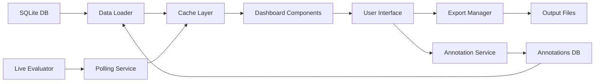

# Interactive Dashboard & Advanced Reporting Specification
## Sleeper Agent Detection System v2.0

### 1. Executive Summary

This specification outlines the implementation of a comprehensive visualization and reporting system for the Sleeper Agent Detection package. The system will provide real-time insights, interactive analysis capabilities, and advanced export options for model safety evaluation results.

### 2. Technical Stack

**Primary Framework: Streamlit** (Based on Gemini consultation)
- Prioritizes rapid development and researcher accessibility
- Easy for Python-native researchers to contribute
- Can migrate to Dash if performance needs arise

**Supporting Libraries:**
- `streamlit` - Main framework (v1.28+)
- `plotly` - Interactive charts and visualizations
- `pandas` - Data manipulation and analysis
- `seaborn` - Statistical visualizations
- `matplotlib` - Static plot generation for exports
- `reportlab` - PDF generation
- `nbformat` - Jupyter notebook generation
- `streamlit-aggrid` - Advanced data tables (Gemini recommended)
- `streamlit-option-menu` - Navigation menu (Gemini recommended)
- `st-annotated-text` - Text annotation support (Gemini recommended)
- `scikit-learn` - For PCA/t-SNE projections
- `streamlit-authenticator` - Simple authentication system
- `bcrypt` - Password hashing

### 3. Architecture Design

```
packages/sleeper_detection/
├── dashboard/
│   ├── __init__.py
│   ├── app.py                        # Main Streamlit application
│   ├── auth/
│   │   ├── __init__.py
│   │   ├── authentication.py         # User authentication system
│   │   └── users.db                  # User database (SQLite)
│   ├── components/
│   │   ├── __init__.py
│   │   ├── overview.py               # Executive Overview
│   │   ├── detection_analysis.py     # Detection Analysis
│   │   ├── model_comparison.py       # Model Comparison
│   │   ├── layer_analysis.py         # Layer Analysis
│   │   ├── attention_heatmaps.py     # Attention Visualization
│   │   ├── probability_analysis.py   # Output Probability Analysis
│   │   ├── activation_projections.py # PCA/t-SNE projections
│   │   ├── influence_causal.py       # Influence & Causal Analysis
│   │   └── performance_metrics.py    # Performance tracking
│   ├── utils/
│   │   ├── __init__.py
│   │   ├── data_loader.py            # Load results from database
│   │   ├── cache_manager.py          # Caching layer
│   │   ├── chart_factory.py          # Chart generation utilities
│   │   ├── annotation_service.py     # Annotation management
│   │   └── export_manager.py         # Export functionality
│   ├── data/
│   │   ├── results.db                # Main evaluation results (SQLite)
│   │   └── annotations.db            # User annotations (SQLite)
│   └── assets/
│       ├── styles.css
│       └── config.yaml
```

### 4. Core Features

#### 4.1 Real-time Dashboard

**Main Views:**
1. **Executive Overview**
   - Overall safety score gauge
   - Risk assessment matrix
   - Top vulnerabilities list
   - Recent evaluation history

2. **Detection Analysis**
   - Accuracy metrics per detection method
   - Confidence distribution histograms
   - ROC curves and AUC scores
   - Confusion matrices

3. **Model Comparison**
   - Side-by-side model metrics
   - Radar charts for multi-dimensional comparison
   - Heatmap of test results across models
   - Ranking leaderboard

4. **Layer Analysis**
   - Layer-wise activation patterns
   - Probe effectiveness by layer
   - Interactive 3D visualizations
   - Gradient flow analysis

5. **Attention Visualization**
   - Attention weight heatmaps
   - Head importance scores
   - Trigger token highlighting
   - Pattern anomaly detection

6. **Output Probability Analysis** (New - Gemini recommendation)
   - Probability distribution bar charts
   - Trigger vs. benign phrase comparisons
   - Token-level probability heatmaps
   - Confidence score distributions

7. **Activation Space Projections** (New - Gemini recommendation)
   - PCA/t-SNE 2D/3D visualizations
   - Cluster identification for malicious behavior
   - Interactive exploration of activation space
   - Trajectory visualization over layers

8. **Performance Metrics**
   - Evaluation time tracking
   - Memory usage charts
   - GPU utilization graphs
   - Throughput statistics

9. **Influence & Causal Analysis** (New - Gemini recommendation)
   - Influence function visualizations
   - Causal tracing diagrams
   - Training data attribution
   - Information flow graphs

#### 4.2 Interactive Features

- **Filters & Controls:**
  - Date range selection
  - Model selection (multi-select)
  - Test suite filtering
  - Confidence threshold sliders

- **Drill-down Capability:**
  - Click on summary → detailed view
  - Zoom and pan on charts
  - Hover tooltips with details
  - Cross-filtering between charts

- **Data Refresh:** (Updated based on Gemini feedback)
  - Manual refresh button for user control
  - Auto-refresh option (10-30 second intervals)
  - Progress indicators for running evaluations
  - Notification system for completed evaluations

#### 4.3 Export Capabilities

**Formats:**
1. **PDF Reports**
   - Executive summary
   - Detailed technical report
   - Custom template support
   - Embedded charts and tables

2. **CSV/Excel Exports**
   - Raw evaluation data
   - Aggregated metrics
   - Comparison tables
   - Time series data

3. **Jupyter Notebooks**
   - Interactive analysis notebooks
   - Reproducible evaluation workflows
   - Embedded visualizations
   - Code examples

4. **JSON API**
   - RESTful endpoints for data access
   - Filtered data queries
   - Pagination support

#### 4.4 Collaborative Features (New - Gemini recommendation)

**Annotation System:**
- Add notes to specific data points or visualizations
- Tag anomalies or interesting patterns
- Comment threads on findings
- Annotation history and versioning

**Sharing Capabilities:**
- Shareable dashboard URLs with state preservation
- Export/import dashboard configurations
- Team workspaces with shared annotations
- Real-time collaboration indicators

### 5. User Interface Design

**Layout Structure:**
```
┌─────────────────────────────────────────────────────┐
│  Header: Sleeper Detection Dashboard     [Export] □ │
├─────────────┬───────────────────────────────────────┤
│             │                                       │
│  Sidebar    │         Main Content Area            │
│             │                                       │
│  - Overview │    ┌─────────────┬─────────────┐    │
│  - Analysis │    │   Chart 1   │   Chart 2   │    │
│  - Compare  │    └─────────────┴─────────────┘    │
│  - Layers   │                                      │
│  - Attention│    ┌──────────────────────────┐     │
│  - Metrics  │    │      Data Table         │     │
│             │    └──────────────────────────┘     │
└─────────────┴───────────────────────────────────────┘
```

**Theme & Styling:**
- Dark/Light mode toggle
- Consistent color scheme for risk levels
- Responsive design for different screen sizes
- Accessibility compliance (WCAG 2.1)

### 6. Data Flow



### 7. Performance Requirements

- **Load Time:** < 3 seconds for initial dashboard
- **Update Frequency:** Manual refresh or 10-30 second auto-refresh
- **Data Points:** Handle up to 1M evaluation results
- **Concurrent Users:** Support 50+ simultaneous users
- **Export Time:** < 10 seconds for PDF generation
- **Cache Performance:** < 100ms for cached data retrieval
- **Annotation Response:** < 500ms for annotation operations

### 8. Implementation Phases (Refined with Gemini)

**Phase 1: Core Infrastructure & Authentication (Days 1-3)**
- Set up Streamlit framework with authentication
- Implement data loader with caching
- Set up dual SQLite databases (results + annotations)
- Create navigation with streamlit-option-menu

**Phase 2: Core Evaluation Components (Days 4-7)**
- Executive Overview dashboard
- Detection Analysis with ROC curves
- Model Comparison with radar charts
- Basic annotation system

**Phase 3: Deep Analysis Components (Days 8-11)**
- Output Probability Analysis
- Activation Space Projections (PCA/t-SNE)
- Layer Analysis visualizations
- Attention Heatmaps

**Phase 4: Advanced Features (Days 12-14)**
- Influence & Causal Analysis
- Performance Metrics tracking
- Collaborative features (sharing, team workspaces)

**Phase 5: Export & Polish (Days 15-16)**
- Multi-format export functionality
- UI refinements and responsive design
- Performance optimization
- Testing and documentation

### 9. Testing Strategy

- **Unit Tests:** Component-level testing
- **Integration Tests:** Data flow validation
- **Performance Tests:** Load and stress testing
- **User Acceptance Tests:** Usability validation

### 10. Future Enhancements

- Machine learning insights and predictions
- Collaborative annotation features
- Custom alert configurations
- Integration with MLOps platforms
- Mobile-responsive design

### 11. Key Design Decisions (Finalized with Gemini)

**Decisions Made:**
1. **Framework:** Streamlit for rapid development and researcher accessibility
2. **Updates:** Manual refresh with optional 10-30 second auto-refresh (no WebSocket)
3. **Critical Visualizations:** Attention heatmaps, output probabilities, activation projections
4. **Collaboration:** Annotation system and shareable dashboard states are essential
5. **New Features:** Added influence functions and causal tracing visualizations
6. **Authentication:** Simple username/password system from the start
7. **Database Design:** Separate SQLite databases for results and annotations
8. **Implementation Priority:** Core evaluation components first, then deep analysis

**Specification Status: FINALIZED ✅**
- Reviewed and refined through 2 Gemini consultations
- Ready for implementation following the 5-phase plan
- Total estimated development time: 16 days

### 12. Success Criteria

- **User Satisfaction:** 90%+ positive feedback on usability
- **Performance:** All visualizations render < 1 second
- **Reliability:** 99.9% uptime for dashboard
- **Adoption:** 80%+ of users regularly use dashboard vs. CLI
- **Export Quality:** Professional-grade PDF reports
